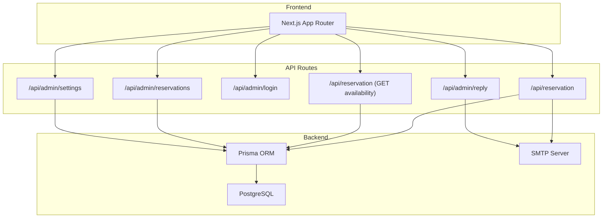
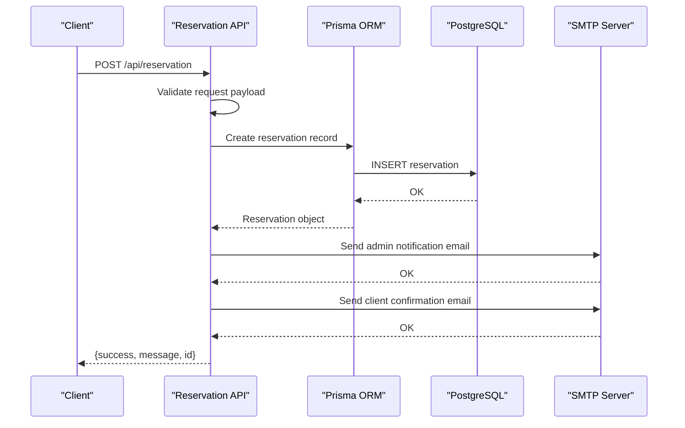
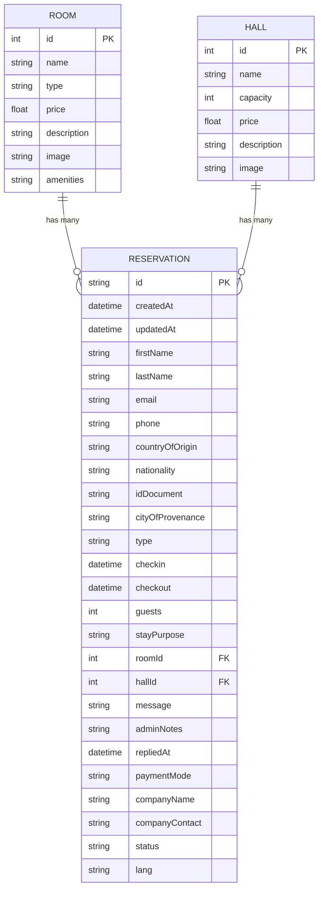
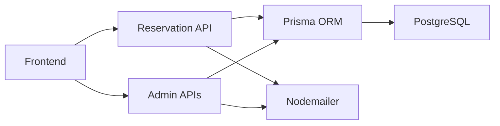

# API Documentation

<cite>
**Referenced Files in This Document**
- [src/app/api/admin/login/route.ts](file://src/app/api/admin/login/route.ts)
- [src/app/api/admin/reply/route.ts](file://src/app/api/admin/reply/route.ts)
- [src/app/api/admin/reservations/route.ts](file://src/app/api/admin/reservations/route.ts)
- [src/app/api/admin/settings/route.ts](file://src/app/api/admin/settings/route.ts)
- [src/app/api/reservation/route.ts](file://src/app/api/reservation/route.ts)
- [src/data/content.ts](file://src/data/content.ts)
- [prisma/schema.prisma](file://prisma/schema.prisma)
- [src/lib/prisma.ts](file://src/lib/prisma.ts)
- [next.config.ts](file://next.config.ts)
- [package.json](file://package.json)
</cite>

## Table of Contents
1. [Introduction](#introduction)
2. [Project Structure](#project-structure)
3. [Core Components](#core-components)
4. [Architecture Overview](#architecture-overview)
5. [Detailed Component Analysis](#detailed-component-analysis)
6. [Dependency Analysis](#dependency-analysis)
7. [Performance Considerations](#performance-considerations)
8. [Troubleshooting Guide](#troubleshooting-guide)
9. [Conclusion](#conclusion)
10. [Appendices](#appendices)

## Introduction
This document provides comprehensive API documentation for the Archangel Hotel system. It covers all REST endpoints, including reservation management, admin dashboard operations, authentication, staff communication, and reply processing. The documentation includes HTTP methods, URL patterns, request/response schemas, authentication requirements, error codes, parameter validation rules, rate limiting considerations, security measures, CORS configuration, and API versioning strategy. It also provides client implementation guidelines, integration examples, and troubleshooting advice.

## Project Structure
The API endpoints are implemented as Next.js App Router API routes under the src/app/api directory. The backend uses Prisma ORM with PostgreSQL for persistence and Nodemailer for sending emails. Environment variables control SMTP credentials and admin password. The frontend is a Next.js application that consumes these APIs.

**Diagram sources**
- [src/app/api/reservation/route.ts:1-255](file://src/app/api/reservation/route.ts#L1-L255)
- [src/app/api/admin/login/route.ts:1-29](file://src/app/api/admin/login/route.ts#L1-L29)
- [src/app/api/admin/reply/route.ts:1-73](file://src/app/api/admin/reply/route.ts#L1-L73)
- [src/app/api/admin/reservations/route.ts:1-46](file://src/app/api/admin/reservations/route.ts#L1-L46)
- [src/app/api/admin/settings/route.ts:1-35](file://src/app/api/admin/settings/route.ts#L1-L35)
- [src/lib/prisma.ts:1-12](file://src/lib/prisma.ts#L1-L12)
- [prisma/schema.prisma:1-75](file://prisma/schema.prisma#L1-L75)

**Section sources**
- [src/app/api/reservation/route.ts:1-255](file://src/app/api/reservation/route.ts#L1-L255)
- [src/app/api/admin/login/route.ts:1-29](file://src/app/api/admin/login/route.ts#L1-L29)
- [src/app/api/admin/reply/route.ts:1-73](file://src/app/api/admin/reply/route.ts#L1-L73)
- [src/app/api/admin/reservations/route.ts:1-46](file://src/app/api/admin/reservations/route.ts#L1-L46)
- [src/app/api/admin/settings/route.ts:1-35](file://src/app/api/admin/settings/route.ts#L1-L35)
- [src/lib/prisma.ts:1-12](file://src/lib/prisma.ts#L1-L12)
- [prisma/schema.prisma:1-75](file://prisma/schema.prisma#L1-L75)

## Core Components
- Reservation Management API: Handles booking creation, availability checking, and reservation status updates.
- Admin Dashboard APIs: Provides admin login, reservation oversight, and settings configuration.
- Staff Communication API: Enables admin replies to clients with templated messages and payment links.
- Persistence Layer: Uses Prisma ORM with PostgreSQL for data storage.
- Email Delivery: Utilizes Nodemailer to send automated emails to clients and administrators.

**Section sources**
- [src/app/api/reservation/route.ts:1-255](file://src/app/api/reservation/route.ts#L1-L255)
- [src/app/api/admin/reply/route.ts:1-73](file://src/app/api/admin/reply/route.ts#L1-L73)
- [src/app/api/admin/reservations/route.ts:1-46](file://src/app/api/admin/reservations/route.ts#L1-L46)
- [src/app/api/admin/settings/route.ts:1-35](file://src/app/api/admin/settings/route.ts#L1-L35)
- [prisma/schema.prisma:1-75](file://prisma/schema.prisma#L1-L75)

## Architecture Overview
The system follows a layered architecture:
- Presentation Layer: Next.js App Router API routes
- Application Layer: Business logic for reservations, admin operations, and email handling
- Data Access Layer: Prisma ORM with PostgreSQL
- External Services: SMTP for email delivery

**Diagram sources**
- [src/app/api/reservation/route.ts:59-253](file://src/app/api/reservation/route.ts#L59-L253)
- [src/lib/prisma.ts:1-12](file://src/lib/prisma.ts#L1-L12)
- [prisma/schema.prisma:34-74](file://prisma/schema.prisma#L34-L74)

## Detailed Component Analysis

### Reservation Management API

#### Endpoint: POST /api/reservation
- Purpose: Create a new reservation request
- Authentication: None required
- Request Body Schema:
  - type: string (required) - One of "room", "restaurant", "event", "photoshoot"
  - fullname: string (optional)
  - firstName: string (optional)
  - lastName: string (optional)
  - email: string (required)
  - phone: string (required)
  - countryOfOrigin: string (optional)
  - nationality: string (optional)
  - idDocument: string (optional)
  - cityOfProvenance: string (optional)
  - stayPurpose: string (optional)
  - paymentMode: string (required) - One of "private", "company"
  - companyName: string (optional)
  - companyContact: string (optional)
  - checkin: string (ISO 8601 datetime) (required for room/event)
  - checkout: string (ISO 8601 datetime) (required for room/event)
  - guests: number (default: 1)
  - roomType: number (required for type "room")
  - hallType: number (required for type "event")
  - message: string (optional)
  - acceptTerms: boolean (required) - Must be true
  - lang: string (default: "fr") - One of "fr", "en"
- Response:
  - success: boolean
  - message: string
  - id: string (reservation ID)
- Validation Rules:
  - acceptTerms must be true
  - Required fields: email, phone
  - For room reservations: checkin, checkout, roomType
  - For event reservations: checkin, checkout, hallType
  - For company payments: companyName, companyContact
- Error Codes:
  - 400: Validation errors (missing required fields, terms not accepted)
  - 500: Internal server error during processing
- Email Notifications:
  - Admin receives notification email with reservation details
  - Client receives confirmation email in selected language

#### Endpoint: GET /api/reservation?roomType={id}&checkin={date}&checkout={date}
- Purpose: Check room availability for given dates
- Authentication: None required
- Query Parameters:
  - roomType: number (required)
  - checkin: string (required, ISO 8601 date)
  - checkout: string (required, ISO 8601 date)
- Response:
  - available: boolean
- Notes:
  - Returns fallback true if parameters are missing
  - Checks existing CONFIRMED reservations for overlap

**Section sources**
- [src/app/api/reservation/route.ts:28-57](file://src/app/api/reservation/route.ts#L28-L57)
- [src/app/api/reservation/route.ts:59-253](file://src/app/api/reservation/route.ts#L59-L253)
- [src/data/content.ts:89-114](file://src/data/content.ts#L89-L114)

### Admin Dashboard APIs

#### Endpoint: POST /api/admin/login
- Purpose: Authenticate admin user
- Authentication: None required
- Request Body:
  - password: string (required)
- Response:
  - success: boolean
- Security:
  - Sets httpOnly admin_session cookie with 24-hour expiry
  - Cookie secure flag enabled in production
- Error Codes:
  - 401: Unauthorized (incorrect password)
- Notes:
  - Admin password is configurable via ADMIN_PASSWORD environment variable

#### Endpoint: GET /api/admin/login
- Purpose: Check admin authentication status
- Authentication: None required
- Response:
  - authenticated: boolean

#### Endpoint: GET /api/admin/reservations
- Purpose: Retrieve all reservations for admin dashboard
- Authentication: Requires admin_session cookie set by login
- Response:
  - success: boolean
  - reservations: array of reservation objects with room/hall relations
- Error Codes:
  - 401: Unauthorized (invalid or missing session)
  - 500: Internal server error

#### Endpoint: PATCH /api/admin/reservations
- Purpose: Update reservation status
- Authentication: Requires admin_session cookie
- Request Body:
  - id: string (required)
  - status: string (required) - One of "PENDING", "CONFIRMED", "CANCELLED"
- Response:
  - success: boolean
  - reservation: updated reservation object
- Error Codes:
  - 401: Unauthorized
  - 500: Internal server error

#### Endpoint: GET /api/admin/settings
- Purpose: Retrieve room and hall configurations
- Authentication: Requires admin_session cookie
- Response:
  - success: boolean
  - rooms: array of room objects
  - halls: array of hall objects
- Error Codes:
  - 401: Unauthorized
  - 500: Internal server error

#### Endpoint: PATCH /api/admin/settings
- Purpose: Update pricing for rooms or halls
- Authentication: Requires admin_session cookie
- Request Body:
  - type: string (required) - "room" or "hall"
  - id: number (required)
  - price: number (required)
- Response:
  - success: boolean
- Error Codes:
  - 401: Unauthorized
  - 500: Internal server error

#### Endpoint: POST /api/admin/reply
- Purpose: Send admin reply to client with templated message
- Authentication: Requires admin_session cookie
- Request Body:
  - reservationId: string (required)
  - to: string (required)
  - subject: string (required)
  - message: string (required)
- Response:
  - success: boolean
- Special Features:
  - Automatically detects payment links and adds styled payment button
  - Updates reservation repliedAt timestamp
- Error Codes:
  - 401: Unauthorized
  - 500: Internal server error

**Section sources**
- [src/app/api/admin/login/route.ts:1-29](file://src/app/api/admin/login/route.ts#L1-L29)
- [src/app/api/admin/reservations/route.ts:1-46](file://src/app/api/admin/reservations/route.ts#L1-L46)
- [src/app/api/admin/settings/route.ts:1-35](file://src/app/api/admin/settings/route.ts#L1-L35)
- [src/app/api/admin/reply/route.ts:1-73](file://src/app/api/admin/reply/route.ts#L1-L73)

### Data Models and Relationships

**Diagram sources**
- [prisma/schema.prisma:13-32](file://prisma/schema.prisma#L13-L32)
- [prisma/schema.prisma:34-74](file://prisma/schema.prisma#L34-L74)

## Dependency Analysis

**Diagram sources**
- [src/app/api/reservation/route.ts:1-255](file://src/app/api/reservation/route.ts#L1-L255)
- [src/app/api/admin/reply/route.ts:1-73](file://src/app/api/admin/reply/route.ts#L1-L73)
- [src/lib/prisma.ts:1-12](file://src/lib/prisma.ts#L1-L12)
- [prisma/schema.prisma:1-75](file://prisma/schema.prisma#L1-L75)

**Section sources**
- [src/app/api/reservation/route.ts:1-255](file://src/app/api/reservation/route.ts#L1-L255)
- [src/app/api/admin/reply/route.ts:1-73](file://src/app/api/admin/reply/route.ts#L1-L73)
- [src/lib/prisma.ts:1-12](file://src/lib/prisma.ts#L1-L12)
- [prisma/schema.prisma:1-75](file://prisma/schema.prisma#L1-L75)

## Performance Considerations
- Database Queries: The reservation availability check performs a single query with OR conditions. Consider adding database indexes on reservation type, roomId, and date ranges for optimal performance.
- Email Delivery: SMTP operations are synchronous and can block requests. Consider implementing asynchronous job queues for email processing in production.
- Rate Limiting: No built-in rate limiting is implemented. Add rate limiting middleware to prevent abuse of reservation endpoints.
- Caching: Implement caching for frequently accessed room/hall configurations to reduce database load.
- Connection Pooling: Prisma manages connection pooling automatically, but monitor pool usage in production.

## Troubleshooting Guide
- Authentication Issues:
  - Verify ADMIN_PASSWORD environment variable is set
  - Check admin_session cookie expiration (24 hours)
  - Ensure cookies are sent with subsequent admin requests
- Email Delivery Problems:
  - Confirm SMTP_HOST, SMTP_PORT, SMTP_USER, SMTP_PASSWORD environment variables
  - Test SMTP connectivity separately
  - Check email templates for malformed HTML
- Database Connectivity:
  - Verify POSTGRES_PRISMA_URL environment variable
  - Check Prisma client initialization logs
  - Monitor database connection pool exhaustion
- Reservation Conflicts:
  - Review overlapping reservation logic in availability check
  - Check timezone handling for date comparisons
- Frontend Integration:
  - Ensure CORS configuration allows your frontend origin
  - Verify Next.js runtime environment variables are properly configured

**Section sources**
- [src/app/api/admin/login/route.ts:6-18](file://src/app/api/admin/login/route.ts#L6-L18)
- [src/app/api/reservation/route.ts:129-137](file://src/app/api/reservation/route.ts#L129-L137)
- [src/lib/prisma.ts:7-9](file://src/lib/prisma.ts#L7-L9)

## Conclusion
The Archangel Hotel API provides a comprehensive reservation system with admin capabilities, email automation, and flexible configuration options. The implementation demonstrates clear separation of concerns with dedicated endpoints for different functional areas. While the current implementation focuses on functionality, production deployments should incorporate rate limiting, enhanced security measures, and performance optimizations as outlined in this documentation.

## Appendices

### API Versioning Strategy
- Current Implementation: No explicit API versioning is implemented
- Recommendation: Add version prefix to all API endpoints (e.g., /api/v1/reservation)
- Migration Path: Maintain backward compatibility during version transitions

### Security Measures
- Admin Authentication: Session-based with httpOnly cookies
- Input Sanitization: HTML escaping for email content
- Environment Variables: SMTP and admin credentials stored securely
- Production Hardening: Secure cookie flag enabled in production

### CORS Configuration
- Next.js Image Optimization: Remote patterns configured for Unsplash and YouTube
- API CORS: Not explicitly configured; ensure frontend origin is allowed in production

### Client Implementation Guidelines
- Authentication Flow:
  1. POST /api/admin/login with password
  2. Store admin_session cookie
  3. Use cookie for subsequent admin requests
- Reservation Flow:
  1. Check availability via GET /api/reservation
  2. Submit reservation via POST /api/reservation
  3. Monitor status via admin dashboard
- Error Handling:
  - Handle 400 errors for validation failures
  - Handle 401 errors for authentication issues
  - Handle 500 errors for server-side failures

### Integration Examples
- Basic Reservation Submission:
  - Method: POST /api/reservation
  - Headers: Content-Type: application/json
  - Body: Complete reservation payload with acceptTerms: true
- Availability Check:
  - Method: GET /api/reservation?roomType=1&checkin=YYYY-MM-DD&checkout=YYYY-MM-DD
  - Response: {available: boolean}

**Section sources**
- [next.config.ts:3-14](file://next.config.ts#L3-L14)
- [package.json:12-24](file://package.json#L12-L24)