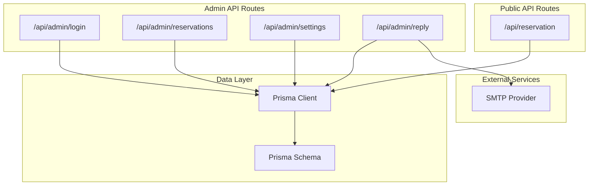
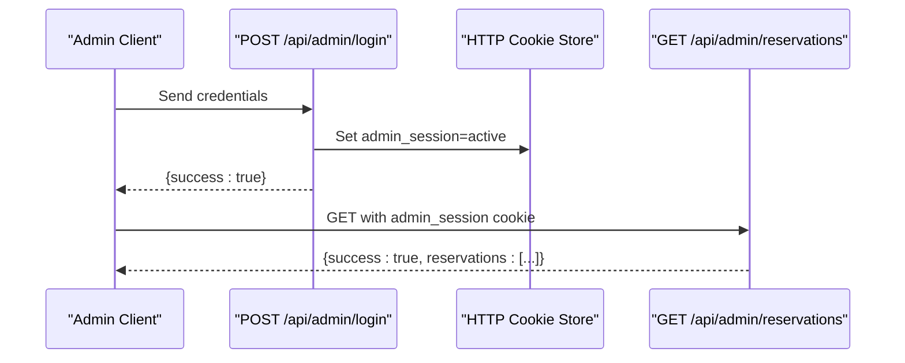
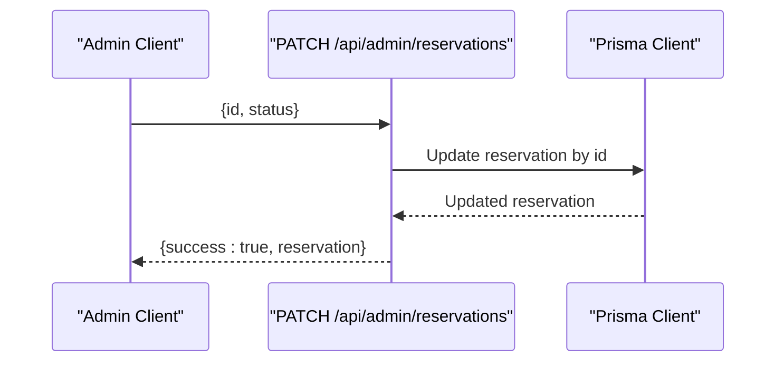
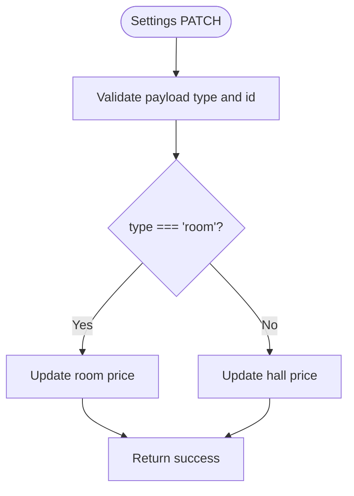
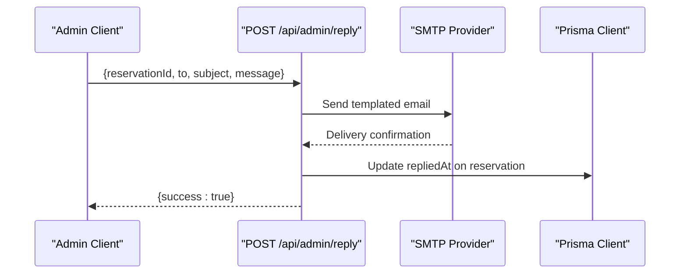
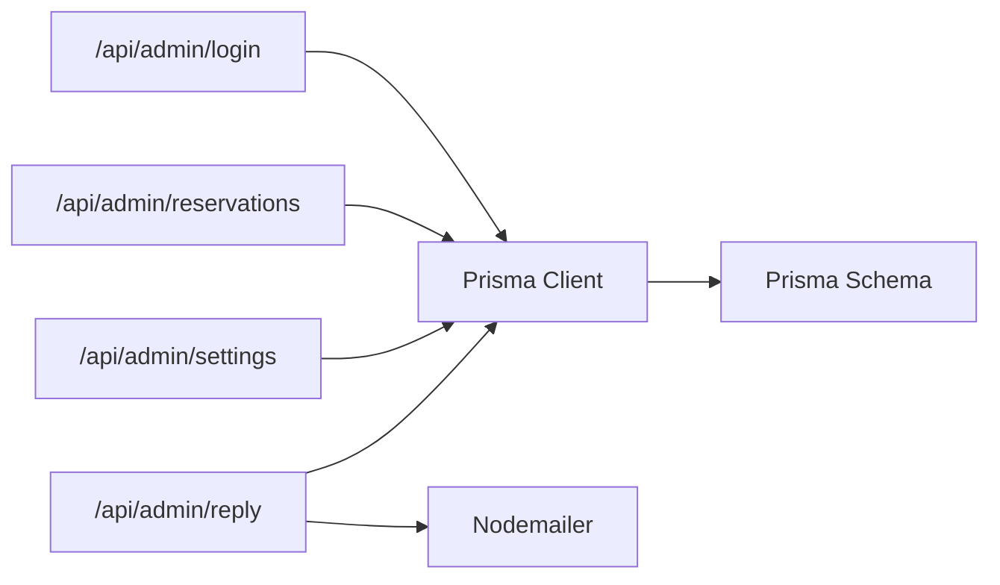
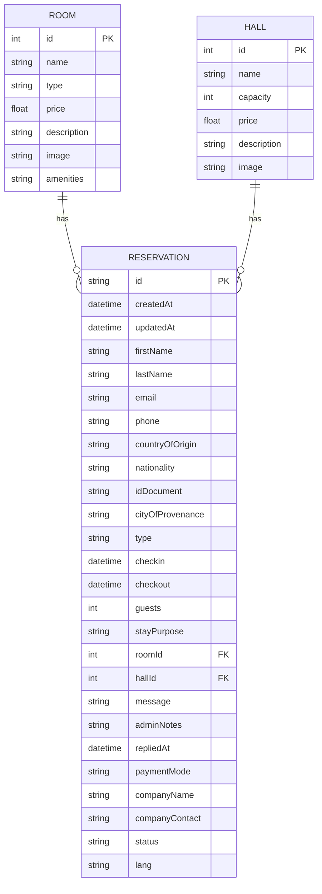

# Admin Dashboard API

<cite>
**Referenced Files in This Document**
- [login route.ts](file://src/app/api/admin/login/route.ts)
- [reservations route.ts](file://src/app/api/admin/reservations/route.ts)
- [settings route.ts](file://src/app/api/admin/settings/route.ts)
- [reply route.ts](file://src/app/api/admin/reply/route.ts)
- [reservation route.ts](file://src/app/api/reservation/route.ts)
- [prisma schema.prisma](file://prisma/schema.prisma)
- [prisma client](file://src/lib/prisma.ts)
- [content data](file://src/data/content.ts)
</cite>

## Table of Contents
1. [Introduction](#introduction)
2. [Project Structure](#project-structure)
3. [Core Components](#core-components)
4. [Architecture Overview](#architecture-overview)
5. [Detailed Component Analysis](#detailed-component-analysis)
6. [Dependency Analysis](#dependency-analysis)
7. [Performance Considerations](#performance-considerations)
8. [Troubleshooting Guide](#troubleshooting-guide)
9. [Conclusion](#conclusion)
10. [Appendices](#appendices)

## Introduction
This document provides comprehensive API documentation for the admin dashboard system. It covers:
- Admin reservation management endpoint for viewing, updating, and filtering reservations with status controls
- Settings management API for pricing configuration, facility updates, and system parameters
- Admin login authentication endpoint with security measures and session management
- Request/response schemas, authentication requirements, authorization headers, and role-based access control
- Examples of admin workflows, bulk operations, and administrative reporting capabilities

The admin APIs are implemented as Next.js App Router API routes under the admin namespace and integrate with Prisma ORM for database operations.

## Project Structure
The admin API endpoints are located under the Next.js app router structure:
- Admin authentication: `/src/app/api/admin/login/route.ts`
- Admin reservations: `/src/app/api/admin/reservations/route.ts`
- Admin settings: `/src/app/api/admin/settings/route.ts`
- Admin reply/email: `/src/app/api/admin/reply/route.ts`
- Public reservation API: `/src/app/api/reservation/route.ts`
- Database schema: `/prisma/schema.prisma`
- Prisma client: `/src/lib/prisma.ts`
- Static content and metadata: `/src/data/content.ts`

**Diagram sources**
- [login route.ts:1-29](file://src/app/api/admin/login/route.ts#L1-L29)
- [reservations route.ts:1-46](file://src/app/api/admin/reservations/route.ts#L1-L46)
- [settings route.ts:1-35](file://src/app/api/admin/settings/route.ts#L1-L35)
- [reply route.ts:1-73](file://src/app/api/admin/reply/route.ts#L1-L73)
- [reservation route.ts:1-255](file://src/app/api/reservation/route.ts#L1-L255)
- [prisma schema.prisma:1-75](file://prisma/schema.prisma#L1-L75)
- [prisma client:1-12](file://src/lib/prisma.ts#L1-L12)

**Section sources**
- [login route.ts:1-29](file://src/app/api/admin/login/route.ts#L1-L29)
- [reservations route.ts:1-46](file://src/app/api/admin/reservations/route.ts#L1-L46)
- [settings route.ts:1-35](file://src/app/api/admin/settings/route.ts#L1-L35)
- [reply route.ts:1-73](file://src/app/api/admin/reply/route.ts#L1-L73)
- [reservation route.ts:1-255](file://src/app/api/reservation/route.ts#L1-L255)
- [prisma schema.prisma:1-75](file://prisma/schema.prisma#L1-L75)
- [prisma client:1-12](file://src/lib/prisma.ts#L1-L12)

## Core Components
- Admin Authentication: Validates credentials and sets a session cookie for subsequent admin requests
- Admin Reservations: Lists all reservations and updates reservation statuses
- Admin Settings: Retrieves pricing and facility data; updates pricing for rooms and halls
- Admin Reply: Sends templated emails to clients and marks replies in the reservation record
- Public Reservation API: Handles guest reservation submissions and sends notifications

Key implementation details:
- Session-based authorization via HTTP-only cookie "admin_session"
- Environment-driven configuration for admin password and SMTP settings
- Prisma ORM integration for data persistence

**Section sources**
- [login route.ts:1-29](file://src/app/api/admin/login/route.ts#L1-L29)
- [reservations route.ts:1-46](file://src/app/api/admin/reservations/route.ts#L1-L46)
- [settings route.ts:1-35](file://src/app/api/admin/settings/route.ts#L1-L35)
- [reply route.ts:1-73](file://src/app/api/admin/reply/route.ts#L1-L73)
- [reservation route.ts:1-255](file://src/app/api/reservation/route.ts#L1-L255)
- [prisma schema.prisma:34-74](file://prisma/schema.prisma#L34-L74)
- [prisma client:1-12](file://src/lib/prisma.ts#L1-L12)

## Architecture Overview
The admin dashboard API follows a layered architecture:
- Presentation layer: Next.js App Router API routes
- Application layer: Route handlers implement business logic
- Data access layer: Prisma client manages database operations
- External services: SMTP for email notifications

**Diagram sources**
- [login route.ts:3-24](file://src/app/api/admin/login/route.ts#L3-L24)
- [reservations route.ts:4-27](file://src/app/api/admin/reservations/route.ts#L4-L27)

**Section sources**
- [login route.ts:1-29](file://src/app/api/admin/login/route.ts#L1-L29)
- [reservations route.ts:1-46](file://src/app/api/admin/reservations/route.ts#L1-L46)

## Detailed Component Analysis

### Admin Authentication Endpoint
- Path: `/api/admin/login`
- Methods:
  - POST: Validates admin password and sets session cookie
  - GET: Returns current authentication state

Authentication requirements:
- Authorization: None for GET; requires valid credentials for POST
- Headers: JSON request body with password field
- Cookies: Sets "admin_session=active" on successful login

Security measures:
- Password validated against environment variable ADMIN_PASSWORD
- HTTP-only cookie prevents client-side access
- Secure flag enabled in production environments
- 24-hour expiration

Response schemas:
- Success: `{ success: true }`
- Failure: `{ success: false }` with 401 Unauthorized

Example workflow:
1. Client sends POST with password
2. Server validates password
3. On success, server sets admin_session cookie and returns success
4. Subsequent admin requests must include this cookie

**Section sources**
- [login route.ts:1-29](file://src/app/api/admin/login/route.ts#L1-L29)

### Admin Reservation Management Endpoint
- Path: `/api/admin/reservations`
- Methods:
  - GET: Lists all reservations with related room/hall data, ordered by creation date
  - PATCH: Updates reservation status by ID

Authorization:
- Requires active admin session cookie

Request/response schemas:
- GET response: `{ success: boolean, reservations: Reservation[] }`
- PATCH request: `{ id: string, status: string }`
- PATCH response: `{ success: boolean, reservation: Reservation }`

Status controls:
- Supported statuses: PENDING, CONFIRMED, CANCELLED (from schema)
- Update applies per reservation ID

Filtering and sorting:
- Includes room and hall relations for display
- Orders by createdAt descending

Bulk operations:
- Individual status updates via PATCH
- Future enhancements could include batch update endpoints

**Diagram sources**
- [reservations route.ts:29-45](file://src/app/api/admin/reservations/route.ts#L29-L45)
- [prisma schema.prisma:71-71](file://prisma/schema.prisma#L71-L71)

**Section sources**
- [reservations route.ts:1-46](file://src/app/api/admin/reservations/route.ts#L1-L46)
- [prisma schema.prisma:34-74](file://prisma/schema.prisma#L34-L74)

### Settings Management API
- Path: `/api/admin/settings`
- Methods:
  - GET: Retrieves rooms and halls sorted by price/capacity respectively
  - PATCH: Updates pricing for rooms or halls

Authorization:
- Requires active admin session cookie

Request/response schemas:
- GET response: `{ success: boolean, rooms: Room[], halls: Hall[] }`
- PATCH request: `{ type: "room"|"hall", id: number, price: number }`
- PATCH response: `{ success: boolean }`

System parameters:
- Pricing configuration for rooms and halls
- Facility metadata (capacity, description, image)

**Diagram sources**
- [settings route.ts:17-34](file://src/app/api/admin/settings/route.ts#L17-L34)

**Section sources**
- [settings route.ts:1-35](file://src/app/api/admin/settings/route.ts#L1-L35)
- [prisma schema.prisma:13-32](file://prisma/schema.prisma#L13-L32)

### Admin Reply/Email Endpoint
- Path: `/api/admin/reply`
- Method: POST
- Purpose: Sends templated emails to clients and tracks reply timestamps

Authorization:
- Requires active admin session cookie

Request/response schemas:
- Request: `{ reservationId: string, to: string, subject: string, message: string }`
- Response: `{ success: boolean }`

Email features:
- Detects payment links and styles them in HTML
- Uses environment variables for SMTP configuration
- Updates reservation repliedAt timestamp after sending

**Diagram sources**
- [reply route.ts:5-72](file://src/app/api/admin/reply/route.ts#L5-L72)

**Section sources**
- [reply route.ts:1-73](file://src/app/api/admin/reply/route.ts#L1-L73)
- [prisma schema.prisma:64-65](file://prisma/schema.prisma#64-L65)

### Public Reservation API (Context)
- Path: `/api/reservation`
- Methods:
  - GET: Checks room availability for given dates and room type
  - POST: Creates reservation and sends notifications

While not part of the admin API, it interacts with the same reservation model and is relevant for understanding the broader reservation lifecycle.

**Section sources**
- [reservation route.ts:28-57](file://src/app/api/reservation/route.ts#L28-L57)
- [reservation route.ts:59-253](file://src/app/api/reservation/route.ts#L59-L253)

## Dependency Analysis
The admin API routes depend on:
- Prisma client for database operations
- Environment variables for configuration
- Nodemailer for email functionality

**Diagram sources**
- [login route.ts:1-29](file://src/app/api/admin/login/route.ts#L1-L29)
- [reservations route.ts:1-46](file://src/app/api/admin/reservations/route.ts#L1-L46)
- [settings route.ts:1-35](file://src/app/api/admin/settings/route.ts#L1-L35)
- [reply route.ts:1-73](file://src/app/api/admin/reply/route.ts#L1-L73)
- [prisma client:1-12](file://src/lib/prisma.ts#L1-L12)
- [prisma schema.prisma:1-75](file://prisma/schema.prisma#L1-L75)

**Section sources**
- [prisma client:1-12](file://src/lib/prisma.ts#L1-L12)
- [prisma schema.prisma:1-75](file://prisma/schema.prisma#L1-L75)

## Performance Considerations
- Session-based authorization avoids repeated credential validation
- Prisma queries use selective includes to minimize payload size
- Email operations are asynchronous and offload network I/O
- Consider adding pagination for reservation listings in production
- Indexes on frequently queried fields (status, dates) would improve performance

## Troubleshooting Guide
Common issues and resolutions:
- Authentication failures: Verify ADMIN_PASSWORD environment variable and cookie presence
- Database errors: Check Prisma client initialization and connection string
- Email delivery failures: Validate SMTP environment variables and network connectivity
- CORS/cookie issues: Ensure frontend and backend share the same origin and path configuration

Error handling patterns:
- Unauthorized responses return 401 with success:false
- Internal server errors return 500 with success:false
- Validation errors return 400 with descriptive messages

**Section sources**
- [login route.ts:23-23](file://src/app/api/admin/login/route.ts#L23-L23)
- [reservations route.ts:24-26](file://src/app/api/admin/reservations/route.ts#L24-L26)
- [settings route.ts:12-14](file://src/app/api/admin/settings/route.ts#L12-L14)
- [reply route.ts:69-71](file://src/app/api/admin/reply/route.ts#L69-L71)

## Conclusion
The admin dashboard API provides a focused set of endpoints for managing reservations, configuring pricing, and communicating with clients. It uses a simple session-based authentication mechanism and integrates with Prisma for data persistence and Nodemailer for email notifications. The design supports future enhancements such as bulk operations, advanced filtering, and expanded reporting capabilities.

## Appendices

### Data Models

**Diagram sources**
- [prisma schema.prisma:13-74](file://prisma/schema.prisma#L13-L74)

### Administrative Workflows

#### View and Update Reservation Status
1. Authenticate via admin login
2. List reservations to review current state
3. Update individual reservation status as needed

#### Bulk Operations (Proposed)
- Batch status updates via PATCH endpoint with array of IDs
- Export filtered reservations to CSV for external processing

#### Administrative Reporting
- Filter reservations by status, date range, and type
- Generate revenue reports by room type and occupancy rates
- Track reply response times and customer communication metrics