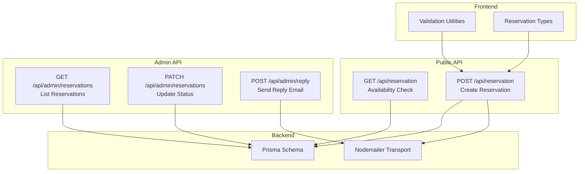
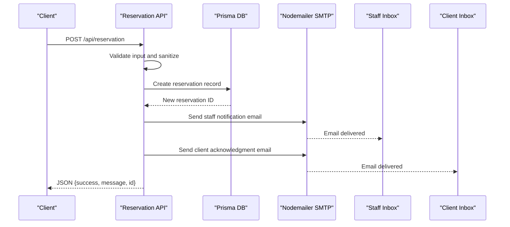
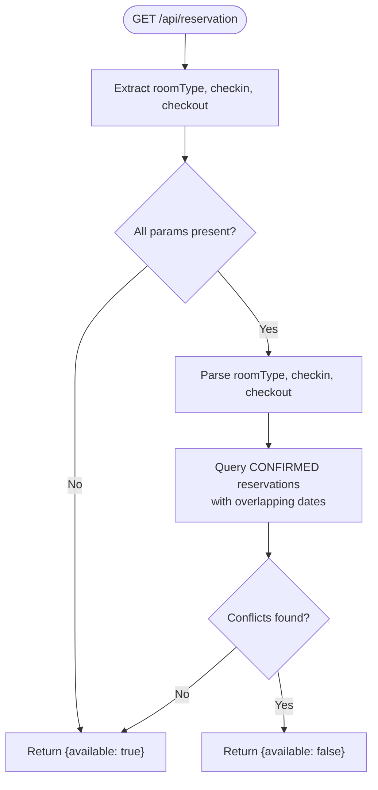
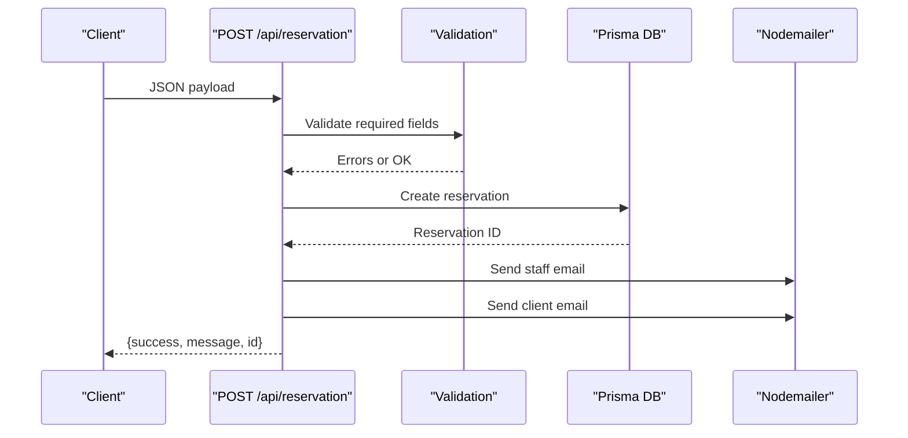
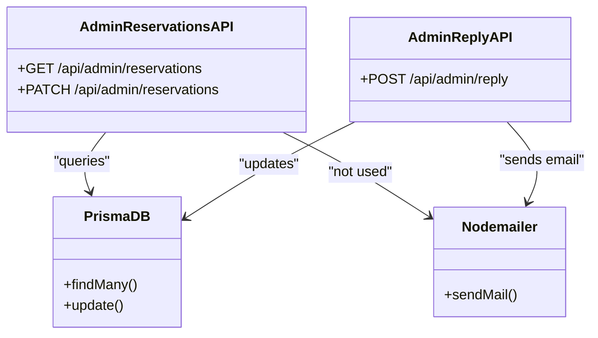
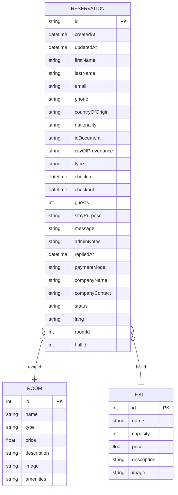
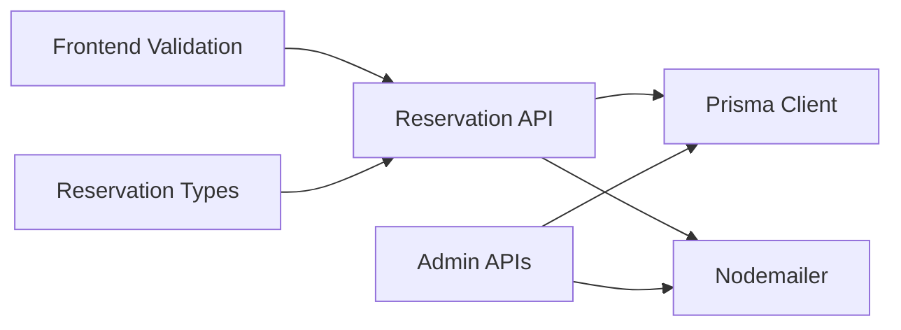

# Reservation Management API

<cite>
**Referenced Files in This Document**
- [route.ts](file://src/app/api/reservation/route.ts)
- [route.ts](file://src/app/api/admin/reservations/route.ts)
- [route.ts](file://src/app/api/admin/reply/route.ts)
- [reservationTypes.ts](file://src/components/reservation/reservationTypes.ts)
- [validateReservation.ts](file://src/components/reservation/validateReservation.ts)
- [content.ts](file://src/data/content.ts)
- [schema.prisma](file://prisma/schema.prisma)
- [site.ts](file://src/lib/site.ts)
- [staff-notify.ts](file://src/lib/staff-notify.ts)
</cite>

## Table of Contents
1. [Introduction](#introduction)
2. [Project Structure](#project-structure)
3. [Core Components](#core-components)
4. [Architecture Overview](#architecture-overview)
5. [Detailed Component Analysis](#detailed-component-analysis)
6. [Dependency Analysis](#dependency-analysis)
7. [Performance Considerations](#performance-considerations)
8. [Troubleshooting Guide](#troubleshooting-guide)
9. [Conclusion](#conclusion)

## Introduction
This document provides comprehensive API documentation for the reservation management system. It covers:
- Availability checking endpoint with query parameters
- Reservation creation endpoint supporting multiple reservation types
- Request/response schemas, validation rules, and error handling
- Email notification system integration with Zoho Mail SMTP
- Security considerations including HTML escaping and input sanitization
- Practical examples and common error scenarios

## Project Structure
The reservation system consists of:
- Public API endpoints for availability checks and reservation submissions
- Admin endpoints for managing reservations and replying to clients
- Frontend validation utilities and data definitions
- Prisma database schema for persistence
- Email transport configuration using Nodemailer with Zoho Mail SMTP

**Diagram sources**
- [route.ts:28-57](file://src/app/api/reservation/route.ts#L28-L57)
- [route.ts:59-253](file://src/app/api/reservation/route.ts#L59-L253)
- [route.ts:4-27](file://src/app/api/admin/reservations/route.ts#L4-L27)
- [route.ts:5-72](file://src/app/api/admin/reply/route.ts#L5-L72)
- [validateReservation.ts:1-59](file://src/components/reservation/validateReservation.ts#L1-L59)
- [reservationTypes.ts:1-58](file://src/components/reservation/reservationTypes.ts#L1-L58)
- [schema.prisma:34-74](file://prisma/schema.prisma#L34-L74)

**Section sources**
- [route.ts:1-255](file://src/app/api/reservation/route.ts#L1-L255)
- [route.ts:1-46](file://src/app/api/admin/reservations/route.ts#L1-L46)
- [route.ts:1-72](file://src/app/api/admin/reply/route.ts#L1-L72)
- [reservationTypes.ts:1-58](file://src/components/reservation/reservationTypes.ts#L1-L58)
- [validateReservation.ts:1-59](file://src/components/reservation/validateReservation.ts#L1-L59)
- [schema.prisma:1-75](file://prisma/schema.prisma#L1-L75)

## Core Components
- Availability Check Endpoint: Validates query parameters and checks room availability against existing reservations
- Reservation Creation Endpoint: Handles multi-type reservations, sanitizes input, persists to database, and sends email notifications
- Admin Management Endpoints: Lists reservations and updates status with admin session validation
- Email Notification System: Uses Zoho Mail SMTP via Nodemailer for staff and client notifications
- Validation Utilities: Frontend validation helpers complement backend validation
- Database Schema: Defines reservation model and relations to rooms and halls

**Section sources**
- [route.ts:28-57](file://src/app/api/reservation/route.ts#L28-L57)
- [route.ts:59-253](file://src/app/api/reservation/route.ts#L59-L253)
- [route.ts:4-27](file://src/app/api/admin/reservations/route.ts#L4-L27)
- [route.ts:5-72](file://src/app/api/admin/reply/route.ts#L5-L72)
- [validateReservation.ts:1-59](file://src/components/reservation/validateReservation.ts#L1-L59)
- [schema.prisma:34-74](file://prisma/schema.prisma#L34-L74)

## Architecture Overview
The system integrates frontend validation, backend API endpoints, database persistence, and email notifications. The reservation creation flow triggers two emails: one to staff and one to the client, both using Zoho Mail SMTP.

**Diagram sources**
- [route.ts:59-253](file://src/app/api/reservation/route.ts#L59-L253)
- [schema.prisma:34-74](file://prisma/schema.prisma#L34-L74)

## Detailed Component Analysis

### Availability Check Endpoint
- Path: GET /api/reservation
- Purpose: Determine room availability for a given room type and date range
- Query Parameters:
  - roomType: integer room identifier
  - checkin: ISO date string
  - checkout: ISO date string
- Behavior:
  - If any required parameter is missing, returns availability as true (fallback)
  - Otherwise, queries CONFIRMED reservations overlapping the requested period
  - Returns JSON with available flag indicating no conflicts

**Diagram sources**
- [route.ts:28-57](file://src/app/api/reservation/route.ts#L28-L57)

**Section sources**
- [route.ts:28-57](file://src/app/api/reservation/route.ts#L28-L57)

### Reservation Creation Endpoint
- Path: POST /api/reservation
- Purpose: Create reservations for room, restaurant, event, or photoshoot types
- Request Body Schema:
  - type: string (room, restaurant, event, photoshoot)
  - fullname: string (optional, fallback to firstName + lastName)
  - firstName: string
  - lastName: string
  - email: string (validated)
  - phone: string (validated)
  - countryOfOrigin: string
  - nationality: string
  - idDocument: string (minimum length)
  - cityOfProvenance: string
  - stayPurpose: string (validated for room type)
  - paymentMode: string ("private" | "company")
  - companyName: string (required if paymentMode is company)
  - companyContact: string (required if paymentMode is company)
  - checkin: string (ISO date, required for room)
  - checkout: string (ISO date, required for room)
  - guests: number (minimum 1)
  - roomType: string (required for room type)
  - hallType: string (required for event type)
  - message: string
  - acceptTerms: boolean (required)
  - lang: string ("fr"|"en")

- Validation Rules:
  - Required fields: acceptTerms, firstName, lastName, email, phone
  - Email format validated
  - Phone format validated (digits, minimum length)
  - stayPurpose minimum length enforced for room type
  - Dates validated for room type (checkin >= today, checkout > checkin)
  - guests must be numeric and >= 1
  - For company payment mode, companyName and companyContact are required
  - roomType and hallType required for respective types

- Response:
  - On success: JSON {success: true, message, id}
  - On validation errors: JSON {success: false, message} with 400 status
  - On internal errors: JSON {success: false, message} with 500 status

- Email Notifications:
  - Staff email sent to reservations@archangeshotel.com
  - Client email sent to the provided email address
  - Both use Zoho Mail SMTP configured via environment variables

**Diagram sources**
- [route.ts:59-253](file://src/app/api/reservation/route.ts#L59-L253)
- [validateReservation.ts:5-50](file://src/components/reservation/validateReservation.ts#L5-L50)

**Section sources**
- [route.ts:59-253](file://src/app/api/reservation/route.ts#L59-L253)
- [validateReservation.ts:1-59](file://src/components/reservation/validateReservation.ts#L1-L59)
- [reservationTypes.ts:1-58](file://src/components/reservation/reservationTypes.ts#L1-L58)

### Admin Management Endpoints
- List Reservations:
  - Path: GET /api/admin/reservations
  - Requires admin session cookie "admin_session" set to "active"
  - Returns JSON {success: true, reservations} ordered by creation date desc
  - Unauthorized response with 401 status

- Update Reservation Status:
  - Path: PATCH /api/admin/reservations
  - Requires admin session cookie
  - Expects JSON {id, status}
  - Updates reservation status and returns updated reservation

- Reply to Client:
  - Path: POST /api/admin/reply
  - Requires admin session cookie
  - Expects JSON {reservationId, to, subject, message}
  - Sends styled HTML email using Zoho Mail SMTP
  - Updates reservation repliedAt timestamp

**Diagram sources**
- [route.ts:4-45](file://src/app/api/admin/reservations/route.ts#L4-L45)
- [route.ts:5-72](file://src/app/api/admin/reply/route.ts#L5-L72)
- [schema.prisma:34-74](file://prisma/schema.prisma#L34-L74)

**Section sources**
- [route.ts:1-46](file://src/app/api/admin/reservations/route.ts#L1-L46)
- [route.ts:1-72](file://src/app/api/admin/reply/route.ts#L1-L72)

### Database Model
The reservation model supports four reservation types and includes fields for guest information, stay details, communication fields, billing information, status tracking, and language preference. It also defines relations to Room and Hall entities.

**Diagram sources**
- [schema.prisma:34-74](file://prisma/schema.prisma#L34-L74)

**Section sources**
- [schema.prisma:34-74](file://prisma/schema.prisma#L34-L74)

### Email Notification System
- SMTP Configuration:
  - Host: smtp.zoho.com (default)
  - Port: 465 (default)
  - Secure: true
  - Credentials: SMTP_USER and SMTP_PASSWORD environment variables
- Staff Notification:
  - Sent to reservations@archangeshotel.com
  - Includes reservation details, client information, and type-specific fields
- Client Acknowledgment:
  - Sent to the provided email address
  - Localized content based on lang field ("fr"|"en")
- Admin Reply:
  - Sends styled HTML email with optional payment link replacement
  - Updates reservation repliedAt timestamp

**Section sources**
- [route.ts:129-203](file://src/app/api/reservation/route.ts#L129-L203)
- [route.ts:205-243](file://src/app/api/reservation/route.ts#L205-L243)
- [route.ts:12-59](file://src/app/api/admin/reply/route.ts#L12-L59)
- [site.ts:20-21](file://src/lib/site.ts#L20-L21)

## Dependency Analysis
The reservation system exhibits clear separation of concerns:
- API endpoints depend on Prisma for data persistence
- Email delivery depends on Nodemailer and Zoho Mail SMTP
- Frontend validation utilities complement backend validation
- Admin endpoints enforce session-based access control

**Diagram sources**
- [route.ts:1-4](file://src/app/api/reservation/route.ts#L1-L4)
- [route.ts](file://src/app/api/admin/reservations/route.ts#L2)
- [route.ts](file://src/app/api/admin/reply/route.ts#L2)
- [validateReservation.ts](file://src/components/reservation/validateReservation.ts#L1)
- [reservationTypes.ts](file://src/components/reservation/reservationTypes.ts#L1)

**Section sources**
- [route.ts:1-4](file://src/app/api/reservation/route.ts#L1-L4)
- [route.ts:1-46](file://src/app/api/admin/reservations/route.ts#L1-L46)
- [route.ts:1-72](file://src/app/api/admin/reply/route.ts#L1-L72)
- [validateReservation.ts:1-59](file://src/components/reservation/validateReservation.ts#L1-L59)
- [reservationTypes.ts:1-58](file://src/components/reservation/reservationTypes.ts#L1-L58)

## Performance Considerations
- Availability Check: The query filters CONFIRMED reservations by overlapping date ranges; ensure proper indexing on reservation date fields for optimal performance
- Email Delivery: Asynchronous email sending may introduce latency; consider queueing for high-volume scenarios
- Database Operations: Batch operations for bulk admin actions can improve throughput
- Frontend Validation: Client-side validation reduces unnecessary API calls and improves user experience

## Troubleshooting Guide
Common Issues and Solutions:
- Missing Required Parameters: Availability check returns fallback availability when parameters are absent
- Validation Errors: Reservation creation responds with 400 status and specific error messages for invalid fields
- Email Delivery Failures: Verify SMTP credentials and network connectivity; check server logs for detailed error information
- Admin Access Denied: Ensure admin session cookie "admin_session" is set to "active"
- Date Validation: For room reservations, checkin must be today or later and checkout must be after checkin

Security Considerations:
- HTML Escaping: All user-provided content in emails is escaped to prevent XSS attacks
- Input Sanitization: Frontend validation complements backend validation for robust sanitization
- Session Management: Admin endpoints require explicit session validation
- Environment Variables: SMTP credentials are loaded from environment variables; ensure proper configuration

**Section sources**
- [route.ts:6-14](file://src/app/api/reservation/route.ts#L6-L14)
- [route.ts:87-100](file://src/app/api/reservation/route.ts#L87-L100)
- [route.ts:5-9](file://src/app/api/admin/reservations/route.ts#L5-L9)
- [validateReservation.ts:28-39](file://src/components/reservation/validateReservation.ts#L28-L39)

## Conclusion
The reservation management system provides a robust foundation for handling multiple reservation types with integrated email notifications and administrative controls. The API endpoints offer clear request/response contracts, comprehensive validation, and security measures including HTML escaping and input sanitization. Proper configuration of SMTP credentials and database connections ensures reliable operation across availability checks, reservation creation, and administrative workflows.