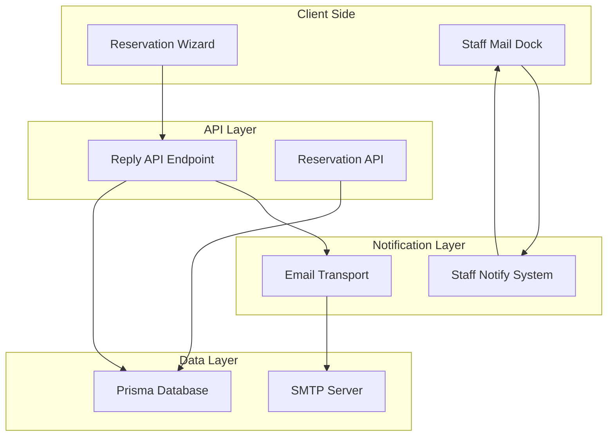
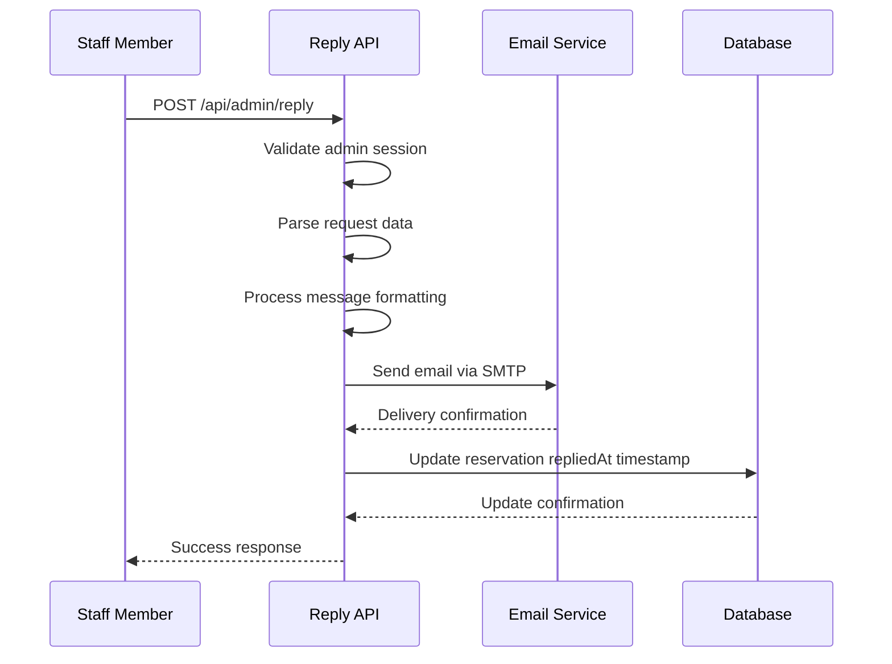
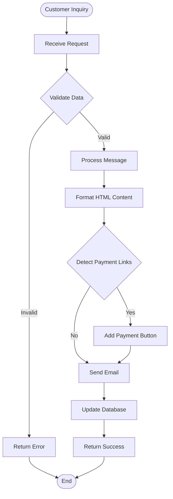

# Staff Communication API

<cite>
**Referenced Files in This Document**
- [src/app/api/admin/reply/route.ts](file://src/app/api/admin/reply/route.ts)
- [src/lib/staff-notify.ts](file://src/lib/staff-notify.ts)
- [src/components/reservation/StaffMailDock.tsx](file://src/components/reservation/StaffMailDock.tsx)
- [src/app/api/reservation/route.ts](file://src/app/api/reservation/route.ts)
- [src/lib/site.ts](file://src/lib/site.ts)
- [src/context/LanguageContext.tsx](file://src/context/LanguageContext.tsx)
- [prisma/schema.prisma](file://prisma/schema.prisma)
</cite>

## Table of Contents
1. [Introduction](#introduction)
2. [System Architecture](#system-architecture)
3. [API Endpoints](#api-endpoints)
4. [Request Schemas](#request-schemas)
5. [Response Formats](#response-formats)
6. [Communication Workflows](#communication-workflows)
7. [Integration Components](#integration-components)
8. [Template System](#template-system)
9. [Notification Mechanisms](#notification-mechanisms)
10. [Common Scenarios](#common-scenarios)
11. [Error Handling](#error-handling)
12. [Security Considerations](#security-considerations)
13. [Conclusion](#conclusion)

## Introduction

The Staff Communication API is a comprehensive system designed to handle staff responses to customer inquiries and reservation requests for Archanges Hôtel. This system integrates email notifications, staff activity alerts, and reservation management to provide a seamless communication workflow between customers and hotel staff.

The system consists of three main components:
- **Reply Processing Endpoint**: Handles staff responses to customer inquiries
- **Email Notification System**: Manages automated email communications
- **Staff Notification System**: Provides real-time alerts for staff activities

## System Architecture



**Diagram sources**
- [src/app/api/admin/reply/route.ts:1-73](file://src/app/api/admin/reply/route.ts#L1-L73)
- [src/lib/staff-notify.ts:1-17](file://src/lib/staff-notify.ts#L1-L17)
- [src/app/api/reservation/route.ts:1-255](file://src/app/api/reservation/route.ts#L1-L255)

## API Endpoints

### Reply Processing Endpoint

The primary endpoint for processing staff responses to customer inquiries and reservation requests.

**Endpoint**: `POST /api/admin/reply`

**Authentication**: Requires admin session cookie with value "active"

**Request Headers**:
- Content-Type: application/json
- Cookie: admin_session=active

**Request Body Schema**:
```typescript
{
  reservationId: string;        // Unique identifier of the reservation
  to: string;                   // Recipient email address
  subject: string;              // Email subject line
  message: string;              // HTML formatted message content
}
```

**Response Schema**:
```typescript
{
  success: boolean;             // Operation status
}
```

**Section sources**
- [src/app/api/admin/reply/route.ts:5-73](file://src/app/api/admin/reply/route.ts#L5-L73)

## Request Schemas

### Staff Reply Request

The staff reply system accepts structured requests for processing customer communications:

| Field | Type | Required | Description |
|-------|------|----------|-------------|
| reservationId | string | Yes | Database ID of the reservation being responded to |
| to | string | Yes | Email address of the recipient |
| subject | string | Yes | Subject line for the email response |
| message | string | Yes | HTML formatted message content |

### Message Processing Features

The system automatically processes messages with special formatting capabilities:

**Payment Link Detection**: Automatically detects payment-related content
- Detects "[LIEN_PAIEMENT_ICI]" placeholder
- Identifies monetary amounts using "$" symbol

**Automatic Styling**: Converts plain text to HTML format
- Replaces line breaks with `<br>` tags
- Applies professional email styling
- Generates responsive HTML templates

**Section sources**
- [src/app/api/admin/reply/route.ts:10-36](file://src/app/api/admin/reply/route.ts#L10-L36)

## Response Formats

### Success Response

```json
{
  "success": true
}
```

### Error Response

```json
{
  "success": false,
  "status": 500
}
```

### Authentication Failure Response

```json
{
  "success": false,
  "status": 401
}
```

## Communication Workflows

### Staff Reply Processing Workflow



**Diagram sources**
- [src/app/api/admin/reply/route.ts:5-73](file://src/app/api/admin/reply/route.ts#L5-L73)

### Customer Communication Flow



**Diagram sources**
- [src/app/api/admin/reply/route.ts:22-65](file://src/app/api/admin/reply/route.ts#L22-L65)

## Integration Components

### Database Integration

The system integrates with Prisma ORM for reservation management:

**Reservation Model Fields Used**:
- `id`: Unique reservation identifier
- `email`: Customer email address
- `message`: Original customer message
- `adminNotes`: Staff internal notes
- `repliedAt`: Timestamp of last response

**Section sources**
- [prisma/schema.prisma:34-74](file://prisma/schema.prisma#L34-L74)

### Email Service Integration

The system uses Nodemailer for email processing:

**SMTP Configuration**:
- Host: Environment variable or default "smtp.zoho.com"
- Port: Environment variable or default "465"
- Secure: True (SSL/TLS)
- Authentication: Username and password from environment variables

**Section sources**
- [src/app/api/admin/reply/route.ts:12-20](file://src/app/api/admin/reply/route.ts#L12-L20)

## Template System

### Email Templates

The system generates professional HTML email templates with hotel branding:

**Template Structure**:
- Hotel header with logo and branding
- Professional content area with styled paragraphs
- Footer with hotel contact information
- Responsive design for mobile devices

**Payment Button Template**:
Automatically generated when payment-related content is detected:
- Centered call-to-action button
- Professional styling with gold accents
- Support information for various payment methods

**Section sources**
- [src/app/api/admin/reply/route.ts:42-58](file://src/app/api/admin/reply/route.ts#L42-L58)

## Notification Mechanisms

### Staff Activity Notifications

The system provides real-time notifications for staff members:

**Notification Types**:
- DOM Custom Events for cross-tab communication
- BroadcastChannel for same-origin messaging
- Visual indicators in staff mail dock

**Notification Trigger**:
- Automatic when new reservation requests are received
- Manual triggering from staff actions

**Section sources**
- [src/lib/staff-notify.ts:1-17](file://src/lib/staff-notify.ts#L1-L17)
- [src/components/reservation/StaffMailDock.tsx:19-35](file://src/components/reservation/StaffMailDock.tsx#L19-L35)

### Staff Mail Dock Interface

Provides staff with quick access to communication tools:

**Features**:
- Floating dock interface with animated transitions
- Visual notification indicators
- Direct links to Zoho webmail
- Quick email composition links

**Section sources**
- [src/components/reservation/StaffMailDock.tsx:13-134](file://src/components/reservation/StaffMailDock.tsx#L13-L134)

## Common Scenarios

### Scenario 1: Standard Reservation Response

**Request**:
- Reservation ID: "abc123"
- Recipient: customer@example.com
- Subject: "RE: Room Reservation Request"
- Message: "Thank you for your inquiry. We have checked availability..."

**Processing**:
1. Validate admin session
2. Process HTML formatting
3. Send email via SMTP
4. Update reservation timestamp
5. Return success response

### Scenario 2: Payment Request Response

**Request**:
- Message contains "$" symbol or "[LIEN_PAIEMENT_ICI]"
- System automatically adds payment button
- Professional styling applied

**Output**:
- HTML email with embedded payment call-to-action
- Responsive design for all devices
- Professional footer with hotel contact

### Scenario 3: Error Handling Scenario

**Request**:
- Invalid admin session
- Missing required fields
- SMTP connection failure

**Response**:
- Appropriate HTTP status codes
- Error messages in response body
- Logging for debugging purposes

## Error Handling

### Authentication Errors
- Status: 401 Unauthorized
- Cause: Invalid or missing admin session
- Response: `{ success: false }`

### Processing Errors
- Status: 500 Internal Server Error
- Cause: Database update failures, email delivery issues
- Response: `{ success: false }`

### Validation Errors
- Status: 400 Bad Request
- Cause: Missing required fields in request
- Response: `{ success: false, message: "Validation error" }`

## Security Considerations

### Authentication
- Session-based authentication required
- Cookie validation for admin access
- CSRF protection through session verification

### Data Protection
- Email content sanitized before sending
- Database updates performed securely
- Environment variables for sensitive configuration

### Access Control
- Only authenticated staff can access reply endpoint
- Session validation prevents unauthorized access
- Audit trail through database timestamps

## Conclusion

The Staff Communication API provides a robust foundation for managing customer communications at Archanges Hôtel. The system combines professional email templating, real-time staff notifications, and seamless database integration to create an efficient communication workflow.

Key benefits include:
- Automated email processing with professional templates
- Real-time staff notification system
- Seamless integration with reservation management
- Multi-language support for international customers
- Responsive design for all communication channels

The modular architecture allows for easy extension and customization while maintaining security and reliability standards.