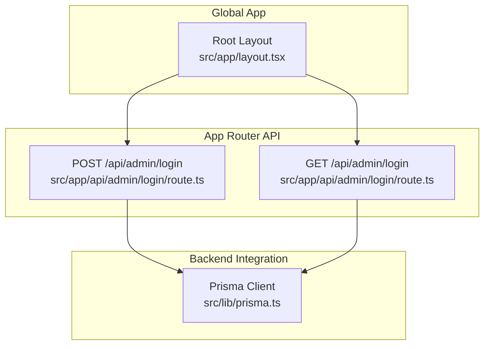
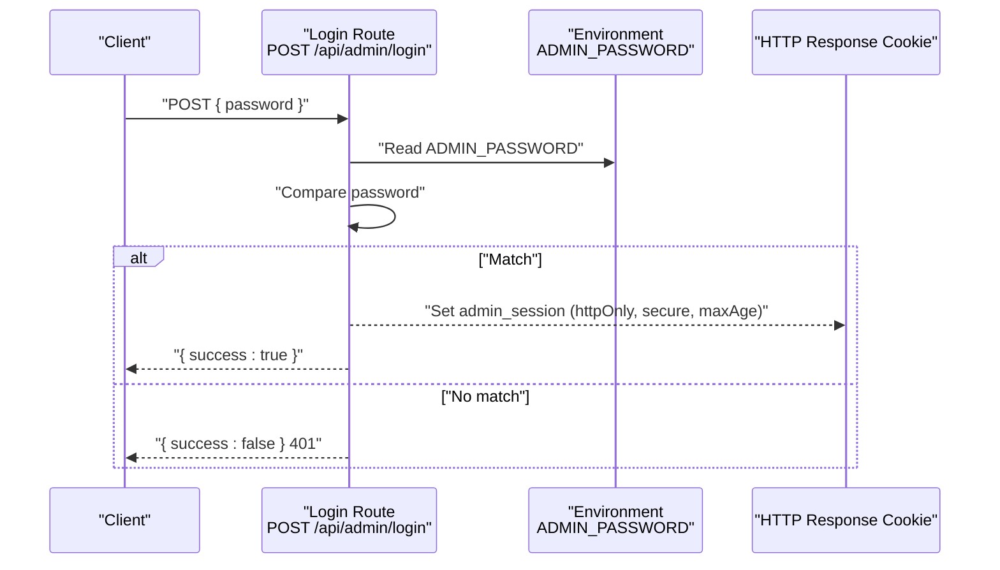
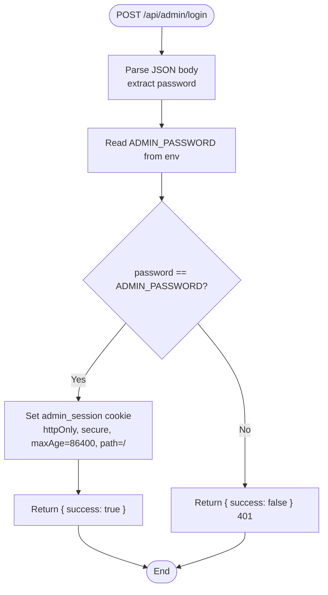
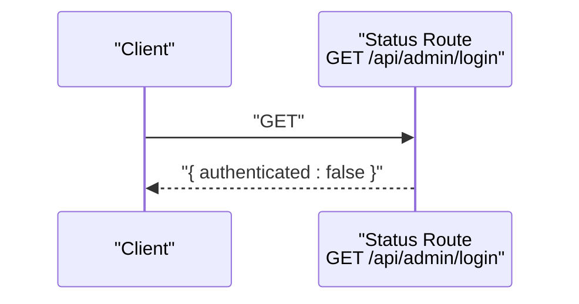
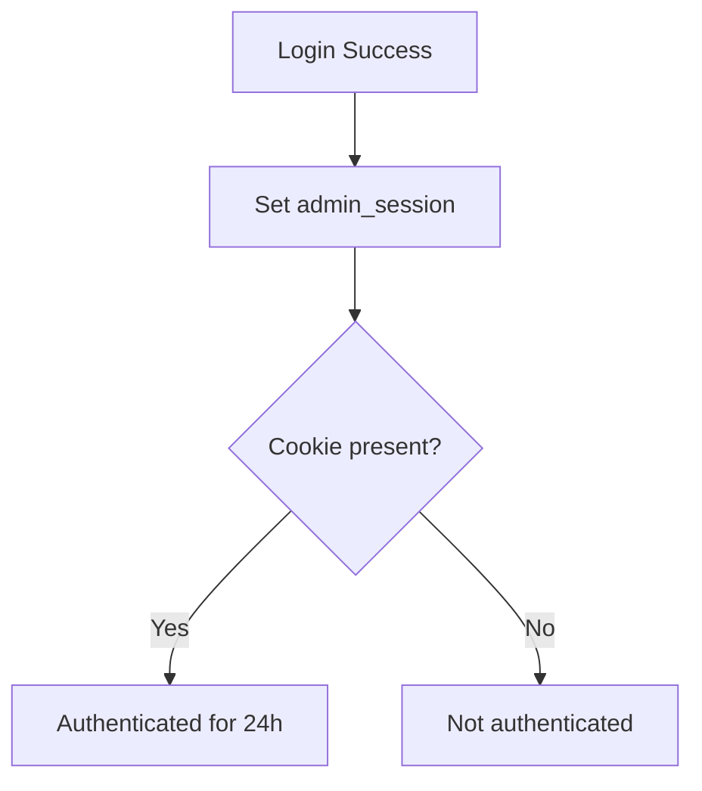
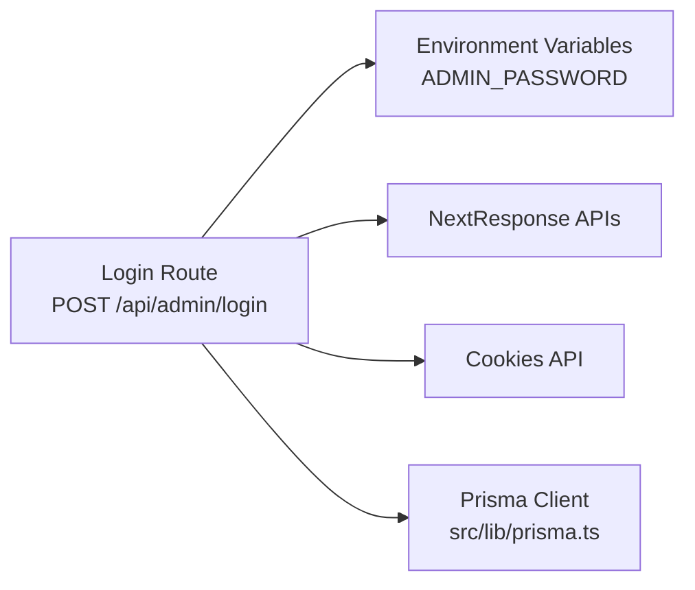

# Admin Authentication

<cite>
**Referenced Files in This Document**
- [login/route.ts](file://src/app/api/admin/login/route.ts)
- [layout.tsx](file://src/app/layout.tsx)
- [prisma.ts](file://src/lib/prisma.ts)
- [package.json](file://package.json)
- [next.config.ts](file://next.config.ts)
- [README.md](file://README.md)
</cite>

## Table of Contents
1. [Introduction](#introduction)
2. [Project Structure](#project-structure)
3. [Core Components](#core-components)
4. [Architecture Overview](#architecture-overview)
5. [Detailed Component Analysis](#detailed-component-analysis)
6. [Dependency Analysis](#dependency-analysis)
7. [Performance Considerations](#performance-considerations)
8. [Troubleshooting Guide](#troubleshooting-guide)
9. [Conclusion](#conclusion)

## Introduction
This document describes the admin authentication system implemented in the project. It focuses on the login API endpoint, password validation, cookie-based session management, and security configurations. It also outlines the authentication flow, environment configuration, production best practices, and troubleshooting guidance for common failure scenarios.

## Project Structure
The admin authentication is implemented as a Next.js App Router API route under the admin namespace. The route exposes two HTTP methods: POST for login and GET for health/status checks. The application layout is defined globally, and the backend integrates with Prisma for data access.

**Diagram sources**
- [login/route.ts:1-28](file://src/app/api/admin/login/route.ts#L1-L28)
- [layout.tsx:38-52](file://src/app/layout.tsx#L38-L52)
- [prisma.ts:1-12](file://src/lib/prisma.ts#L1-L12)

**Section sources**
- [login/route.ts:1-28](file://src/app/api/admin/login/route.ts#L1-L28)
- [layout.tsx:38-52](file://src/app/layout.tsx#L38-L52)
- [prisma.ts:1-12](file://src/lib/prisma.ts#L1-L12)

## Core Components
- Login API route:
  - Validates the incoming password against an environment-controlled secret.
  - On success, returns a JSON success response and sets a session cookie with httpOnly, secure, maxAge, and path attributes.
  - On failure, returns a JSON failure response with HTTP 401 Unauthorized.
  - Provides a GET endpoint returning an authentication status payload.

- Environment configuration:
  - Uses ADMIN_PASSWORD from environment variables; defaults to a hardcoded value if not present.

- Session cookie:
  - httpOnly prevents client-side script access.
  - secure flag enables transport security in production environments.
  - maxAge configures a 24-hour session lifetime.
  - path restricts the cookie to the root path.

- Prisma integration:
  - The Prisma client is initialized and exposed for potential future use in admin authentication logic.

**Section sources**
- [login/route.ts:3-24](file://src/app/api/admin/login/route.ts#L3-L24)
- [prisma.ts:1-12](file://src/lib/prisma.ts#L1-L12)

## Architecture Overview
The authentication flow is a simple API-driven process. The client sends credentials to the login endpoint, which validates them and establishes a session via a cookie. Subsequent requests can leverage the cookie for session identification.

**Diagram sources**
- [login/route.ts:3-24](file://src/app/api/admin/login/route.ts#L3-L24)

## Detailed Component Analysis

### Login Endpoint (POST)
- Purpose: Authenticate administrators by validating a password and establishing a session.
- Request body: Expects a JSON object containing the password field.
- Validation:
  - Reads ADMIN_PASSWORD from environment variables.
  - Compares the incoming password to the configured secret.
- Response:
  - On success: Returns JSON with success set to true and sets a session cookie.
  - On failure: Returns JSON with success set to false and HTTP 401.

Security and session configuration:
- Cookie attributes:
  - httpOnly: true
  - secure: enabled when NODE_ENV equals production
  - maxAge: 86400 seconds (24 hours)
  - path: "/"
- Notes:
  - The implementation comments indicate that a real production deployment should consider using a proper JWT instead of a simple session cookie.

**Diagram sources**
- [login/route.ts:3-24](file://src/app/api/admin/login/route.ts#L3-L24)

**Section sources**
- [login/route.ts:3-24](file://src/app/api/admin/login/route.ts#L3-L24)

### Status Endpoint (GET)
- Purpose: Provide a lightweight check to determine current authentication state.
- Behavior: Returns a JSON payload indicating whether the client is authenticated.
- Typical usage: Used by frontend to hydrate UI state or redirect unauthorized clients.

**Diagram sources**
- [login/route.ts:26-28](file://src/app/api/admin/login/route.ts#L26-L28)

**Section sources**
- [login/route.ts:26-28](file://src/app/api/admin/login/route.ts#L26-L28)

### Session Management and Timeout
- Session establishment: A single session cookie named admin_session is set upon successful login.
- Timeout: The cookie’s maxAge is configured to 24 hours.
- Path scope: The cookie applies to the root path, ensuring broad access within the admin area.
- Persistence: The cookie remains valid until expiration or deletion.

**Diagram sources**
- [login/route.ts:13-18](file://src/app/api/admin/login/route.ts#L13-L18)

**Section sources**
- [login/route.ts:13-18](file://src/app/api/admin/login/route.ts#L13-L18)

### Logout Procedure
- Current implementation: There is no explicit logout endpoint in the repository.
- Suggested approach: To log out, the client should either:
  - Delete the admin_session cookie, or
  - Redirect to a dedicated logout handler that clears the cookie.
- Recommendation: Implement a DELETE or POST logout endpoint that removes the session cookie and optionally invalidates server-side session state if extended.

[No sources needed since this section provides general guidance]

### Security Best Practices for Production
- Use a strong, randomly generated ADMIN_PASSWORD in production.
- Ensure NODE_ENV is set to production to enable the secure flag on cookies.
- Consider migrating from a simple session cookie to a signed JWT with short-lived access tokens and refresh tokens.
- Enforce HTTPS in production to protect cookies in transit.
- Add rate limiting and IP allowlisting for the login endpoint.
- Rotate secrets regularly and store them in a secure secrets manager.
- Add CSRF protection if the admin UI is served from the same origin.

**Section sources**
- [login/route.ts:14-15](file://src/app/api/admin/login/route.ts#L14-L15)

## Dependency Analysis
- The login route depends on Next.js server APIs for request/response handling.
- The route reads environment variables for credential validation.
- The Prisma client is available for potential future use in admin authentication logic (e.g., storing login attempts or user records).

**Diagram sources**
- [login/route.ts:1-24](file://src/app/api/admin/login/route.ts#L1-L24)
- [prisma.ts:1-12](file://src/lib/prisma.ts#L1-L12)

**Section sources**
- [login/route.ts:1-24](file://src/app/api/admin/login/route.ts#L1-L24)
- [prisma.ts:1-12](file://src/lib/prisma.ts#L1-L12)

## Performance Considerations
- The login endpoint performs a constant-time comparison against a single secret, minimizing computational overhead.
- Cookie-based session storage avoids server-side session stores, reducing memory footprint.
- For high-traffic scenarios, consider adding caching for repeated validations and implementing rate limiting.

[No sources needed since this section provides general guidance]

## Troubleshooting Guide
Common issues and resolutions:
- Unauthorized response (401):
  - Cause: Incorrect password or missing ADMIN_PASSWORD in environment.
  - Resolution: Verify ADMIN_PASSWORD is set in the environment and matches the submitted password.
- Cookie not set:
  - Cause: Secure flag requires HTTPS; httpOnly prevents client-side access.
  - Resolution: Ensure the deployment uses HTTPS in production; avoid reading the cookie via JavaScript.
- Session expires unexpectedly:
  - Cause: maxAge is set to 24 hours; long inactivity leads to expiration.
  - Resolution: Re-authenticate or adjust maxAge as needed.
- Frontend authentication state mismatch:
  - Cause: GET endpoint returns a static status payload.
  - Resolution: Implement a server-side session check endpoint or maintain client-side state based on cookie presence.

**Section sources**
- [login/route.ts:23-27](file://src/app/api/admin/login/route.ts#L23-L27)

## Conclusion
The admin authentication system provides a straightforward, cookie-backed login mechanism with sensible defaults for security. While suitable for development and simple scenarios, production deployments should strengthen the implementation by adopting robust secrets management, HTTPS enforcement, rate limiting, and a more advanced session/token strategy.