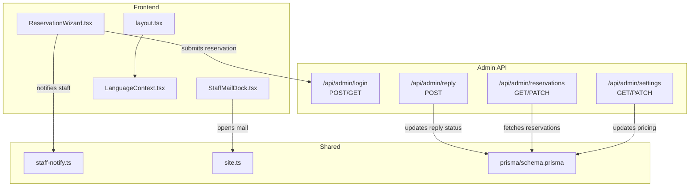
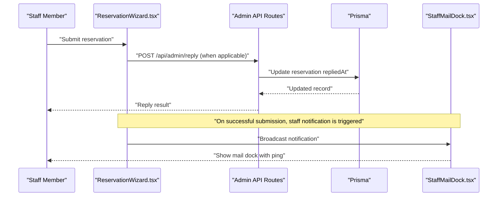
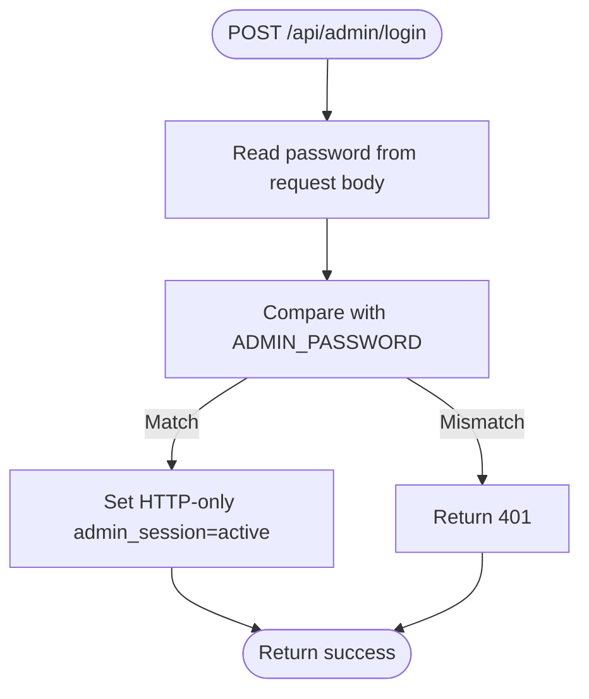
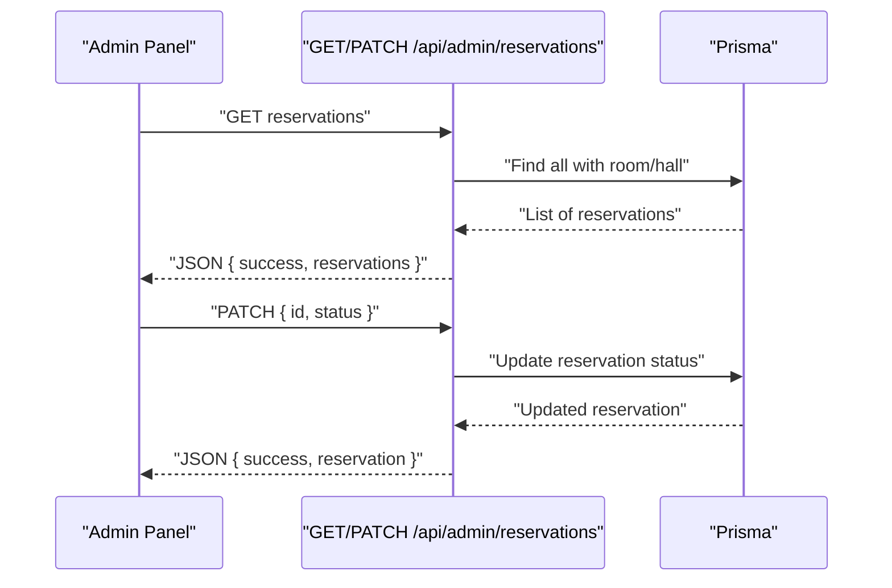
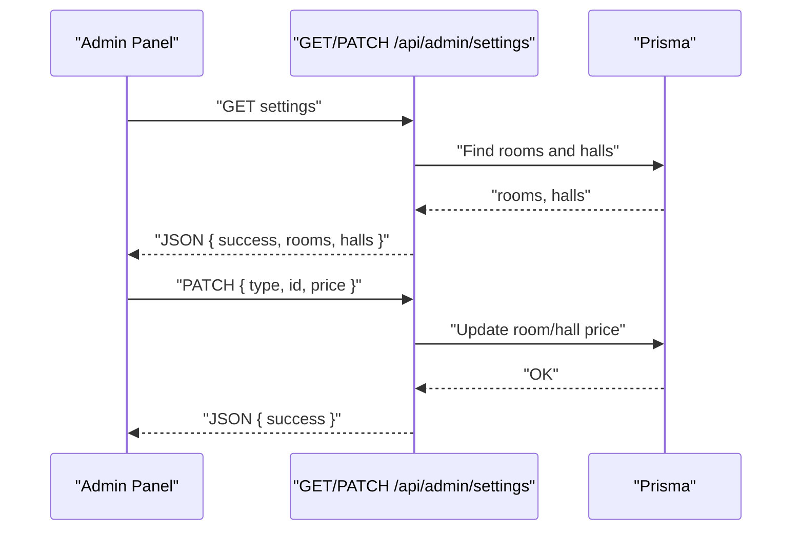
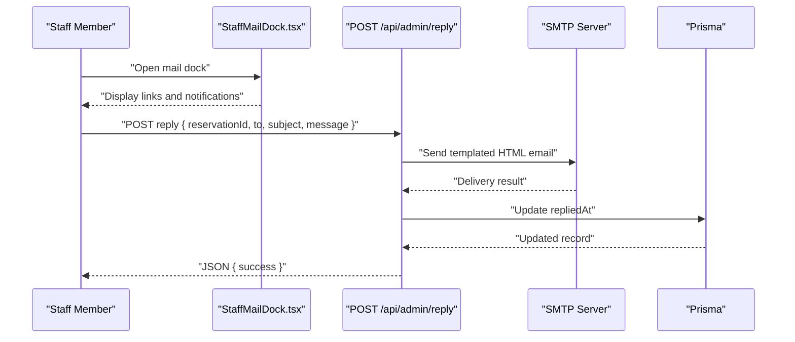
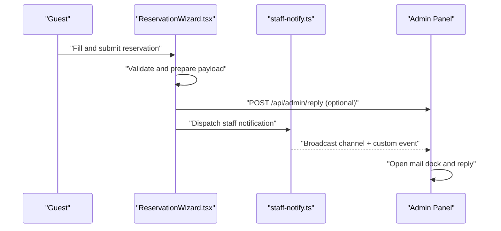
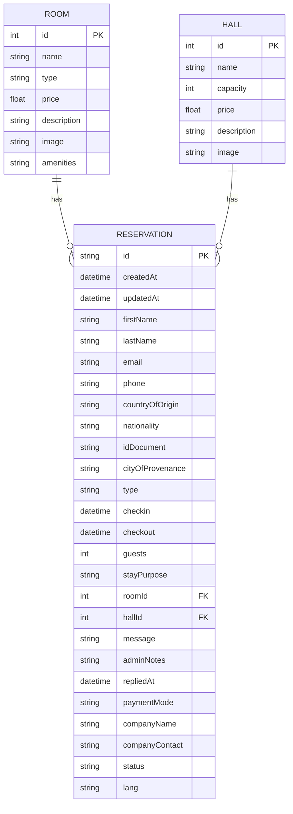
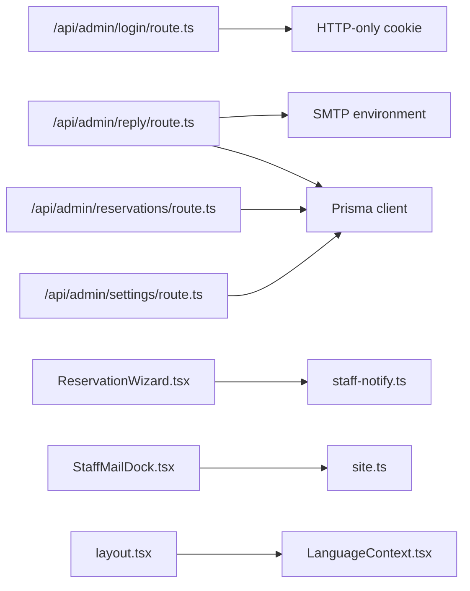

# Admin Dashboard

<cite>
**Referenced Files in This Document**
- [src/app/admin/page.tsx](file://src/app/admin/page.tsx)
- [src/app/api/admin/login/route.ts](file://src/app/api/admin/login/route.ts)
- [src/app/api/admin/reply/route.ts](file://src/app/api/admin/reply/route.ts)
- [src/app/api/admin/reservations/route.ts](file://src/app/api/admin/reservations/route.ts)
- [src/app/api/admin/settings/route.ts](file://src/app/api/admin/settings/route.ts)
- [src/components/reservation/StaffMailDock.tsx](file://src/components/reservation/StaffMailDock.tsx)
- [src/lib/staff-notify.ts](file://src/lib/staff-notify.ts)
- [src/lib/site.ts](file://src/lib/site.ts)
- [src/context/LanguageContext.tsx](file://src/context/LanguageContext.tsx)
- [src/components/reservation/ReservationWizard.tsx](file://src/components/reservation/ReservationWizard.tsx)
- [prisma/schema.prisma](file://prisma/schema.prisma)
- [src/app/layout.tsx](file://src/app/layout.tsx)
</cite>

## Table of Contents
1. [Introduction](#introduction)
2. [Project Structure](#project-structure)
3. [Core Components](#core-components)
4. [Architecture Overview](#architecture-overview)
5. [Detailed Component Analysis](#detailed-component-analysis)
6. [Dependency Analysis](#dependency-analysis)
7. [Performance Considerations](#performance-considerations)
8. [Troubleshooting Guide](#troubleshooting-guide)
9. [Conclusion](#conclusion)
10. [Appendices](#appendices)

## Introduction
This document describes the admin dashboard and staff management functionality for Archanges Hôtel. It covers the staff authentication system, login and session handling, access control, reservation management workflows, settings management for pricing and facility configuration, and staff communication tools including the mail dock interface and reply processing. It also outlines administrative workflows, permission models, security considerations, staff training requirements, administrative reporting features, and integration with the reservation system.

## Project Structure
The admin-related functionality is organized around:
- Admin API routes under src/app/api/admin for authentication, replies, reservations, and settings
- A reusable staff mail dock component under src/components/reservation
- Notification utilities for staff activity
- Site configuration constants
- Prisma schema modeling reservations, rooms, and halls
- A reservation wizard that triggers staff notifications upon successful submissions

**Diagram sources**
- [src/app/api/admin/login/route.ts:1-29](file://src/app/api/admin/login/route.ts#L1-L29)
- [src/app/api/admin/reply/route.ts:1-73](file://src/app/api/admin/reply/route.ts#L1-L73)
- [src/app/api/admin/reservations/route.ts:1-46](file://src/app/api/admin/reservations/route.ts#L1-L46)
- [src/app/api/admin/settings/route.ts:1-35](file://src/app/api/admin/settings/route.ts#L1-L35)
- [src/components/reservation/ReservationWizard.tsx:171-201](file://src/components/reservation/ReservationWizard.tsx#L171-L201)
- [src/components/reservation/StaffMailDock.tsx:1-134](file://src/components/reservation/StaffMailDock.tsx#L1-L134)
- [src/lib/staff-notify.ts:1-17](file://src/lib/staff-notify.ts#L1-L17)
- [src/lib/site.ts:1-29](file://src/lib/site.ts#L1-L29)
- [prisma/schema.prisma:1-75](file://prisma/schema.prisma#L1-L75)
- [src/app/layout.tsx:1-54](file://src/app/layout.tsx#L1-L54)

**Section sources**
- [src/app/api/admin/login/route.ts:1-29](file://src/app/api/admin/login/route.ts#L1-L29)
- [src/app/api/admin/reply/route.ts:1-73](file://src/app/api/admin/reply/route.ts#L1-L73)
- [src/app/api/admin/reservations/route.ts:1-46](file://src/app/api/admin/reservations/route.ts#L1-L46)
- [src/app/api/admin/settings/route.ts:1-35](file://src/app/api/admin/settings/route.ts#L1-L35)
- [src/components/reservation/StaffMailDock.tsx:1-134](file://src/components/reservation/StaffMailDock.tsx#L1-L134)
- [src/lib/staff-notify.ts:1-17](file://src/lib/staff-notify.ts#L1-L17)
- [src/lib/site.ts:1-29](file://src/lib/site.ts#L1-L29)
- [prisma/schema.prisma:1-75](file://prisma/schema.prisma#L1-L75)
- [src/app/layout.tsx:1-54](file://src/app/layout.tsx#L1-L54)

## Core Components
- Admin authentication and session management via a simple password check and HTTP-only cookie
- Staff mail dock for quick access to professional mail and notifications
- Reply processor that sends templated emails and marks replies in the reservation record
- Reservation listing and status update endpoints for administrative oversight
- Settings endpoint for retrieving and updating pricing of rooms and halls
- Reservation wizard that validates inputs, submits requests, and notifies staff on success
- Prisma schema defining reservations, rooms, and halls with relevant fields for admin workflows

**Section sources**
- [src/app/api/admin/login/route.ts:3-28](file://src/app/api/admin/login/route.ts#L3-L28)
- [src/components/reservation/StaffMailDock.tsx:13-134](file://src/components/reservation/StaffMailDock.tsx#L13-L134)
- [src/app/api/admin/reply/route.ts:5-72](file://src/app/api/admin/reply/route.ts#L5-L72)
- [src/app/api/admin/reservations/route.ts:4-45](file://src/app/api/admin/reservations/route.ts#L4-L45)
- [src/app/api/admin/settings/route.ts:4-34](file://src/app/api/admin/settings/route.ts#L4-L34)
- [src/components/reservation/ReservationWizard.tsx:171-201](file://src/components/reservation/ReservationWizard.tsx#L171-L201)
- [prisma/schema.prisma:34-74](file://prisma/schema.prisma#L34-L74)

## Architecture Overview
The admin dashboard relies on server-side API routes protected by a session cookie. The frontend components trigger actions that communicate with these APIs. Notifications propagate across browser contexts to inform staff of new activity.

**Diagram sources**
- [src/components/reservation/ReservationWizard.tsx:171-201](file://src/components/reservation/ReservationWizard.tsx#L171-L201)
- [src/app/api/admin/reply/route.ts:5-72](file://src/app/api/admin/reply/route.ts#L5-L72)
- [src/components/reservation/StaffMailDock.tsx:19-35](file://src/components/reservation/StaffMailDock.tsx#L19-L35)
- [prisma/schema.prisma:34-74](file://prisma/schema.prisma#L34-L74)

## Detailed Component Analysis

### Staff Authentication and Access Control
- Login endpoint accepts a password and sets an HTTP-only session cookie when credentials match the configured secret
- GET endpoint reports authentication status
- All admin endpoints check for the presence of the active session cookie before processing requests
- Production recommendation: replace the simple cookie with a signed JWT and enforce HTTPS and SameSite policies

**Diagram sources**
- [src/app/api/admin/login/route.ts:3-28](file://src/app/api/admin/login/route.ts#L3-L28)

**Section sources**
- [src/app/api/admin/login/route.ts:3-28](file://src/app/api/admin/login/route.ts#L3-L28)

### Reservation Management Interface
- GET /api/admin/reservations lists all reservations with related room/hall details, ordered by creation date
- PATCH /api/admin/reservations updates the status of a reservation
- Both endpoints require an active admin session cookie

**Diagram sources**
- [src/app/api/admin/reservations/route.ts:4-45](file://src/app/api/admin/reservations/route.ts#L4-L45)
- [prisma/schema.prisma:34-74](file://prisma/schema.prisma#L34-L74)

**Section sources**
- [src/app/api/admin/reservations/route.ts:4-45](file://src/app/api/admin/reservations/route.ts#L4-L45)
- [prisma/schema.prisma:34-74](file://prisma/schema.prisma#L34-L74)

### Settings Management (Pricing and Facilities)
- GET /api/admin/settings retrieves rooms and halls, sorted by price and capacity respectively
- PATCH /api/admin/settings updates the price of a room or hall based on type and id
- Requires an active admin session cookie

**Diagram sources**
- [src/app/api/admin/settings/route.ts:4-34](file://src/app/api/admin/settings/route.ts#L4-L34)
- [prisma/schema.prisma:13-32](file://prisma/schema.prisma#L13-L32)

**Section sources**
- [src/app/api/admin/settings/route.ts:4-34](file://src/app/api/admin/settings/route.ts#L4-L34)
- [prisma/schema.prisma:13-32](file://prisma/schema.prisma#L13-L32)

### Staff Communication Tools: Mail Dock and Reply Processing
- StaffMailDock provides a floating panel to open the professional mail (Zoho) and compose messages
- It listens for staff notifications via a custom event and BroadcastChannel to show a ping indicator
- Reply endpoint validates session, constructs a styled HTML email, sends it via SMTP, and updates the reservation’s reply timestamp

**Diagram sources**
- [src/components/reservation/StaffMailDock.tsx:13-134](file://src/components/reservation/StaffMailDock.tsx#L13-L134)
- [src/app/api/admin/reply/route.ts:5-72](file://src/app/api/admin/reply/route.ts#L5-L72)
- [prisma/schema.prisma:34-74](file://prisma/schema.prisma#L34-L74)

**Section sources**
- [src/components/reservation/StaffMailDock.tsx:13-134](file://src/components/reservation/StaffMailDock.tsx#L13-L134)
- [src/app/api/admin/reply/route.ts:5-72](file://src/app/api/admin/reply/route.ts#L5-L72)
- [src/lib/staff-notify.ts:1-17](file://src/lib/staff-notify.ts#L1-L17)
- [src/lib/site.ts:1-29](file://src/lib/site.ts#L1-L29)

### Reservation Submission and Staff Notification
- The reservation wizard validates each step, aggregates data, and posts to the reservation API
- On success, it triggers a staff notification broadcast to inform operators of new activity
- The admin reply endpoint can then be used to respond to the reservation

**Diagram sources**
- [src/components/reservation/ReservationWizard.tsx:171-201](file://src/components/reservation/ReservationWizard.tsx#L171-L201)
- [src/lib/staff-notify.ts:6-16](file://src/lib/staff-notify.ts#L6-L16)

**Section sources**
- [src/components/reservation/ReservationWizard.tsx:171-201](file://src/components/reservation/ReservationWizard.tsx#L171-L201)
- [src/lib/staff-notify.ts:1-17](file://src/lib/staff-notify.ts#L1-L17)

### Data Model Overview
The Prisma schema defines entities for rooms, halls, and reservations, including fields relevant to administrative oversight such as pricing, status, and reply timestamps.

**Diagram sources**
- [prisma/schema.prisma:13-74](file://prisma/schema.prisma#L13-L74)

**Section sources**
- [prisma/schema.prisma:13-74](file://prisma/schema.prisma#L13-L74)

## Dependency Analysis
- Admin API routes depend on:
  - Session cookie validation for access control
  - Prisma client for persistence
  - Environment variables for SMTP configuration
- Frontend components depend on:
  - Language context for i18n
  - Site configuration for mail URLs
  - Notification utilities for cross-tab alerts

**Diagram sources**
- [src/app/api/admin/login/route.ts:3-28](file://src/app/api/admin/login/route.ts#L3-L28)
- [src/app/api/admin/reply/route.ts:12-20](file://src/app/api/admin/reply/route.ts#L12-L20)
- [src/app/api/admin/reservations/route.ts:1-46](file://src/app/api/admin/reservations/route.ts#L1-L46)
- [src/app/api/admin/settings/route.ts:1-35](file://src/app/api/admin/settings/route.ts#L1-L35)
- [src/components/reservation/ReservationWizard.tsx:192-192](file://src/components/reservation/ReservationWizard.tsx#L192-L192)
- [src/components/reservation/StaffMailDock.tsx:17-86](file://src/components/reservation/StaffMailDock.tsx#L17-L86)
- [src/app/layout.tsx:4-4](file://src/app/layout.tsx#L4-L4)

**Section sources**
- [src/app/api/admin/login/route.ts:3-28](file://src/app/api/admin/login/route.ts#L3-L28)
- [src/app/api/admin/reply/route.ts:12-20](file://src/app/api/admin/reply/route.ts#L12-L20)
- [src/app/api/admin/reservations/route.ts:1-46](file://src/app/api/admin/reservations/route.ts#L1-L46)
- [src/app/api/admin/settings/route.ts:1-35](file://src/app/api/admin/settings/route.ts#L1-L35)
- [src/components/reservation/ReservationWizard.tsx:192-192](file://src/components/reservation/ReservationWizard.tsx#L192-L192)
- [src/components/reservation/StaffMailDock.tsx:17-86](file://src/components/reservation/StaffMailDock.tsx#L17-L86)
- [src/app/layout.tsx:4-4](file://src/app/layout.tsx#L4-L4)

## Performance Considerations
- Prefer pagination for reservation listings in GET /api/admin/reservations as the dataset grows
- Cache frequently accessed settings (rooms/halls) in memory to reduce database queries
- Use connection pooling and limit concurrent SMTP operations to avoid timeouts
- Minimize payload sizes by selecting only required fields in API responses
- Consider indexing reservation status and creation date for faster filtering and sorting

## Troubleshooting Guide
Common issues and resolutions:
- Login fails or redirects to unauthorized:
  - Verify ADMIN_PASSWORD environment variable is set and matches the submitted password
  - Confirm cookies are accepted and HTTP-only flag is respected by the browser
- Reply endpoint returns unauthorized:
  - Ensure the admin_session cookie is present and equals "active"
  - Check server logs for session validation failures
- Reply endpoint returns internal error:
  - Validate SMTP_HOST, SMTP_PORT, SMTP_USER, and SMTP_PASSWORD environment variables
  - Confirm the SMTP server allows sending from the configured credentials
- Mail dock does not show notifications:
  - Confirm BroadcastChannel is supported by the browser
  - Ensure the custom event is dispatched and listeners are attached
- Reservation listing empty or outdated:
  - Confirm session validation passes and Prisma queries succeed
  - Check database connectivity and Prisma client initialization

**Section sources**
- [src/app/api/admin/login/route.ts:3-28](file://src/app/api/admin/login/route.ts#L3-L28)
- [src/app/api/admin/reply/route.ts:5-72](file://src/app/api/admin/reply/route.ts#L5-L72)
- [src/components/reservation/StaffMailDock.tsx:19-35](file://src/components/reservation/StaffMailDock.tsx#L19-L35)

## Conclusion
The admin dashboard integrates a straightforward authentication model with session-based access control, a mail dock for staff communication, and administrative endpoints for managing reservations and settings. The reservation wizard triggers staff notifications to streamline oversight. For production hardening, adopt JWT-based sessions, strengthen transport security, and implement rate limiting and audit logging.

## Appendices

### Administrative Workflows and Permission Models
- Permission model:
  - Single admin role with session-based access to all admin endpoints
  - No granular permissions or role hierarchy currently implemented
- Administrative workflows:
  - Log in via admin login endpoint
  - View reservations and update statuses
  - Adjust pricing for rooms and halls
  - Send replies to reservations via the reply endpoint
  - Monitor new activity through the mail dock

**Section sources**
- [src/app/api/admin/login/route.ts:3-28](file://src/app/api/admin/login/route.ts#L3-L28)
- [src/app/api/admin/reservations/route.ts:4-45](file://src/app/api/admin/reservations/route.ts#L4-L45)
- [src/app/api/admin/settings/route.ts:4-34](file://src/app/api/admin/settings/route.ts#L4-L34)
- [src/app/api/admin/reply/route.ts:5-72](file://src/app/api/admin/reply/route.ts#L5-L72)
- [src/components/reservation/StaffMailDock.tsx:13-134](file://src/components/reservation/StaffMailDock.tsx#L13-L134)

### Security Considerations
- Use HTTPS in production and configure secure, SameSite cookie attributes
- Store secrets in environment variables and rotate them regularly
- Sanitize and validate all inputs to prevent injection attacks
- Implement rate limiting on login and reply endpoints
- Add audit logs for sensitive operations (status changes, pricing updates)

### Staff Training Requirements
- Train staff to recognize the mail dock notification and open Zoho Mail from the dock
- Educate on verifying reservation details before responding
- Establish standard reply templates and escalation procedures
- Document environment variables and operational limits for SMTP

### Administrative Reporting Features
- Current capabilities:
  - List all reservations with related room/hall details
  - Filter and sort by creation date
  - Update reservation status
- Future enhancements (conceptual):
  - Status dashboards and occupancy metrics
  - Exportable CSV of reservations and replies
  - Audit trail of admin actions

[No sources needed since this section provides general guidance]