# Reservation Management

<cite>
**Referenced Files in This Document**
- [schema.prisma](file://prisma/schema.prisma)
- [prisma.ts](file://src/lib/prisma.ts)
- [route.ts (admin login)](file://src/app/api/admin/login/route.ts)
- [route.ts (admin reservations)](file://src/app/api/admin/reservations/route.ts)
- [route.ts (admin reply)](file://src/app/api/admin/reply/route.ts)
- [route.ts (admin settings)](file://src/app/api/admin/settings/route.ts)
- [route.ts (public reservation)](file://src/app/api/reservation/route.ts)
- [ReservationWizard.tsx](file://src/components/reservation/ReservationWizard.tsx)
- [reservationTypes.ts](file://src/components/reservation/reservationTypes.ts)
- [content.ts](file://src/data/content.ts)
- [staff-notify.ts](file://src/lib/staff-notify.ts)
- [package.json](file://package.json)
</cite>

## Table of Contents
1. [Introduction](#introduction)
2. [Project Structure](#project-structure)
3. [Core Components](#core-components)
4. [Architecture Overview](#architecture-overview)
5. [Detailed Component Analysis](#detailed-component-analysis)
6. [Dependency Analysis](#dependency-analysis)
7. [Performance Considerations](#performance-considerations)
8. [Troubleshooting Guide](#troubleshooting-guide)
9. [Conclusion](#conclusion)
10. [Appendices](#appendices)

## Introduction
This document describes the admin reservation management system for Archanges Hotel. It covers how staff can list, filter, and modify reservations, the underlying reservation data model, status workflows, administrative editing permissions, search and filtering capabilities, cancellation and status update procedures, staff-only visibility controls, integration with the main reservation system, data synchronization, and reporting/audit features. It also provides examples of common administrative tasks and guidance for troubleshooting.

## Project Structure
The reservation system spans:
- Database schema and ORM client (Prisma)
- Public API for guest reservations
- Admin APIs for listing, updating status, replying, and managing pricing
- Frontend wizard for guest booking
- Shared types and content definitions

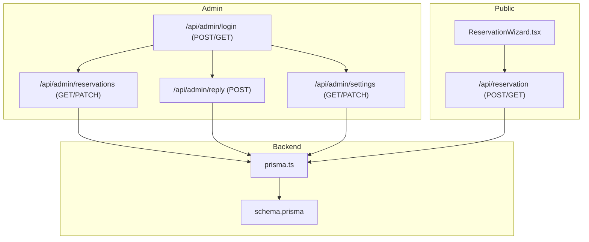

**Diagram sources**
- [route.ts (public reservation):1-255](file://src/app/api/reservation/route.ts#L1-L255)
- [route.ts (admin reservations):1-46](file://src/app/api/admin/reservations/route.ts#L1-L46)
- [route.ts (admin reply):1-73](file://src/app/api/admin/reply/route.ts#L1-L73)
- [route.ts (admin settings):1-35](file://src/app/api/admin/settings/route.ts#L1-L35)
- [route.ts (admin login):1-29](file://src/app/api/admin/login/route.ts#L1-L29)
- [prisma.ts:1-12](file://src/lib/prisma.ts#L1-L12)
- [schema.prisma:1-75](file://prisma/schema.prisma#L1-L75)

**Section sources**
- [route.ts (public reservation):1-255](file://src/app/api/reservation/route.ts#L1-L255)
- [route.ts (admin reservations):1-46](file://src/app/api/admin/reservations/route.ts#L1-L46)
- [route.ts (admin reply):1-73](file://src/app/api/admin/reply/route.ts#L1-L73)
- [route.ts (admin settings):1-35](file://src/app/api/admin/settings/route.ts#L1-L35)
- [route.ts (admin login):1-29](file://src/app/api/admin/login/route.ts#L1-L29)
- [prisma.ts:1-12](file://src/lib/prisma.ts#L1-L12)
- [schema.prisma:1-75](file://prisma/schema.prisma#L1-L75)

## Core Components
- Reservation data model with fields for guest info, stay info, relations, communication, and status.
- Public reservation API for availability checks and submission, including email notifications.
- Admin reservation API for listing all reservations and updating status.
- Admin reply API for sending templated emails and marking replies.
- Admin settings API for retrieving and updating room/hall pricing.
- Guest-facing reservation wizard with multi-step form and validation.
- Shared types and constants for reservation data and content definitions.

Key responsibilities:
- Data persistence and relations via Prisma.
- Session-based admin authentication using cookies.
- Email delivery for confirmations and replies.
- Status lifecycle management (pending, confirmed, cancelled).

**Section sources**
- [schema.prisma:34-74](file://prisma/schema.prisma#L34-L74)
- [route.ts (public reservation):28-57](file://src/app/api/reservation/route.ts#L28-L57)
- [route.ts (public reservation):59-252](file://src/app/api/reservation/route.ts#L59-L252)
- [route.ts (admin reservations):4-27](file://src/app/api/admin/reservations/route.ts#L4-L27)
- [route.ts (admin reservations):29-45](file://src/app/api/admin/reservations/route.ts#L29-L45)
- [route.ts (admin reply):5-72](file://src/app/api/admin/reply/route.ts#L5-L72)
- [route.ts (admin settings):4-15](file://src/app/api/admin/settings/route.ts#L4-L15)
- [route.ts (admin settings):17-34](file://src/app/api/admin/settings/route.ts#L17-L34)
- [ReservationWizard.tsx:62-201](file://src/components/reservation/ReservationWizard.tsx#L62-L201)
- [reservationTypes.ts:1-58](file://src/components/reservation/reservationTypes.ts#L1-L58)
- [content.ts:70-114](file://src/data/content.ts#L70-L114)

## Architecture Overview
The system integrates a guest-facing booking flow with an admin backend secured by session cookies. Data is stored in PostgreSQL via Prisma. Emails are sent using SMTP transport.

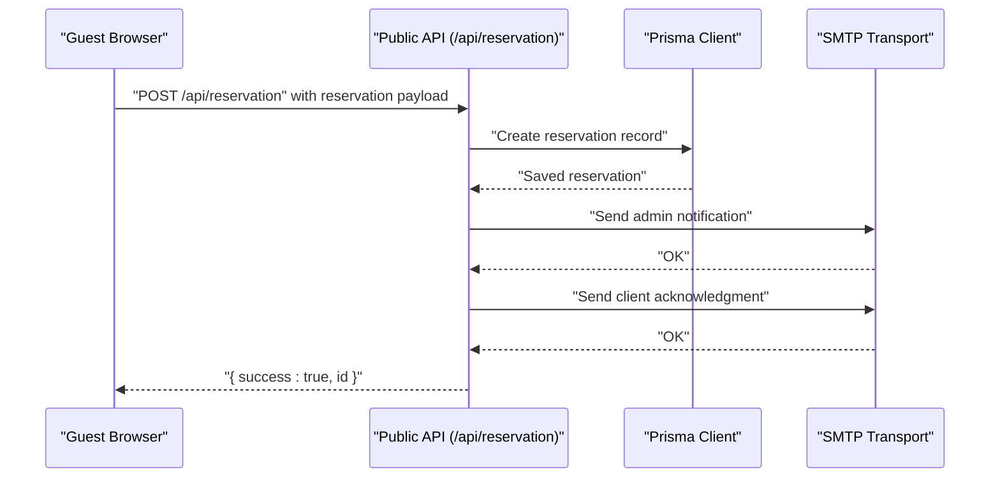

**Diagram sources**
- [route.ts (public reservation):59-252](file://src/app/api/reservation/route.ts#L59-L252)
- [prisma.ts:1-12](file://src/lib/prisma.ts#L1-L12)

**Section sources**
- [route.ts (public reservation):59-252](file://src/app/api/reservation/route.ts#L59-L252)
- [prisma.ts:1-12](file://src/lib/prisma.ts#L1-L12)

## Detailed Component Analysis

### Reservation Data Model
The reservation entity stores guest details, stay specifics, relations to rooms/halls, communication fields, payment metadata, language, timestamps, and status. It supports relations to Room and Hall.

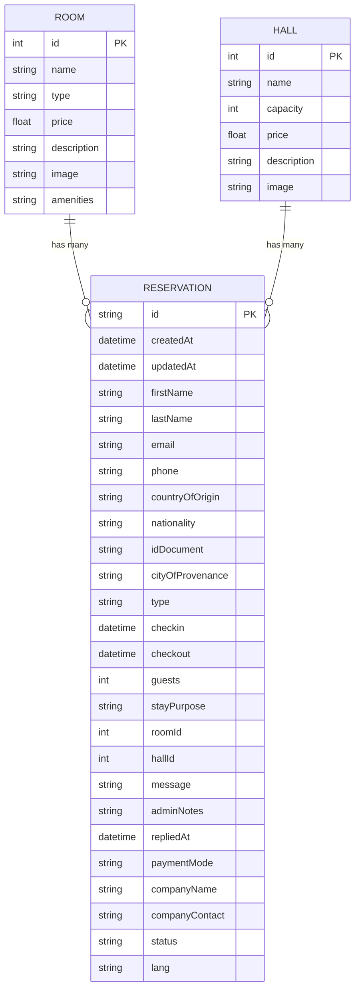

**Diagram sources**
- [schema.prisma:13-74](file://prisma/schema.prisma#L13-L74)

**Section sources**
- [schema.prisma:13-74](file://prisma/schema.prisma#L13-L74)

### Admin Authentication and Permissions
Admin access is controlled by a session cookie. Login sets a session cookie; all admin endpoints validate the cookie before proceeding. Unauthorized requests receive a 401 response.

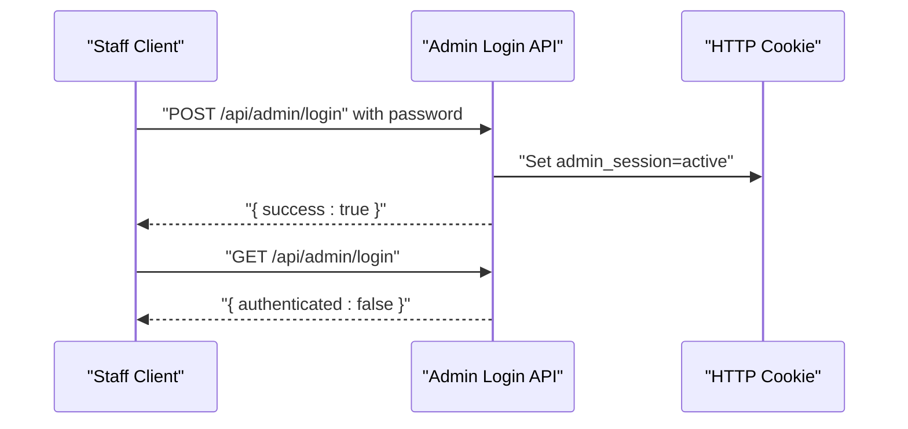

**Diagram sources**
- [route.ts (admin login):3-28](file://src/app/api/admin/login/route.ts#L3-L28)

**Section sources**
- [route.ts (admin login):3-28](file://src/app/api/admin/login/route.ts#L3-L28)

### Admin Reservation Listing and Filtering
Admins can list all reservations with related room/hall data, ordered by creation time. Filtering is not exposed via the admin endpoint; however, the public reservation endpoint supports availability checks by room type and date range.

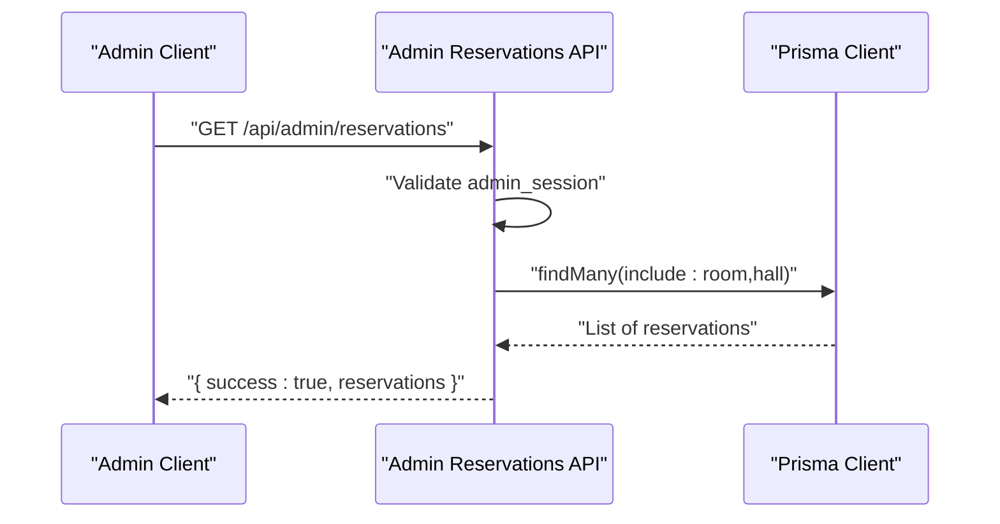

**Diagram sources**
- [route.ts (admin reservations):4-27](file://src/app/api/admin/reservations/route.ts#L4-L27)
- [prisma.ts:1-12](file://src/lib/prisma.ts#L1-L12)

**Section sources**
- [route.ts (admin reservations):4-27](file://src/app/api/admin/reservations/route.ts#L4-L27)

### Reservation Status Management Workflows
Status transitions are managed by patching the reservation’s status field. The model defines default status as pending and supports confirmed and cancelled states.

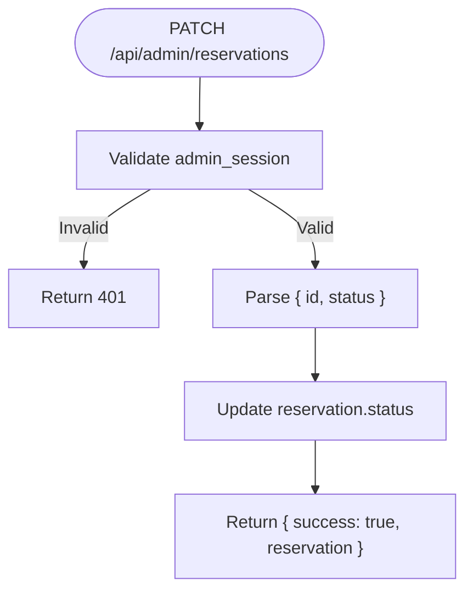

**Diagram sources**
- [route.ts (admin reservations):29-45](file://src/app/api/admin/reservations/route.ts#L29-L45)
- [schema.prisma:71-71](file://prisma/schema.prisma#L71-L71)

**Section sources**
- [route.ts (admin reservations):29-45](file://src/app/api/admin/reservations/route.ts#L29-L45)
- [schema.prisma:71-71](file://prisma/schema.prisma#L71-L71)

### Administrative Editing Permissions
- Admin endpoints require a valid admin session cookie.
- Admin reply endpoint sends templated emails and records reply timestamp.
- Admin settings endpoint retrieves and updates pricing for rooms and halls.

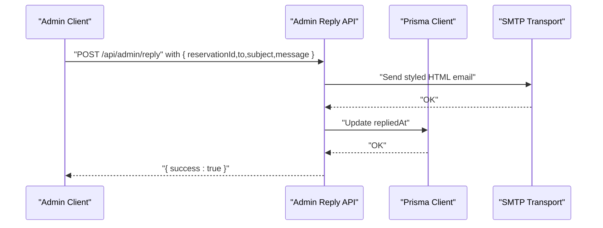

**Diagram sources**
- [route.ts (admin reply):5-72](file://src/app/api/admin/reply/route.ts#L5-L72)
- [prisma.ts:1-12](file://src/lib/prisma.ts#L1-L12)

**Section sources**
- [route.ts (admin reply):5-72](file://src/app/api/admin/reply/route.ts#L5-L72)
- [route.ts (admin settings):4-15](file://src/app/api/admin/settings/route.ts#L4-L15)
- [route.ts (admin settings):17-34](file://src/app/api/admin/settings/route.ts#L17-L34)

### Search and Filtering Options
- Public availability check: GET /api/reservation with roomType, checkin, checkout filters CONFIRMED overlapping stays.
- Admin listing: Returns all reservations with related room/hall; no explicit filters are exposed in the admin endpoint.

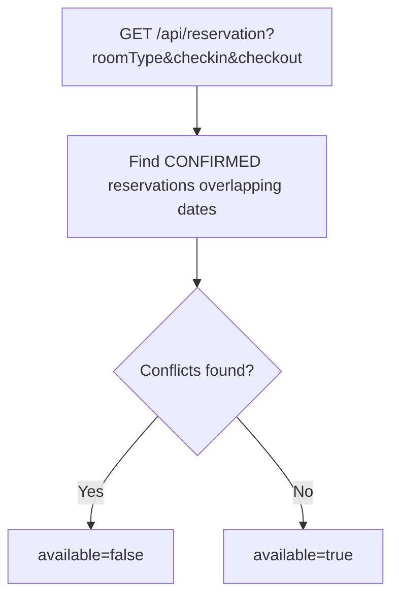

**Diagram sources**
- [route.ts (public reservation):28-57](file://src/app/api/reservation/route.ts#L28-L57)

**Section sources**
- [route.ts (public reservation):28-57](file://src/app/api/reservation/route.ts#L28-L57)
- [route.ts (admin reservations):4-27](file://src/app/api/admin/reservations/route.ts#L4-L27)

### Reservation Cancellation Procedures
Cancellation is performed by setting the reservation status to the cancelled value via the admin PATCH endpoint. The model default is pending; confirmed/cancelled are supported states.

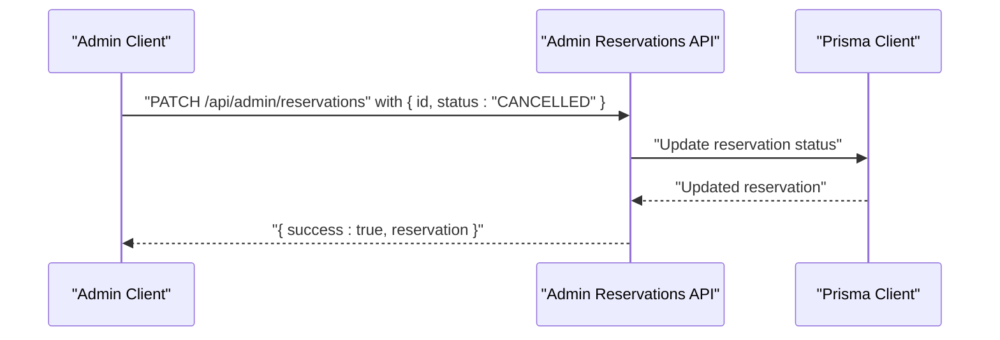

**Diagram sources**
- [route.ts (admin reservations):29-45](file://src/app/api/admin/reservations/route.ts#L29-L45)
- [schema.prisma:71-71](file://prisma/schema.prisma#L71-L71)

**Section sources**
- [route.ts (admin reservations):29-45](file://src/app/api/admin/reservations/route.ts#L29-L45)
- [schema.prisma:71-71](file://prisma/schema.prisma#L71-L71)

### Staff-Only Visibility Controls
- Admin endpoints enforce session validation via cookie.
- Public reservation endpoint does not expose admin-only fields; admin notes and reply timestamps are part of the reservation model but are not returned to guests.

**Section sources**
- [route.ts (admin reservations):5-9](file://src/app/api/admin/reservations/route.ts#L5-L9)
- [route.ts (admin reply):6-7](file://src/app/api/admin/reply/route.ts#L6-L7)
- [schema.prisma:64-65](file://prisma/schema.prisma#L64-L65)

### Integration with Main Reservation System and Data Synchronization
- Public reservation submissions create records and send notifications.
- Admin actions (status updates, replies, pricing changes) persist via Prisma to PostgreSQL.
- The system logs Prisma queries in development for observability.

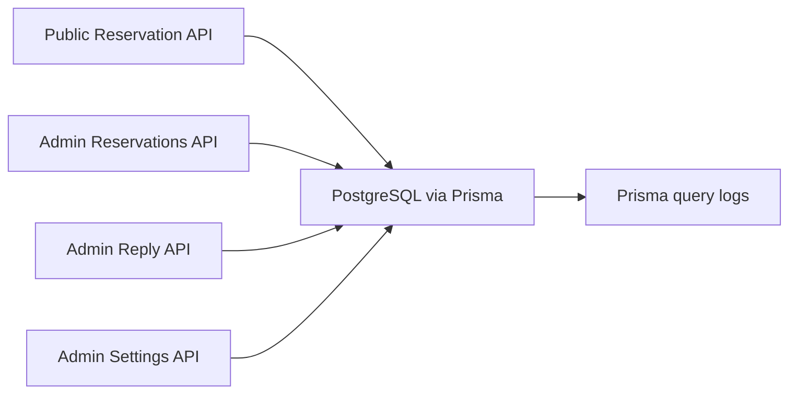

**Diagram sources**
- [route.ts (public reservation):59-252](file://src/app/api/reservation/route.ts#L59-L252)
- [route.ts (admin reservations):4-45](file://src/app/api/admin/reservations/route.ts#L4-L45)
- [route.ts (admin reply):5-72](file://src/app/api/admin/reply/route.ts#L5-L72)
- [route.ts (admin settings):4-34](file://src/app/api/admin/settings/route.ts#L4-L34)
- [prisma.ts:7-9](file://src/lib/prisma.ts#L7-L9)

**Section sources**
- [route.ts (public reservation):59-252](file://src/app/api/reservation/route.ts#L59-L252)
- [route.ts (admin reservations):4-45](file://src/app/api/admin/reservations/route.ts#L4-L45)
- [route.ts (admin reply):5-72](file://src/app/api/admin/reply/route.ts#L5-L72)
- [route.ts (admin settings):4-34](file://src/app/api/admin/settings/route.ts#L4-L34)
- [prisma.ts:7-9](file://src/lib/prisma.ts#L7-L9)

### Examples of Common Administrative Tasks
- Viewing reservation details: GET /api/admin/reservations returns all reservations with room/hall included.
- Updating guest information: Not exposed in current admin endpoints; administrators can update status and notes via PATCH and internal fields.
- Managing reservation states: PATCH /api/admin/reservations with status values (pending/confirmed/cancelled).
- Sending replies: POST /api/admin/reply with reservationId, recipient, subject, and message; system marks repliedAt automatically.
- Pricing adjustments: GET /api/admin/settings for current lists; PATCH /api/admin/settings to update room/hall prices.

**Section sources**
- [route.ts (admin reservations):4-27](file://src/app/api/admin/reservations/route.ts#L4-L27)
- [route.ts (admin reservations):29-45](file://src/app/api/admin/reservations/route.ts#L29-L45)
- [route.ts (admin reply):5-72](file://src/app/api/admin/reply/route.ts#L5-L72)
- [route.ts (admin settings):4-15](file://src/app/api/admin/settings/route.ts#L4-L15)
- [route.ts (admin settings):17-34](file://src/app/api/admin/settings/route.ts#L17-L34)

### Reservation History Tracking and Reporting
- The reservation model includes createdAt and updatedAt timestamps for audit trails.
- The admin reply endpoint updates repliedAt after sending communications, enabling tracking of staff responses.
- Public availability checks rely on CONFIRMED overlapping stays, aiding conflict detection and reporting.

**Section sources**
- [schema.prisma:36-37](file://prisma/schema.prisma#L36-L37)
- [schema.prisma:65-65](file://prisma/schema.prisma#L65-L65)
- [route.ts (public reservation):42-56](file://src/app/api/reservation/route.ts#L42-L56)

## Dependency Analysis
- Prisma client is initialized globally and reused across admin and public endpoints.
- SMTP credentials are loaded from environment variables for email operations.
- Guest reservation wizard depends on shared types and content definitions for labels and options.

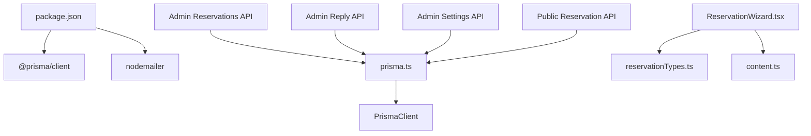

**Diagram sources**
- [package.json:12-24](file://package.json#L12-L24)
- [prisma.ts:1-12](file://src/lib/prisma.ts#L1-L12)
- [route.ts (admin reservations):1-2](file://src/app/api/admin/reservations/route.ts#L1-L2)
- [route.ts (admin reply):1-3](file://src/app/api/admin/reply/route.ts#L1-L3)
- [route.ts (admin settings):1-2](file://src/app/api/admin/settings/route.ts#L1-L2)
- [route.ts (public reservation):1-4](file://src/app/api/reservation/route.ts#L1-L4)
- [ReservationWizard.tsx:30-32](file://src/components/reservation/ReservationWizard.tsx#L30-L32)
- [reservationTypes.ts:30-32](file://src/components/reservation/reservationTypes.ts#L30-L32)
- [content.ts:70-114](file://src/data/content.ts#L70-L114)

**Section sources**
- [package.json:12-24](file://package.json#L12-L24)
- [prisma.ts:1-12](file://src/lib/prisma.ts#L1-L12)
- [ReservationWizard.tsx:30-32](file://src/components/reservation/ReservationWizard.tsx#L30-L32)
- [reservationTypes.ts:30-32](file://src/components/reservation/reservationTypes.ts#L30-L32)
- [content.ts:70-114](file://src/data/content.ts#L70-L114)

## Performance Considerations
- Availability checks query CONFIRMED overlapping stays; ensure appropriate indexing on type, roomId, hallId, checkin, checkout, and status for optimal performance.
- Admin listing returns all reservations; pagination or server-side filtering could be introduced to scale.
- Email sending occurs synchronously; consider queuing for high throughput scenarios.
- Prisma query logging is enabled in development to aid debugging and performance tuning.

[No sources needed since this section provides general guidance]

## Troubleshooting Guide
- Admin unauthorized errors: Verify admin_session cookie presence and validity; ensure password matches ADMIN_PASSWORD environment variable.
- Reservation submission failures: Confirm required fields, terms acceptance, and SMTP configuration; review server logs for Prisma errors.
- Reply failures: Check SMTP_HOST, SMTP_PORT, SMTP_USER, and SMTP_PASSWORD environment variables; inspect reply endpoint error responses.
- Pricing updates: Ensure type is either "room" or "hall" and id exists; verify numeric price conversion.

**Section sources**
- [route.ts (admin login):3-28](file://src/app/api/admin/login/route.ts#L3-L28)
- [route.ts (public reservation):87-100](file://src/app/api/reservation/route.ts#L87-L100)
- [route.ts (public reservation):246-252](file://src/app/api/reservation/route.ts#L246-L252)
- [route.ts (admin reply):12-20](file://src/app/api/admin/reply/route.ts#L12-L20)
- [route.ts (admin reply):68-71](file://src/app/api/admin/reply/route.ts#L68-L71)
- [route.ts (admin settings):22-28](file://src/app/api/admin/settings/route.ts#L22-L28)

## Conclusion
The admin reservation management system provides a clear pathway for staff to view, update, and communicate about reservations while maintaining strict session-based access control. The reservation model supports essential fields for guests, stays, relations, and status, with built-in timestamps for auditing. Integrations with Prisma and SMTP enable reliable data persistence and notifications. Extending the admin interface with filtering, pagination, and richer reporting would further enhance operational oversight.

[No sources needed since this section summarizes without analyzing specific files]

## Appendices

### Reservation Data Fields Reference
- Guest info: firstName, lastName, email, phone, countryOfOrigin, nationality, idDocument, cityOfProvenance
- Stay info: type, checkin, checkout, guests, stayPurpose, room/hall relations
- Communication: message, adminNotes, repliedAt
- Payment: paymentMode, companyName, companyContact
- Metadata: status (default: pending), lang, timestamps

**Section sources**
- [schema.prisma:34-74](file://prisma/schema.prisma#L34-L74)

### Guest Booking Wizard Highlights
- Multi-step form with validation per step.
- Dynamic room/hall selection and pricing display.
- Terms acceptance and submission to public reservation API.

**Section sources**
- [ReservationWizard.tsx:62-201](file://src/components/reservation/ReservationWizard.tsx#L62-L201)
- [reservationTypes.ts:1-58](file://src/components/reservation/reservationTypes.ts#L1-L58)
- [content.ts:70-114](file://src/data/content.ts#L70-L114)