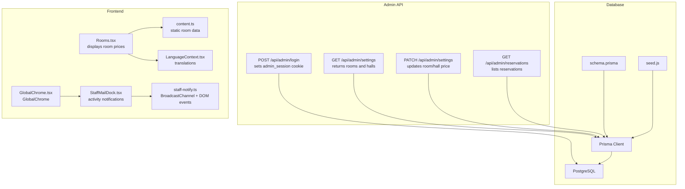
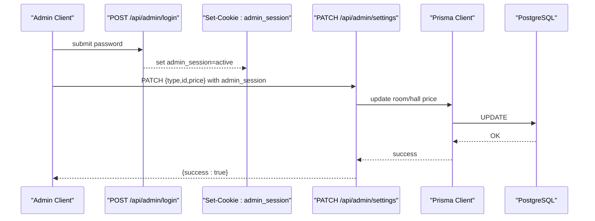
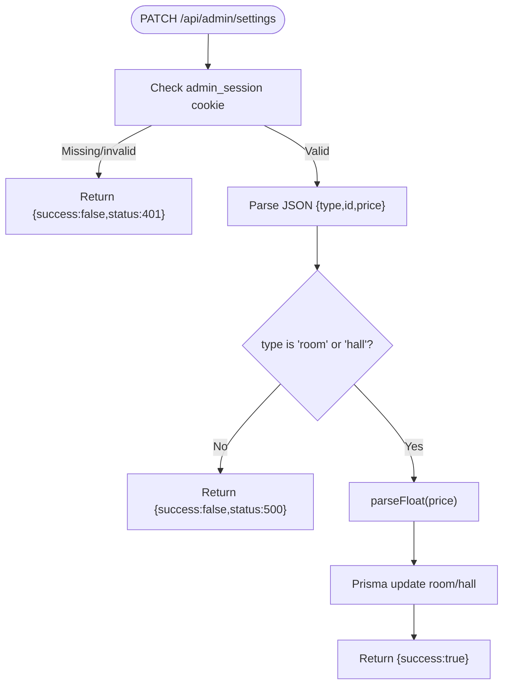
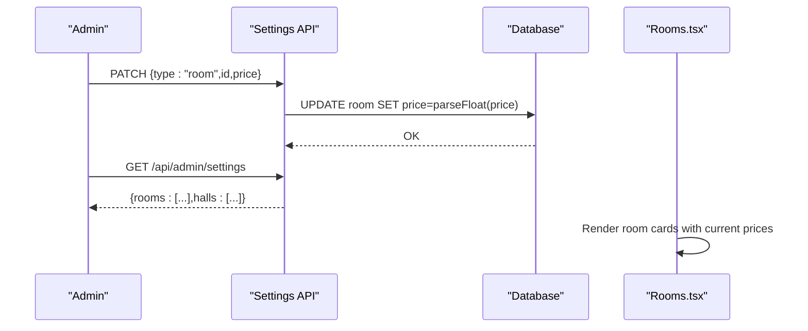
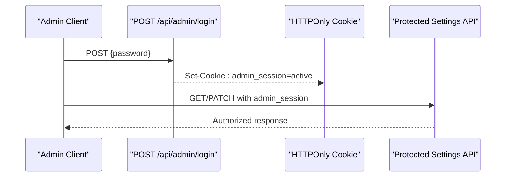
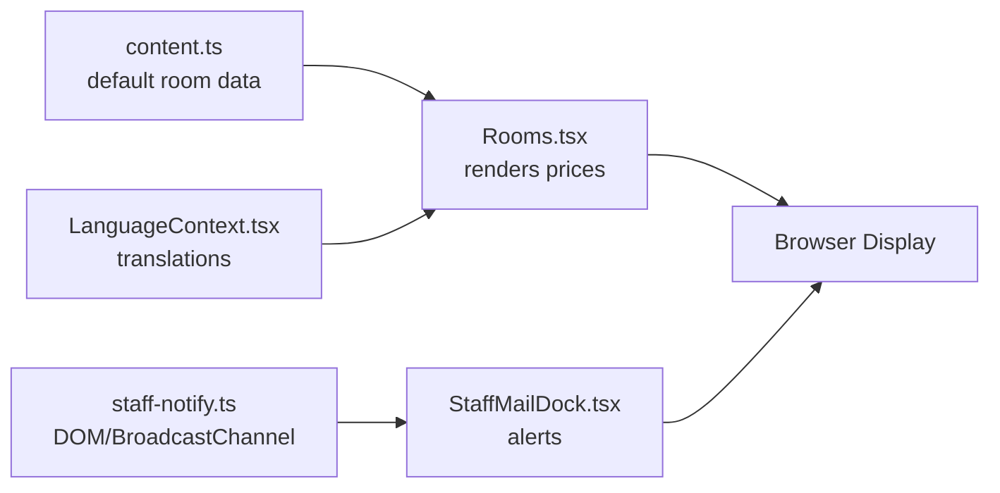
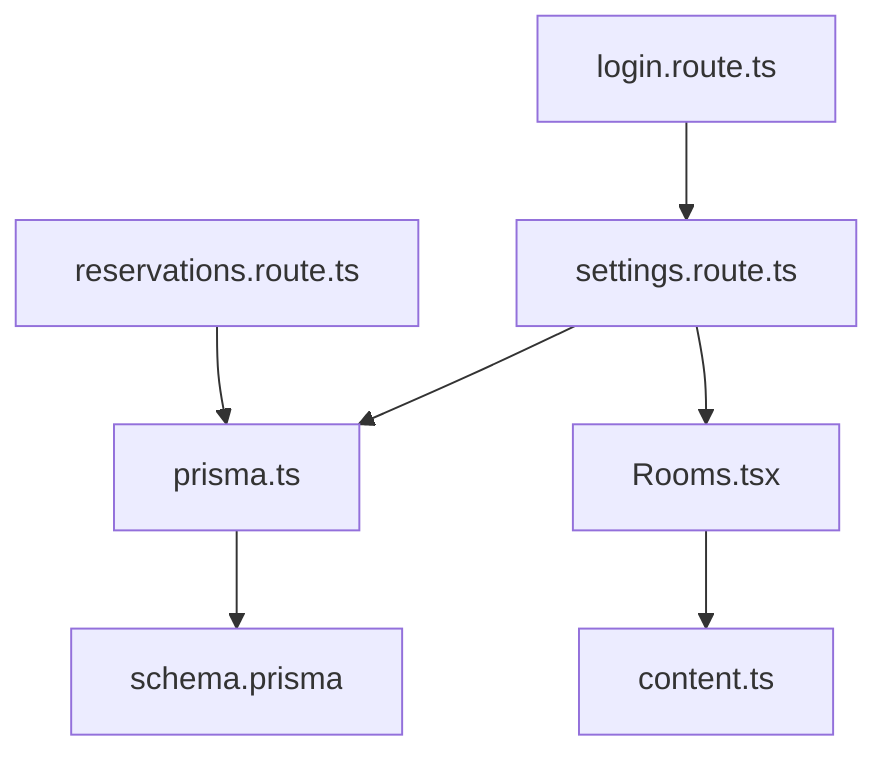
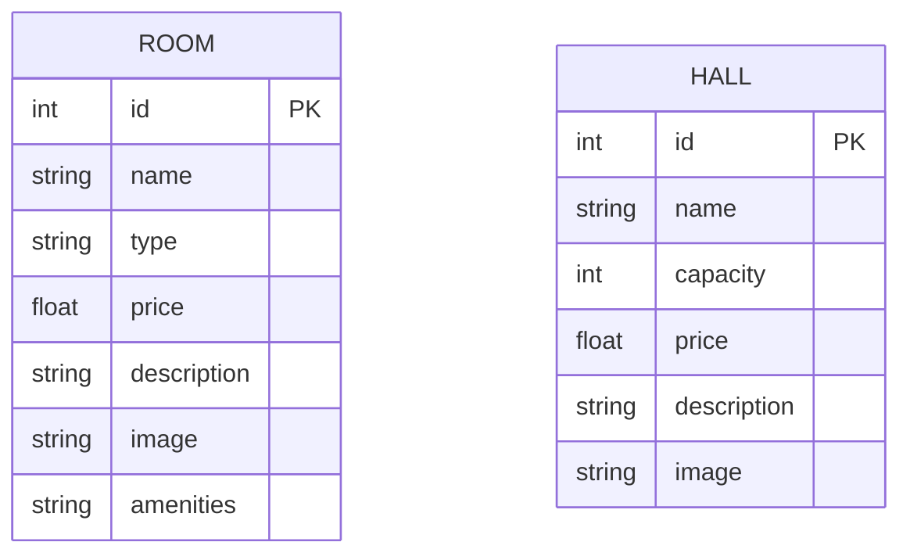

# Settings Configuration

<cite>
**Referenced Files in This Document**
- [schema.prisma](file://prisma/schema.prisma)
- [seed.js](file://prisma/seed.js)
- [prisma.ts](file://src/lib/prisma.ts)
- [settings.route.ts](file://src/app/api/admin/settings/route.ts)
- [login.route.ts](file://src/app/api/admin/login/route.ts)
- [reservations.route.ts](file://src/app/api/admin/reservations/route.ts)
- [Rooms.tsx](file://src/components/Rooms.tsx)
- [content.ts](file://src/data/content.ts)
- [LanguageContext.tsx](file://src/context/LanguageContext.tsx)
- [GlobalChrome.tsx](file://src/components/GlobalChrome.tsx)
- [staff-notify.ts](file://src/lib/staff-notify.ts)
- [StaffMailDock.tsx](file://src/components/reservation/StaffMailDock.tsx)
</cite>

## Table of Contents
1. [Introduction](#introduction)
2. [Project Structure](#project-structure)
3. [Core Components](#core-components)
4. [Architecture Overview](#architecture-overview)
5. [Detailed Component Analysis](#detailed-component-analysis)
6. [Dependency Analysis](#dependency-analysis)
7. [Performance Considerations](#performance-considerations)
8. [Troubleshooting Guide](#troubleshooting-guide)
9. [Conclusion](#conclusion)
10. [Appendices](#appendices)

## Introduction
This document describes the admin settings and configuration management system for the hotel website. It focuses on the settings API endpoint that manages pricing configurations for rooms and halls, the underlying data model, and how those settings are surfaced to the frontend. It also documents current validation and error handling, and outlines recommended practices for backup, restore, versioning, change tracking, caching, real-time updates, and rollback procedures.

## Project Structure
The settings system spans backend API routes, database modeling, and frontend presentation:
- Backend API: admin settings endpoint and admin login
- Database: Prisma schema and seeding
- Frontend: room pricing display and language-driven content
- Operational integration: staff notifications for activity

**Diagram sources**
- [settings.route.ts:1-35](file://src/app/api/admin/settings/route.ts#L1-L35)
- [login.route.ts:1-28](file://src/app/api/admin/login/route.ts#L1-L28)
- [reservations.route.ts:1-45](file://src/app/api/admin/reservations/route.ts#L1-L45)
- [prisma.ts:1-12](file://src/lib/prisma.ts#L1-L12)
- [schema.prisma:1-75](file://prisma/schema.prisma#L1-L75)
- [seed.js:1-42](file://prisma/seed.js#L1-L42)
- [Rooms.tsx:1-86](file://src/components/Rooms.tsx#L1-L86)
- [content.ts:89-114](file://src/data/content.ts#L89-L114)
- [LanguageContext.tsx:1-555](file://src/context/LanguageContext.tsx#L1-L555)
- [GlobalChrome.tsx:1-15](file://src/components/GlobalChrome.tsx#L1-L15)
- [staff-notify.ts:1-16](file://src/lib/staff-notify.ts#L1-L16)
- [StaffMailDock.tsx:1-46](file://src/components/reservation/StaffMailDock.tsx#L1-L46)

**Section sources**
- [settings.route.ts:1-35](file://src/app/api/admin/settings/route.ts#L1-L35)
- [login.route.ts:1-28](file://src/app/api/admin/login/route.ts#L1-L28)
- [reservations.route.ts:1-45](file://src/app/api/admin/reservations/route.ts#L1-L45)
- [prisma.ts:1-12](file://src/lib/prisma.ts#L1-L12)
- [schema.prisma:1-75](file://prisma/schema.prisma#L1-L75)
- [seed.js:1-42](file://prisma/seed.js#L1-L42)
- [Rooms.tsx:1-86](file://src/components/Rooms.tsx#L1-L86)
- [content.ts:89-114](file://src/data/content.ts#L89-L114)
- [LanguageContext.tsx:1-555](file://src/context/LanguageContext.tsx#L1-L555)
- [GlobalChrome.tsx:1-15](file://src/components/GlobalChrome.tsx#L1-L15)
- [staff-notify.ts:1-16](file://src/lib/staff-notify.ts#L1-L16)
- [StaffMailDock.tsx:1-46](file://src/components/reservation/StaffMailDock.tsx#L1-L46)

## Core Components
- Settings API
  - Endpoint: GET and PATCH under /api/admin/settings
  - Authentication: requires admin_session cookie set by /api/admin/login
  - Data retrieval: returns rooms and halls lists ordered by price and capacity respectively
  - Update operation: accepts { type, id, price } and updates the corresponding entity
- Database model
  - Room: id, name, type, price, description, image, amenities
  - Hall: id, name, capacity, price, description, image
- Frontend display
  - Rooms.tsx renders room cards and displays per-night pricing
  - content.ts defines static room data (including prices) used in UI
- Operational integration
  - Login route sets a session cookie for admin access
  - StaffMailDock and staff-notify utilities support real-time staff alerts

**Section sources**
- [settings.route.ts:1-35](file://src/app/api/admin/settings/route.ts#L1-L35)
- [login.route.ts:1-28](file://src/app/api/admin/login/route.ts#L1-L28)
- [schema.prisma:13-32](file://prisma/schema.prisma#L13-L32)
- [Rooms.tsx:28-81](file://src/components/Rooms.tsx#L28-L81)
- [content.ts:89-114](file://src/data/content.ts#L89-L114)
- [staff-notify.ts:1-16](file://src/lib/staff-notify.ts#L1-L16)
- [StaffMailDock.tsx:1-46](file://src/components/reservation/StaffMailDock.tsx#L1-L46)

## Architecture Overview
The settings API is a thin controller layer backed by Prisma ORM and PostgreSQL. Admin actions are authenticated via a simple session cookie. Pricing changes are persisted to the database and reflected in the frontend through existing data sources and UI components.

**Diagram sources**
- [login.route.ts:3-23](file://src/app/api/admin/login/route.ts#L3-L23)
- [settings.route.ts:17-34](file://src/app/api/admin/settings/route.ts#L17-L34)
- [prisma.ts:1-12](file://src/lib/prisma.ts#L1-L12)
- [schema.prisma:13-32](file://prisma/schema.prisma#L13-L32)

## Detailed Component Analysis

### Settings API: Data Model and Endpoints
- Data model
  - Room: includes price, used for room pricing configuration
  - Hall: includes price, used for event hall pricing configuration
- Endpoints
  - GET /api/admin/settings: returns { success, rooms, halls }
  - PATCH /api/admin/settings: updates price for room or hall based on type and id
- Validation and error handling
  - Authentication: checks admin_session cookie; unauthorized responses return success:false with 401
  - Request body: expects { type, id, price }; numeric conversion performed before update
  - Database errors: caught and return success:false with 500
- Ordering
  - Rooms returned ordered by price ascending
  - Halls returned ordered by capacity ascending

**Diagram sources**
- [settings.route.ts:17-34](file://src/app/api/admin/settings/route.ts#L17-L34)

**Section sources**
- [schema.prisma:13-32](file://prisma/schema.prisma#L13-L32)
- [settings.route.ts:4-15](file://src/app/api/admin/settings/route.ts#L4-L15)
- [settings.route.ts:17-34](file://src/app/api/admin/settings/route.ts#L17-L34)

### Pricing Management for Rooms and Halls
- Room pricing
  - Managed via PATCH to /api/admin/settings with type=room
  - Returned by GET /api/admin/settings and used by Rooms.tsx for display
- Hall pricing
  - Managed via PATCH to /api/admin/settings with type=hall
  - Returned by GET /api/admin/settings
- Static content
  - content.ts provides default room data (including prices) used by Rooms.tsx
  - These defaults seed the database via seed.js

**Diagram sources**
- [settings.route.ts:17-34](file://src/app/api/admin/settings/route.ts#L17-L34)
- [Rooms.tsx:28-81](file://src/components/Rooms.tsx#L28-L81)
- [content.ts:89-114](file://src/data/content.ts#L89-L114)
- [seed.js:4-32](file://prisma/seed.js#L4-L32)

**Section sources**
- [settings.route.ts:8-11](file://src/app/api/admin/settings/route.ts#L8-L11)
- [Rooms.tsx:28-81](file://src/components/Rooms.tsx#L28-L81)
- [content.ts:89-114](file://src/data/content.ts#L89-L114)
- [seed.js:4-32](file://prisma/seed.js#L4-L32)

### Admin Authentication and Authorization
- Login endpoint validates password and sets admin_session cookie
- All settings endpoints check for active session before processing requests
- Logout is implicit via cookie expiration

**Diagram sources**
- [login.route.ts:3-23](file://src/app/api/admin/login/route.ts#L3-L23)
- [settings.route.ts:5-6](file://src/app/api/admin/settings/route.ts#L5-L6)

**Section sources**
- [login.route.ts:3-23](file://src/app/api/admin/login/route.ts#L3-L23)
- [settings.route.ts:5-6](file://src/app/api/admin/settings/route.ts#L5-L6)

### Frontend Display and Real-Time Updates
- Room pricing display
  - Rooms.tsx reads room data and renders per-night prices
  - content.ts supplies default room entries used in UI
- Language integration
  - LanguageContext.tsx provides translations; room labels and descriptions are localized
- Real-time staff notifications
  - staff-notify.ts emits DOM events and BroadcastChannel messages
  - StaffMailDock listens for activity and toggles visibility

**Diagram sources**
- [Rooms.tsx:28-81](file://src/components/Rooms.tsx#L28-L81)
- [content.ts:89-114](file://src/data/content.ts#L89-L114)
- [LanguageContext.tsx:1-555](file://src/context/LanguageContext.tsx#L1-L555)
- [staff-notify.ts:1-16](file://src/lib/staff-notify.ts#L1-L16)
- [StaffMailDock.tsx:1-46](file://src/components/reservation/StaffMailDock.tsx#L1-L46)

**Section sources**
- [Rooms.tsx:28-81](file://src/components/Rooms.tsx#L28-L81)
- [content.ts:89-114](file://src/data/content.ts#L89-L114)
- [LanguageContext.tsx:1-555](file://src/context/LanguageContext.tsx#L1-L555)
- [staff-notify.ts:1-16](file://src/lib/staff-notify.ts#L1-L16)
- [StaffMailDock.tsx:1-46](file://src/components/reservation/StaffMailDock.tsx#L1-L46)

### Settings Data Structure and Validation Rules
- Request payload for PATCH /api/admin/settings
  - type: "room" | "hall"
  - id: integer identifier
  - price: numeric value (converted via parseFloat)
- Response payload
  - GET: { success: boolean, rooms: Room[], halls: Hall[] }
  - PATCH: { success: boolean }
- Validation rules
  - Authentication required (admin_session cookie)
  - type must match supported values
  - id must correspond to an existing record
  - price must parse to a valid number

**Section sources**
- [settings.route.ts:21-28](file://src/app/api/admin/settings/route.ts#L21-L28)
- [settings.route.ts:8-11](file://src/app/api/admin/settings/route.ts#L8-L11)

### Update Procedures
- Update room price
  - Send PATCH to /api/admin/settings with { type: "room", id, price }
- Update hall price
  - Send PATCH to /api/admin/settings with { type: "hall", id, price }
- Retrieve current configuration
  - Send GET to /api/admin/settings to receive rooms and halls arrays

**Section sources**
- [settings.route.ts:17-34](file://src/app/api/admin/settings/route.ts#L17-L34)
- [settings.route.ts:4-11](file://src/app/api/admin/settings/route.ts#L4-L11)

### Configuration Backup and Restore
- Current state
  - Database seeding script exists to initialize rooms and halls
  - No built-in backup/restore endpoints are present
- Recommended procedure
  - Export database schema and data regularly
  - Store seed snapshots alongside application versioning
  - Use Prisma migrations to track structural changes
- Rollback
  - Re-run previous seed or restore database snapshot
  - Re-apply migrations as needed

**Section sources**
- [seed.js:4-32](file://prisma/seed.js#L4-L32)
- [schema.prisma:1-75](file://prisma/schema.prisma#L1-L75)

### Settings Versioning and Change Tracking
- Versioning
  - Track settings changes via database migration history
  - Maintain separate environments (dev, staging, prod) with distinct seeds
- Change tracking
  - Log administrative actions at the application level
  - Consider adding audit logs for price changes

[No sources needed since this section provides general guidance]

### Caching Mechanisms and Real-Time Updates
- Current behavior
  - Settings are fetched on-demand from the database
  - No explicit caching layer is implemented for settings
- Recommendations
  - Add cache invalidation on PATCH /api/admin/settings
  - Use Redis or in-memory cache for frequently accessed settings
  - Implement server-sent events or WebSocket updates for live UI refresh

[No sources needed since this section provides general guidance]

### Examples of Common Configuration Tasks
- Updating room rates
  - Send PATCH with type=room and the target room id and new price
- Modifying service availability
  - Extend the settings API to support availability toggles for rooms/halls
- Adjusting promotional settings
  - Add promotional discount fields to the settings model and expose via API

[No sources needed since this section provides general guidance]

### Error Handling and Rollback Procedures
- Error handling
  - Unauthorized access returns success:false with 401
  - Database errors return success:false with 500
- Rollback
  - Revert to last known good seed or database snapshot
  - Re-apply migrations to align schema

**Section sources**
- [settings.route.ts:6-6](file://src/app/api/admin/settings/route.ts#L6-L6)
- [settings.route.ts:12-14](file://src/app/api/admin/settings/route.ts#L12-L14)
- [settings.route.ts:31-33](file://src/app/api/admin/settings/route.ts#L31-L33)

## Dependency Analysis
The settings system depends on:
- Prisma ORM for database operations
- PostgreSQL for persistence
- Next.js API routes for HTTP endpoints
- Frontend components for rendering

**Diagram sources**
- [settings.route.ts:1-35](file://src/app/api/admin/settings/route.ts#L1-L35)
- [login.route.ts:1-28](file://src/app/api/admin/login/route.ts#L1-L28)
- [reservations.route.ts:1-45](file://src/app/api/admin/reservations/route.ts#L1-L45)
- [prisma.ts:1-12](file://src/lib/prisma.ts#L1-L12)
- [schema.prisma:1-75](file://prisma/schema.prisma#L1-L75)
- [Rooms.tsx:1-86](file://src/components/Rooms.tsx#L1-L86)
- [content.ts:1-418](file://src/data/content.ts#L1-L418)

**Section sources**
- [settings.route.ts:1-35](file://src/app/api/admin/settings/route.ts#L1-L35)
- [login.route.ts:1-28](file://src/app/api/admin/login/route.ts#L1-L28)
- [reservations.route.ts:1-45](file://src/app/api/admin/reservations/route.ts#L1-L45)
- [prisma.ts:1-12](file://src/lib/prisma.ts#L1-L12)
- [schema.prisma:1-75](file://prisma/schema.prisma#L1-L75)
- [Rooms.tsx:1-86](file://src/components/Rooms.tsx#L1-L86)
- [content.ts:1-418](file://src/data/content.ts#L1-L418)

## Performance Considerations
- Database queries
  - Use pagination for large datasets
  - Index price and capacity fields for efficient sorting
- API latency
  - Cache frequent reads of settings
  - Batch updates when changing multiple prices
- Frontend rendering
  - Debounce UI refresh after settings updates
  - Lazy-load images to reduce render cost

[No sources needed since this section provides general guidance]

## Troubleshooting Guide
- Authentication failures
  - Verify admin_session cookie presence and value
  - Confirm password matches ADMIN_PASSWORD environment variable
- Database errors
  - Check Prisma client logs and PostgreSQL connectivity
  - Validate that ids exist before update
- Frontend not reflecting changes
  - Clear browser cache or force reload
  - Confirm that Rooms.tsx uses current data sources

**Section sources**
- [login.route.ts:3-23](file://src/app/api/admin/login/route.ts#L3-L23)
- [settings.route.ts:5-6](file://src/app/api/admin/settings/route.ts#L5-L6)
- [settings.route.ts:12-14](file://src/app/api/admin/settings/route.ts#L12-L14)
- [settings.route.ts:31-33](file://src/app/api/admin/settings/route.ts#L31-L33)

## Conclusion
The settings system currently supports dynamic pricing for rooms and halls via a simple admin API with basic authentication. It integrates with the frontend through existing components and data sources. To enhance reliability and operability, introduce formal backup/restore, versioning, change tracking, caching, and real-time update mechanisms. Extend the API to manage broader operational parameters as the system evolves.

## Appendices

### API Definitions
- GET /api/admin/settings
  - Description: Fetch current pricing configuration for rooms and halls
  - Response: { success: boolean, rooms: Room[], halls: Hall[] }
- PATCH /api/admin/settings
  - Description: Update room or hall price
  - Request body: { type: "room"|"hall", id: number, price: number|string }
  - Response: { success: boolean }

**Section sources**
- [settings.route.ts:4-15](file://src/app/api/admin/settings/route.ts#L4-L15)
- [settings.route.ts:17-34](file://src/app/api/admin/settings/route.ts#L17-L34)

### Data Model Snapshot

**Diagram sources**
- [schema.prisma:13-32](file://prisma/schema.prisma#L13-L32)