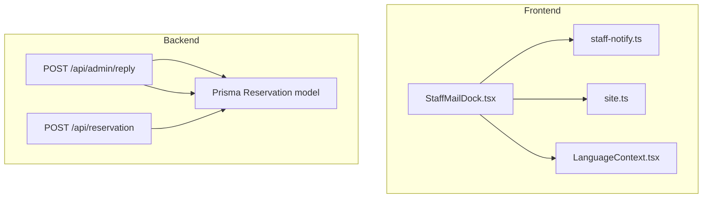
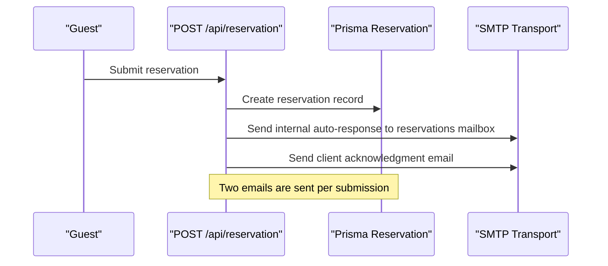
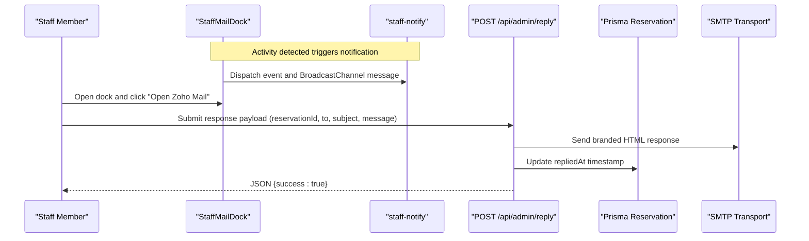
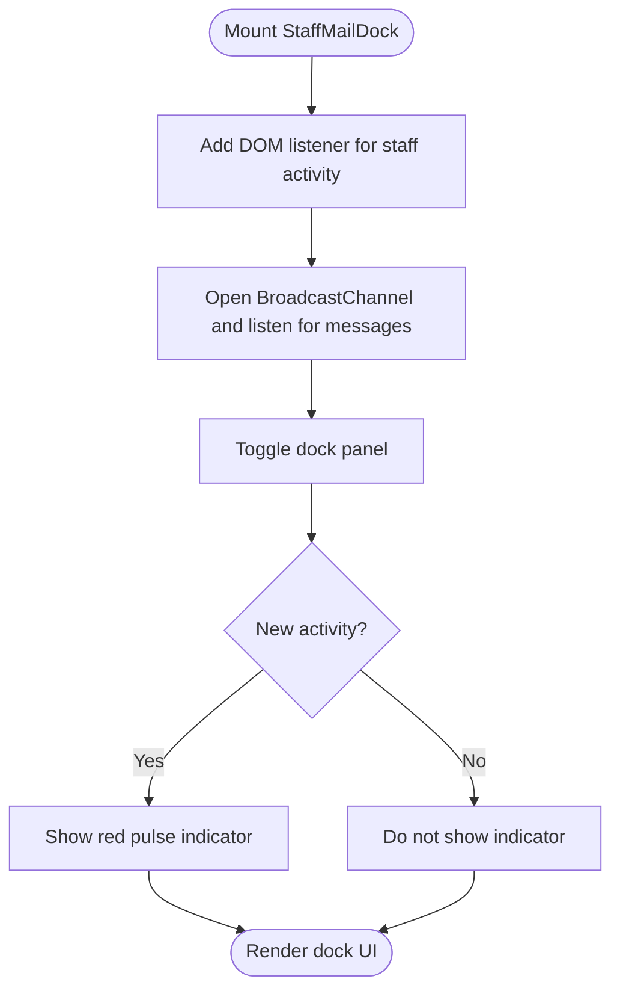
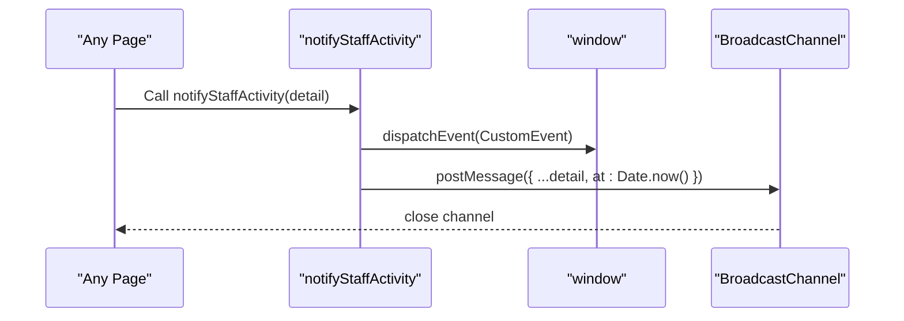
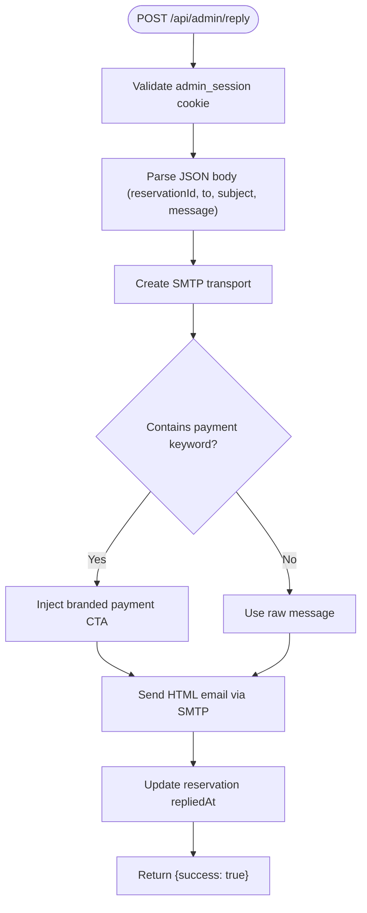
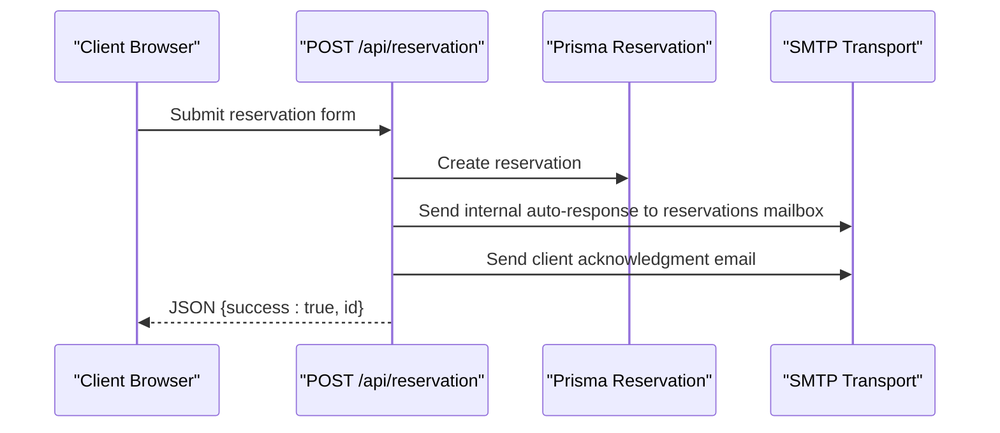
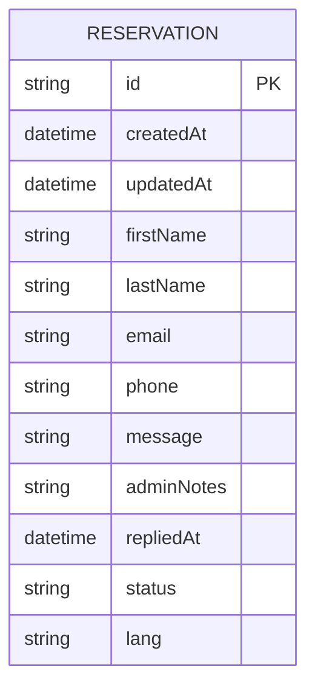
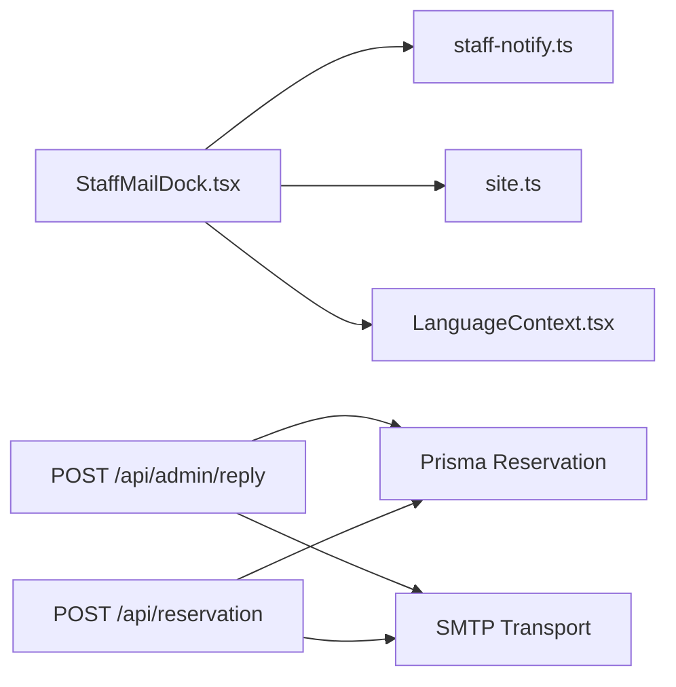

# Staff Communication

<cite>
**Referenced Files in This Document**
- [StaffMailDock.tsx](file://src/components/reservation/StaffMailDock.tsx)
- [staff-notify.ts](file://src/lib/staff-notify.ts)
- [site.ts](file://src/lib/site.ts)
- [LanguageContext.tsx](file://src/context/LanguageContext.tsx)
- [route.ts](file://src/app/api/admin/reply/route.ts)
- [route.ts](file://src/app/api/reservation/route.ts)
- [schema.prisma](file://prisma/schema.prisma)
</cite>

## Table of Contents
1. [Introduction](#introduction)
2. [Project Structure](#project-structure)
3. [Core Components](#core-components)
4. [Architecture Overview](#architecture-overview)
5. [Detailed Component Analysis](#detailed-component-analysis)
6. [Dependency Analysis](#dependency-analysis)
7. [Performance Considerations](#performance-considerations)
8. [Troubleshooting Guide](#troubleshooting-guide)
9. [Conclusion](#conclusion)
10. [Appendices](#appendices)

## Introduction
This document describes the staff communication and messaging system for Archanges Hôtel. It focuses on:
- The Reply API endpoint used by staff to respond to customer inquiries and reservations
- The StaffMailDock component that provides a persistent dock for staff to view and manage incoming messages
- Message threading and notification workflows
- Response categorization and auto-response behavior
- Integration between the frontend dock and the backend messaging system, including real-time updates and message status tracking
- Examples of common staff communication scenarios
- Message archiving, staff assignment workflows, and communication analytics

## Project Structure
The staff communication system spans frontend UI components, backend APIs, and database models:
- Frontend: StaffMailDock provides a floating dock with notifications and quick links to the team’s webmail
- Backend: Reply API handles staff responses to customers; reservation submission triggers auto-responses
- Notifications: A lightweight DOM/BroadcastChannel mechanism alerts the dock panel when activity occurs
- Database: Reservation model stores message metadata and response timestamps

**Diagram sources**
- [StaffMailDock.tsx:13-133](file://src/components/reservation/StaffMailDock.tsx#L13-L133)
- [staff-notify.ts:1-16](file://src/lib/staff-notify.ts#L1-L16)
- [site.ts:1-29](file://src/lib/site.ts#L1-L29)
- [LanguageContext.tsx:1-555](file://src/context/LanguageContext.tsx#L1-L555)
- [route.ts:1-72](file://src/app/api/admin/reply/route.ts#L1-L72)
- [route.ts:59-253](file://src/app/api/reservation/route.ts#L59-L253)
- [schema.prisma:34-74](file://prisma/schema.prisma#L34-L74)

**Section sources**
- [StaffMailDock.tsx:1-134](file://src/components/reservation/StaffMailDock.tsx#L1-L134)
- [staff-notify.ts:1-16](file://src/lib/staff-notify.ts#L1-L16)
- [site.ts:1-29](file://src/lib/site.ts#L1-L29)
- [LanguageContext.tsx:1-555](file://src/context/LanguageContext.tsx#L1-L555)
- [route.ts:1-72](file://src/app/api/admin/reply/route.ts#L1-L72)
- [route.ts:59-253](file://src/app/api/reservation/route.ts#L59-L253)
- [schema.prisma:34-74](file://prisma/schema.prisma#L34-L74)

## Core Components
- StaffMailDock: Floating dock that notifies staff of new activity and provides quick access to the team’s webmail and reservation mailbox
- Staff Notification Utility: Dispatches a DOM event and posts to a BroadcastChannel to trigger dock updates
- Reply API: Validates admin session, sends a styled HTML email response, and records the reply timestamp on the reservation
- Reservation Submission API: Persists the reservation and sends two auto-responses: one to the guest and one to the reservations mailbox
- Database Model: Reservation entity captures message content, admin notes, reply timestamp, and status

Key responsibilities:
- Real-time notifications for new messages
- Secure, branded email responses with optional payment link injection
- Timestamped reply tracking for audit and analytics
- Auto-response to guests upon submission

**Section sources**
- [StaffMailDock.tsx:13-133](file://src/components/reservation/StaffMailDock.tsx#L13-L133)
- [staff-notify.ts:6-16](file://src/lib/staff-notify.ts#L6-L16)
- [route.ts:5-72](file://src/app/api/admin/reply/route.ts#L5-L72)
- [route.ts:59-253](file://src/app/api/reservation/route.ts#L59-L253)
- [schema.prisma:34-74](file://prisma/schema.prisma#L34-L74)

## Architecture Overview
The system integrates frontend and backend components to support staff communication workflows.

**Diagram sources**
- [route.ts:59-253](file://src/app/api/reservation/route.ts#L59-L253)

**Diagram sources**
- [StaffMailDock.tsx:19-35](file://src/components/reservation/StaffMailDock.tsx#L19-L35)
- [staff-notify.ts:6-16](file://src/lib/staff-notify.ts#L6-L16)
- [route.ts:5-72](file://src/app/api/admin/reply/route.ts#L5-L72)
- [schema.prisma:62-65](file://prisma/schema.prisma#L62-L65)

## Detailed Component Analysis

### StaffMailDock Component
The StaffMailDock is a floating dock that:
- Listens for a global DOM event and BroadcastChannel message to show a “new activity” indicator
- Provides quick links to the team’s webmail and the reservations mailbox
- Uses localized labels from the LanguageContext
- Integrates with the site configuration for suggested emails and webmail URL

**Diagram sources**
- [StaffMailDock.tsx:19-43](file://src/components/reservation/StaffMailDock.tsx#L19-L43)
- [staff-notify.ts:6-16](file://src/lib/staff-notify.ts#L6-L16)
- [site.ts:10-21](file://src/lib/site.ts#L10-L21)
- [LanguageContext.tsx:537-539](file://src/context/LanguageContext.tsx#L537-L539)

**Section sources**
- [StaffMailDock.tsx:13-133](file://src/components/reservation/StaffMailDock.tsx#L13-L133)
- [site.ts:10-21](file://src/lib/site.ts#L10-L21)
- [LanguageContext.tsx:537-539](file://src/context/LanguageContext.tsx#L537-L539)

### Staff Notification Workflow
The notification utility:
- Dispatches a custom DOM event to inform the dock of new activity
- Posts a message to a BroadcastChannel for cross-tab/window updates
- Gracefully handles environments without BroadcastChannel support

**Diagram sources**
- [staff-notify.ts:6-16](file://src/lib/staff-notify.ts#L6-L16)

**Section sources**
- [staff-notify.ts:1-16](file://src/lib/staff-notify.ts#L1-L16)

### Reply API Endpoint
The Reply API endpoint:
- Validates admin session via cookie
- Creates an SMTP transport using environment variables
- Detects payment-related keywords and injects a branded payment call-to-action
- Sends a styled HTML email response
- Updates the reservation’s repliedAt timestamp

**Diagram sources**
- [route.ts:5-72](file://src/app/api/admin/reply/route.ts#L5-L72)
- [schema.prisma:62-65](file://prisma/schema.prisma#L62-L65)

**Section sources**
- [route.ts:5-72](file://src/app/api/admin/reply/route.ts#L5-L72)
- [schema.prisma:62-65](file://prisma/schema.prisma#L62-L65)

### Reservation Submission and Auto-Responses
On reservation submission:
- The reservation is persisted with status PENDING
- An internal auto-response is sent to the reservations mailbox
- A client acknowledgment email is sent to the guest

**Diagram sources**
- [route.ts:59-253](file://src/app/api/reservation/route.ts#L59-L253)

**Section sources**
- [route.ts:59-253](file://src/app/api/reservation/route.ts#L59-L253)

### Message Threading and Status Tracking
- Thread context: Responses are prefixed with RE: subject and include branded headers/footers
- Status tracking: repliedAt is updated when a staff response is sent
- Availability: The reservation model includes a status field for PENDING, CONFIRMED, CANCELLED

**Diagram sources**
- [schema.prisma:34-74](file://prisma/schema.prisma#L34-L74)

**Section sources**
- [schema.prisma:34-74](file://prisma/schema.prisma#L34-L74)

### Message Templates and Auto-Responses
- Internal auto-response: Sent to reservations mailbox with structured content and labels
- Client acknowledgment: Sent to the guest with language-specific content and hotel contact details
- Branded HTML: Both auto-responses use a consistent branded template

**Section sources**
- [route.ts:175-243](file://src/app/api/reservation/route.ts#L175-L243)

### Escalation Procedures
Escalation is not explicitly implemented in the current codebase. To support escalation:
- Extend the reservation model with an escalation flag and assigned staff
- Add UI and backend logic to promote unresolved PENDING reservations to higher priority states
- Integrate with external ticketing systems or internal queues

[No sources needed since this section proposes enhancements not present in the codebase]

### Integration and Real-Time Updates
- The dock listens for a custom DOM event and BroadcastChannel messages to update instantly across tabs
- The reply endpoint updates the database and returns a success response for optimistic UI updates

**Section sources**
- [StaffMailDock.tsx:19-35](file://src/components/reservation/StaffMailDock.tsx#L19-L35)
- [staff-notify.ts:6-16](file://src/lib/staff-notify.ts#L6-L16)
- [route.ts:67-72](file://src/app/api/admin/reply/route.ts#L67-L72)

## Dependency Analysis
The following diagram shows the primary dependencies among components involved in staff communication.

**Diagram sources**
- [StaffMailDock.tsx:1-134](file://src/components/reservation/StaffMailDock.tsx#L1-L134)
- [staff-notify.ts:1-16](file://src/lib/staff-notify.ts#L1-L16)
- [site.ts:1-29](file://src/lib/site.ts#L1-L29)
- [LanguageContext.tsx:1-555](file://src/context/LanguageContext.tsx#L1-L555)
- [route.ts:1-72](file://src/app/api/admin/reply/route.ts#L1-L72)
- [route.ts:1-253](file://src/app/api/reservation/route.ts#L1-L253)
- [schema.prisma:34-74](file://prisma/schema.prisma#L34-L74)

**Section sources**
- [route.ts:1-72](file://src/app/api/admin/reply/route.ts#L1-L72)
- [route.ts:1-253](file://src/app/api/reservation/route.ts#L1-L253)
- [schema.prisma:34-74](file://prisma/schema.prisma#L34-L74)

## Performance Considerations
- Email transport initialization occurs per request; consider connection pooling or reusing transports in production
- HTML email generation is synchronous; keep message sizes reasonable to avoid timeouts
- Database writes occur after email sends; ensure transactional behavior if needed to prevent inconsistent states
- BroadcastChannel usage is lightweight; ensure fallbacks for unsupported browsers

[No sources needed since this section provides general guidance]

## Troubleshooting Guide
Common issues and remedies:
- Missing admin session cookie: The Reply API returns unauthorized; ensure admin authentication flow sets the cookie
- SMTP configuration errors: Verify host, port, credentials, and TLS settings; check environment variables
- Payment keyword detection: Ensure the message contains the expected keywords for CTA injection
- Database update failures: Confirm Prisma client connectivity and permissions; verify reservationId exists
- Notification not appearing: Check BroadcastChannel support and CORS for cross-tab delivery

**Section sources**
- [route.ts:6-7](file://src/app/api/admin/reply/route.ts#L6-L7)
- [route.ts:68-71](file://src/app/api/admin/reply/route.ts#L68-L71)
- [route.ts:246-252](file://src/app/api/reservation/route.ts#L246-L252)

## Conclusion
The staff communication system combines a responsive frontend dock with robust backend APIs and a database model to support efficient staff-customer interactions. The Reply API enables branded, timely responses with payment-aware templating, while the reservation submission pipeline ensures immediate acknowledgment and internal routing. Real-time updates are achieved through a lightweight notification mechanism. Future enhancements could include escalation workflows, staff assignment, and analytics dashboards.

[No sources needed since this section summarizes without analyzing specific files]

## Appendices

### Common Staff Communication Scenarios
- Responding to booking questions: Use the Reply API to send a branded response; the reservation’s repliedAt timestamp is updated for audit
- Handling special requests: Include request details in the message; the system preserves thread context via RE: subject
- Coordinating with guests: Use the dock to quickly open the team’s webmail and review messages; the dock highlights new activity

[No sources needed since this section provides general guidance]