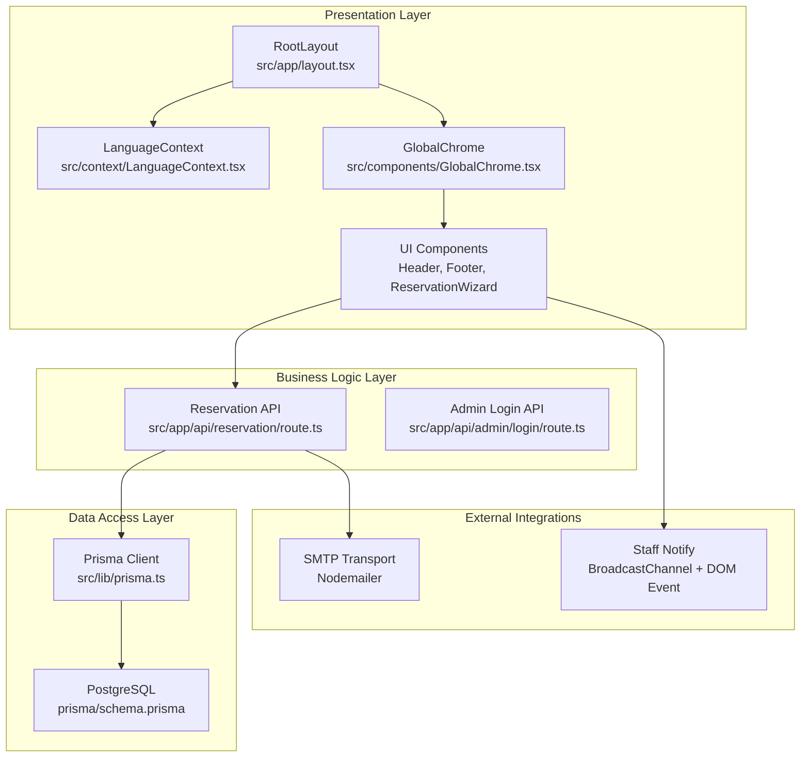
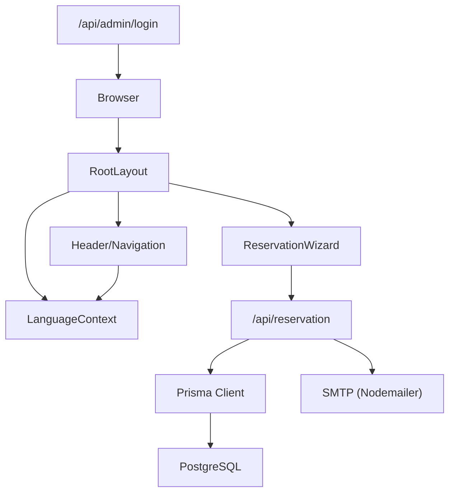
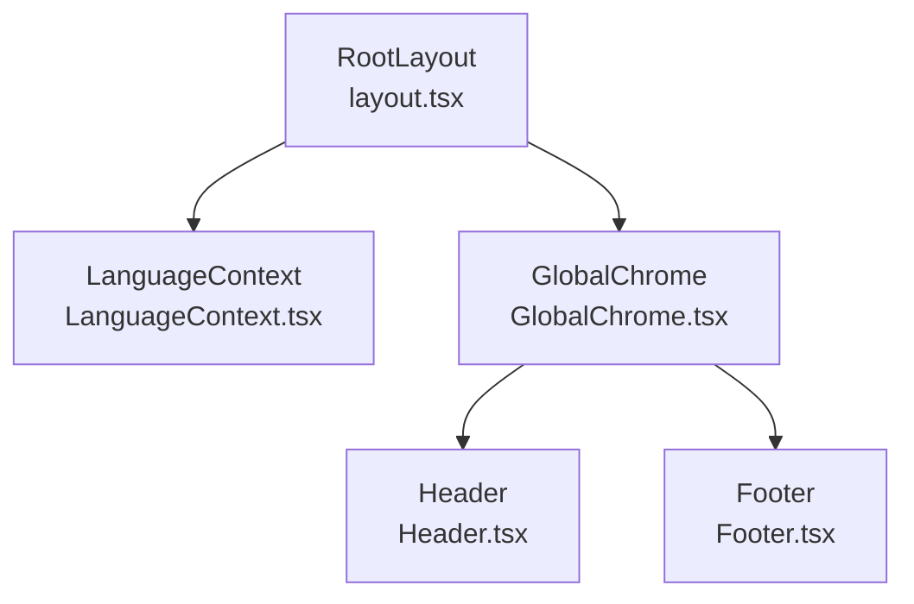
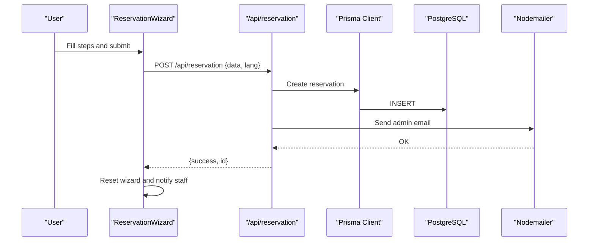
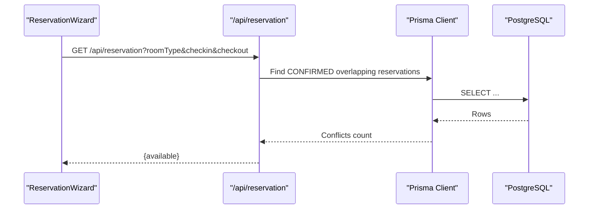
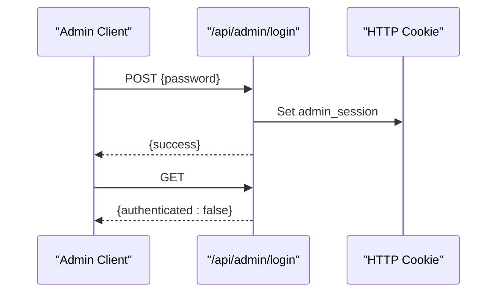
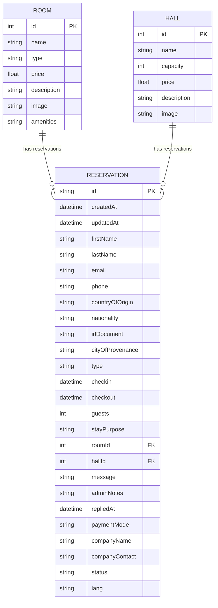
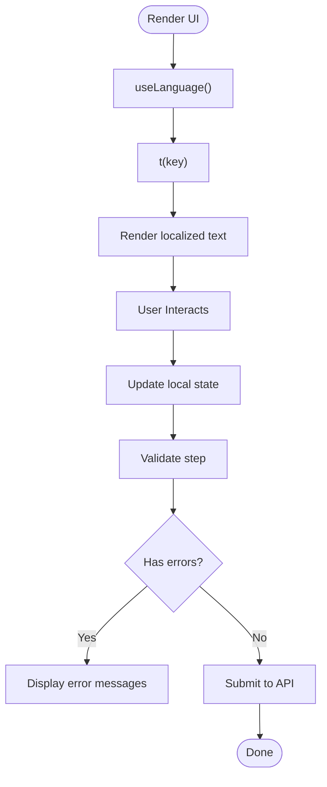
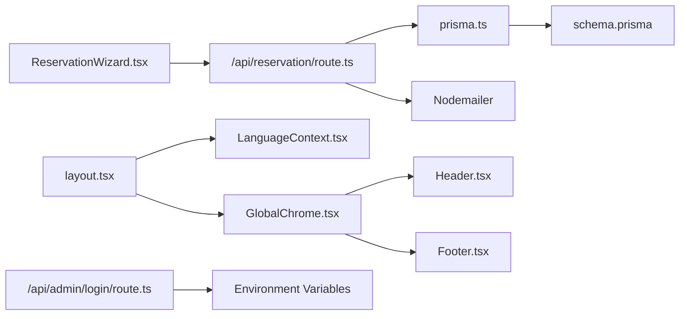

# Architecture Overview

<cite>
**Referenced Files in This Document**
- [README.md](file://README.md)
- [layout.tsx](file://src/app/layout.tsx)
- [LanguageContext.tsx](file://src/context/LanguageContext.tsx)
- [schema.prisma](file://prisma/schema.prisma)
- [prisma.ts](file://src/lib/prisma.ts)
- [package.json](file://package.json)
- [route.ts (Admin Login)](file://src/app/api/admin/login/route.ts)
- [route.ts (Reservation API)](file://src/app/api/reservation/route.ts)
- [ReservationWizard.tsx](file://src/components/reservation/ReservationWizard.tsx)
- [GlobalChrome.tsx](file://src/components/GlobalChrome.tsx)
- [Header.tsx](file://src/components/Header.tsx)
- [Footer.tsx](file://src/components/Footer.tsx)
- [content.ts](file://src/data/content.ts)
- [staff-notify.ts](file://src/lib/staff-notify.ts)
</cite>

## Table of Contents
1. [Introduction](#introduction)
2. [Project Structure](#project-structure)
3. [Core Components](#core-components)
4. [Architecture Overview](#architecture-overview)
5. [Detailed Component Analysis](#detailed-component-analysis)
6. [Dependency Analysis](#dependency-analysis)
7. [Performance Considerations](#performance-considerations)
8. [Troubleshooting Guide](#troubleshooting-guide)
9. [Conclusion](#conclusion)
10. [Appendices](#appendices)

## Introduction
This document describes the architecture of the Archangel Hotel website built with Next.js App Router. It explains the layered design (presentation, business logic, data access, external integrations), component hierarchy from RootLayout down to UI components, internationalization and state management, data flows, and operational boundaries. It also covers deployment topology and cross-cutting concerns such as authentication, error handling, and performance.

## Project Structure
The project follows Next.js App Router conventions with a clear separation of concerns:
- Presentation layer: React components under src/components and pages under src/app
- Business logic layer: API routes under src/app/api
- Data access layer: Prisma ORM with PostgreSQL datasource
- External integrations: Email transport via SMTP, staff notifications via DOM events and BroadcastChannel
- Internationalization: LanguageContext provider wrapping the app shell

**Diagram sources**
- [layout.tsx:38-53](file://src/app/layout.tsx#L38-L53)
- [LanguageContext.tsx:534-546](file://src/context/LanguageContext.tsx#L534-L546)
- [GlobalChrome.tsx:7-14](file://src/components/GlobalChrome.tsx#L7-L14)
- [route.ts (Reservation API):1-255](file://src/app/api/reservation/route.ts#L1-L255)
- [route.ts (Admin Login):1-29](file://src/app/api/admin/login/route.ts#L1-L29)
- [prisma.ts:1-12](file://src/lib/prisma.ts#L1-L12)
- [schema.prisma:1-75](file://prisma/schema.prisma#L1-L75)

**Section sources**
- [README.md:1-37](file://README.md#L1-L37)
- [layout.tsx:1-54](file://src/app/layout.tsx#L1-L54)
- [LanguageContext.tsx:1-555](file://src/context/LanguageContext.tsx#L1-L555)
- [schema.prisma:1-75](file://prisma/schema.prisma#L1-L75)
- [prisma.ts:1-12](file://src/lib/prisma.ts#L1-L12)
- [package.json:1-37](file://package.json#L1-L37)

## Core Components
- RootLayout: Sets metadata, fonts, and wraps children with LanguageProvider and GlobalChrome.
- LanguageContext: Provides translation keys and language switching to all components.
- GlobalChrome: Houses shared chrome elements including anchor scrolling and staff mail dock.
- ReservationWizard: Multi-step booking UI with validation, state updates, and submission to the reservation API.
- Reservation API: Handles GET availability checks and POST creation of reservations, persistence, and email notifications.
- Prisma Client: Centralized client initialization and logging.
- Admin Login API: Basic admin session management via cookies.
- Site utilities and content: Shared constants for rooms, halls, menus, and reservation types.

**Section sources**
- [layout.tsx:19-53](file://src/app/layout.tsx#L19-L53)
- [LanguageContext.tsx:534-555](file://src/context/LanguageContext.tsx#L534-L555)
- [GlobalChrome.tsx:7-14](file://src/components/GlobalChrome.tsx#L7-L14)
- [ReservationWizard.tsx:62-201](file://src/components/reservation/ReservationWizard.tsx#L62-L201)
- [route.ts (Reservation API):28-57](file://src/app/api/reservation/route.ts#L28-L57)
- [prisma.ts:1-12](file://src/lib/prisma.ts#L1-L12)
- [route.ts (Admin Login):3-24](file://src/app/api/admin/login/route.ts#L3-L24)
- [content.ts:70-114](file://src/data/content.ts#L70-L114)

## Architecture Overview
The system is layered and follows a unidirectional data flow:
- Presentation layer renders localized UI and triggers actions.
- Business logic layer exposes REST-like API endpoints for reservations and admin.
- Data access layer persists and queries data via Prisma.
- External integrations handle email notifications and staff activity alerts.

**Diagram sources**
- [layout.tsx:38-53](file://src/app/layout.tsx#L38-L53)
- [LanguageContext.tsx:534-555](file://src/context/LanguageContext.tsx#L534-L555)
- [Header.tsx:20-70](file://src/components/Header.tsx#L20-L70)
- [ReservationWizard.tsx:171-201](file://src/components/reservation/ReservationWizard.tsx#L171-L201)
- [route.ts (Reservation API):59-253](file://src/app/api/reservation/route.ts#L59-L253)
- [route.ts (Admin Login):3-24](file://src/app/api/admin/login/route.ts#L3-L24)
- [prisma.ts:1-12](file://src/lib/prisma.ts#L1-L12)
- [schema.prisma:8-11](file://prisma/schema.prisma#L8-L11)

## Detailed Component Analysis

### Component Hierarchy and Internationalization
The component tree begins at RootLayout, which:
- Defines metadata and fonts
- Wraps children with LanguageProvider
- Renders GlobalChrome beneath children

LanguageContext provides:
- Current language state
- Translation function t(key)
- Provider boundary for all child components

Header and Footer consume t() for labels and dynamic content, while GlobalChrome hosts shared chrome elements.

**Diagram sources**
- [layout.tsx:38-53](file://src/app/layout.tsx#L38-L53)
- [LanguageContext.tsx:534-555](file://src/context/LanguageContext.tsx#L534-L555)
- [GlobalChrome.tsx:7-14](file://src/components/GlobalChrome.tsx#L7-L14)
- [Header.tsx:20-70](file://src/components/Header.tsx#L20-L70)
- [Footer.tsx:9-20](file://src/components/Footer.tsx#L9-L20)

**Section sources**
- [layout.tsx:38-53](file://src/app/layout.tsx#L38-L53)
- [LanguageContext.tsx:534-555](file://src/context/LanguageContext.tsx#L534-L555)
- [GlobalChrome.tsx:7-14](file://src/components/GlobalChrome.tsx#L7-L14)
- [Header.tsx:20-70](file://src/components/Header.tsx#L20-L70)
- [Footer.tsx:9-20](file://src/components/Footer.tsx#L9-L20)

### Reservation Submission Flow
The ReservationWizard orchestrates a multi-step booking experience:
- Step navigation with validation per step
- State updates for guest, billing, and summary
- Submission to /api/reservation with translated labels and language context
- Upon success, notifies staff activity and resets form

**Diagram sources**
- [ReservationWizard.tsx:171-201](file://src/components/reservation/ReservationWizard.tsx#L171-L201)
- [route.ts (Reservation API):59-253](file://src/app/api/reservation/route.ts#L59-L253)
- [prisma.ts:1-12](file://src/lib/prisma.ts#L1-L12)
- [schema.prisma:34-74](file://prisma/schema.prisma#L34-L74)

**Section sources**
- [ReservationWizard.tsx:62-201](file://src/components/reservation/ReservationWizard.tsx#L62-L201)
- [route.ts (Reservation API):59-253](file://src/app/api/reservation/route.ts#L59-L253)

### Availability Check Flow
The Reservation API supports a GET endpoint to check room availability between two dates for a given room type.

**Diagram sources**
- [route.ts (Reservation API):28-57](file://src/app/api/reservation/route.ts#L28-L57)
- [prisma.ts:1-12](file://src/lib/prisma.ts#L1-L12)
- [schema.prisma:42-56](file://prisma/schema.prisma#L42-L56)

**Section sources**
- [route.ts (Reservation API):28-57](file://src/app/api/reservation/route.ts#L28-L57)

### Admin Authentication Flow
The admin login endpoint validates a password and sets a session cookie. It also exposes a GET endpoint to check authentication status.

**Diagram sources**
- [route.ts (Admin Login):3-28](file://src/app/api/admin/login/route.ts#L3-L28)

**Section sources**
- [route.ts (Admin Login):3-28](file://src/app/api/admin/login/route.ts#L3-L28)

### Data Model Overview
The Prisma schema defines three core models:
- Room: room inventory and pricing
- Hall: event space capacity and pricing
- Reservation: guest details, stay info, relations, communication fields, and status

**Diagram sources**
- [schema.prisma:13-74](file://prisma/schema.prisma#L13-L74)

**Section sources**
- [schema.prisma:13-74](file://prisma/schema.prisma#L13-L74)

### State Management and Internationalization
- LanguageContext manages language state and translation lookup, exposing t(key) to all components.
- Components like Header and Footer use t() for labels and dynamic content.
- ReservationWizard uses t() for localized UI and error messages.
- The wizard also tracks validation errors per step and navigates accordingly.

**Diagram sources**
- [LanguageContext.tsx:534-555](file://src/context/LanguageContext.tsx#L534-L555)
- [Header.tsx:25-50](file://src/components/Header.tsx#L25-L50)
- [ReservationWizard.tsx:62-170](file://src/components/reservation/ReservationWizard.tsx#L62-L170)

**Section sources**
- [LanguageContext.tsx:534-555](file://src/context/LanguageContext.tsx#L534-L555)
- [Header.tsx:25-50](file://src/components/Header.tsx#L25-L50)
- [ReservationWizard.tsx:62-170](file://src/components/reservation/ReservationWizard.tsx#L62-L170)

## Dependency Analysis
- Presentation depends on LanguageContext and shared components.
- ReservationWizard depends on content definitions and site utilities.
- Reservation API depends on Prisma client and SMTP transport.
- Prisma client depends on PostgreSQL datasource configured in schema.
- Admin Login API depends on environment variables for credentials and cookie security.

**Diagram sources**
- [ReservationWizard.tsx:171-201](file://src/components/reservation/ReservationWizard.tsx#L171-L201)
- [route.ts (Reservation API):59-253](file://src/app/api/reservation/route.ts#L59-L253)
- [prisma.ts:1-12](file://src/lib/prisma.ts#L1-L12)
- [schema.prisma:8-11](file://prisma/schema.prisma#L8-L11)
- [layout.tsx:38-53](file://src/app/layout.tsx#L38-L53)
- [LanguageContext.tsx:534-555](file://src/context/LanguageContext.tsx#L534-L555)
- [GlobalChrome.tsx:7-14](file://src/components/GlobalChrome.tsx#L7-L14)
- [Header.tsx:20-70](file://src/components/Header.tsx#L20-L70)
- [Footer.tsx:9-20](file://src/components/Footer.tsx#L9-L20)
- [route.ts (Admin Login):3-24](file://src/app/api/admin/login/route.ts#L3-L24)

**Section sources**
- [package.json:12-24](file://package.json#L12-L24)
- [schema.prisma:8-11](file://prisma/schema.prisma#L8-L11)
- [prisma.ts:1-12](file://src/lib/prisma.ts#L1-L12)
- [route.ts (Reservation API):59-253](file://src/app/api/reservation/route.ts#L59-L253)
- [route.ts (Admin Login):3-24](file://src/app/api/admin/login/route.ts#L3-L24)

## Performance Considerations
- Next.js App Router enables efficient static generation and server-side rendering where applicable.
- Prisma client is initialized once globally to avoid reconnect overhead.
- Reservation API logs queries during development to monitor performance and optimize.
- Client-side animations and transitions are used sparingly to balance UX and performance.
- Font loading uses next/font with display swap to improve perceived performance.

[No sources needed since this section provides general guidance]

## Troubleshooting Guide
- Reservation submission failures:
  - Verify SMTP environment variables and connectivity.
  - Check reservation API error responses and Prisma logs.
- Availability checks:
  - Ensure roomType, checkin, and checkout parameters are provided.
  - Confirm date range validity and room existence.
- Admin login:
  - Confirm ADMIN_PASSWORD environment variable and cookie security settings.
- Internationalization:
  - Ensure translation keys exist in LanguageContext and components render fallbacks gracefully.

**Section sources**
- [route.ts (Reservation API):246-252](file://src/app/api/reservation/route.ts#L246-L252)
- [route.ts (Admin Login):3-24](file://src/app/api/admin/login/route.ts#L3-L24)
- [LanguageContext.tsx:534-555](file://src/context/LanguageContext.tsx#L534-L555)

## Conclusion
The Archangel Hotel website employs a clean, layered architecture leveraging Next.js App Router, React Context for internationalization, Prisma ORM for data persistence, and Nodemailer for email notifications. The component hierarchy starts at RootLayout and flows through LanguageContext and GlobalChrome to UI components. The reservation flow demonstrates robust state management, validation, and integration with backend APIs and external services. Cross-cutting concerns such as authentication, error handling, and performance are addressed through environment-driven configuration, centralized utilities, and pragmatic UI patterns.

[No sources needed since this section summarizes without analyzing specific files]

## Appendices

### Deployment Topology
- Application: Next.js app served via Next.js runtime.
- Database: PostgreSQL managed by Prisma.
- Environment: Secrets for SMTP and admin password are expected via environment variables.
- Build pipeline: Prisma client generation and database push executed during build.

**Section sources**
- [README.md:32-37](file://README.md#L32-L37)
- [package.json:5-11](file://package.json#L5-L11)
- [route.ts (Admin Login):7-7](file://src/app/api/admin/login/route.ts#L7-L7)
- [route.ts (Reservation API):129-137](file://src/app/api/reservation/route.ts#L129-L137)