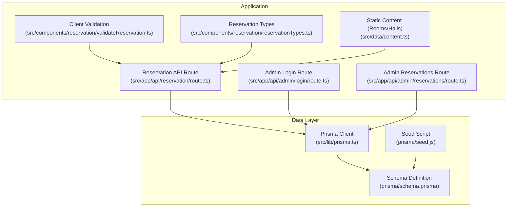
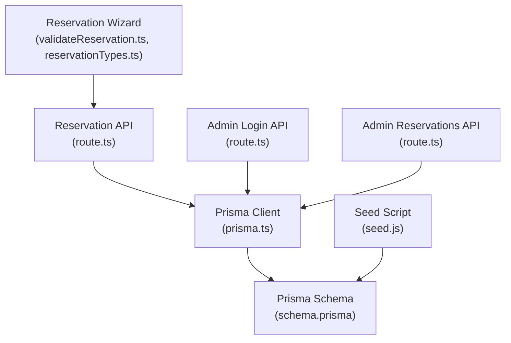
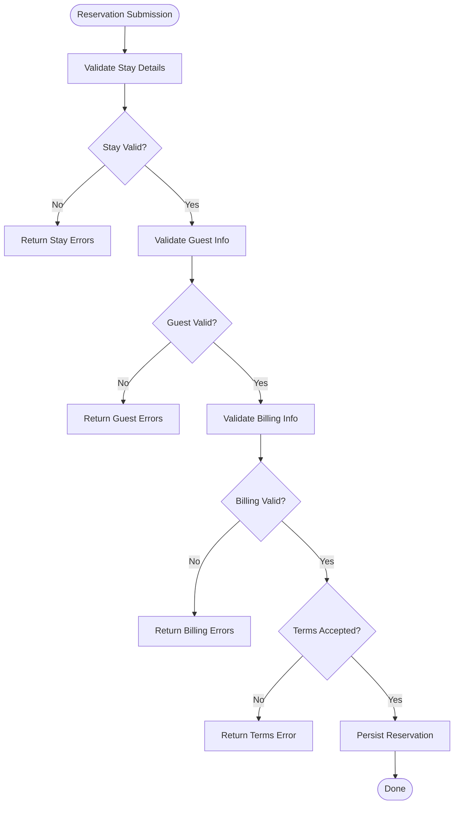
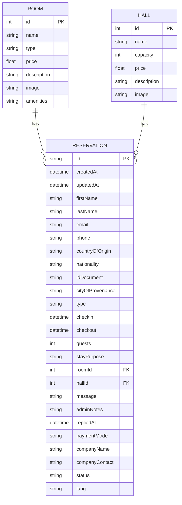
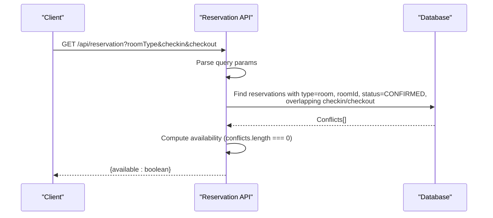
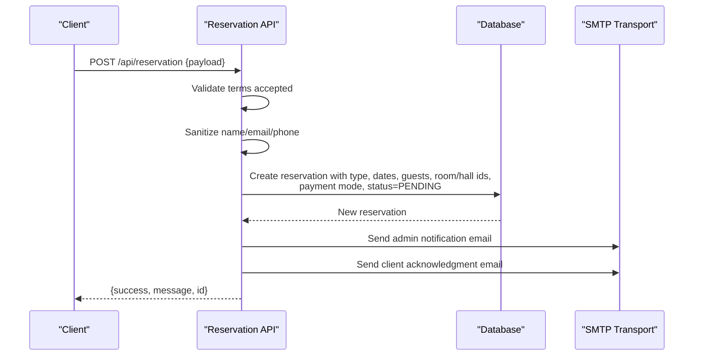
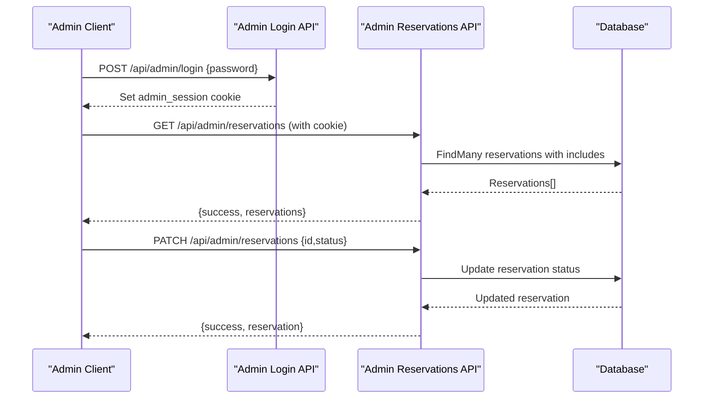
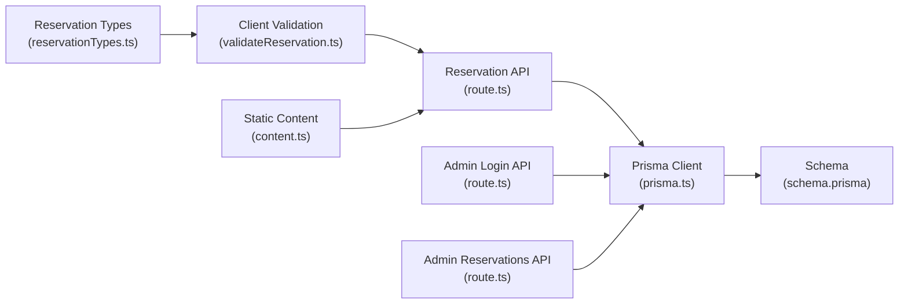
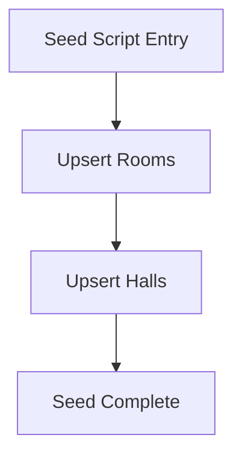

# Database Schema

<cite>
**Referenced Files in This Document**
- [schema.prisma](file://prisma/schema.prisma)
- [seed.js](file://prisma/seed.js)
- [prisma.ts](file://src/lib/prisma.ts)
- [route.ts](file://src/app/api/reservation/route.ts)
- [route.ts](file://src/app/api/admin/login/route.ts)
- [route.ts](file://src/app/api/admin/reservations/route.ts)
- [validateReservation.ts](file://src/components/reservation/validateReservation.ts)
- [reservationTypes.ts](file://src/components/reservation/reservationTypes.ts)
- [content.ts](file://src/data/content.ts)
</cite>

## Table of Contents
1. [Introduction](#introduction)
2. [Project Structure](#project-structure)
3. [Core Components](#core-components)
4. [Architecture Overview](#architecture-overview)
5. [Detailed Component Analysis](#detailed-component-analysis)
6. [Dependency Analysis](#dependency-analysis)
7. [Performance Considerations](#performance-considerations)
8. [Troubleshooting Guide](#troubleshooting-guide)
9. [Conclusion](#conclusion)
10. [Appendices](#appendices)

## Introduction
This document provides comprehensive data model documentation for the Prisma ORM schema and database design of the Archanges Hotel booking system. It details entity relationships among Reservation, Room, and Hall, including field definitions, data types, constraints, primary and foreign keys, indexes, and referential integrity. It also explains validation rules, business logic enforcement, data access patterns, query optimization strategies, migration and seeding procedures, backup/recovery considerations, and security/access control mechanisms. Practical examples of common queries and data manipulation scenarios are included to guide developers and operators.

## Project Structure
The database schema is defined in Prisma’s schema file and is consumed by the application through a shared Prisma client instance. API routes handle reservation creation, availability checks, and administrative operations. A seed script initializes baseline Room and Hall records. Client-side validation ensures data quality before submission.

**Diagram sources**
- [route.ts:1-255](file://src/app/api/reservation/route.ts#L1-L255)
- [route.ts:1-29](file://src/app/api/admin/login/route.ts#L1-L29)
- [route.ts:1-46](file://src/app/api/admin/reservations/route.ts#L1-L46)
- [validateReservation.ts:1-59](file://src/components/reservation/validateReservation.ts#L1-L59)
- [reservationTypes.ts:1-58](file://src/components/reservation/reservationTypes.ts#L1-L58)
- [content.ts:70-114](file://src/data/content.ts#L70-L114)
- [prisma.ts:1-12](file://src/lib/prisma.ts#L1-L12)
- [schema.prisma:1-75](file://prisma/schema.prisma#L1-L75)
- [seed.js:1-43](file://prisma/seed.js#L1-L43)

**Section sources**
- [schema.prisma:1-75](file://prisma/schema.prisma#L1-L75)
- [prisma.ts:1-12](file://src/lib/prisma.ts#L1-L12)
- [seed.js:1-43](file://prisma/seed.js#L1-L43)
- [route.ts:1-255](file://src/app/api/reservation/route.ts#L1-L255)
- [route.ts:1-29](file://src/app/api/admin/login/route.ts#L1-L29)
- [route.ts:1-46](file://src/app/api/admin/reservations/route.ts#L1-L46)
- [validateReservation.ts:1-59](file://src/components/reservation/validateReservation.ts#L1-L59)
- [reservationTypes.ts:1-58](file://src/components/reservation/reservationTypes.ts#L1-L58)
- [content.ts:70-114](file://src/data/content.ts#L70-L114)

## Core Components
This section defines the core entities and their attributes, constraints, and relationships.

- Room
  - Purpose: Defines hotel room offerings with pricing and metadata.
  - Fields:
    - id: Integer, primary key, autoincrement.
    - name: String.
    - type: String (domain: standard, deluxe, vip).
    - price: Float.
    - description: String?.
    - image: String?.
    - amenities: String? (comma-separated list stored as text).
  - Relationships:
    - reservations: Array of Reservation entries linked via optional foreign key roomId.

- Hall
  - Purpose: Defines event/reception spaces with capacity and pricing.
  - Fields:
    - id: Integer, primary key, autoincrement.
    - name: String.
    - capacity: Int.
    - price: Float (default 0).
    - description: String?.
    - image: String?.
  - Relationships:
    - reservations: Array of Reservation entries linked via optional foreign key hallId.

- Reservation
  - Purpose: Captures guest requests for rooms, events, restaurant, or photoshoots, including guest info, stay details, communication fields, billing info, status, and localization.
  - Identity:
    - id: String, primary key, cuid().
    - createdAt: DateTime (default now).
    - updatedAt: DateTime (updated-at).
  - Guest Info:
    - firstName, lastName, email, phone: Strings.
    - countryOfOrigin, nationality, idDocument, cityOfProvenance: Strings?.
  - Stay Info:
    - type: String (domain: room, restaurant, event, photoshoot).
    - checkin, checkout: DateTime.
    - guests: Int (default 1).
    - stayPurpose: String?.
  - Relations:
    - room: Room? (optional relation).
    - roomId: Int?.
    - hall: Hall? (optional relation).
    - hallId: Int?.
  - Communication:
    - message: String?.
    - adminNotes: String?.
    - repliedAt: DateTime?.
  - Billing and Company:
    - paymentMode: String (domain: private, company).
    - companyName: String?.
    - companyContact: String?.
  - Status and Localization:
    - status: String (default PENDING; domain: PENDING, CONFIRMED, CANCELLED).
    - lang: String (default fr).

Constraints and Defaults
- Room.type constrained to a fixed set of values via application/business logic.
- Hall.price defaults to 0.
- Reservation.status defaults to PENDING.
- Reservation.lang defaults to fr.
- Reservation.guests defaults to 1.
- Foreign keys roomId and hallId are optional, enabling reservations for non-room/non-hall types (e.g., restaurant, photoshoot).

Referential Integrity
- Prisma relations define optional foreign keys:
  - Reservation.roomId -> Room.id
  - Reservation.hallId -> Hall.id
- No explicit ON DELETE behavior is declared in the schema; referential actions depend on Prisma defaults and underlying database behavior.

Indexes and Performance
- Primary keys are implicitly indexed.
- No explicit indexes are defined in the schema for foreign keys or frequently queried columns. Consider adding indexes on Reservation.checkin, Reservation.checkout, Reservation.roomId, and Reservation.hallId for performance-sensitive queries.

**Section sources**
- [schema.prisma:13-32](file://prisma/schema.prisma#L13-L32)
- [schema.prisma:34-74](file://prisma/schema.prisma#L34-L74)

## Architecture Overview
The system follows a layered architecture:
- Presentation/UI: React components collect reservation data and validate locally.
- API Layer: Next.js API routes handle reservation creation, availability checks, and admin operations.
- Data Access: Prisma client encapsulated in a singleton module.
- Persistence: PostgreSQL database managed by Prisma.

**Diagram sources**
- [validateReservation.ts:1-59](file://src/components/reservation/validateReservation.ts#L1-L59)
- [reservationTypes.ts:1-58](file://src/components/reservation/reservationTypes.ts#L1-L58)
- [route.ts:1-255](file://src/app/api/reservation/route.ts#L1-L255)
- [route.ts:1-29](file://src/app/api/admin/login/route.ts#L1-L29)
- [route.ts:1-46](file://src/app/api/admin/reservations/route.ts#L1-L46)
- [prisma.ts:1-12](file://src/lib/prisma.ts#L1-L12)
- [schema.prisma:1-75](file://prisma/schema.prisma#L1-L75)
- [seed.js:1-43](file://prisma/seed.js#L1-L43)

## Detailed Component Analysis

### Reservation Entity and Business Logic
Reservation captures multi-purpose bookings. Business rules enforced:
- Type domain: room, restaurant, event, photoshoot.
- Room stays require check-in/check-out dates; future-dated check-in is enforced; checkout must be after check-in.
- Guests must be a positive integer.
- Email and phone must match minimal regex patterns.
- Payment mode “company” requires company name and contact.
- Terms acceptance is mandatory.
- Availability check for room reservations uses overlapping date ranges.

**Diagram sources**
- [validateReservation.ts:5-50](file://src/components/reservation/validateReservation.ts#L5-L50)
- [reservationTypes.ts:3-24](file://src/components/reservation/reservationTypes.ts#L3-L24)

**Section sources**
- [validateReservation.ts:1-59](file://src/components/reservation/validateReservation.ts#L1-L59)
- [reservationTypes.ts:1-58](file://src/components/reservation/reservationTypes.ts#L1-L58)

### Room and Hall Entities
Room and Hall define inventory and pricing. The seed script upserts baseline records for both entities. Static content files provide labels and metadata used by the UI and emails.

**Diagram sources**
- [schema.prisma:13-32](file://prisma/schema.prisma#L13-L32)
- [schema.prisma:34-74](file://prisma/schema.prisma#L34-L74)

**Section sources**
- [schema.prisma:13-32](file://prisma/schema.prisma#L13-L32)
- [seed.js:4-32](file://prisma/seed.js#L4-L32)
- [content.ts:70-114](file://src/data/content.ts#L70-L114)

### API Workflows

#### Availability Check Workflow
The reservation API exposes a GET endpoint to check room availability over a date range.

**Diagram sources**
- [route.ts:28-57](file://src/app/api/reservation/route.ts#L28-L57)

**Section sources**
- [route.ts:28-57](file://src/app/api/reservation/route.ts#L28-L57)

#### Reservation Creation Workflow
The reservation API handles POST requests, validates terms, sanitizes input, persists the record, and sends automated emails.

**Diagram sources**
- [route.ts:59-253](file://src/app/api/reservation/route.ts#L59-L253)

**Section sources**
- [route.ts:59-253](file://src/app/api/reservation/route.ts#L59-L253)

#### Admin Authentication and Management
Admin endpoints manage session-based access and CRUD operations on reservations.

**Diagram sources**
- [route.ts:3-24](file://src/app/api/admin/login/route.ts#L3-L24)
- [route.ts:4-45](file://src/app/api/admin/reservations/route.ts#L4-L45)

**Section sources**
- [route.ts:1-29](file://src/app/api/admin/login/route.ts#L1-L29)
- [route.ts:1-46](file://src/app/api/admin/reservations/route.ts#L1-L46)

## Dependency Analysis
- Prisma Client is initialized once and reused across the app.
- API routes depend on Prisma for persistence and on static content for labels.
- Client-side validation depends on typed interfaces and regex patterns.
- Admin APIs enforce session-based access control via cookies.

**Diagram sources**
- [prisma.ts:1-12](file://src/lib/prisma.ts#L1-L12)
- [schema.prisma:1-75](file://prisma/schema.prisma#L1-L75)
- [route.ts:1-255](file://src/app/api/reservation/route.ts#L1-L255)
- [route.ts:1-29](file://src/app/api/admin/login/route.ts#L1-L29)
- [route.ts:1-46](file://src/app/api/admin/reservations/route.ts#L1-L46)
- [validateReservation.ts:1-59](file://src/components/reservation/validateReservation.ts#L1-L59)
- [reservationTypes.ts:1-58](file://src/components/reservation/reservationTypes.ts#L1-L58)
- [content.ts:70-114](file://src/data/content.ts#L70-L114)

**Section sources**
- [prisma.ts:1-12](file://src/lib/prisma.ts#L1-L12)
- [route.ts:1-255](file://src/app/api/reservation/route.ts#L1-L255)
- [route.ts:1-29](file://src/app/api/admin/login/route.ts#L1-L29)
- [route.ts:1-46](file://src/app/api/admin/reservations/route.ts#L1-L46)
- [validateReservation.ts:1-59](file://src/components/reservation/validateReservation.ts#L1-L59)
- [reservationTypes.ts:1-58](file://src/components/reservation/reservationTypes.ts#L1-L58)
- [content.ts:70-114](file://src/data/content.ts#L70-L114)

## Performance Considerations
- Indexing:
  - Add indexes on Reservation.checkin, Reservation.checkout, Reservation.roomId, and Reservation.hallId to optimize availability checks and filtering.
  - Consider composite indexes for frequent filter combinations (e.g., type + status + checkin).
- Query Patterns:
  - Use select/include sparingly; only fetch required fields to reduce payload size.
  - Paginate admin reservation lists to avoid large result sets.
- Logging:
  - The Prisma client logs queries; monitor logs in development to identify slow queries.
- Data Types:
  - Keep amenities as comma-separated strings for simplicity; if querying features becomes frequent, consider a separate normalized table and join.
- Caching:
  - Cache static Room/Hall metadata from content.ts to reduce repeated lookups.

[No sources needed since this section provides general guidance]

## Troubleshooting Guide
- Validation Errors:
  - Ensure client-side validation runs before submission; errors are returned as field-specific messages.
- Date Overlaps:
  - Availability checks rely on overlapping date ranges; confirm check-in is not in the past and check-out is after check-in.
- Missing Required Fields:
  - Terms acceptance, name, email, and phone are mandatory; missing any triggers a 400 response.
- Admin Access:
  - Admin endpoints require a valid admin_session cookie; verify cookie presence and expiration.
- Database Connectivity:
  - Confirm POSTGRES_PRISMA_URL is set; Prisma client initialization logs queries by default.

**Section sources**
- [validateReservation.ts:5-50](file://src/components/reservation/validateReservation.ts#L5-L50)
- [route.ts:87-100](file://src/app/api/reservation/route.ts#L87-L100)
- [route.ts:9-23](file://src/app/api/admin/login/route.ts#L9-L23)
- [prisma.ts:7-9](file://src/lib/prisma.ts#L7-L9)

## Conclusion
The database schema models a straightforward yet effective booking system with clear entity relationships and enforced business rules at both the client and server layers. Room and Hall entities provide inventory and pricing, while Reservation centralizes all booking requests with robust validation and status tracking. Administrators can manage reservations securely via session-based access. To scale, consider adding targeted indexes, normalizing feature lists, and implementing pagination and caching strategies.

[No sources needed since this section summarizes without analyzing specific files]

## Appendices

### A. Seeding Initial Data
Baseline Room and Hall records are created via the seed script using upsert operations to avoid duplication.

**Diagram sources**
- [seed.js:4-32](file://prisma/seed.js#L4-L32)

**Section sources**
- [seed.js:1-43](file://prisma/seed.js#L1-L43)

### B. Migration Strategies
- Use Prisma Migrate for schema evolution:
  - Initialize migrations if not present.
  - Generate and apply migrations when schema.prisma changes.
  - Back up the database before applying migrations in production.
- Version Control:
  - Commit migration files alongside schema changes.
- Rollback Planning:
  - Maintain safe-to-apply incremental migrations and test rollback procedures.

[No sources needed since this section provides general guidance]

### C. Backup and Recovery
- Regular database snapshots or logical backups should be scheduled.
- Store secrets (POSTGRES_PRISMA_URL, SMTP credentials) securely and rotate periodically.
- Test restore procedures regularly to ensure recoverability.

[No sources needed since this section provides general guidance]

### D. Security and Access Control
- Admin Access:
  - Session cookie with httpOnly and secure flags; adjust maxAge/path per environment.
  - Validate session on admin endpoints; return 401 Unauthorized otherwise.
- Data Exposure:
  - Sanitize user inputs and escape HTML in emails to prevent XSS.
- Secrets Management:
  - Use environment variables for database URLs and SMTP credentials.
- Privacy:
  - Limit data collection to what is necessary; retain personal data only as long as required by policy.

**Section sources**
- [route.ts:9-23](file://src/app/api/admin/login/route.ts#L9-L23)
- [route.ts:7-9](file://src/app/api/admin/reservations/route.ts#L7-L9)
- [route.ts:6-14](file://src/app/api/reservation/route.ts#L6-L14)
- [route.ts:129-137](file://src/app/api/reservation/route.ts#L129-L137)

### E. Practical Query Examples
- Check Room Availability
  - Endpoint: GET /api/reservation?roomType={id}&checkin={date}&checkout={date}
  - Logic: Find confirmed reservations with overlapping date ranges.
- List All Reservations (Admin)
  - Endpoint: GET /api/admin/reservations
  - Includes: room and hall relations; ordered by creation date desc.
- Update Reservation Status (Admin)
  - Endpoint: PATCH /api/admin/reservations
  - Payload: { id, status }
  - Returns: updated reservation.

**Section sources**
- [route.ts:28-57](file://src/app/api/reservation/route.ts#L28-L57)
- [route.ts:12-22](file://src/app/api/admin/reservations/route.ts#L12-L22)
- [route.ts:37-41](file://src/app/api/admin/reservations/route.ts#L37-L41)