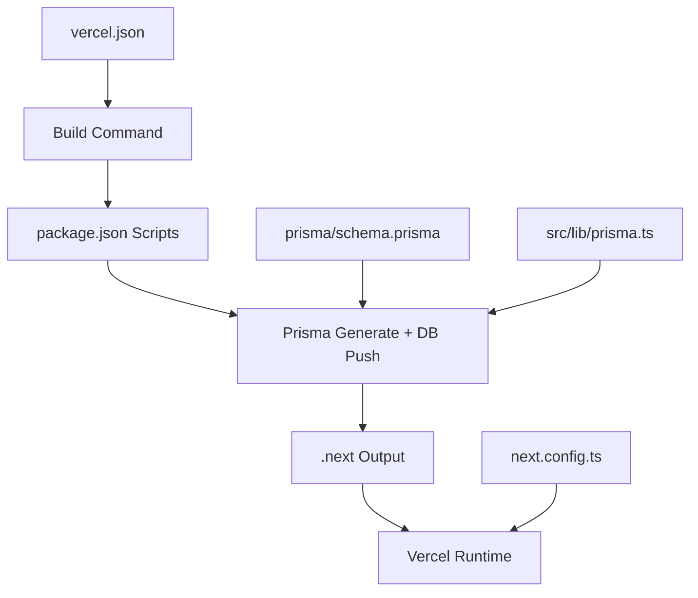
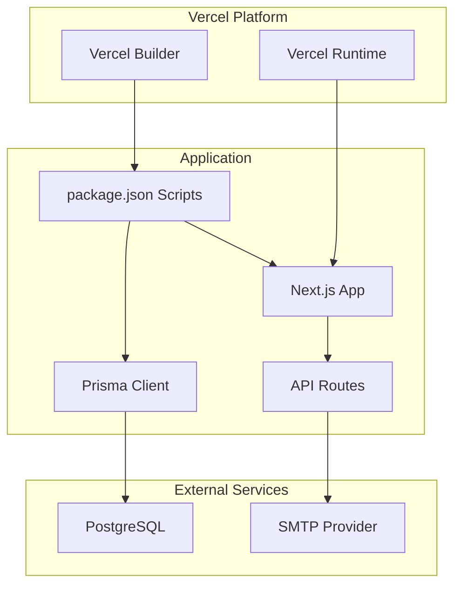
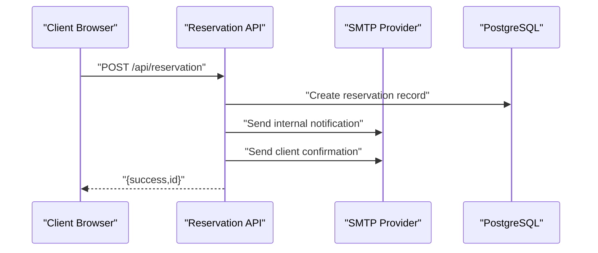
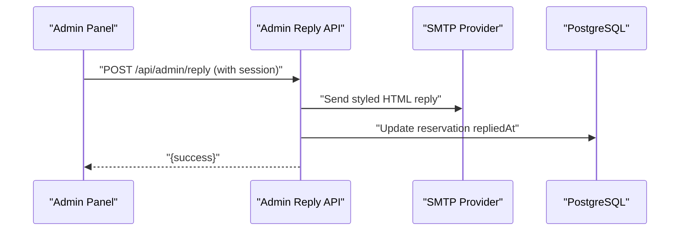
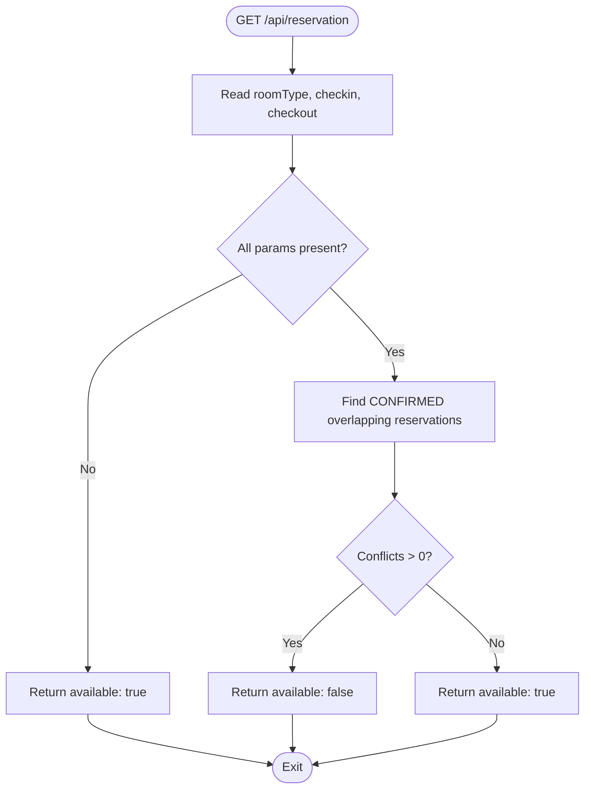
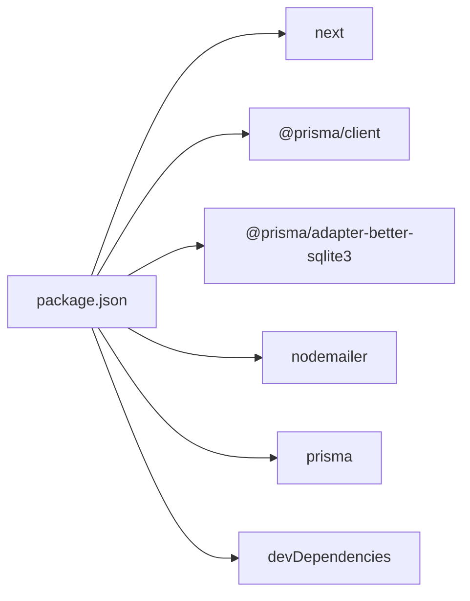

# Deployment and Configuration

<cite>
**Referenced Files in This Document**
- [vercel.json](file://vercel.json)
- [package.json](file://package.json)
- [next.config.ts](file://next.config.ts)
- [prisma/schema.prisma](file://prisma/schema.prisma)
- [src/lib/prisma.ts](file://src/lib/prisma.ts)
- [src/app/api/admin/login/route.ts](file://src/app/api/admin/login/route.ts)
- [src/app/api/admin/reply/route.ts](file://src/app/api/admin/reply/route.ts)
- [src/app/api/admin/reservations/route.ts](file://src/app/api/admin/reservations/route.ts)
- [src/app/api/admin/settings/route.ts](file://src/app/api/admin/settings/route.ts)
- [src/app/api/reservation/route.ts](file://src/app/api/reservation/route.ts)
- [README.md](file://README.md)
</cite>

## Table of Contents
1. [Introduction](#introduction)
2. [Project Structure](#project-structure)
3. [Core Components](#core-components)
4. [Architecture Overview](#architecture-overview)
5. [Detailed Component Analysis](#detailed-component-analysis)
6. [Dependency Analysis](#dependency-analysis)
7. [Performance Considerations](#performance-considerations)
8. [Troubleshooting Guide](#troubleshooting-guide)
9. [Conclusion](#conclusion)
10. [Appendices](#appendices)

## Introduction
This document provides comprehensive deployment and configuration guidance for the Archangel Hotel application. It covers Vercel deployment configuration, environment variable requirements, build process optimization, production environment setup (database, email service, and security), CI/CD pipeline recommendations, automated testing integration, performance optimization, caching strategies, monitoring, scaling, load balancing, disaster recovery, configuration management, secrets handling, and operational troubleshooting.

## Project Structure
The application is a Next.js 16 app configured for Vercel deployment. Key deployment-related files include:
- Vercel configuration for framework detection and build command
- Next.js configuration for image optimization
- Prisma schema defining PostgreSQL-backed data model
- API routes for reservations and administrative actions
- Package scripts orchestrating Prisma generation and database push during builds

**Diagram sources**
- [vercel.json:1-6](file://vercel.json#L1-L6)
- [package.json:5-11](file://package.json#L5-L11)
- [next.config.ts:1-17](file://next.config.ts#L1-L17)
- [prisma/schema.prisma:1-75](file://prisma/schema.prisma#L1-L75)
- [src/lib/prisma.ts:1-12](file://src/lib/prisma.ts#L1-L12)

**Section sources**
- [vercel.json:1-6](file://vercel.json#L1-L6)
- [package.json:5-11](file://package.json#L5-L11)
- [next.config.ts:1-17](file://next.config.ts#L1-L17)
- [prisma/schema.prisma:1-75](file://prisma/schema.prisma#L1-L75)
- [src/lib/prisma.ts:1-12](file://src/lib/prisma.ts#L1-L12)

## Core Components
- Vercel deployment configuration defines the Next.js framework, build command, and output directory.
- Build pipeline integrates Prisma client generation and database schema push prior to building the Next app.
- Next.js configuration restricts remote image hosts for security and performance.
- Prisma data model defines PostgreSQL connection via environment variable and supports rooms, halls, and reservations.
- API routes handle:
  - Admin login with cookie-based session
  - Reply-to-customer emails via SMTP
  - Fetching and updating reservations
  - Settings retrieval and updates
  - Guest reservation submission and dual-email notifications

**Section sources**
- [vercel.json:1-6](file://vercel.json#L1-L6)
- [package.json:5-11](file://package.json#L5-L11)
- [next.config.ts:1-17](file://next.config.ts#L1-L17)
- [prisma/schema.prisma:8-11](file://prisma/schema.prisma#L8-L11)
- [src/lib/prisma.ts:1-12](file://src/lib/prisma.ts#L1-L12)
- [src/app/api/admin/login/route.ts:1-29](file://src/app/api/admin/login/route.ts#L1-L29)
- [src/app/api/admin/reply/route.ts:1-73](file://src/app/api/admin/reply/route.ts#L1-L73)
- [src/app/api/admin/reservations/route.ts:1-46](file://src/app/api/admin/reservations/route.ts#L1-L46)
- [src/app/api/admin/settings/route.ts:1-35](file://src/app/api/admin/settings/route.ts#L1-L35)
- [src/app/api/reservation/route.ts:1-255](file://src/app/api/reservation/route.ts#L1-L255)

## Architecture Overview
The deployment architecture centers on Vercel’s platform with a Postgres-backed Prisma layer and SMTP-based email notifications. The build process runs Prisma client generation and schema push before compiling the Next.js app.

**Diagram sources**
- [vercel.json:1-6](file://vercel.json#L1-L6)
- [package.json:5-11](file://package.json#L5-L11)
- [prisma/schema.prisma:8-11](file://prisma/schema.prisma#L8-L11)
- [src/app/api/reservation/route.ts:129-137](file://src/app/api/reservation/route.ts#L129-L137)
- [src/app/api/admin/reply/route.ts:12-20](file://src/app/api/admin/reply/route.ts#L12-L20)

## Detailed Component Analysis

### Vercel Deployment Configuration
- Framework: Next.js
- Build command: runs Prisma generation and database push, followed by Next build
- Output directory: .next

Operational implications:
- Ensure environment variables are present at build time for Prisma and SMTP.
- Keep the build command aligned with Prisma client generation and schema synchronization.

**Section sources**
- [vercel.json:1-6](file://vercel.json#L1-L6)
- [package.json:5-11](file://package.json#L5-L11)

### Build Process and Prisma Integration
- Pre-build steps:
  - Prisma client generation
  - Database schema push
- Build output:
  - Next.js static assets compiled to .next

Recommendations:
- Pin Prisma version and keep client generation deterministic.
- Use Vercel’s build environment variables to supply database credentials securely.

**Section sources**
- [package.json:5-11](file://package.json#L5-L11)
- [prisma/schema.prisma:4-11](file://prisma/schema.prisma#L4-L11)
- [src/lib/prisma.ts:1-12](file://src/lib/prisma.ts#L1-L12)

### Next.js Image Optimization
- Remote image hosts restricted to specific domains for security and performance.

Implications:
- Configure image domains centrally to avoid runtime warnings.
- Consider CDN integration for improved global delivery.

**Section sources**
- [next.config.ts:3-14](file://next.config.ts#L3-L14)

### Database Configuration (PostgreSQL via Prisma)
- Data source provider: PostgreSQL
- Connection URL sourced from environment variable
- Models: Room, Hall, Reservation

Security and reliability:
- Store the database URL in Vercel environment variables.
- Prefer read-replica connections for read-heavy admin endpoints if scaling.

**Section sources**
- [prisma/schema.prisma:8-11](file://prisma/schema.prisma#L8-L11)
- [prisma/schema.prisma:13-74](file://prisma/schema.prisma#L13-L74)
- [src/lib/prisma.ts:1-12](file://src/lib/prisma.ts#L1-L12)

### Email Service Integration (SMTP)
- SMTP host and port defaults to a provider; credentials sourced from environment variables
- Admin reply endpoint sends styled HTML emails and updates reservation reply timestamps
- Public reservation endpoint sends notifications to internal mailbox and a confirmation email to the client

Security considerations:
- Use dedicated SMTP credentials with least privilege.
- Enable TLS and secure cookies for admin sessions.

**Section sources**
- [src/app/api/admin/reply/route.ts:12-20](file://src/app/api/admin/reply/route.ts#L12-L20)
- [src/app/api/admin/reply/route.ts:38-59](file://src/app/api/admin/reply/route.ts#L38-L59)
- [src/app/api/reservation/route.ts:129-137](file://src/app/api/reservation/route.ts#L129-L137)
- [src/app/api/reservation/route.ts:197-203](file://src/app/api/reservation/route.ts#L197-L203)
- [src/app/api/reservation/route.ts:236-243](file://src/app/api/reservation/route.ts#L236-L243)

### Admin Authentication and Session Management
- Login endpoint validates password and sets a secure, HTTP-only cookie
- Admin endpoints require a valid session cookie

Security hardening:
- Replace cookie-based session with signed JWT tokens in production.
- Enforce HTTPS-only cookies and SameSite policies.
- Rotate ADMIN_PASSWORD via environment variables.

**Section sources**
- [src/app/api/admin/login/route.ts:3-24](file://src/app/api/admin/login/route.ts#L3-L24)

### Reservation Submission Workflow

**Diagram sources**
- [src/app/api/reservation/route.ts:59-255](file://src/app/api/reservation/route.ts#L59-L255)
- [prisma/schema.prisma:34-74](file://prisma/schema.prisma#L34-L74)

### Admin Reply-to-Customer Workflow

**Diagram sources**
- [src/app/api/admin/reply/route.ts:5-73](file://src/app/api/admin/reply/route.ts#L5-L73)
- [prisma/schema.prisma:34-74](file://prisma/schema.prisma#L34-L74)

### Availability Check Logic

**Diagram sources**
- [src/app/api/reservation/route.ts:28-57](file://src/app/api/reservation/route.ts#L28-L57)
- [prisma/schema.prisma:34-74](file://prisma/schema.prisma#L34-L74)

## Dependency Analysis
- Application dependencies include Next.js, Prisma client, better-sqlite3 adapter, and Nodemailer.
- Build-time dependencies orchestrate Prisma client generation and schema push.
- Runtime dependencies include Prisma client and SMTP transport.

**Diagram sources**
- [package.json:12-35](file://package.json#L12-L35)

**Section sources**
- [package.json:12-35](file://package.json#L12-L35)

## Performance Considerations
- Build optimization:
  - Keep Prisma client generation deterministic; pin versions.
  - Minimize rebuild scope by avoiding unnecessary schema changes.
- Runtime optimization:
  - Enable Next.js image optimization with allowed remote patterns.
  - Use server-side rendering and static generation where appropriate.
- Database:
  - Index frequently queried fields (e.g., reservation dates, status).
  - Consider read replicas for admin endpoints.
- Caching:
  - Use Vercel Edge Config for small, shared configuration.
  - Cache non-sensitive computed data at the edge when safe.
- Monitoring:
  - Track build duration and deployment health.
  - Monitor API latency and error rates for reservation and reply endpoints.

[No sources needed since this section provides general guidance]

## Troubleshooting Guide
Common deployment issues and resolutions:
- Prisma errors during build:
  - Verify database URL and connectivity in Vercel environment variables.
  - Ensure Prisma client is regenerated and schema is pushed before build.
- SMTP failures:
  - Confirm SMTP host, port, user, and password are set.
  - Test SMTP credentials independently.
- Admin session problems:
  - Ensure HTTPS in production and secure cookie flags are applied.
  - Replace cookie-based session with JWT tokens for robustness.
- Reservation availability checks:
  - Validate date parameters and timezone handling.
  - Confirm reservation status filtering for availability logic.

**Section sources**
- [prisma/schema.prisma:8-11](file://prisma/schema.prisma#L8-L11)
- [src/app/api/reservation/route.ts:28-57](file://src/app/api/reservation/route.ts#L28-L57)
- [src/app/api/admin/login/route.ts:9-24](file://src/app/api/admin/login/route.ts#L9-L24)
- [src/app/api/admin/reply/route.ts:12-20](file://src/app/api/admin/reply/route.ts#L12-L20)

## Conclusion
The Archangel Hotel application is structured for efficient Vercel deployment with integrated Prisma and SMTP workflows. By securing environment variables, optimizing the build pipeline, implementing robust admin authentication, and adopting scalable database and caching strategies, the system can operate reliably in production. Continuous monitoring, CI/CD automation, and disaster recovery planning will further strengthen operational resilience.

[No sources needed since this section summarizes without analyzing specific files]

## Appendices

### Environment Variables Reference
- Database
  - POSTGRES_PRISMA_URL: PostgreSQL connection string for Prisma
- Admin
  - ADMIN_PASSWORD: Admin login password (replace default)
- SMTP
  - SMTP_HOST: SMTP server hostname
  - SMTP_PORT: SMTP server port (default used if unset)
  - SMTP_USER: SMTP username
  - SMTP_PASSWORD: SMTP password

**Section sources**
- [prisma/schema.prisma:10](file://prisma/schema.prisma#L10)
- [src/app/api/admin/login/route.ts:7](file://src/app/api/admin/login/route.ts#L7)
- [src/app/api/admin/reply/route.ts:13-19](file://src/app/api/admin/reply/route.ts#L13-L19)
- [src/app/api/reservation/route.ts:130-136](file://src/app/api/reservation/route.ts#L130-L136)

### CI/CD Pipeline Setup
Recommended steps:
- Trigger build on pull requests to validate Prisma schema and linting.
- Run tests (unit/integration) before allowing production deployments.
- Promote successful builds to staging, then production with manual approval.
- Automate secret rotation for SMTP and database URLs.

[No sources needed since this section provides general guidance]

### Security Hardening Checklist
- Use HTTPS-only cookies for admin session.
- Enforce strong passwords and rotate ADMIN_PASSWORD regularly.
- Restrict SMTP credentials to minimal required scope.
- Limit remote image hosts to trusted domains.
- Sanitize user inputs and escape HTML in email templates.

**Section sources**
- [src/app/api/admin/login/route.ts:13-18](file://src/app/api/admin/login/route.ts#L13-L18)
- [src/app/api/reservation/route.ts:6-14](file://src/app/api/reservation/route.ts#L6-L14)
- [src/app/api/admin/reply/route.ts:25-36](file://src/app/api/admin/reply/route.ts#L25-L36)

### Scaling and Disaster Recovery
- Scaling:
  - Use Vercel’s autoscaling for the frontend.
  - Scale PostgreSQL tier and consider read replicas for admin queries.
- Load balancing:
  - Rely on Vercel’s global edge network.
- Disaster recovery:
  - Back up PostgreSQL regularly.
  - Maintain immutable deployment artifacts and rollback plans.

[No sources needed since this section provides general guidance]

### Monitoring and Observability
- Track build success and duration.
- Monitor API error rates and latency.
- Log reservation and reply operations for auditability.
- Alert on SMTP delivery failures and database connectivity issues.

[No sources needed since this section provides general guidance]