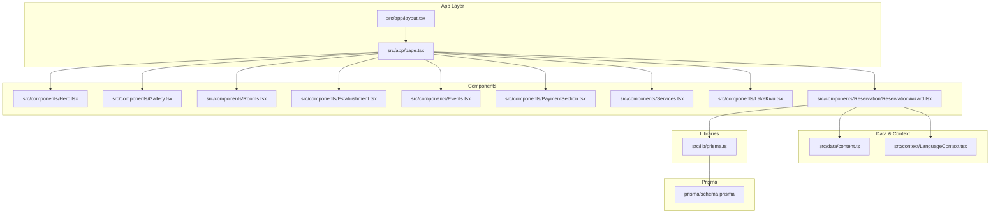
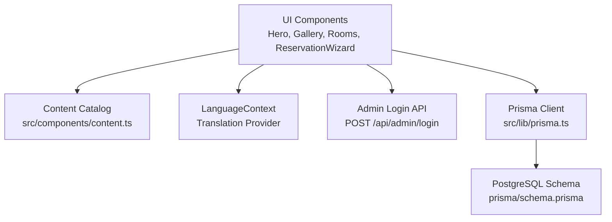
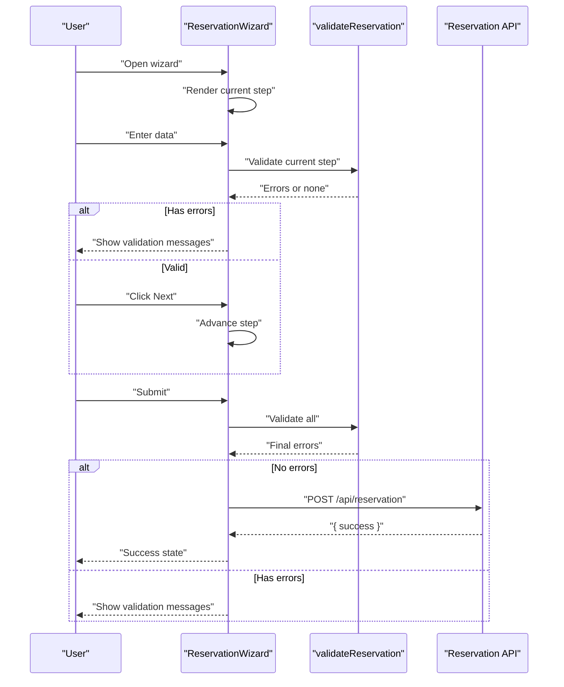
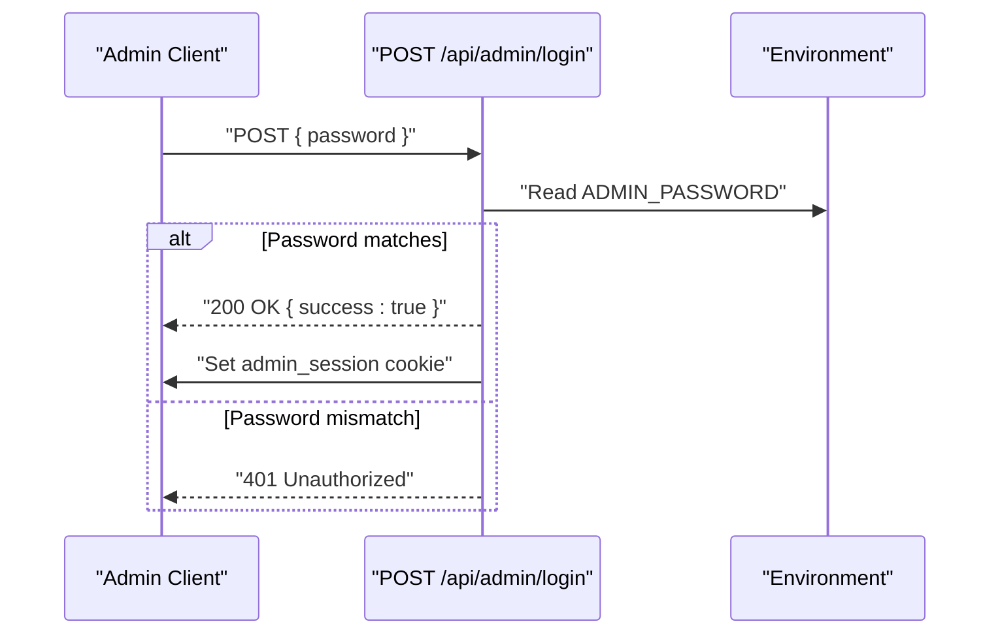
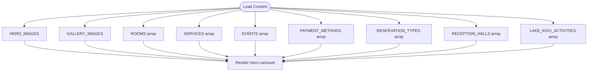
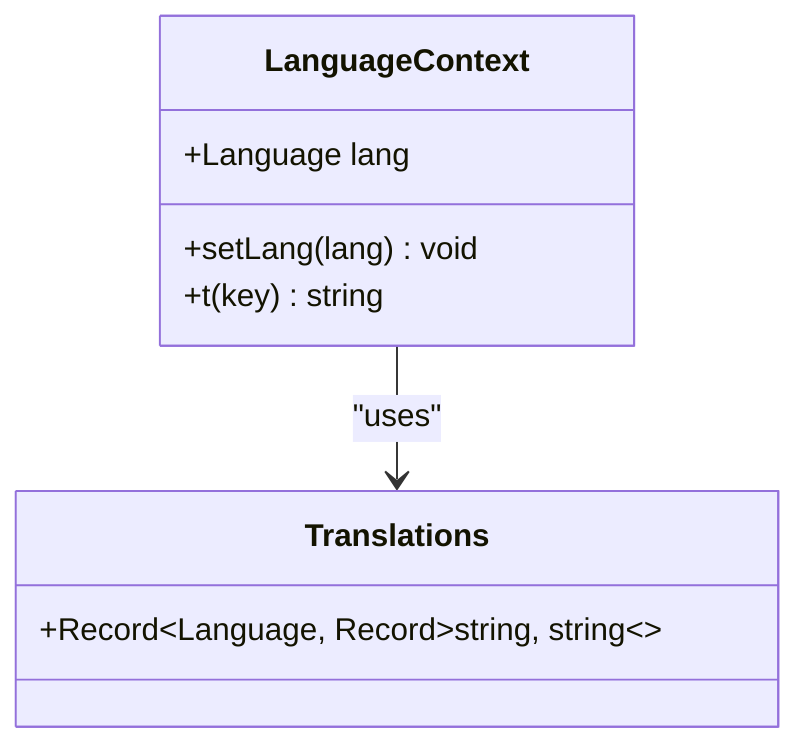
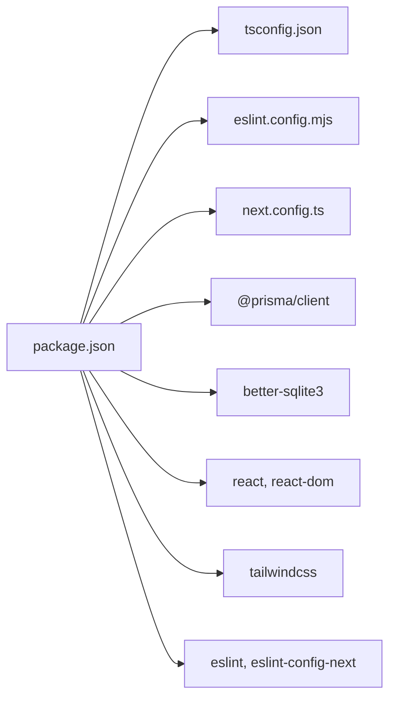

# Development Guidelines

<cite>
**Referenced Files in This Document**
- [package.json](file://package.json)
- [tsconfig.json](file://tsconfig.json)
- [eslint.config.mjs](file://eslint.config.mjs)
- [next.config.ts](file://next.config.ts)
- [README.md](file://README.md)
- [GUIDE_COMPLET.md](file://GUIDE_COMPLET.md)
- [GUIDE_MODIFICATIONS.md](file://GUIDE_MODIFICATIONS.md)
- [src/app/layout.tsx](file://src/app/layout.tsx)
- [src/app/page.tsx](file://src/app/page.tsx)
- [src/components/content.ts](file://src/components/content.ts)
- [src/context/LanguageContext.tsx](file://src/context/LanguageContext.tsx)
- [src/lib/prisma.ts](file://src/lib/prisma.ts)
- [prisma/schema.prisma](file://prisma/schema.prisma)
- [src/components/Reservation/ReservationWizard.tsx](file://src/components/Reservation/ReservationWizard.tsx)
- [src/components/Reservation/validateReservation.ts](file://src/components/Reservation/validateReservation.ts)
- [src/app/api/admin/login/route.ts](file://src/app/api/admin/login/route.ts)
</cite>

## Table of Contents
1. [Introduction](#introduction)
2. [Project Structure](#project-structure)
3. [Core Components](#core-components)
4. [Architecture Overview](#architecture-overview)
5. [Detailed Component Analysis](#detailed-component-analysis)
6. [Dependency Analysis](#dependency-analysis)
7. [Performance Considerations](#performance-considerations)
8. [Troubleshooting Guide](#troubleshooting-guide)
9. [Conclusion](#conclusion)
10. [Appendices](#appendices)

## Introduction
This document defines comprehensive development guidelines and contribution practices for the Archangel Hotel project. It consolidates code organization standards, component development patterns, architectural principles, TypeScript configuration, ESLint rules, and code quality expectations. It also outlines the development workflow (branching, pull requests, reviews), testing and QA strategies, coding conventions, naming patterns, and operational procedures for extending functionality while maintaining consistency across the codebase.

## Project Structure
The project follows a Next.js App Router structure with a clear separation of concerns:
- Application pages and layouts under src/app
- Reusable UI components under src/components
- Centralized content and configuration under src/data and src/context
- Shared libraries under src/lib
- Database schema and client generation under prisma
- Static assets under public

**Diagram sources**
- [src/app/layout.tsx:1-54](file://src/app/layout.tsx#L1-L54)
- [src/app/page.tsx:1-36](file://src/app/page.tsx#L1-L36)
- [src/components/Reservation/ReservationWizard.tsx:1-800](file://src/components/Reservation/ReservationWizard.tsx#L1-L800)
- [src/context/LanguageContext.tsx:1-555](file://src/context/LanguageContext.tsx#L1-L555)
- [src/lib/prisma.ts:1-12](file://src/lib/prisma.ts#L1-L12)
- [prisma/schema.prisma:1-75](file://prisma/schema.prisma#L1-L75)

**Section sources**
- [README.md:1-37](file://README.md#L1-L37)
- [GUIDE_COMPLET.md:7-54](file://GUIDE_COMPLET.md#L7-L54)

## Core Components
- Content catalog: centralized media and configuration in src/components/content.ts
- Internationalization: LanguageContext.tsx provides translation keys and runtime switching
- Reservation wizard: end-to-end booking flow with validation and submission
- Layout and metadata: global layout, fonts, and SEO metadata in layout.tsx
- Admin login API: simple session-based admin endpoint

Key responsibilities:
- src/components/content.ts: maintain image lists and static content
- src/context/LanguageContext.tsx: manage translations and language state
- src/components/Reservation/ReservationWizard.tsx: orchestrate multi-step booking
- src/app/layout.tsx: global theme, fonts, and metadata
- src/app/api/admin/login/route.ts: admin authentication endpoint

**Section sources**
- [src/components/content.ts:1-287](file://src/components/content.ts#L1-L287)
- [src/context/LanguageContext.tsx:1-555](file://src/context/LanguageContext.tsx#L1-L555)
- [src/components/Reservation/ReservationWizard.tsx:1-800](file://src/components/Reservation/ReservationWizard.tsx#L1-L800)
- [src/app/layout.tsx:1-54](file://src/app/layout.tsx#L1-L54)
- [src/app/api/admin/login/route.ts:1-29](file://src/app/api/admin/login/route.ts#L1-L29)

## Architecture Overview
High-level architecture integrates UI components, content catalogs, i18n, and backend APIs:
- Frontend: Next.js App Router pages and components
- Data: centralized content arrays and objects
- Localization: context provider with translation dictionary
- Persistence: Prisma client configured for PostgreSQL
- Admin: simple login API with session cookie

**Diagram sources**
- [src/components/Reservation/ReservationWizard.tsx:1-800](file://src/components/Reservation/ReservationWizard.tsx#L1-L800)
- [src/context/LanguageContext.tsx:1-555](file://src/context/LanguageContext.tsx#L1-L555)
- [src/app/api/admin/login/route.ts:1-29](file://src/app/api/admin/login/route.ts#L1-L29)
- [src/lib/prisma.ts:1-12](file://src/lib/prisma.ts#L1-L12)
- [prisma/schema.prisma:1-75](file://prisma/schema.prisma#L1-L75)

## Detailed Component Analysis

### Reservation Wizard
The reservation wizard is a multi-step form with validation per step and submission to a backend API. It uses:
- Translation keys for all user-facing strings
- Local state for step progression and form data
- Validation helpers for each step
- Submission to /api/reservation with language context

**Diagram sources**
- [src/components/Reservation/ReservationWizard.tsx:152-201](file://src/components/Reservation/ReservationWizard.tsx#L152-L201)
- [src/components/Reservation/validateReservation.ts:1-59](file://src/components/Reservation/validateReservation.ts#L1-L59)

**Section sources**
- [src/components/Reservation/ReservationWizard.tsx:1-800](file://src/components/Reservation/ReservationWizard.tsx#L1-L800)
- [src/components/Reservation/validateReservation.ts:1-59](file://src/components/Reservation/validateReservation.ts#L1-L59)

### Admin Authentication Flow
The admin login endpoint validates a password and sets a session cookie.

**Diagram sources**
- [src/app/api/admin/login/route.ts:1-29](file://src/app/api/admin/login/route.ts#L1-L29)

**Section sources**
- [src/app/api/admin/login/route.ts:1-29](file://src/app/api/admin/login/route.ts#L1-L29)

### Content Catalog and Media Management
The content catalog centralizes media and configuration for sections like Hero, Gallery, Rooms, Services, Events, and Payment methods. It supports local image paths and structured data for UI components.

**Diagram sources**
- [src/components/content.ts:18-287](file://src/components/content.ts#L18-L287)

**Section sources**
- [src/components/content.ts:1-287](file://src/components/content.ts#L1-L287)

### Internationalization Context
The LanguageContext provides a translation function and language state, enabling dynamic content in French and English.

**Diagram sources**
- [src/context/LanguageContext.tsx:13-555](file://src/context/LanguageContext.tsx#L13-L555)

**Section sources**
- [src/context/LanguageContext.tsx:1-555](file://src/context/LanguageContext.tsx#L1-L555)

## Dependency Analysis
External dependencies and tooling:
- Next.js 16.2.3 with App Router
- Prisma client and PostgreSQL adapter
- React 19 and React DOM
- Tailwind CSS 4 and PostCSS
- TypeScript 5
- ESLint 9 with Next.js recommended configs

**Diagram sources**
- [package.json:1-37](file://package.json#L1-L37)
- [tsconfig.json:1-35](file://tsconfig.json#L1-L35)
- [eslint.config.mjs:1-19](file://eslint.config.mjs#L1-L19)
- [next.config.ts:1-17](file://next.config.ts#L1-L17)

**Section sources**
- [package.json:1-37](file://package.json#L1-L37)
- [tsconfig.json:1-35](file://tsconfig.json#L1-L35)
- [eslint.config.mjs:1-19](file://eslint.config.mjs#L1-L19)
- [next.config.ts:1-17](file://next.config.ts#L1-L17)

## Performance Considerations
- Optimize images: use appropriate formats (JPG/PNG/WebP), correct aspect ratios, and target sizes to reduce payload and improve rendering performance.
- Lazy loading and skeleton placeholders for galleries and carousels.
- Minimize heavy third-party libraries; keep animations lightweight.
- Use Next.js automatic optimizations (image optimization, font optimization).
- Keep translation dictionaries concise and avoid unnecessary re-renders by memoizing computed values.

[No sources needed since this section provides general guidance]

## Troubleshooting Guide
Common development issues and resolutions:
- Image not found or broken icons: verify file placement, extension, and exact filename casing in public/images.
- Distorted or stretched images: ensure correct aspect ratios (Hero 16:9, Gallery 1:1, Rooms 4:3).
- Slow page load: compress images using recommended tools and adhere to size targets.
- ESLint errors: run the linter and fix reported issues; ensure TypeScript strictness is respected.
- Prisma client initialization: ensure environment variables are set and migrations are applied before building.

**Section sources**
- [GUIDE_COMPLET.md:277-311](file://GUIDE_COMPLET.md#L277-L311)
- [eslint.config.mjs:1-19](file://eslint.config.mjs#L1-L19)
- [src/lib/prisma.ts:1-12](file://src/lib/prisma.ts#L1-L12)

## Conclusion
These guidelines establish a consistent foundation for developing, maintaining, and extending the Archangel Hotel website. By adhering to the code organization standards, component patterns, and quality practices outlined here, contributors can collaborate effectively, ensure high code quality, and deliver a robust, localized, and performant user experience.

[No sources needed since this section summarizes without analyzing specific files]

## Appendices

### A. Code Quality Standards and Tooling
- TypeScript strict mode enabled; no emit to separate JS; bundler module resolution.
- ESLint configured with Next.js core-web-vitals and TypeScript presets; overrides global ignores for generated artifacts.
- Next.js image optimization configured for trusted remote patterns.

**Section sources**
- [tsconfig.json:1-35](file://tsconfig.json#L1-L35)
- [eslint.config.mjs:1-19](file://eslint.config.mjs#L1-L19)
- [next.config.ts:1-17](file://next.config.ts#L1-L17)

### B. Development Workflow
Branching and PR procedures:
- Feature branches: develop features in dedicated branches (e.g., feature/add-payment-methods).
- Commit hygiene: atomic commits with clear messages; reference issues by number.
- Pull requests: open against main; include screenshots or demo links for UI changes; ensure CI passes.
- Code review: require at least one reviewer; address comments promptly; update PR accordingly.
- Merge: fast-forward preferred; delete feature branch after merge.

[No sources needed since this section provides general guidance]

### C. Testing Strategies and QA Procedures
Testing approaches:
- Unit tests: validate reservation validation functions and utility logic.
- Component tests: render UI components with mocked content and translations; simulate user interactions.
- Integration tests: test end-to-end flows (e.g., reservation wizard submission) with a test harness.
- Manual QA: cross-browser compatibility, responsive behavior, and accessibility checks.
- Performance QA: measure LCP, FID, CLS; optimize heavy assets and scripts.

[No sources needed since this section provides general guidance]

### D. Coding Conventions and Naming Patterns
Naming and conventions:
- File naming: PascalCase for components (e.g., Hero.tsx), kebab-case for pages (e.g., page.tsx).
- Component exports: default export for pages; named exports for reusable components.
- Paths: use path aliases (@/*) consistently for imports.
- Translation keys: dot-separated semantic keys (e.g., booking.wizard.hero_title).
- Constants: UPPER_SNAKE_CASE for static configuration values.

**Section sources**
- [tsconfig.json:21-23](file://tsconfig.json#L21-L23)
- [src/context/LanguageContext.tsx:13-555](file://src/context/LanguageContext.tsx#L13-L555)

### E. Extending Functionality and Maintaining Consistency
Guidelines for adding new features:
- Define content in src/components/content.ts or create new data modules under src/data.
- Wrap new UI in a component under src/components and integrate into src/app/page.tsx.
- Add translation keys to LanguageContext.tsx and ensure coverage for both languages.
- For backend integrations, create API routes under src/app/api and ensure proper error handling.
- Keep Prisma schema aligned with domain models; regenerate client after schema changes.

**Section sources**
- [src/components/content.ts:1-287](file://src/components/content.ts#L1-L287)
- [src/context/LanguageContext.tsx:1-555](file://src/context/LanguageContext.tsx#L1-L555)
- [prisma/schema.prisma:1-75](file://prisma/schema.prisma#L1-L75)

### F. Team Collaboration and Documentation Standards
Collaboration practices:
- Use shared documentation (GUIDE_COMPLET.md, GUIDE_MODIFICATIONS.md) for onboarding and updates.
- Maintain changelog entries for breaking changes and major features.
- Conduct pair programming for complex components; record decisions in ADRs if applicable.
- Share knowledge via short walkthroughs and inline comments in code.

**Section sources**
- [GUIDE_COMPLET.md:1-381](file://GUIDE_COMPLET.md#L1-L381)
- [GUIDE_MODIFICATIONS.md:1-176](file://GUIDE_MODIFICATIONS.md#L1-L176)

### G. Debugging and Performance Optimization
Debugging tips:
- Use React DevTools to inspect component props and state.
- Enable Prisma query logging in development to trace database activity.
- Inspect network requests and cookies for admin session and API responses.
- Validate translations by toggling language and verifying missing keys fallback.

Performance optimization:
- Audit Core Web Vitals; defer non-critical resources.
- Compress and resize images; leverage Next.js image optimization.
- Minimize re-renders by memoizing derived values and using shallow comparisons.

**Section sources**
- [src/lib/prisma.ts:1-12](file://src/lib/prisma.ts#L1-L12)
- [eslint.config.mjs:1-19](file://eslint.config.mjs#L1-L19)