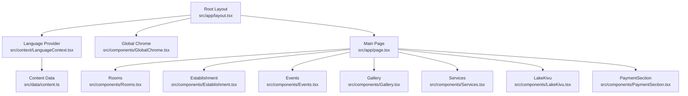
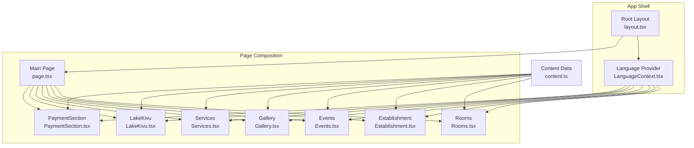
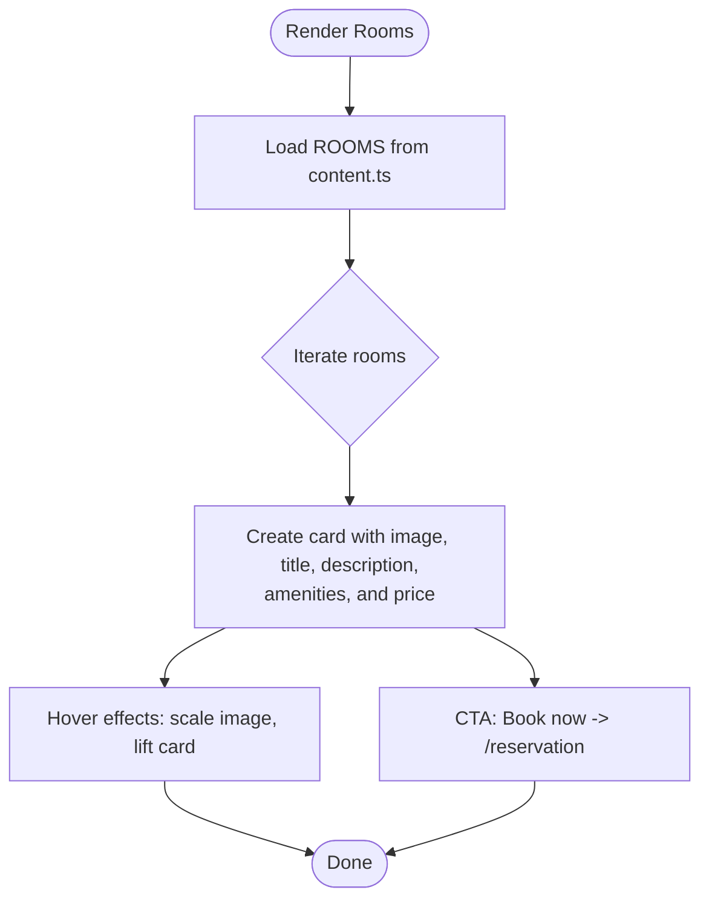
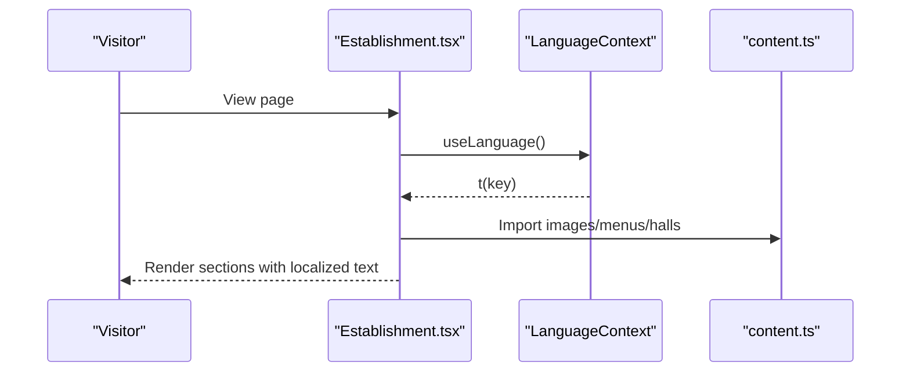
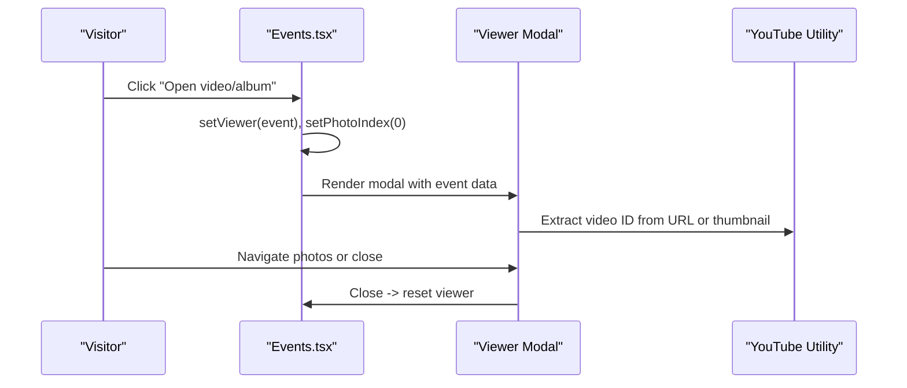
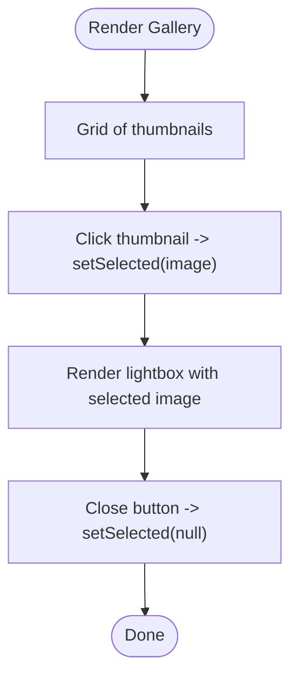
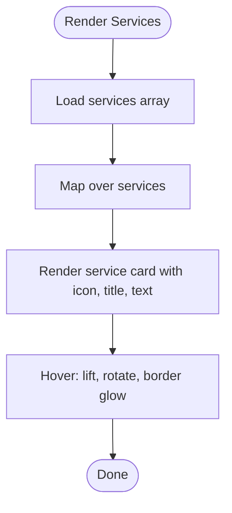
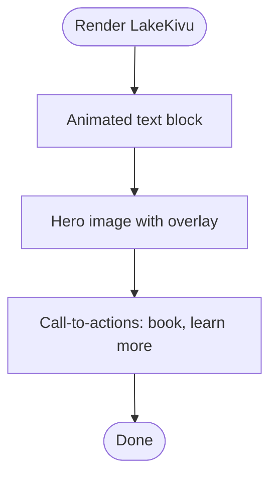
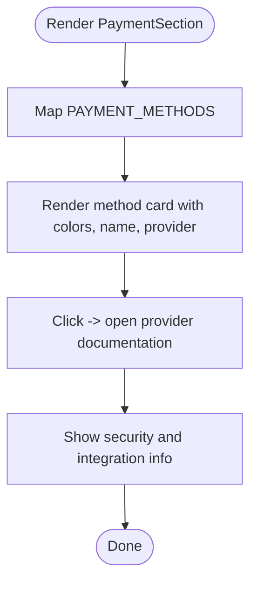
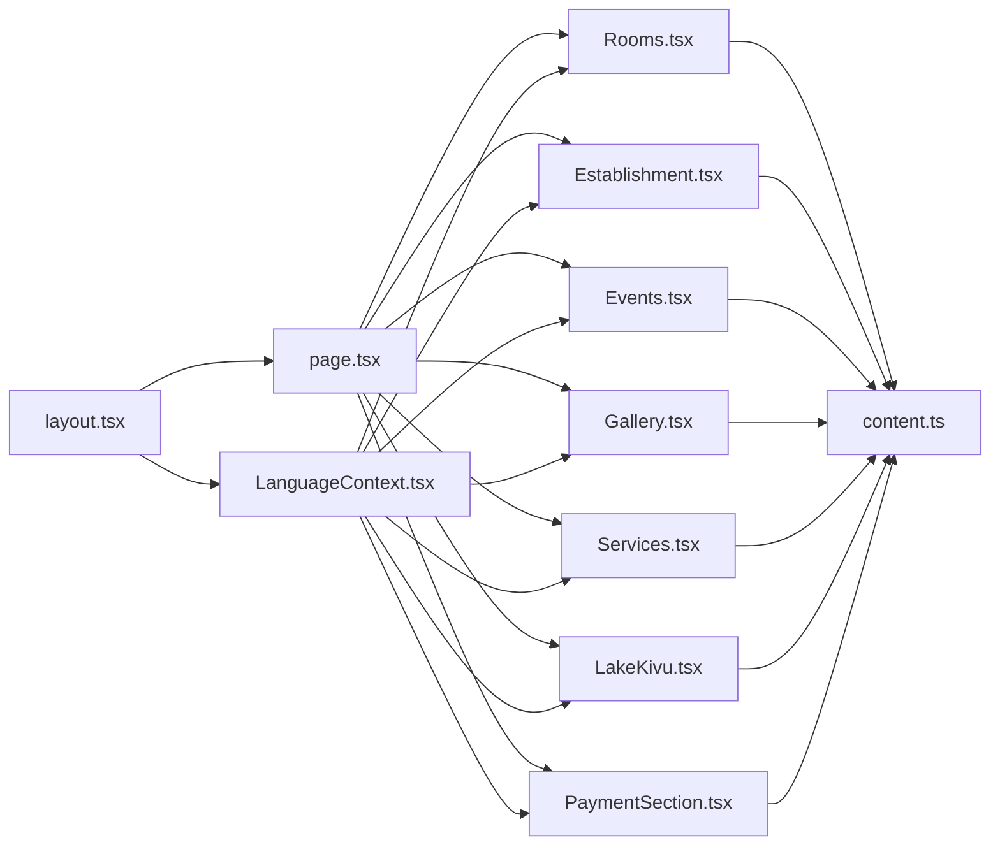

# Frontend Components

<cite>
**Referenced Files in This Document**
- [layout.tsx](file://src/app/layout.tsx)
- [LanguageContext.tsx](file://src/context/LanguageContext.tsx)
- [content.ts](file://src/data/content.ts)
- [Rooms.tsx](file://src/components/Rooms.tsx)
- [Establishment.tsx](file://src/components/Establishment.tsx)
- [Events.tsx](file://src/components/Events.tsx)
- [Gallery.tsx](file://src/components/Gallery.tsx)
- [Services.tsx](file://src/components/Services.tsx)
- [LakeKivu.tsx](file://src/components/LakeKivu.tsx)
- [PaymentSection.tsx](file://src/components/PaymentSection.tsx)
</cite>

## Table of Contents
1. [Introduction](#introduction)
2. [Project Structure](#project-structure)
3. [Core Components](#core-components)
4. [Architecture Overview](#architecture-overview)
5. [Detailed Component Analysis](#detailed-component-analysis)
6. [Dependency Analysis](#dependency-analysis)
7. [Performance Considerations](#performance-considerations)
8. [Accessibility Considerations](#accessibility-considerations)
9. [Testing Strategies](#testing-strategies)
10. [Customization and Best Practices](#customization-and-best-practices)
11. [Troubleshooting Guide](#troubleshooting-guide)
12. [Conclusion](#conclusion)

## Introduction
This document describes the frontend component library and UI architecture for the Archanges Hotel website. It focuses on the main layout components (Header, Footer, Hero) and specialized content components (Rooms, Establishment, Events, Gallery, Services, LakeKivu, PaymentSection). It explains component composition patterns, prop interfaces, reusability strategies, styling with Tailwind CSS, responsive design, animations, component interactions, state management, internationalization integration, accessibility, performance, and testing approaches.

## Project Structure
The frontend is a Next.js application with a clear separation of concerns:
- Application shell and global providers live in the app directory.
- UI components are organized under src/components.
- Internationalization is centralized in a context provider.
- Content and media assets are managed via a dedicated data module.

**Diagram sources**
- [layout.tsx:38-53](file://src/app/layout.tsx#L38-L53)
- [LanguageContext.tsx:534-555](file://src/context/LanguageContext.tsx#L534-L555)
- [content.ts:1-418](file://src/data/content.ts#L1-L418)

**Section sources**
- [layout.tsx:19-53](file://src/app/layout.tsx#L19-L53)

## Core Components
This section outlines the primary content components and their roles:
- Rooms: Displays room listings with pricing, amenities, and a reservation CTA.
- Establishment: Presents restaurant highlights, menus, reception halls, and photo space.
- Events: Manages upcoming and past events with lightbox viewers for videos and albums.
- Gallery: Renders a responsive grid of thumbnails with a modal lightbox.
- Services: Highlights hotel services with icons and hover effects.
- LakeKivu: Showcases scenic views and calls-to-action for excursions.
- PaymentSection: Lists accepted payment methods and emphasizes security.

Each component follows a consistent pattern:
- Uses Reveal for entrance animations and Framer Motion for staggered and interactive transitions.
- Integrates the i18n system via useLanguage to render localized text.
- Consumes data from content.ts for images, menus, events, and payment methods.

**Section sources**
- [Rooms.tsx:12-86](file://src/components/Rooms.tsx#L12-L86)
- [Establishment.tsx:35-331](file://src/components/Establishment.tsx#L35-L331)
- [Events.tsx:24-300](file://src/components/Events.tsx#L24-L300)
- [Gallery.tsx:10-80](file://src/components/Gallery.tsx#L10-L80)
- [Services.tsx:58-105](file://src/components/Services.tsx#L58-L105)
- [LakeKivu.tsx:13-93](file://src/components/LakeKivu.tsx#L13-L93)
- [PaymentSection.tsx:10-120](file://src/components/PaymentSection.tsx#L10-L120)

## Architecture Overview
The UI architecture centers around:
- Root layout providing global fonts, metadata, and the LanguageProvider.
- A content-driven design consuming static data from content.ts.
- Component composition with shared patterns (Reveal, Framer Motion, Tailwind utilities).
- A consistent navigation and scroll experience anchored by section IDs.

**Diagram sources**
- [layout.tsx:38-53](file://src/app/layout.tsx#L38-L53)
- [LanguageContext.tsx:534-555](file://src/context/LanguageContext.tsx#L534-L555)
- [content.ts:89-355](file://src/data/content.ts#L89-L355)

## Detailed Component Analysis

### Rooms Component
- Purpose: Present room types with pricing, descriptions, and amenities.
- Composition: Grid layout with animated cards, hover scaling, and staggered entrance.
- Data: Consumes ROOMS array from content.ts.
- Interactions: Link to reservation page; hover effects on images and buttons.
- Accessibility: Uses semantic headings and alt texts for images.

**Diagram sources**
- [Rooms.tsx:28-81](file://src/components/Rooms.tsx#L28-L81)
- [content.ts:89-114](file://src/data/content.ts#L89-L114)

**Section sources**
- [Rooms.tsx:12-86](file://src/components/Rooms.tsx#L12-L86)
- [content.ts:89-114](file://src/data/content.ts#L89-L114)

### Establishment Component
- Purpose: Showcase restaurant, menu, reception halls, and photo space.
- Composition: Multiple sections with Reveal and Motion animations; responsive grids.
- Data: Uses RESTAURANT_IMAGES, RESTAURANT_MENU, RECEPTION_HALLS, PHOTOSHOOT_IMAGES.
- Interactions: Links to reservation; dynamic tag rendering from translation keys.
- Internationalization: Translations accessed via useLanguage.

**Diagram sources**
- [Establishment.tsx:35-331](file://src/components/Establishment.tsx#L35-L331)
- [LanguageContext.tsx:534-555](file://src/context/LanguageContext.tsx#L534-L555)
- [content.ts:51-87](file://src/data/content.ts#L51-L87)

**Section sources**
- [Establishment.tsx:35-331](file://src/components/Establishment.tsx#L35-L331)
- [content.ts:51-87](file://src/data/content.ts#L51-L87)

### Events Component
- Purpose: List upcoming and past events with a modal viewer for videos and albums.
- Composition: Two lists (upcoming/past) and a modal dialog with navigation controls.
- State Management: Viewer visibility, current photo index, keyboard handling, body overflow.
- Interactions: Open/close viewer, navigate photos, embed YouTube videos.

**Diagram sources**
- [Events.tsx:24-300](file://src/components/Events.tsx#L24-L300)
- [LanguageContext.tsx:534-555](file://src/context/LanguageContext.tsx#L534-L555)

**Section sources**
- [Events.tsx:24-300](file://src/components/Events.tsx#L24-L300)

### Gallery Component
- Purpose: Display a responsive grid of thumbnails and a fullscreen lightbox.
- Composition: Grid with hover scaling and overlay; modal with close button.
- State Management: Selected image state; click-to-close behavior.

**Diagram sources**
- [Gallery.tsx:10-80](file://src/components/Gallery.tsx#L10-L80)

**Section sources**
- [Gallery.tsx:10-80](file://src/components/Gallery.tsx#L10-L80)

### Services Component
- Purpose: Highlight hotel services with icons and hover animations.
- Composition: Responsive grid with colored icon containers and subtle shadows.

**Diagram sources**
- [Services.tsx:58-105](file://src/components/Services.tsx#L58-L105)

**Section sources**
- [Services.tsx:58-105](file://src/components/Services.tsx#L58-L105)

### LakeKivu Component
- Purpose: Promote scenic views and excursion bookings.
- Composition: Split layout with animated text and hero image; gradient overlays.

**Diagram sources**
- [LakeKivu.tsx:13-93](file://src/components/LakeKivu.tsx#L13-L93)

**Section sources**
- [LakeKivu.tsx:13-93](file://src/components/LakeKivu.tsx#L13-L93)

### PaymentSection Component
- Purpose: Display accepted payment methods and emphasize security.
- Composition: Gradient cards per payment method; security and integration info blocks.

**Diagram sources**
- [PaymentSection.tsx:10-120](file://src/components/PaymentSection.tsx#L10-L120)
- [content.ts:301-355](file://src/data/content.ts#L301-L355)

**Section sources**
- [PaymentSection.tsx:10-120](file://src/components/PaymentSection.tsx#L10-L120)
- [content.ts:301-355](file://src/data/content.ts#L301-L355)

## Dependency Analysis
- Root layout injects the LanguageProvider and GlobalChrome, ensuring global i18n and chrome elements.
- All content components depend on content.ts for images and structured data.
- Components rely on Lucide icons, Next.js Image, Framer Motion, and Reveal for animations.

**Diagram sources**
- [layout.tsx:38-53](file://src/app/layout.tsx#L38-L53)
- [LanguageContext.tsx:534-555](file://src/context/LanguageContext.tsx#L534-L555)
- [content.ts:1-418](file://src/data/content.ts#L1-L418)

**Section sources**
- [layout.tsx:38-53](file://src/app/layout.tsx#L38-L53)
- [LanguageContext.tsx:534-555](file://src/context/LanguageContext.tsx#L534-L555)
- [content.ts:1-418](file://src/data/content.ts#L1-L418)

## Performance Considerations
- Lazy loading and viewport-triggered animations reduce initial load impact.
- Next.js Image with appropriate sizes and aspect ratios improves Core Web Vitals.
- Staggered animations avoid layout thrashing; viewport once prevents repeated triggers.
- Static content imports minimize runtime computation overhead.
- Modal rendering is conditional to avoid unnecessary DOM nodes.

[No sources needed since this section provides general guidance]

## Accessibility Considerations
- Semantic headings and alt texts for images.
- Focusable elements in modals (viewer, lightbox) with proper ARIA attributes.
- Keyboard navigation support for modal close and photo navigation.
- Sufficient color contrast for text and backgrounds.
- Landmark regions and skip links can be added at the shell level.

[No sources needed since this section provides general guidance]

## Testing Strategies
- Unit tests for i18n keys and fallback behavior in LanguageContext.
- Snapshot tests for component renders with mocked content data.
- Interaction tests for modal flows (Events, Gallery) using user actions.
- Accessibility tests with automated tools targeting focus order and ARIA roles.
- Visual regression tests for responsive layouts across breakpoints.

[No sources needed since this section provides general guidance]

## Customization and Best Practices
- Extend content.ts to add new rooms, events, or payment methods without changing components.
- Use consistent Tailwind utilities and spacing tokens for maintainable styles.
- Centralize brand colors and typography via theme variables.
- Keep animations subtle and performance-friendly; prefer transform and opacity.
- Add prop interfaces for reusable components to enforce type safety.

[No sources needed since this section provides general guidance]

## Troubleshooting Guide
- Missing translations: Verify keys exist in LanguageContext translations and fallback to key if missing.
- Modal not closing: Ensure event listeners are cleaned up and body overflow restored.
- Images not loading: Confirm image paths in content.ts match actual files in public/images.
- Animations not triggering: Check viewport settings and ensure elements are within the viewport.

**Section sources**
- [LanguageContext.tsx:534-555](file://src/context/LanguageContext.tsx#L534-L555)
- [Events.tsx:41-53](file://src/components/Events.tsx#L41-L53)
- [content.ts:32-48](file://src/data/content.ts#L32-L48)

## Conclusion
The component library follows a content-driven, i18n-first approach with consistent animations and responsive design. By leveraging shared patterns (Reveal, Framer Motion, Tailwind), the system achieves scalability, maintainability, and a polished user experience. Extending the library involves adding content entries and minor component adaptations, preserving cohesion and reusability.