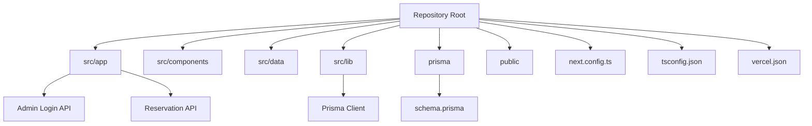
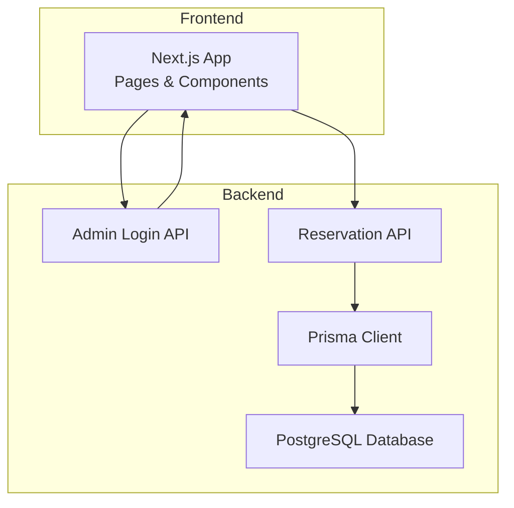
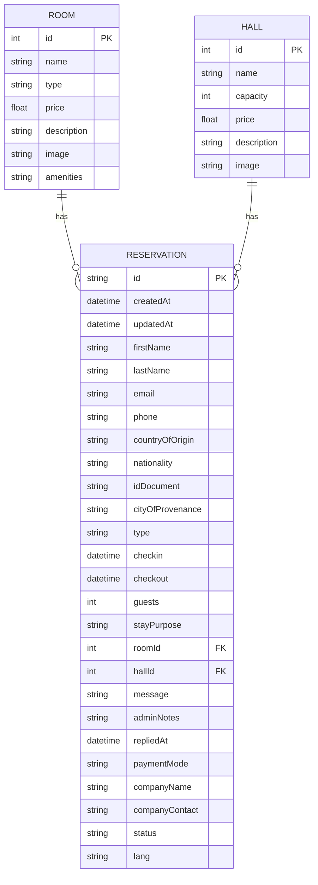
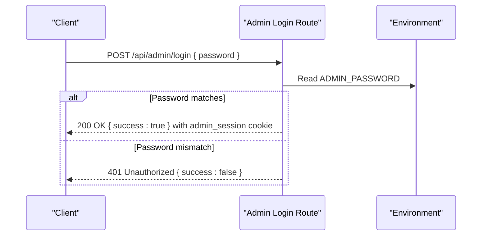
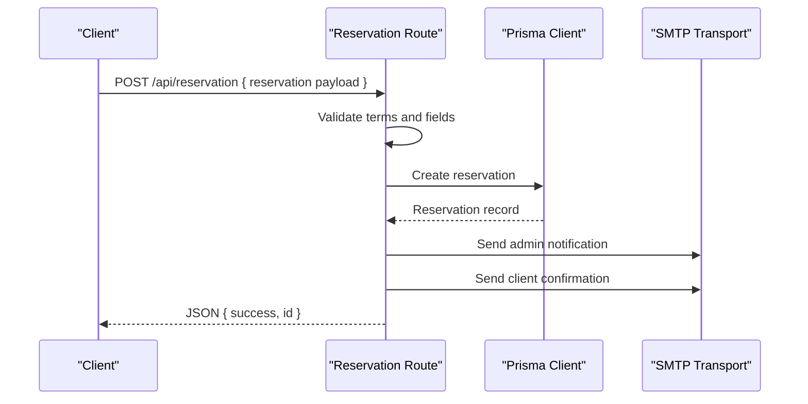
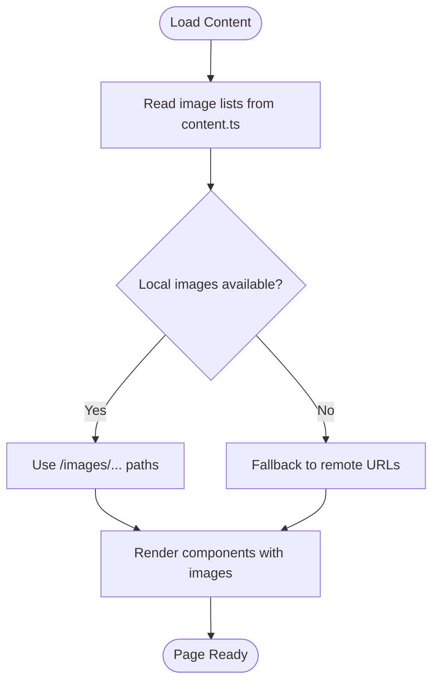
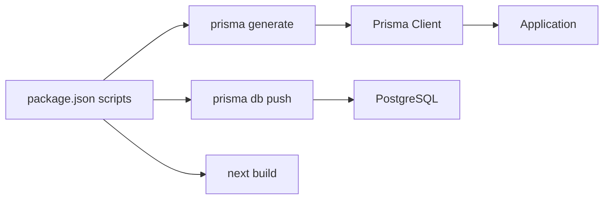

# Getting Started

<cite>
**Referenced Files in This Document**
- [README.md](file://README.md)
- [package.json](file://package.json)
- [next.config.ts](file://next.config.ts)
- [vercel.json](file://vercel.json)
- [tsconfig.json](file://tsconfig.json)
- [prisma/schema.prisma](file://prisma/schema.prisma)
- [src/lib/prisma.ts](file://src/lib/prisma.ts)
- [src/app/api/admin/login/route.ts](file://src/app/api/admin/login/route.ts)
- [src/app/api/reservation/route.ts](file://src/app/api/reservation/route.ts)
- [src/data/content.ts](file://src/data/content.ts)
- [src/app/layout.tsx](file://src/app/layout.tsx)
</cite>

## Table of Contents
1. [Introduction](#introduction)
2. [Project Structure](#project-structure)
3. [Core Components](#core-components)
4. [Architecture Overview](#architecture-overview)
5. [Detailed Component Analysis](#detailed-component-analysis)
6. [Dependency Analysis](#dependency-analysis)
7. [Performance Considerations](#performance-considerations)
8. [Troubleshooting Guide](#troubleshooting-guide)
9. [Conclusion](#conclusion)
10. [Appendices](#appendices)

## Introduction
This guide helps you set up the Archangel Hotel website locally and prepare for production deployment. It covers prerequisites, environment configuration, database setup, installation, development server startup, and verification steps. It also includes troubleshooting tips and environment configuration guidance for different deployment targets.

## Project Structure
The project is a Next.js 16 application using TypeScript, Prisma ORM, and a PostgreSQL datasource. It includes:
- Frontend pages and components under src/app and src/components
- API routes for administration and reservations
- Prisma schema and client generation
- Tailwind-based styling and Next.js configuration
- Deployment configuration for Vercel

**Diagram sources**
- [next.config.ts:1-17](file://next.config.ts#L1-L17)
- [tsconfig.json:1-35](file://tsconfig.json#L1-L35)
- [vercel.json:1-6](file://vercel.json#L1-L6)
- [prisma/schema.prisma:1-75](file://prisma/schema.prisma#L1-L75)
- [src/lib/prisma.ts:1-12](file://src/lib/prisma.ts#L1-L12)
- [src/app/api/admin/login/route.ts:1-29](file://src/app/api/admin/login/route.ts#L1-L29)
- [src/app/api/reservation/route.ts:1-255](file://src/app/api/reservation/route.ts#L1-L255)

**Section sources**
- [README.md:1-37](file://README.md#L1-L37)
- [next.config.ts:1-17](file://next.config.ts#L1-L17)
- [tsconfig.json:1-35](file://tsconfig.json#L1-L35)
- [vercel.json:1-6](file://vercel.json#L1-L6)

## Core Components
- Next.js Application: Pages, routing, and metadata configuration
- Prisma ORM: Database client and schema-driven model definitions
- API Routes: Admin authentication and reservation submission with email notifications
- Content Data: Static assets and content definitions for rooms, halls, menus, and events
- Environment Configuration: SMTP credentials, database URLs, and admin password

Key implementation references:
- Next.js scripts and build pipeline
- Prisma datasource and client initialization
- Admin login route and cookie-based session
- Reservation route with Prisma and Nodemailer integration
- Content data for images and static assets

**Section sources**
- [package.json:1-37](file://package.json#L1-L37)
- [prisma/schema.prisma:1-75](file://prisma/schema.prisma#L1-L75)
- [src/lib/prisma.ts:1-12](file://src/lib/prisma.ts#L1-L12)
- [src/app/api/admin/login/route.ts:1-29](file://src/app/api/admin/login/route.ts#L1-L29)
- [src/app/api/reservation/route.ts:1-255](file://src/app/api/reservation/route.ts#L1-L255)
- [src/data/content.ts:1-418](file://src/data/content.ts#L1-L418)

## Architecture Overview
The application follows a frontend-first architecture with serverless API routes and a database-backed reservation system. The build pipeline generates Prisma client code and pushes schema changes before building the Next.js app.

**Diagram sources**
- [src/app/api/admin/login/route.ts:1-29](file://src/app/api/admin/login/route.ts#L1-L29)
- [src/app/api/reservation/route.ts:1-255](file://src/app/api/reservation/route.ts#L1-L255)
- [src/lib/prisma.ts:1-12](file://src/lib/prisma.ts#L1-L12)
- [prisma/schema.prisma:8-11](file://prisma/schema.prisma#L8-L11)

## Detailed Component Analysis

### Prisma Setup and Schema
- Datasource: PostgreSQL configured via environment variable
- Client: Generated and imported in the application
- Models: Room, Hall, and Reservation with relations and statuses

**Diagram sources**
- [prisma/schema.prisma:13-74](file://prisma/schema.prisma#L13-L74)

**Section sources**
- [prisma/schema.prisma:1-75](file://prisma/schema.prisma#L1-L75)
- [src/lib/prisma.ts:1-12](file://src/lib/prisma.ts#L1-L12)

### Admin Authentication API
- Accepts POST with password and sets a session cookie
- Returns 401 for invalid credentials
- Cookie security depends on NODE_ENV

**Diagram sources**
- [src/app/api/admin/login/route.ts:1-29](file://src/app/api/admin/login/route.ts#L1-L29)

**Section sources**
- [src/app/api/admin/login/route.ts:1-29](file://src/app/api/admin/login/route.ts#L1-L29)

### Reservation API
- Validates terms acceptance and required fields
- Persists reservation via Prisma
- Sends admin and client emails via Nodemailer using SMTP settings
- Supports room availability checks

**Diagram sources**
- [src/app/api/reservation/route.ts:1-255](file://src/app/api/reservation/route.ts#L1-L255)
- [src/lib/prisma.ts:1-12](file://src/lib/prisma.ts#L1-L12)

**Section sources**
- [src/app/api/reservation/route.ts:1-255](file://src/app/api/reservation/route.ts#L1-L255)
- [src/lib/prisma.ts:1-12](file://src/lib/prisma.ts#L1-L12)

### Content and Assets
- Static images are served from public/images
- Content data defines lists of images and metadata
- Remote image patterns are allowed for specific hosts

**Diagram sources**
- [src/data/content.ts:1-418](file://src/data/content.ts#L1-L418)
- [next.config.ts:3-14](file://next.config.ts#L3-L14)

**Section sources**
- [src/data/content.ts:1-418](file://src/data/content.ts#L1-L418)
- [next.config.ts:1-17](file://next.config.ts#L1-L17)

## Dependency Analysis
- Build pipeline runs Prisma client generation and schema push before Next.js build
- Prisma client is initialized once and reused across the app lifecycle
- Environment variables drive database URL, SMTP settings, and admin password

**Diagram sources**
- [package.json:5-11](file://package.json#L5-L11)
- [prisma/schema.prisma:4-11](file://prisma/schema.prisma#L4-L11)

**Section sources**
- [package.json:1-37](file://package.json#L1-L37)
- [prisma/schema.prisma:1-75](file://prisma/schema.prisma#L1-L75)

## Performance Considerations
- Keep images optimized and sized appropriately to reduce load times
- Use local images in public/images for faster, offline-ready delivery
- Minimize external network dependencies for media assets
- Monitor Prisma query logs during development to identify bottlenecks

## Troubleshooting Guide
Common setup issues and resolutions:
- Database connection failures
  - Verify POSTGRES_PRISMA_URL is set and reachable
  - Ensure Prisma schema datasource matches your database provider
- SMTP errors when sending reservations
  - Confirm SMTP_HOST, SMTP_PORT, SMTP_USER, and SMTP_PASSWORD are configured
  - Test credentials with your mail provider
- Admin login fails
  - Check ADMIN_PASSWORD environment variable
  - Ensure cookies are accepted and secure flag aligns with deployment (secure only in production)
- Images not displaying
  - Confirm files exist in public/images with correct casing and extension
  - Use supported formats and recommended sizes
- Build errors
  - Run postinstall to generate Prisma client
  - Ensure Node.js and package manager versions satisfy project requirements

**Section sources**
- [src/app/api/admin/login/route.ts:6-18](file://src/app/api/admin/login/route.ts#L6-L18)
- [src/app/api/reservation/route.ts:129-137](file://src/app/api/reservation/route.ts#L129-L137)
- [prisma/schema.prisma:8-11](file://prisma/schema.prisma#L8-L11)
- [package.json:10](file://package.json#L10)

## Conclusion
You now have the essentials to install, configure, and run the Archangel Hotel website locally, integrate with a PostgreSQL database, and deploy to production. Follow the step-by-step instructions below to get started quickly and verify your setup.

## Appendices

### Prerequisites
- Node.js: The project uses Next.js 16 and modern JavaScript/TypeScript features. Use a current LTS version compatible with the project’s toolchain.
- Package Managers: npm, yarn, pnpm, or bun are supported for development and builds.
- Database: PostgreSQL is configured as the datasource provider. Ensure connectivity to your PostgreSQL instance or service.

**Section sources**
- [package.json:12-24](file://package.json#L12-L24)
- [prisma/schema.prisma:8-11](file://prisma/schema.prisma#L8-L11)

### Step-by-Step Installation
1. Clone the repository to your machine.
2. Install dependencies:
   - Use your preferred package manager to install dependencies.
3. Configure environment variables:
   - Set POSTGRES_PRISMA_URL to point to your PostgreSQL database.
   - Configure SMTP settings for email notifications.
   - Optionally set ADMIN_PASSWORD for admin login.
4. Prepare the database:
   - Run Prisma client generation and schema push to synchronize the database.
5. Start the development server:
   - Launch the Next.js dev server.
6. Initial testing:
   - Visit the homepage and test reservation submission.
   - Verify admin login and email delivery.

**Section sources**
- [README.md:5-15](file://README.md#L5-L15)
- [package.json:5-11](file://package.json#L5-L11)
- [src/app/api/admin/login/route.ts:7](file://src/app/api/admin/login/route.ts#L7)
- [src/app/api/reservation/route.ts:129-137](file://src/app/api/reservation/route.ts#L129-L137)

### Environment Configuration for Different Targets
- Local development:
  - Use a local or containerized PostgreSQL instance.
  - Keep NODE_ENV unset or set to development.
- Production (Vercel):
  - Set NODE_ENV to production.
  - Configure secure cookies and HTTPS.
  - Provide production database and SMTP credentials.

**Section sources**
- [src/app/api/admin/login/route.ts:15](file://src/app/api/admin/login/route.ts#L15)
- [vercel.json:1-6](file://vercel.json#L1-6)

### Verification Steps
- Homepage loads without errors.
- Reservation form submits successfully and emails are sent.
- Admin login sets a session cookie and allows access to admin features.
- Database reflects new reservations.

**Section sources**
- [src/app/api/reservation/route.ts:245-246](file://src/app/api/reservation/route.ts#L245-L246)
- [src/app/api/admin/login/route.ts:9-21](file://src/app/api/admin/login/route.ts#L9-L21)