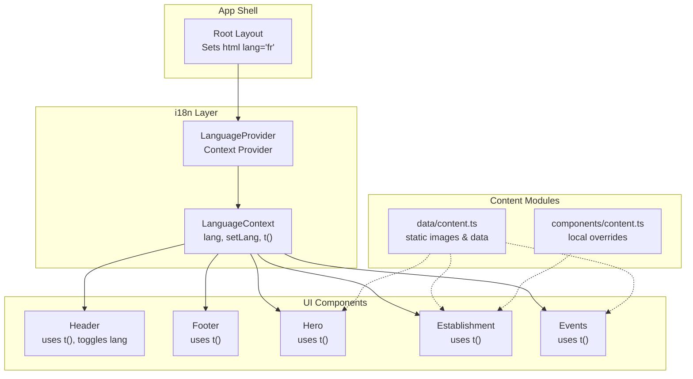
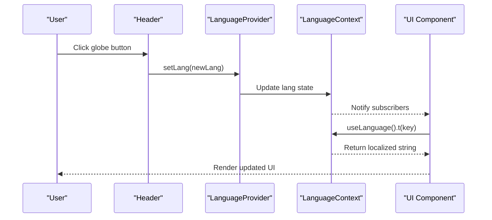
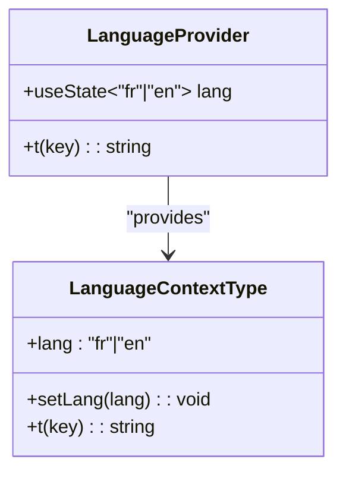
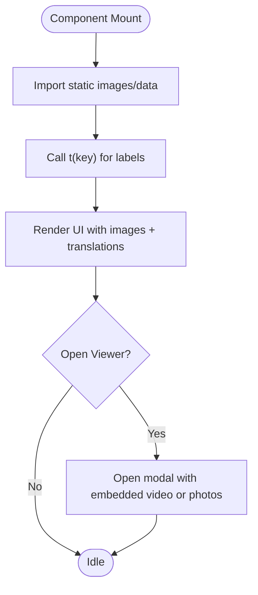
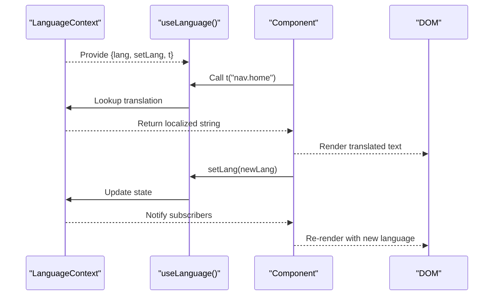
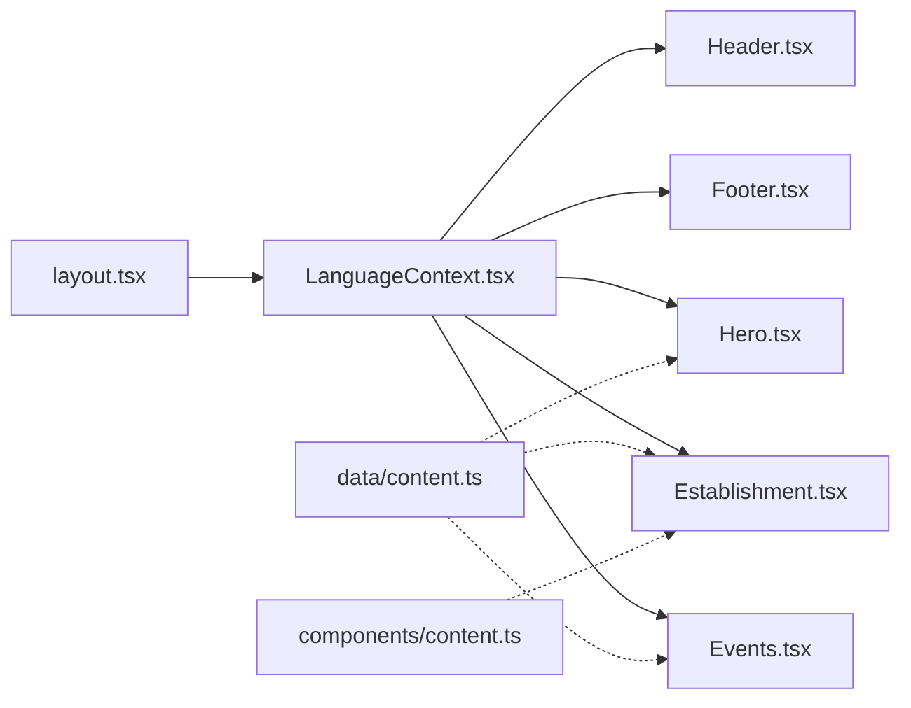

# Internationalization (i18n)

<cite>
**Referenced Files in This Document**
- [LanguageContext.tsx](file://src/context/LanguageContext.tsx)
- [layout.tsx](file://src/app/layout.tsx)
- [Header.tsx](file://src/components/Header.tsx)
- [Footer.tsx](file://src/components/Footer.tsx)
- [Hero.tsx](file://src/components/Hero.tsx)
- [Establishment.tsx](file://src/components/Establishment.tsx)
- [Events.tsx](file://src/components/Events.tsx)
- [content.ts](file://src/data/content.ts)
- [content.ts](file://src/components/content.ts)
</cite>

## Table of Contents
1. [Introduction](#introduction)
2. [Project Structure](#project-structure)
3. [Core Components](#core-components)
4. [Architecture Overview](#architecture-overview)
5. [Detailed Component Analysis](#detailed-component-analysis)
6. [Dependency Analysis](#dependency-analysis)
7. [Performance Considerations](#performance-considerations)
8. [Troubleshooting Guide](#troubleshooting-guide)
9. [Conclusion](#conclusion)
10. [Appendices](#appendices)

## Introduction
This document explains the internationalization (i18n) system used to support multiple languages across the application. It focuses on the LanguageContext implementation, translation key management, dynamic content loading, and the end-to-end translation workflow from configuration to UI rendering. It also covers fallback strategies, language switching, content structure for French and English, and practical guidance for adding new languages, managing updates, and optimizing performance.

## Project Structure
The i18n system is centered around a React Context that exposes the current language, a setter to switch languages, and a translation function. Components consume this context to render localized text. Static content is organized in dedicated modules for images and structured data, while translation keys are stored in the LanguageContext.

**Diagram sources**
- [layout.tsx:38-52](file://src/app/layout.tsx#L38-L52)
- [LanguageContext.tsx:534-555](file://src/context/LanguageContext.tsx#L534-L555)
- [Header.tsx:20-50](file://src/components/Header.tsx#L20-L50)
- [Footer.tsx:9-12](file://src/components/Footer.tsx#L9-L12)
- [Hero.tsx:12-16](file://src/components/Hero.tsx#L12-L16)
- [Establishment.tsx:35-37](file://src/components/Establishment.tsx#L35-L37)
- [Events.tsx:24-26](file://src/components/Events.tsx#L24-L26)
- [content.ts:32-48](file://src/data/content.ts#L32-L48)
- [content.ts:19-43](file://src/components/content.ts#L19-L43)

**Section sources**
- [layout.tsx:38-52](file://src/app/layout.tsx#L38-L52)
- [LanguageContext.tsx:534-555](file://src/context/LanguageContext.tsx#L534-L555)

## Core Components
- LanguageContext: Provides the current language, a setter to change language, and a translation function t(key). It defines translation keys for navigation, hero, establishment, halls, photoshoots, events, gallery, rooms, lake, booking, staff, payment, services, and footer. It falls back to the key itself if a translation is missing.
- Root Layout: Wraps the app with LanguageProvider and sets the HTML lang attribute to French by default.
- UI Components: Header, Footer, Hero, Establishment, and Events consume useLanguage() to translate labels and content.

Key behaviors:
- Language switching: The Header component toggles between French and English when the user clicks the globe button.
- Translation lookup: The t function returns the localized string for a given key or the key itself if not found.
- Static content: Images and structured data are imported from content modules and used alongside translations.

**Section sources**
- [LanguageContext.tsx:5-11](file://src/context/LanguageContext.tsx#L5-L11)
- [LanguageContext.tsx:13-530](file://src/context/LanguageContext.tsx#L13-L530)
- [LanguageContext.tsx:534-555](file://src/context/LanguageContext.tsx#L534-L555)
- [layout.tsx:44-49](file://src/app/layout.tsx#L44-L49)
- [Header.tsx:25-137](file://src/components/Header.tsx#L25-L137)

## Architecture Overview
The i18n pipeline is straightforward: components call useLanguage() to get t(key), which resolves to a localized string from the LanguageContext’s translation map. Language switching updates the context state, causing components to re-render with the new language.

**Diagram sources**
- [Header.tsx:129-137](file://src/components/Header.tsx#L129-L137)
- [LanguageContext.tsx:534-555](file://src/context/LanguageContext.tsx#L534-L555)
- [LanguageContext.tsx:537-539](file://src/context/LanguageContext.tsx#L537-L539)

## Detailed Component Analysis

### LanguageContext Implementation
- State: Maintains the current language (fr or en).
- Translation map: A nested record keyed by language and translation keys.
- Translation function: Returns translations for the current language or falls back to the key.
- Provider: Exposes lang, setLang, and t to descendants.

**Diagram sources**
- [LanguageContext.tsx:7-11](file://src/context/LanguageContext.tsx#L7-L11)
- [LanguageContext.tsx:534-555](file://src/context/LanguageContext.tsx#L534-L555)

**Section sources**
- [LanguageContext.tsx:5-11](file://src/context/LanguageContext.tsx#L5-L11)
- [LanguageContext.tsx:13-530](file://src/context/LanguageContext.tsx#L13-L530)
- [LanguageContext.tsx:534-555](file://src/context/LanguageContext.tsx#L534-L555)

### Translation Key Management
- Keys are grouped by functional areas (navigation, hero, establishment, halls, photoshoots, events, gallery, rooms, lake, booking, staff, payment, services, footer).
- Keys are dot-separated hierarchical identifiers (e.g., nav.home, hero.tagline, booking.wizard.hero_title).
- Both French and English translations are maintained in the same translation map.

Best practices:
- Keep keys stable and hierarchical to simplify maintenance.
- Prefer short, descriptive keys that reflect UI labels or content sections.
- Avoid embedding dynamic values inside keys; pass values as parameters to t() if needed.

**Section sources**
- [LanguageContext.tsx:13-530](file://src/context/LanguageContext.tsx#L13-L530)

### Dynamic Content Loading Mechanisms
- Static assets and structured data are imported from content modules and used by components.
- Components import images and data arrays from data/content.ts or components/content.ts and render them alongside translated text.
- The Events component demonstrates dynamic behavior: it opens a modal viewer for videos or albums, using t() for labels and accessibility attributes.

**Diagram sources**
- [Hero.tsx:12-16](file://src/components/Hero.tsx#L12-L16)
- [Establishment.tsx:35-37](file://src/components/Establishment.tsx#L35-L37)
- [Events.tsx:24-26](file://src/components/Events.tsx#L24-L26)
- [content.ts:32-48](file://src/data/content.ts#L32-L48)
- [content.ts:19-43](file://src/components/content.ts#L19-L43)

**Section sources**
- [Hero.tsx:12-16](file://src/components/Hero.tsx#L12-L16)
- [Establishment.tsx:35-37](file://src/components/Establishment.tsx#L35-L37)
- [Events.tsx:24-26](file://src/components/Events.tsx#L24-L26)
- [content.ts:32-48](file://src/data/content.ts#L32-L48)
- [content.ts:19-43](file://src/components/content.ts#L19-L43)

### Translation Workflow: From Configuration to UI Rendering
- Configuration: Define translation keys and values in LanguageContext.
- Consumption: Components import useLanguage() and call t(key) to resolve localized strings.
- Rendering: UI renders labels, placeholders, and content based on the current language.
- Language Switching: A toggle in the Header switches the language, updating the context and re-rendering components.

**Diagram sources**
- [LanguageContext.tsx:534-555](file://src/context/LanguageContext.tsx#L534-L555)
- [Header.tsx:25-137](file://src/components/Header.tsx#L25-L137)
- [Header.tsx:39-50](file://src/components/Header.tsx#L39-L50)

**Section sources**
- [LanguageContext.tsx:534-555](file://src/context/LanguageContext.tsx#L534-L555)
- [Header.tsx:25-137](file://src/components/Header.tsx#L25-L137)

### Fallback Strategies
- If a translation key is missing for the current language, the t function returns the key itself. This prevents runtime errors and helps identify missing translations during testing.
- Recommendation: Add placeholder translations for new keys and remove them once localized text is available.

**Section sources**
- [LanguageContext.tsx:537-539](file://src/context/LanguageContext.tsx#L537-L539)

### Language Switching Functionality
- The Header component includes a globe button that toggles the language between French and English.
- The toggle updates the context state, which triggers re-renders across the app with the new language.

**Section sources**
- [Header.tsx:129-137](file://src/components/Header.tsx#L129-L137)
- [Header.tsx:39-50](file://src/components/Header.tsx#L39-L50)

### Content Structure for French and English Interfaces
- French translations are defined under the "fr" key in the translation map.
- English translations are defined under the "en" key in the translation map.
- Keys are identical across languages, enabling seamless switching.

Examples of keys:
- Navigation: nav.home, nav.restaurant, nav.rooms, nav.halls, nav.events, nav.gallery, nav.photo, nav.lake, nav.services, nav.contact, nav.reservation
- Hero: hero.tagline, hero.desc, hero.book, hero.explore, hero.find, hero.cta
- Establishment: establishment.title, restaurant.title, restaurant.subtitle, restaurant.tagline, restaurant.quote, restaurant.desc, restaurant.features, restaurant.book
- Halls: halls.title, halls.subtitle, halls.desc, halls.malaika, halls.malaika_subtitle, halls.malaika_desc, halls.arche, halls.arche_subtitle, halls.arche_desc, halls.malaika_tags, halls.arche_tags, halls.book
- Photoshoots: photo.title, photo.subtitle, photo.desc, photo.light, photo.light_desc, photo.booking
- Events: events.title, events.upcoming, events.past, events.evangelism, events.evangelist, events.kicker, events.subtitle, events.past_section, events.past_hint, events.open_video, events.open_album, events.badge_video, events.badge_album, events.close, events.prev, events.next, events.external_note, events.open_youtube_tab
- Gallery: gallery.title, gallery.subtitle, gallery.close
- Rooms: rooms.title, rooms.subtitle, rooms.standard, rooms.standard_desc, rooms.deluxe, rooms.deluxe_desc, rooms.vip, rooms.vip_desc, rooms.price, rooms.amenities, rooms.book
- Lake Kivu: lake.title, lake.subtitle, lake.desc, lake.activities, lake.book_excursion, lake.learn_more
- Booking: booking.title, booking.subtitle, booking.type, booking.fullname, booking.email, booking.phone, booking.checkin, booking.checkout, booking.guests, booking.room_type, booking.message, booking.submit, booking.success, booking.error_email, booking.error_phone, booking.error_dates, booking.error_checkout, booking.page_title, booking.page_subtitle, booking.section_identity, booking.section_stay, booking.section_payment, booking.section_billing, booking.lastname, booking.firstname, booking.country_origin, booking.nationality, booking.id_document, booking.city_origin, booking.stay_purpose, booking.payment_mode, booking.payment_private, booking.payment_company, booking.company_name, booking.company_contact, booking.accept_terms, booking.accept_terms_link, booking.error_required, booking.error_accept, booking.error_company, booking.per_night, booking.sending, booking.success_title, booking.success_body, booking.close, booking.send_error, booking.network_error, booking.res_type.room, booking.res_type.restaurant, booking.res_type.event, booking.res_type.photoshoot, booking.ph_country, booking.ph_id, booking.ph_purpose, booking.ph_company, booking.privacy_blurb, booking.dates, booking.wizard.breadcrumb_home, booking.wizard.hero_title, booking.wizard.hero_subtitle, booking.wizard.progress_label, booking.wizard.tab_stay, booking.wizard.tab_guest, booking.wizard.tab_billing, booking.wizard.tab_review, booking.wizard.stay_heading, booking.wizard.guest_heading, booking.wizard.billing_heading, booking.wizard.review_heading, booking.wizard.review_intro, booking.wizard.review_guest, booking.wizard.night_one, booking.wizard.night_other, booking.wizard.back, booking.wizard.next, booking.wizard.confirm_send, booking.wizard.summary_title, booking.wizard.summary_note_title, booking.wizard.summary_note, booking.trust_secure, booking.trust_response, booking.trust_direct, booking.promo_title, booking.promo_subtitle, booking.promo_cta, booking.promo_trust_line, booking.promo_phone_label
- Staff: staff.mail_badge, staff.mail_title, staff.mail_desc, staff.mail_open_zoho, staff.mail_write, staff.mail_note, staff.notify_title, staff.notify_body
- Payment: payment.title, payment.subtitle, payment.mpesa, payment.airtel, payment.orange, payment.visa, payment.mastercard, payment.available, payment.security, payment.security_desc
- Services: services.title, services.subtitle, services.concierge, services.concierge_desc, services.wifi, services.wifi_desc, services.security, services.security_desc, services.parking, services.parking_desc, services.relax, services.relax_desc, services.fast, services.fast_desc, services.breakfast, services.breakfast_desc, services.location, services.location_desc
- Footer: footer.brand, footer.tagline, footer.desc, footer.nav, footer.contact, footer.emails, footer.address, footer.phone, footer.website, footer.welcome, footer.reservations, footer.events_email, footer.management, footer.rights, footer.dev

**Section sources**
- [LanguageContext.tsx:13-530](file://src/context/LanguageContext.tsx#L13-L530)

### Translation Key Organization and Content Localization Patterns
- Hierarchical keys: Use dot notation to group by domain (e.g., booking.wizard.hero_title).
- Consistent naming: Match keys to UI labels and content sections for easy scanning.
- Mixed content: Some keys represent lists or comma-separated values (e.g., halls.malaika_tags) that are split and rendered dynamically.

**Section sources**
- [LanguageContext.tsx:13-530](file://src/context/LanguageContext.tsx#L13-L530)

### Examples of Implementing New Translated Content
- Add a new translation key-value pair in the appropriate language section of the translation map.
- Consume the key in a component using t("your.new.key").
- Verify the fallback behavior by temporarily removing the translation to ensure the key is displayed.

**Section sources**
- [LanguageContext.tsx:537-539](file://src/context/LanguageContext.tsx#L537-L539)

## Dependency Analysis
- Root Layout depends on LanguageProvider to wrap the app.
- Components depend on useLanguage() to access t() and lang.
- Static content modules are consumed by components to render images and structured data.

**Diagram sources**
- [layout.tsx:44-49](file://src/app/layout.tsx#L44-L49)
- [LanguageContext.tsx:534-555](file://src/context/LanguageContext.tsx#L534-L555)
- [Header.tsx:25-137](file://src/components/Header.tsx#L25-L137)
- [Footer.tsx:9-12](file://src/components/Footer.tsx#L9-L12)
- [Hero.tsx:12-16](file://src/components/Hero.tsx#L12-L16)
- [Establishment.tsx:35-37](file://src/components/Establishment.tsx#L35-L37)
- [Events.tsx:24-26](file://src/components/Events.tsx#L24-L26)
- [content.ts:32-48](file://src/data/content.ts#L32-L48)
- [content.ts:19-43](file://src/components/content.ts#L19-L43)

**Section sources**
- [layout.tsx:44-49](file://src/app/layout.tsx#L44-L49)
- [LanguageContext.tsx:534-555](file://src/context/LanguageContext.tsx#L534-L555)
- [Header.tsx:25-137](file://src/components/Header.tsx#L25-L137)
- [Footer.tsx:9-12](file://src/components/Footer.tsx#L9-L12)
- [Hero.tsx:12-16](file://src/components/Hero.tsx#L12-L16)
- [Establishment.tsx:35-37](file://src/components/Establishment.tsx#L35-L37)
- [Events.tsx:24-26](file://src/components/Events.tsx#L24-L26)
- [content.ts:32-48](file://src/data/content.ts#L32-L48)
- [content.ts:19-43](file://src/components/content.ts#L19-L43)

## Performance Considerations
- Translation lookup cost: O(1) hash map access per key; negligible overhead.
- Bundle size: All translations are included in the client bundle. For large datasets, consider:
  - Splitting keys into feature-based groups and loading only relevant keys on demand.
  - Using dynamic imports for language packs and loading them on language change.
  - Lazy-loading heavy content (images, videos) to reduce initial payload.
- Rendering: Components re-render on language change; memoize expensive computations and avoid unnecessary re-renders by keeping translation calls minimal and scoped.

[No sources needed since this section provides general guidance]

## Troubleshooting Guide
Common issues and resolutions:
- Missing translation: If a key is not found, t(key) returns the key itself. Add the missing translation or adjust the key.
- Incorrect language on initial load: Ensure the HTML lang attribute matches the default language in LanguageProvider.
- Mixed content rendering: For keys containing delimited lists (e.g., halls.malaika_tags), ensure proper splitting and trimming before rendering.
- Accessibility: Always pass translated strings to aria-labels and screen reader-friendly attributes.

**Section sources**
- [LanguageContext.tsx:537-539](file://src/context/LanguageContext.tsx#L537-L539)
- [layout.tsx:44](file://src/app/layout.tsx#L44)
- [Establishment.tsx:241-252](file://src/components/Establishment.tsx#L241-L252)

## Conclusion
The i18n system leverages a simple, efficient React Context to manage language state and provide translation lookups. By organizing keys hierarchically and maintaining consistent naming, the system supports reliable language switching and dynamic content rendering. Following the guidelines for adding new languages, managing updates, and optimizing performance ensures scalability and maintainability across the application.

[No sources needed since this section summarizes without analyzing specific files]

## Appendices

### Guidelines for Adding a New Language
- Extend the Language union and add a new language branch in the translation map.
- Populate translations for all existing keys.
- Update the language toggle logic to include the new language.
- Verify accessibility attributes and screen reader text.

**Section sources**
- [LanguageContext.tsx:5-11](file://src/context/LanguageContext.tsx#L5-L11)
- [LanguageContext.tsx:13-530](file://src/context/LanguageContext.tsx#L13-L530)
- [Header.tsx:129-137](file://src/components/Header.tsx#L129-L137)

### Managing Translation Updates
- Use a centralized spreadsheet or editor to track keys and translations.
- Version control changes to the translation map.
- Run tests to catch missing keys after bulk updates.

**Section sources**
- [LanguageContext.tsx:13-530](file://src/context/LanguageContext.tsx#L13-L530)

### Maintaining Consistency Across the Application
- Enforce a naming convention for keys (domain.section.element).
- Avoid duplicating translations; reuse keys where appropriate.
- Keep static content imports separate from translations to minimize coupling.

**Section sources**
- [LanguageContext.tsx:13-530](file://src/context/LanguageContext.tsx#L13-L530)
- [content.ts:32-48](file://src/data/content.ts#L32-L48)
- [content.ts:19-43](file://src/components/content.ts#L19-L43)