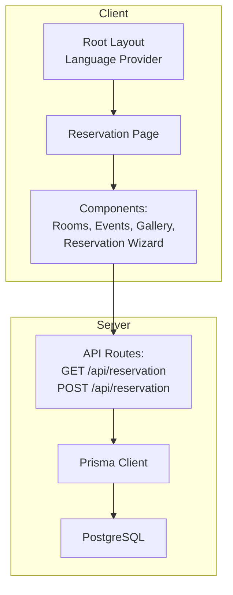
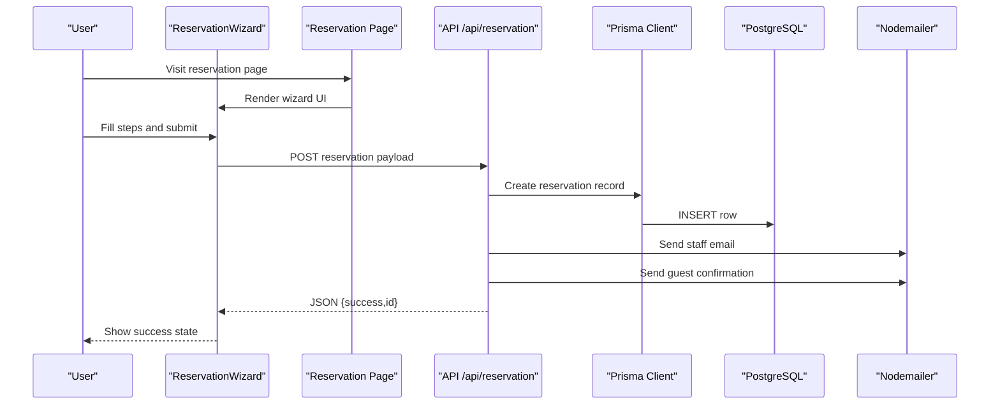
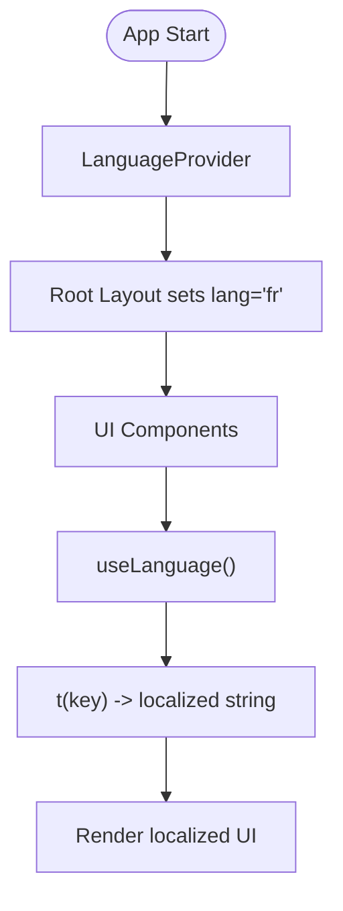
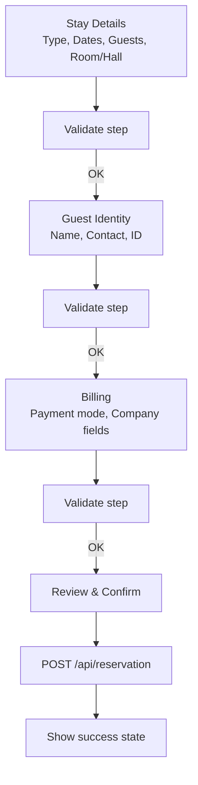
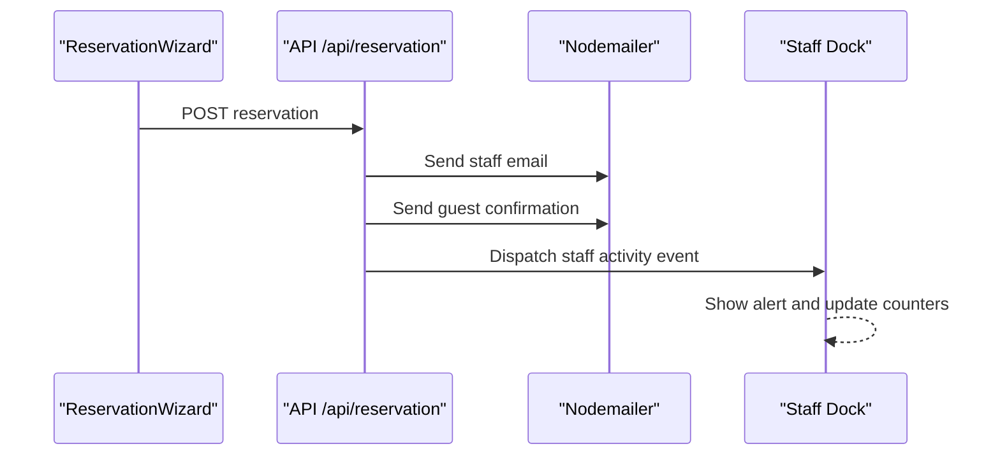
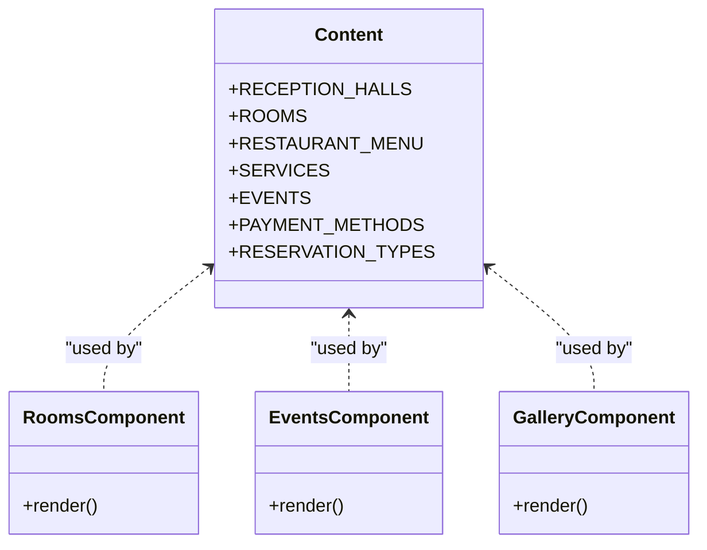
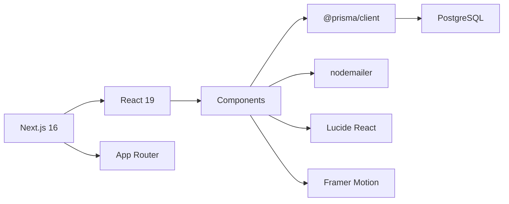

# Project Overview

<cite>
**Referenced Files in This Document**
- [README.md](file://README.md)
- [package.json](file://package.json)
- [prisma/schema.prisma](file://prisma/schema.prisma)
- [src/app/layout.tsx](file://src/app/layout.tsx)
- [src/context/LanguageContext.tsx](file://src/context/LanguageContext.tsx)
- [src/app/api/reservation/route.ts](file://src/app/api/reservation/route.ts)
- [src/components/reservation/ReservationWizard.tsx](file://src/components/reservation/ReservationWizard.tsx)
- [src/data/content.ts](file://src/data/content.ts)
- [src/lib/staff-notify.ts](file://src/lib/staff-notify.ts)
- [src/app/reservation/page.tsx](file://src/app/reservation/page.tsx)
- [src/components/Rooms.tsx](file://src/components/Rooms.tsx)
- [src/components/Events.tsx](file://src/components/Events.tsx)
- [src/components/Gallery.tsx](file://src/components/Gallery.tsx)
</cite>

## Table of Contents
1. [Introduction](#introduction)
2. [Project Structure](#project-structure)
3. [Core Components](#core-components)
4. [Architecture Overview](#architecture-overview)
5. [Detailed Component Analysis](#detailed-component-analysis)
6. [Dependency Analysis](#dependency-analysis)
7. [Performance Considerations](#performance-considerations)
8. [Troubleshooting Guide](#troubleshooting-guide)
9. [Conclusion](#conclusion)

## Introduction
Archangel Hotel is a luxury hotel management platform designed to deliver a seamless, multilingual booking experience across rooms, restaurant tables, event halls, and photography sessions. It targets discerning travelers and event organizers seeking a premium, transparent, and efficient hospitality solution. Built with modern web technologies, the platform emphasizes intuitive user flows, robust reservation management, and integrated communication channels.

Positioned as a boutique luxury property on Lake Kivu, the platform differentiates itself through:
- Unified multi-service booking under one guided experience
- Native multi-language support (French and English)
- Integrated email notifications for both guests and staff
- A forward-looking admin dashboard roadmap

## Project Structure
The project follows a Next.js 16 App Router architecture with a clear separation of concerns:
- Application shell and global providers in the root layout
- Feature-based pages and components
- API routes for backend operations (reservations, admin)
- Data and content definitions for UI assets and static content
- Internationalization via a dedicated language context

**Diagram sources**
- [src/app/layout.tsx:1-54](file://src/app/layout.tsx#L1-L54)
- [src/app/reservation/page.tsx:1-23](file://src/app/reservation/page.tsx#L1-L23)
- [src/components/reservation/ReservationWizard.tsx:1-800](file://src/components/reservation/ReservationWizard.tsx#L1-L800)
- [src/app/api/reservation/route.ts:1-255](file://src/app/api/reservation/route.ts#L1-L255)
- [prisma/schema.prisma:1-75](file://prisma/schema.prisma#L1-L75)

**Section sources**
- [README.md:1-37](file://README.md#L1-L37)
- [package.json:1-37](file://package.json#L1-L37)
- [src/app/layout.tsx:1-54](file://src/app/layout.tsx#L1-L54)

## Core Components
- Multi-service booking system: rooms, restaurant, event halls, photography
- Reservation wizard with guided steps and validation
- Multi-language support (French and English) with centralized translation keys
- Email integration for guest confirmations and staff notifications
- Admin dashboard (planned) for reservation management and visibility

Key capabilities:
- End-to-end reservation flow with real-time availability checks
- Structured customer data capture and internal notes
- Automated acknowledgment emails and staff alerts
- Extensible content model for rooms, halls, events, and media

**Section sources**
- [src/data/content.ts:70-114](file://src/data/content.ts#L70-L114)
- [src/data/content.ts:357-382](file://src/data/content.ts#L357-L382)
- [src/context/LanguageContext.tsx:1-555](file://src/context/LanguageContext.tsx#L1-L555)
- [src/app/api/reservation/route.ts:1-255](file://src/app/api/reservation/route.ts#L1-L255)

## Architecture Overview
The platform adopts a client-driven UI with serverless API routes for reservations and communications. Data persistence is handled by Prisma ORM against PostgreSQL. Internationalization is implemented via a React context that supplies translated strings across components.

**Diagram sources**
- [src/app/reservation/page.tsx:1-23](file://src/app/reservation/page.tsx#L1-L23)
- [src/components/reservation/ReservationWizard.tsx:171-201](file://src/components/reservation/ReservationWizard.tsx#L171-L201)
- [src/app/api/reservation/route.ts:59-255](file://src/app/api/reservation/route.ts#L59-L255)
- [prisma/schema.prisma:34-74](file://prisma/schema.prisma#L34-L74)

## Detailed Component Analysis

### Multi-language Support
The language system centralizes translations and exposes a simple hook for components to render localized content. The root layout sets the HTML language attribute and wraps the app with the provider.

**Diagram sources**
- [src/app/layout.tsx:44-52](file://src/app/layout.tsx#L44-L52)
- [src/context/LanguageContext.tsx:534-555](file://src/context/LanguageContext.tsx#L534-L555)

**Section sources**
- [src/context/LanguageContext.tsx:1-555](file://src/context/LanguageContext.tsx#L1-L555)
- [src/app/layout.tsx:19-36](file://src/app/layout.tsx#L19-L36)

### Reservation Wizard
The wizard guides users through four steps: stay details, guest identity, billing, and review. It validates inputs progressively, computes derived values (e.g., nights count), and posts the reservation to the API.

**Diagram sources**
- [src/components/reservation/ReservationWizard.tsx:152-201](file://src/components/reservation/ReservationWizard.tsx#L152-L201)
- [src/app/api/reservation/route.ts:59-127](file://src/app/api/reservation/route.ts#L59-L127)

**Section sources**
- [src/components/reservation/ReservationWizard.tsx:1-800](file://src/components/reservation/ReservationWizard.tsx#L1-L800)
- [src/app/reservation/page.tsx:1-23](file://src/app/reservation/page.tsx#L1-L23)

### Email Integration and Staff Notifications
On successful submission, the API route:
- Persists the reservation
- Sends a staff notification email to the reservations mailbox
- Sends a localized guest confirmation email
- Triggers a staff activity notification for the admin dock

**Diagram sources**
- [src/app/api/reservation/route.ts:197-243](file://src/app/api/reservation/route.ts#L197-L243)
- [src/lib/staff-notify.ts:1-17](file://src/lib/staff-notify.ts#L1-L17)

**Section sources**
- [src/app/api/reservation/route.ts:1-255](file://src/app/api/reservation/route.ts#L1-L255)
- [src/lib/staff-notify.ts:1-17](file://src/lib/staff-notify.ts#L1-L17)

### Content Model and UI Assets
Static content for rooms, halls, menus, services, events, and payment methods is defined centrally. This enables consistent rendering across components and easy updates.

**Diagram sources**
- [src/data/content.ts:70-114](file://src/data/content.ts#L70-L114)
- [src/data/content.ts:357-382](file://src/data/content.ts#L357-L382)
- [src/components/Rooms.tsx:1-86](file://src/components/Rooms.tsx#L1-L86)
- [src/components/Events.tsx:1-300](file://src/components/Events.tsx#L1-L300)
- [src/components/Gallery.tsx:1-80](file://src/components/Gallery.tsx#L1-L80)

**Section sources**
- [src/data/content.ts:1-418](file://src/data/content.ts#L1-L418)
- [src/components/Rooms.tsx:1-86](file://src/components/Rooms.tsx#L1-L86)
- [src/components/Events.tsx:1-300](file://src/components/Events.tsx#L1-L300)
- [src/components/Gallery.tsx:1-80](file://src/components/Gallery.tsx#L1-L80)

## Dependency Analysis
Technology stack and module relationships:
- Next.js 16 App Router for routing and SSR/SSG
- React 19 for component model and hooks
- Prisma ORM with PostgreSQL adapter for data modeling and queries
- Nodemailer for transactional emails
- Framer Motion and Lucide React for animations and UI icons

**Diagram sources**
- [package.json:12-35](file://package.json#L12-L35)
- [prisma/schema.prisma:1-11](file://prisma/schema.prisma#L1-L11)

**Section sources**
- [package.json:1-37](file://package.json#L1-L37)
- [prisma/schema.prisma:1-75](file://prisma/schema.prisma#L1-L75)

## Performance Considerations
- Client-side rendering with progressive enhancement ensures fast initial loads and smooth transitions.
- Static content arrays minimize runtime computation overhead for UI assets.
- Email transport is synchronous during submission; consider queueing for high throughput.
- Prisma client generation and schema validation occur at build time, reducing runtime overhead.

## Troubleshooting Guide
Common issues and resolutions:
- SMTP configuration errors: Verify environment variables for SMTP host, port, credentials, and sender address.
- Missing or invalid reservation data: Ensure required fields are present and validated before submission.
- Availability checks failing: Confirm room type and date range parameters passed to the availability endpoint.
- Language switching anomalies: Ensure the language provider is initialized at the root and the HTML lang attribute matches the selected language.

Operational checks:
- Reservation creation logs: Inspect API route error responses and Prisma client exceptions.
- Email delivery: Review SMTP settings and recipient addresses; test with a sandbox SMTP service.
- Staff notifications: Confirm BroadcastChannel support and event dispatch in the browser.

**Section sources**
- [src/app/api/reservation/route.ts:129-137](file://src/app/api/reservation/route.ts#L129-L137)
- [src/lib/staff-notify.ts:1-17](file://src/lib/staff-notify.ts#L1-L17)

## Conclusion
Archangel Hotel delivers a modern, multilingual, and feature-rich booking platform tailored for luxury hospitality. Its layered architecture—client-first UI, serverless API routes, and robust data modeling—provides a scalable foundation for growth. The platform’s emphasis on user experience, clear communication, and operational transparency positions it as a strong choice for boutique hotels seeking digital excellence in East Africa’s hospitality market.