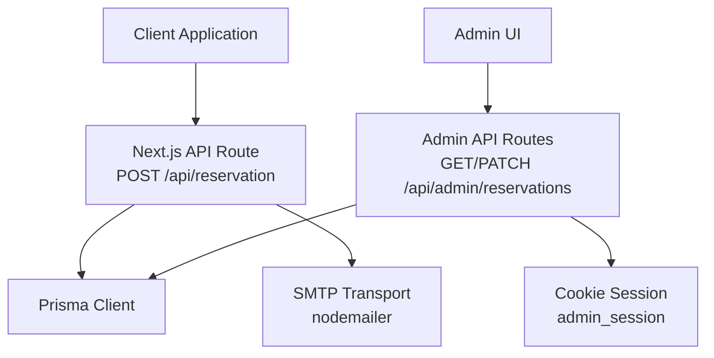
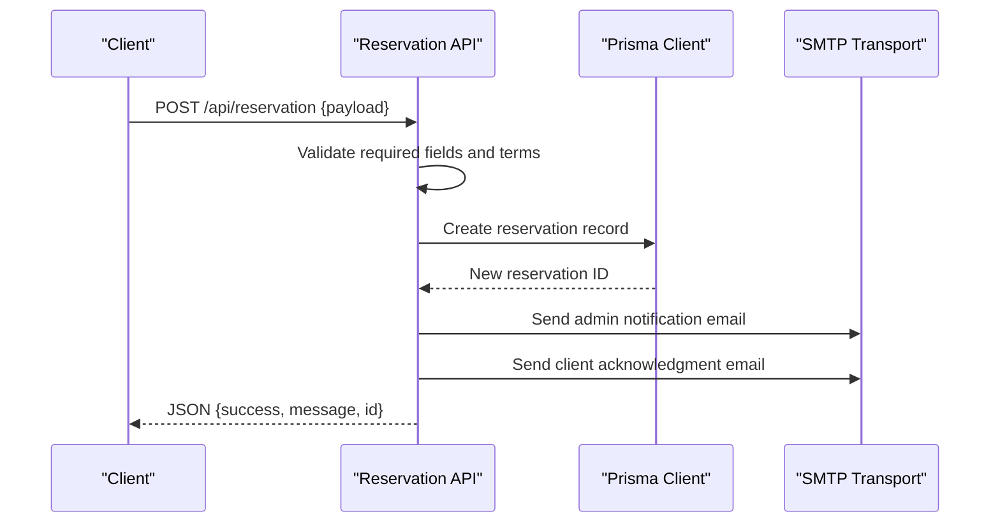
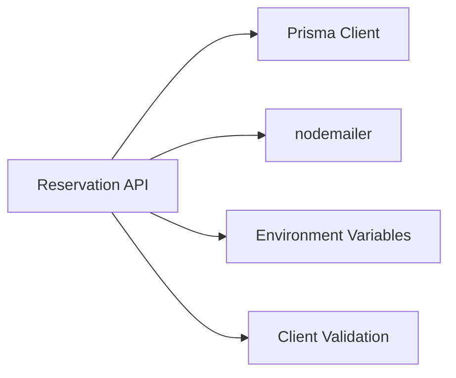

# API Endpoints and Data Handling

<cite>
**Referenced Files in This Document**
- [route.ts](file://src/app/api/reservation/route.ts)
- [validateReservation.ts](file://src/components/reservation/validateReservation.ts)
- [reservationTypes.ts](file://src/components/reservation/reservationTypes.ts)
- [schema.prisma](file://prisma/schema.prisma)
- [prisma.ts](file://src/lib/prisma.ts)
- [route.ts](file://src/app/api/admin/reservations/route.ts)
- [route.ts](file://src/app/api/admin/login/route.ts)
- [content.ts](file://src/data/content.ts)
- [page.tsx](file://src/app/reservation/page.tsx)
- [package.json](file://package.json)
- [GUIDE_COMPLET.md](file://GUIDE_COMPLET.md)
</cite>

## Table of Contents
1. [Introduction](#introduction)
2. [Project Structure](#project-structure)
3. [Core Components](#core-components)
4. [Architecture Overview](#architecture-overview)
5. [Detailed Component Analysis](#detailed-component-analysis)
6. [Dependency Analysis](#dependency-analysis)
7. [Performance Considerations](#performance-considerations)
8. [Troubleshooting Guide](#troubleshooting-guide)
9. [Conclusion](#conclusion)
10. [Appendices](#appendices)

## Introduction
This document provides API documentation for the reservation management endpoints, focusing on the POST /api/reservation endpoint used to submit new reservations. It covers request and response schemas, authentication requirements, data validation, server-side processing logic (database operations, availability checks, and email notifications), error handling strategies, security considerations, rate limiting, data sanitization, integration guidelines, and troubleshooting.

## Project Structure
The reservation API is implemented as a Next.js App Router API route. Supporting components include client-side validation utilities, TypeScript types, Prisma schema/model definitions, and admin endpoints for managing reservations.

**Diagram sources**
- [route.ts:59-253](file://src/app/api/reservation/route.ts#L59-L253)
- [prisma.ts:1-12](file://src/lib/prisma.ts#L1-L12)
- [route.ts:1-46](file://src/app/api/admin/reservations/route.ts#L1-L46)
- [route.ts:1-28](file://src/app/api/admin/login/route.ts#L1-L28)

**Section sources**
- [route.ts:1-255](file://src/app/api/reservation/route.ts#L1-L255)
- [prisma.ts:1-12](file://src/lib/prisma.ts#L1-L12)
- [route.ts:1-46](file://src/app/api/admin/reservations/route.ts#L1-L46)
- [route.ts:1-28](file://src/app/api/admin/login/route.ts#L1-L28)

## Core Components
- Reservation API route: Handles POST requests to create reservations, validates inputs, persists to the database, and sends email notifications.
- Client-side validation utilities: Provide frontend validation for stay dates, guest details, and billing terms.
- Prisma schema and model: Define the Reservation entity and related relations.
- Admin API: Provides authenticated retrieval and status updates for reservations.

Key implementation references:
- POST /api/reservation: [route.ts:59-253](file://src/app/api/reservation/route.ts#L59-L253)
- Client-side validation: [validateReservation.ts:1-59](file://src/components/reservation/validateReservation.ts#L1-L59)
- Types: [reservationTypes.ts:1-58](file://src/components/reservation/reservationTypes.ts#L1-L58)
- Prisma model: [schema.prisma:34-74](file://prisma/schema.prisma#L34-L74)
- Admin reservations: [route.ts:1-46](file://src/app/api/admin/reservations/route.ts#L1-L46)

**Section sources**
- [route.ts:59-253](file://src/app/api/reservation/route.ts#L59-L253)
- [validateReservation.ts:1-59](file://src/components/reservation/validateReservation.ts#L1-L59)
- [reservationTypes.ts:1-58](file://src/components/reservation/reservationTypes.ts#L1-L58)
- [schema.prisma:34-74](file://prisma/schema.prisma#L34-L74)
- [route.ts:1-46](file://src/app/api/admin/reservations/route.ts#L1-L46)

## Architecture Overview
The reservation submission flow integrates client-side validation, backend API processing, database persistence, and email notifications.

**Diagram sources**
- [route.ts:59-253](file://src/app/api/reservation/route.ts#L59-L253)
- [prisma.ts:1-12](file://src/lib/prisma.ts#L1-L12)

## Detailed Component Analysis

### POST /api/reservation
Purpose: Submit a new reservation request. The endpoint validates required fields, persists the reservation, and dispatches two emails: one to the admin mailbox and one to the client.

- Endpoint: POST /api/reservation
- Request body: JSON object containing reservation details, guest information, and billing data.
- Response: JSON object indicating success or failure, with optional reservation ID.

Request payload structure
- type: string. One of room, restaurant, event, photoshoot.
- firstName: string. Required.
- lastName: string. Required.
- email: string. Required; validated against a basic email regex.
- phone: string. Required; validated to contain at least 9 digits after removing non-digits.
- countryOfOrigin: string. Required.
- nationality: string. Required.
- idDocument: string. Required; minimum length enforced.
- cityOfProvenance: string. Required.
- stayPurpose: string. Required; minimum length enforced for room bookings.
- paymentMode: string. Either private or company.
- companyName: string. Required if paymentMode is company.
- companyContact: string. Required if paymentMode is company.
- checkin: string (ISO date). Required for room type.
- checkout: string (ISO date). Required for room type.
- guests: number. Required; must be finite and >= 1.
- roomType: string. Required for type room.
- hallType: string. Required for type event.
- message: string. Optional.
- acceptTerms: boolean. Required; must be true.
- lang: string. Controls client email language; defaults to French if not set.

Response format
- success: boolean. True on success.
- message: string. Human-readable message.
- id: string. Reservation identifier (Prisma cuid) when successful.

Processing logic
- Terms acceptance check: If acceptTerms is false, returns 400 with an error message.
- Required fields validation: Ensures firstName, lastName, email, phone, countryOfOrigin, nationality, idDocument, cityOfProvenance are present and minimally valid.
- Guest count validation: guests must be a finite number >= 1.
- Room booking date validation: checkin and checkout must be present and logically ordered; checkin must not be in the past.
- Persistence: Creates a reservation record with status PENDING and computed firstName/lastName fallbacks.
- Email notifications:
  - Admin email to reservations@archangeshotel.com with formatted details.
  - Client email sent in French or English depending on lang.

Error handling
- Validation errors: Returns 400 with a message indicating missing or invalid fields.
- Server errors: Catches exceptions and returns 500 with a generic message.

Security and sanitization
- HTML escaping applied to all dynamic fields included in emails to mitigate XSS risks.
- Basic input validation performed on email and phone formats.
- Environment variables used for SMTP configuration.

Availability checking
- A GET /api/reservation endpoint exists to check room availability given roomType, checkin, and checkout parameters. It queries CONFIRMED reservations overlapping the requested period and returns whether the room is available.

Integration notes
- The client-side wizard uses the same ReservationData shape and validation helpers to pre-validate inputs before submission.

Example request payload (paths only)
- Room booking: [route.ts:62-85](file://src/app/api/reservation/route.ts#L62-L85)
- Event booking: [route.ts:62-85](file://src/app/api/reservation/route.ts#L62-L85)
- Guest validation rules: [validateReservation.ts:26-40](file://src/components/reservation/validateReservation.ts#L26-L40)
- Billing validation rules: [validateReservation.ts:42-50](file://src/components/reservation/validateReservation.ts#L42-L50)

Example successful response
- [route.ts:245-245](file://src/app/api/reservation/route.ts#L245-L245)

Example failed responses
- Terms not accepted: [route.ts:87-92](file://src/app/api/reservation/route.ts#L87-L92)
- Missing required fields: [route.ts:98-100](file://src/app/api/reservation/route.ts#L98-L100)
- Server error: [route.ts:246-252](file://src/app/api/reservation/route.ts#L246-L252)

Availability check
- Endpoint: GET /api/reservation?roomType={id}&checkin={date}&checkout={date}
- Behavior: Returns { available: boolean } based on overlapping CONFIRMED reservations.

Availability check implementation
- [route.ts:28-57](file://src/app/api/reservation/route.ts#L28-L57)

**Section sources**
- [route.ts:59-253](file://src/app/api/reservation/route.ts#L59-L253)
- [validateReservation.ts:1-59](file://src/components/reservation/validateReservation.ts#L1-L59)
- [reservationTypes.ts:1-58](file://src/components/reservation/reservationTypes.ts#L1-L58)
- [route.ts:28-57](file://src/app/api/reservation/route.ts#L28-L57)

### Client-side validation and types
- Validation functions:
  - validateStepStay: Validates stay purpose, checkin/checkout for room type, and guests.
  - validateStepGuest: Validates personal details and documents.
  - validateStepBilling: Validates company billing fields and terms acceptance.
  - validateAll: Aggregates all validation errors.
- Types:
  - ReservationData: Defines the shape of the reservation form data.
  - ValidationErrors: Map of field names to error messages.

References
- [validateReservation.ts:1-59](file://src/components/reservation/validateReservation.ts#L1-L59)
- [reservationTypes.ts:1-58](file://src/components/reservation/reservationTypes.ts#L1-L58)

**Section sources**
- [validateReservation.ts:1-59](file://src/components/reservation/validateReservation.ts#L1-L59)
- [reservationTypes.ts:1-58](file://src/components/reservation/reservationTypes.ts#L1-L58)

### Database model and persistence
- Reservation model includes client info, stay info, relations to Room/Hall, communication fields, payment mode, status, and language.
- Prisma client initialization logs queries in development.

References
- [schema.prisma:34-74](file://prisma/schema.prisma#L34-L74)
- [prisma.ts:1-12](file://src/lib/prisma.ts#L1-L12)

**Section sources**
- [schema.prisma:34-74](file://prisma/schema.prisma#L34-L74)
- [prisma.ts:1-12](file://src/lib/prisma.ts#L1-L12)

### Admin reservations management
- Authentication: Requires a valid admin session cookie (admin_session).
- GET /api/admin/reservations: Returns all reservations ordered by creation date, including related room/hall.
- PATCH /api/admin/reservations: Updates reservation status.

References
- [route.ts:1-46](file://src/app/api/admin/reservations/route.ts#L1-L46)
- [route.ts:1-28](file://src/app/api/admin/login/route.ts#L1-L28)

**Section sources**
- [route.ts:1-46](file://src/app/api/admin/reservations/route.ts#L1-L46)
- [route.ts:1-28](file://src/app/api/admin/login/route.ts#L1-L28)

### Room and event catalog
- Room and reception hall catalogs are used to label roomType and hallType in emails and availability checks.

References
- [content.ts:70-114](file://src/data/content.ts#L70-L114)

**Section sources**
- [content.ts:70-114](file://src/data/content.ts#L70-L114)

## Dependency Analysis
The reservation API depends on:
- Prisma for database operations.
- nodemailer for sending emails.
- Environment variables for SMTP configuration.
- Client-side validation utilities for pre-submission checks.

**Diagram sources**
- [route.ts:1-255](file://src/app/api/reservation/route.ts#L1-L255)
- [prisma.ts:1-12](file://src/lib/prisma.ts#L1-L12)
- [validateReservation.ts:1-59](file://src/components/reservation/validateReservation.ts#L1-L59)

**Section sources**
- [route.ts:1-255](file://src/app/api/reservation/route.ts#L1-L255)
- [prisma.ts:1-12](file://src/lib/prisma.ts#L1-L12)
- [validateReservation.ts:1-59](file://src/components/reservation/validateReservation.ts#L1-L59)

## Performance Considerations
- Database query: The availability check performs a single query filtering by type, roomId, status, and overlapping date ranges. This is efficient for typical loads.
- Email dispatch: Two SMTP operations occur per reservation. Consider asynchronous processing or queueing for high throughput.
- Logging: Prisma client logs queries in development; disable or reduce logging in production to minimize overhead.

[No sources needed since this section provides general guidance]

## Troubleshooting Guide
Common issues and resolutions:
- Missing or invalid fields: Ensure acceptTerms is true and required fields (firstName, lastName, email, phone, countryOfOrigin, nationality, idDocument, cityOfProvenance) are provided. For room bookings, provide checkin, checkout, and ensure guests >= 1.
- Company billing errors: If paymentMode is company, provide companyName and companyContact.
- SMTP failures: Verify SMTP_HOST, SMTP_PORT, SMTP_USER, and SMTP_PASSWORD environment variables. Check service provider configuration and credentials.
- Availability conflicts: If a room is unavailable for requested dates, adjust dates or choose another room.
- Server errors: Inspect server logs for stack traces; the API returns a generic 500 message on exceptions.

Integration tips:
- Use client-side validation to prevent unnecessary submissions.
- Respect the lang field to send the appropriate acknowledgment email language.
- For admin operations, ensure the admin_session cookie is set after login.

**Section sources**
- [route.ts:87-100](file://src/app/api/reservation/route.ts#L87-L100)
- [route.ts:167-173](file://src/app/api/reservation/route.ts#L167-L173)
- [route.ts:1-28](file://src/app/api/admin/login/route.ts#L1-L28)
- [route.ts:1-46](file://src/app/api/admin/reservations/route.ts#L1-L46)

## Conclusion
The POST /api/reservation endpoint provides a robust mechanism for accepting reservations with client-side validation, server-side persistence, and automated email notifications. Administrators can manage reservations via authenticated admin endpoints. Proper environment configuration, input sanitization, and adherence to validation rules ensure reliable operation.

[No sources needed since this section summarizes without analyzing specific files]

## Appendices

### API Definition: POST /api/reservation
- Method: POST
- Path: /api/reservation
- Content-Type: application/json
- Authentication: None required for submission
- Request body fields:
  - type: string
  - firstName: string
  - lastName: string
  - email: string
  - phone: string
  - countryOfOrigin: string
  - nationality: string
  - idDocument: string
  - cityOfProvenance: string
  - stayPurpose: string
  - paymentMode: string
  - companyName: string
  - companyContact: string
  - checkin: string
  - checkout: string
  - guests: number
  - roomType: string
  - hallType: string
  - message: string
  - acceptTerms: boolean
  - lang: string

- Success response:
  - Status: 200
  - Body: { success: boolean, message: string, id: string }

- Error responses:
  - 400 Bad Request: Validation errors
  - 500 Internal Server Error: Server-side exceptions

**Section sources**
- [route.ts:59-253](file://src/app/api/reservation/route.ts#L59-L253)

### Availability Check: GET /api/reservation
- Method: GET
- Query parameters:
  - roomType: string
  - checkin: string
  - checkout: string
- Response: { available: boolean }

**Section sources**
- [route.ts:28-57](file://src/app/api/reservation/route.ts#L28-L57)

### Admin Access: POST /api/admin/login
- Method: POST
- Request body: { password: string }
- Response: { success: boolean } with a secure httpOnly cookie on success

**Section sources**
- [route.ts:1-28](file://src/app/api/admin/login/route.ts#L1-L28)

### Admin Management: GET/PATCH /api/admin/reservations
- GET: Returns { success: boolean, reservations: array }
- PATCH: Updates reservation status; requires admin session cookie

**Section sources**
- [route.ts:1-46](file://src/app/api/admin/reservations/route.ts#L1-L46)

### Client-side Integration
- Use the ReservationData shape and validation helpers to pre-validate inputs.
- The reservation page renders the wizard component.

**Section sources**
- [reservationTypes.ts:1-58](file://src/components/reservation/reservationTypes.ts#L1-L58)
- [page.tsx:1-23](file://src/app/reservation/page.tsx#L1-L23)

### Security and Rate Limiting
- Security:
  - HTML-escapes all dynamic content in emails.
  - Basic input validation for email and phone formats.
  - Admin endpoints require a session cookie.
- Rate limiting:
  - Not implemented in the current codebase. Consider adding rate limiting at the edge or middleware level to protect the reservation endpoint.

**Section sources**
- [route.ts:6-14](file://src/app/api/reservation/route.ts#L6-L14)
- [route.ts:13-18](file://src/app/api/admin/login/route.ts#L13-L18)
- [package.json:1-37](file://package.json#L1-L37)