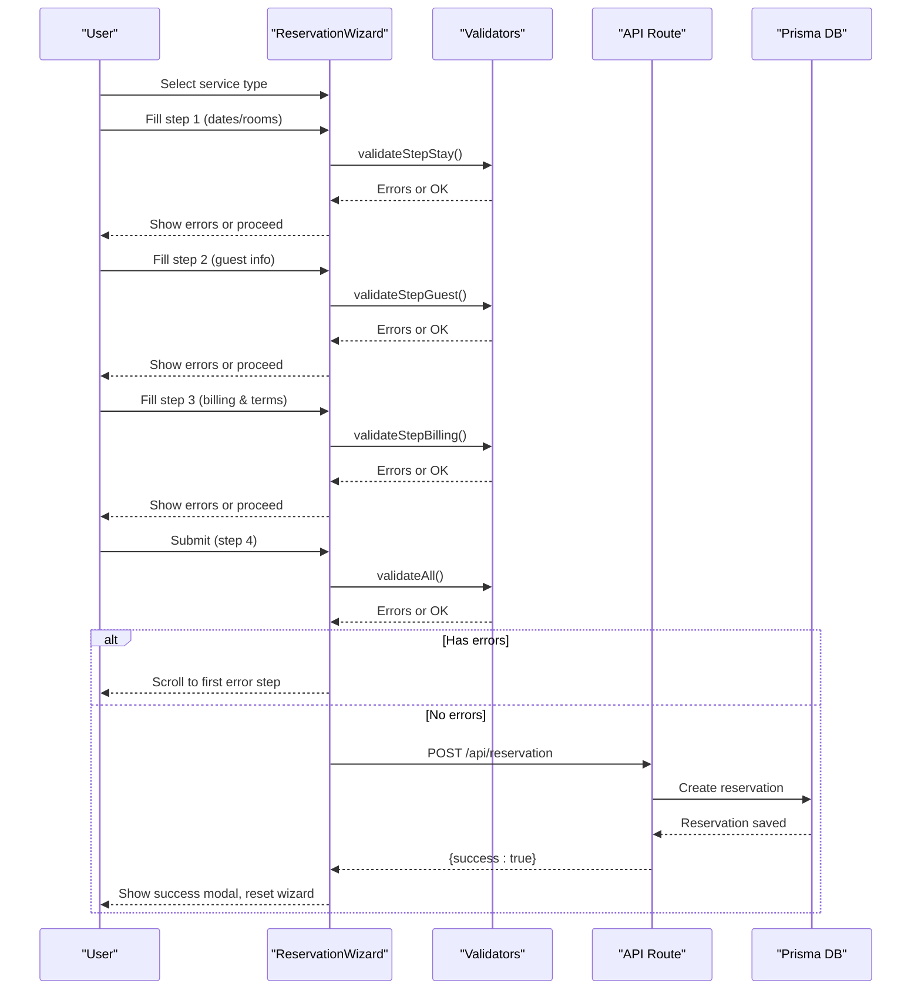
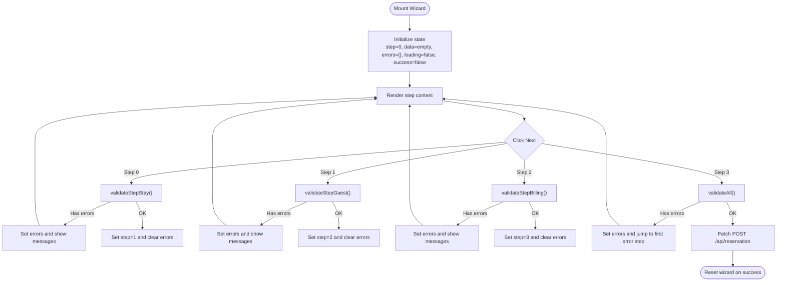
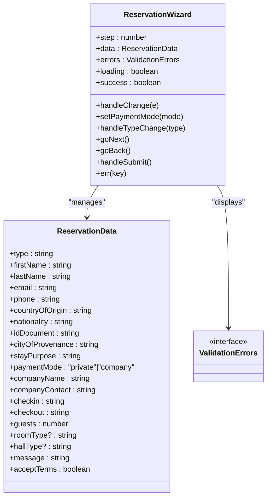
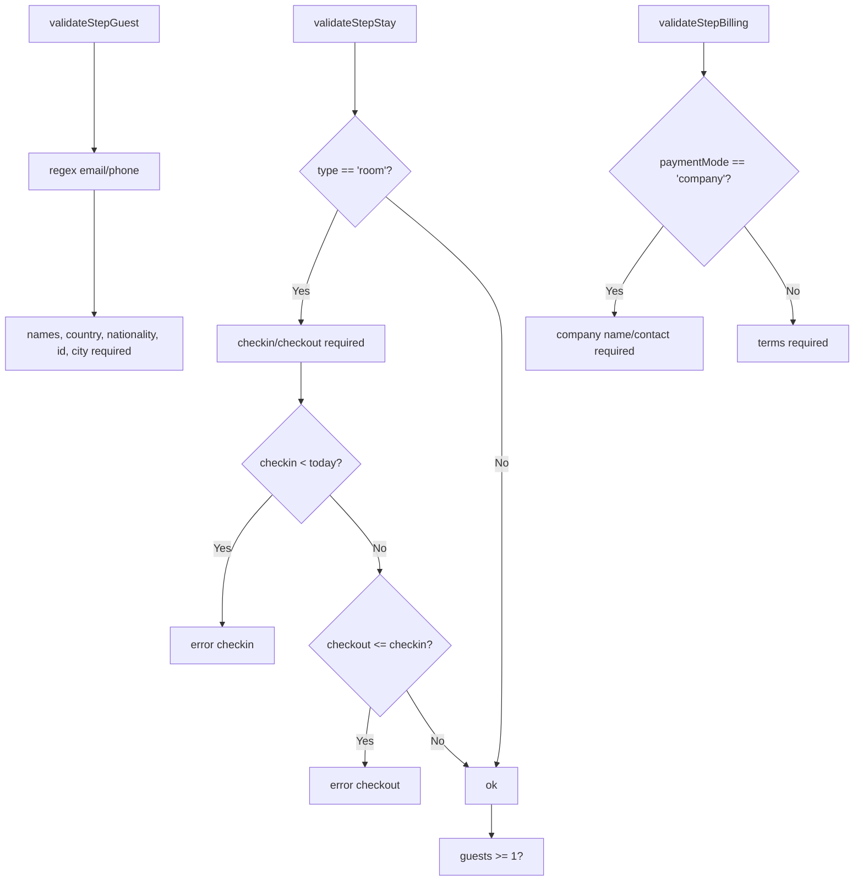
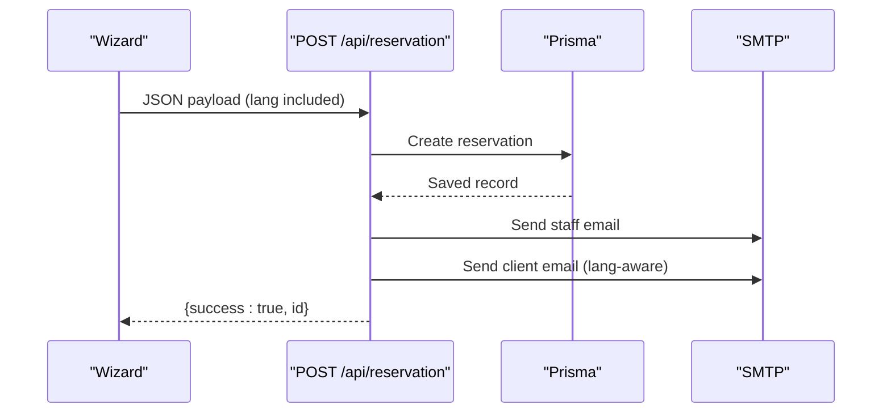
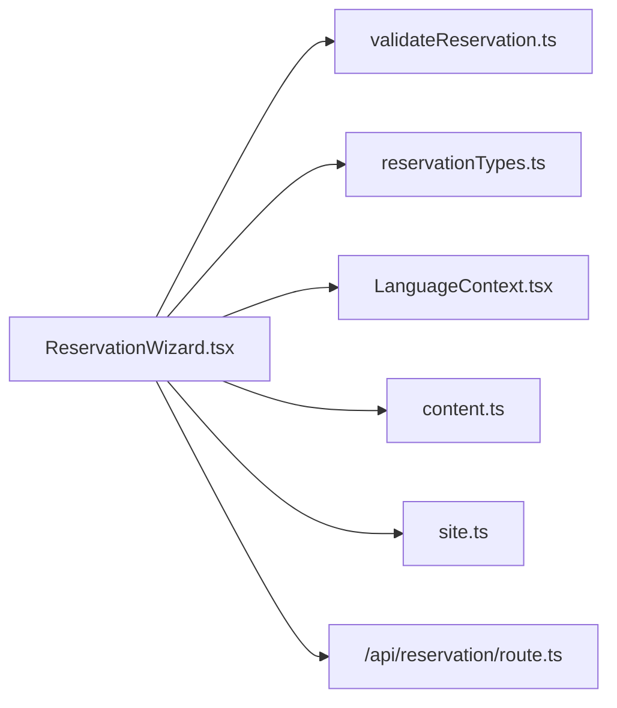

# Booking Interface and Workflow

<cite>
**Referenced Files in This Document**
- [ReservationWizard.tsx](file://src/components/reservation/ReservationWizard.tsx)
- [reservationTypes.ts](file://src/components/reservation/reservationTypes.ts)
- [validateReservation.ts](file://src/components/reservation/validateReservation.ts)
- [LanguageContext.tsx](file://src/context/LanguageContext.tsx)
- [content.ts](file://src/data/content.ts)
- [site.ts](file://src/lib/site.ts)
- [page.tsx](file://src/app/reservation/page.tsx)
- [route.ts](file://src/app/api/reservation/route.ts)
- [layout.tsx](file://src/app/layout.tsx)
- [globals.css](file://src/app/globals.css)
</cite>

## Table of Contents
1. [Introduction](#introduction)
2. [Project Structure](#project-structure)
3. [Core Components](#core-components)
4. [Architecture Overview](#architecture-overview)
5. [Detailed Component Analysis](#detailed-component-analysis)
6. [Dependency Analysis](#dependency-analysis)
7. [Performance Considerations](#performance-considerations)
8. [Troubleshooting Guide](#troubleshooting-guide)
9. [Conclusion](#conclusion)
10. [Appendices](#appendices)

## Introduction
This document explains the reservation booking interface and user workflow. It details the four-step wizard architecture (service selection, guest information, billing setup, and review confirmation), interactive UI components, state management with React hooks, responsive design, animations, accessibility, breadcrumbs and stepper, error handling, and internationalization. It also provides user interaction flows and troubleshooting guidance.

## Project Structure
The reservation experience is implemented as a client-side React component integrated into the Next.js app router. The wizard is self-contained and relies on shared data, i18n, and backend APIs.

```mermaid
graph TB
subgraph "App Layer"
L["layout.tsx"]
P["page.tsx"]
end
subgraph "Components"
W["ReservationWizard.tsx"]
VT["validateReservation.ts"]
RT["reservationTypes.ts"]
LC["LanguageContext.tsx"]
CT["content.ts"]
ST["site.ts"]
end
subgraph "API"
API["/api/reservation/route.ts"]
end
subgraph "Styling"
CSS["globals.css"]
end
L --> P
P --> W
W --> VT
W --> RT
W --> LC
W --> CT
W --> ST
W --> API
L --> CSS
```

**Diagram sources**
- [layout.tsx:1-54](file://src/app/layout.tsx#L1-L54)
- [page.tsx:1-23](file://src/app/reservation/page.tsx#L1-L23)
- [ReservationWizard.tsx:1-884](file://src/components/reservation/ReservationWizard.tsx#L1-L884)
- [validateReservation.ts:1-59](file://src/components/reservation/validateReservation.ts#L1-L59)
- [reservationTypes.ts:1-58](file://src/components/reservation/reservationTypes.ts#L1-L58)
- [LanguageContext.tsx:1-555](file://src/context/LanguageContext.tsx#L1-L555)
- [content.ts:1-418](file://src/data/content.ts#L1-L418)
- [site.ts:1-29](file://src/lib/site.ts#L1-L29)
- [route.ts:1-255](file://src/app/api/reservation/route.ts#L1-L255)
- [globals.css:1-39](file://src/app/globals.css#L1-L39)

**Section sources**
- [layout.tsx:1-54](file://src/app/layout.tsx#L1-L54)
- [page.tsx:1-23](file://src/app/reservation/page.tsx#L1-L23)
- [ReservationWizard.tsx:1-884](file://src/components/reservation/ReservationWizard.tsx#L1-L884)

## Core Components
- ReservationWizard: Multi-step wizard managing state, validation, navigation, and submission.
- Validation helpers: Step-specific validators and combined validator.
- Types and constants: Strongly typed reservation data and shared UI constants.
- Internationalization: Language context and translation keys.
- Backend API: Reservation creation endpoint with email notifications.

Key responsibilities:
- State management: Tracks current step, reservation data, validation errors, loading, and success state.
- UI orchestration: Renders step content, handles navigation, displays errors, and shows summary.
- Data integrity: Validates inputs per step and aggregates errors.
- Submission pipeline: Posts to the API, notifies staff, resets state, and shows success modal.

**Section sources**
- [ReservationWizard.tsx:62-201](file://src/components/reservation/ReservationWizard.tsx#L62-L201)
- [validateReservation.ts:5-58](file://src/components/reservation/validateReservation.ts#L5-L58)
- [reservationTypes.ts:3-51](file://src/components/reservation/reservationTypes.ts#L3-L51)
- [LanguageContext.tsx:13-555](file://src/context/LanguageContext.tsx#L13-L555)

## Architecture Overview
The wizard is a single-page experience with animated transitions between steps. It integrates with:
- Frontend: React hooks for state, Framer Motion for transitions, Lucide icons for UI.
- Backend: Next.js API route for persistence and email dispatch.
- Data: Static content for rooms, halls, and reservation types; site metadata.



**Diagram sources**
- [ReservationWizard.tsx:152-201](file://src/components/reservation/ReservationWizard.tsx#L152-L201)
- [validateReservation.ts:52-58](file://src/components/reservation/validateReservation.ts#L52-L58)
- [route.ts:59-255](file://src/app/api/reservation/route.ts#L59-L255)

## Detailed Component Analysis

### Wizard State Management and Navigation
- Steps: 0=Stay, 1=Guest, 2=Billing, 3=Review.
- State hooks:
  - step: current step index.
  - data: ReservationData with defaults.
  - errors: validation errors keyed by field.
  - loading/success: submission state.
- Navigation:
  - goNext/goBack: advance/backward with validation.
  - Stepper: clickable tabs for visited steps.
- Transitions: Framer Motion slide fade between steps.



**Diagram sources**
- [ReservationWizard.tsx:62-201](file://src/components/reservation/ReservationWizard.tsx#L62-L201)
- [validateReservation.ts:5-58](file://src/components/reservation/validateReservation.ts#L5-L58)

**Section sources**
- [ReservationWizard.tsx:62-201](file://src/components/reservation/ReservationWizard.tsx#L62-L201)
- [reservationTypes.ts:28-51](file://src/components/reservation/reservationTypes.ts#L28-L51)

### Interactive UI Components
- Date pickers: HTML input type date for check-in/check-out.
- Dropdown selectors: Room type and event hall selection.
- Form controls: Text inputs, textarea, checkboxes.
- Progress navigation: Stepper tabs with icons and badges.
- Validation indicators: Inline error messages with icon.
- Animations: Enter/exit transitions per step.
- Accessibility: Proper labels, disabled states, ARIA roles where applicable.



**Diagram sources**
- [ReservationWizard.tsx:62-201](file://src/components/reservation/ReservationWizard.tsx#L62-L201)
- [reservationTypes.ts:3-24](file://src/components/reservation/reservationTypes.ts#L3-L24)

**Section sources**
- [ReservationWizard.tsx:334-792](file://src/components/reservation/ReservationWizard.tsx#L334-L792)
- [reservationTypes.ts:53-58](file://src/components/reservation/reservationTypes.ts#L53-L58)

### Validation System
- Step 1 (Stay): Purpose required, dates required for room type, check-in not in past, checkout after check-in, guests >= 1.
- Step 2 (Guest): Names required, valid email, phone minimum length, country/nationality/id/city required.
- Step 3 (Billing): Company mode requires company name and contact; terms acceptance required.
- Combined validation aggregates all errors for final submit.



**Diagram sources**
- [validateReservation.ts:5-50](file://src/components/reservation/validateReservation.ts#L5-L50)

**Section sources**
- [validateReservation.ts:5-58](file://src/components/reservation/validateReservation.ts#L5-L58)

### Responsive Design and Animation Transitions
- Layout: Two-column layout on large screens; single column on small screens.
- Sticky summary panel: Appears next to the wizard on larger viewports.
- Animations: Framer Motion enter/exit with x and opacity transforms per step.
- Typography and spacing: Consistent sizing and padding scales across breakpoints.

**Section sources**
- [ReservationWizard.tsx:322-333](file://src/components/reservation/ReservationWizard.tsx#L322-L333)
- [ReservationWizard.tsx:324-332](file://src/components/reservation/ReservationWizard.tsx#L324-L332)
- [globals.css:1-39](file://src/app/globals.css#L1-L39)

### Accessibility Features
- Semantic labels and inputs for all form fields.
- Disabled states for back/next buttons when not applicable.
- Focus styles via Tailwind utilities.
- Success modal with overlay and close button.
- Icons with accessible labels via screen reader-friendly markup.

**Section sources**
- [ReservationWizard.tsx:771-792](file://src/components/reservation/ReservationWizard.tsx#L771-L792)
- [ReservationWizard.tsx:849-880](file://src/components/reservation/ReservationWizard.tsx#L849-L880)

### Breadcrumb Navigation and Stepper
- Breadcrumb: Home → Reservation.
- Stepper: Four labeled tabs with icons; clickable for visited steps; active/current state styling; progress bar segments.

**Section sources**
- [ReservationWizard.tsx:220-226](file://src/components/reservation/ReservationWizard.tsx#L220-L226)
- [ReservationWizard.tsx:267-318](file://src/components/reservation/ReservationWizard.tsx#L267-L318)

### Error Display Mechanisms
- Inline error messages appear below each field when invalid.
- On submit failure, the wizard scrolls to the first error step and highlights it.
- Network and server errors surfaced via alerts with localized messages.

**Section sources**
- [ReservationWizard.tsx:203-209](file://src/components/reservation/ReservationWizard.tsx#L203-L209)
- [ReservationWizard.tsx:171-177](file://src/components/reservation/ReservationWizard.tsx#L171-L177)
- [LanguageContext.tsx:13-530](file://src/context/LanguageContext.tsx#L13-L530)

### Internationalization Integration
- Language context provides t() and lang.
- All UI strings are keys resolved by t().
- Translation bundles include French and English.
- API route sends localized emails based on lang.

**Section sources**
- [LanguageContext.tsx:13-555](file://src/context/LanguageContext.tsx#L13-L555)
- [ReservationWizard.tsx:63](file://src/components/reservation/ReservationWizard.tsx#L63)
- [route.ts:205-243](file://src/app/api/reservation/route.ts#L205-L243)

### Data Sources and Content
- Room types and pricing.
- Event halls with capacities.
- Static reservation types (room, restaurant, event, photoshoot).
- Site metadata for branding and contact.

**Section sources**
- [content.ts:70-114](file://src/data/content.ts#L70-L114)
- [content.ts:357-382](file://src/data/content.ts#L357-L382)
- [site.ts:1-29](file://src/lib/site.ts#L1-L29)

### Submission Pipeline
- Client posts JSON payload to /api/reservation.
- Server validates required fields and terms.
- Persists reservation to database.
- Sends two-way emails (to staff and client) with escaped HTML.
- Returns success with reservation ID.



**Diagram sources**
- [ReservationWizard.tsx:180-188](file://src/components/reservation/ReservationWizard.tsx#L180-L188)
- [route.ts:59-255](file://src/app/api/reservation/route.ts#L59-L255)

**Section sources**
- [ReservationWizard.tsx:171-201](file://src/components/reservation/ReservationWizard.tsx#L171-L201)
- [route.ts:59-255](file://src/app/api/reservation/route.ts#L59-L255)

## Dependency Analysis
- Wizard depends on:
  - Validation helpers for each step.
  - Types for strong typing.
  - Language context for i18n.
  - Static content for room/hall lists and reservation types.
  - Site metadata for branding.
  - API route for persistence and notifications.



**Diagram sources**
- [ReservationWizard.tsx:1-32](file://src/components/reservation/ReservationWizard.tsx#L1-L32)
- [validateReservation.ts:1](file://src/components/reservation/validateReservation.ts#L1)
- [reservationTypes.ts:1](file://src/components/reservation/reservationTypes.ts#L1)
- [LanguageContext.tsx:1](file://src/context/LanguageContext.tsx#L1)
- [content.ts:1](file://src/data/content.ts#L1)
- [site.ts:1](file://src/lib/site.ts#L1)
- [route.ts:1](file://src/app/api/reservation/route.ts#L1)

**Section sources**
- [ReservationWizard.tsx:1-32](file://src/components/reservation/ReservationWizard.tsx#L1-L32)

## Performance Considerations
- Memoized computed values (e.g., nights calculation) reduce unnecessary renders.
- Conditional rendering per step minimizes DOM size.
- Client-side validation avoids extra round trips until final submit.
- Keep payload minimal; only send changed fields via controlled handlers.
- Lazy-load heavy assets; current implementation uses static images.

[No sources needed since this section provides general guidance]

## Troubleshooting Guide
Common issues and resolutions:
- Dates validation fails:
  - Ensure check-in is not in the past and check-out is after check-in.
  - Verify date picker values are valid ISO strings.
- Guest info errors:
  - Confirm email format and phone number meets minimum digit requirement.
  - Ensure all identity fields are filled and ID length is sufficient.
- Billing errors:
  - For company mode, provide both company name and contact.
  - Accept terms checkbox must be checked.
- Submission failures:
  - Check network connectivity and retry.
  - Review localized error messages for details.
- Email delivery:
  - Confirm SMTP environment variables are configured.
  - Verify client receives acknowledgment email.

**Section sources**
- [validateReservation.ts:10-49](file://src/components/reservation/validateReservation.ts#L10-L49)
- [ReservationWizard.tsx:171-198](file://src/components/reservation/ReservationWizard.tsx#L171-L198)
- [route.ts:129-243](file://src/app/api/reservation/route.ts#L129-L243)

## Conclusion
The reservation wizard provides a guided, multilingual, and accessible booking experience. Its modular design, robust validation, and seamless animations improve usability while the backend ensures reliable persistence and communication. The system is ready for extension (e.g., availability checks, payment processing) with minimal disruption.

[No sources needed since this section summarizes without analyzing specific files]

## Appendices

### User Interaction Flows
- Room booking flow:
  - Select “Room” → choose dates and room type → enter guest details → select payment mode → review and submit.
- Event booking flow:
  - Select “Event hall” → choose date and hall → enter guest details → select company/private → review and submit.
- Restaurant/photoshoot flows:
  - Similar structure with simplified fields (no dates/rooms).

[No sources needed since this section doesn't analyze specific files]