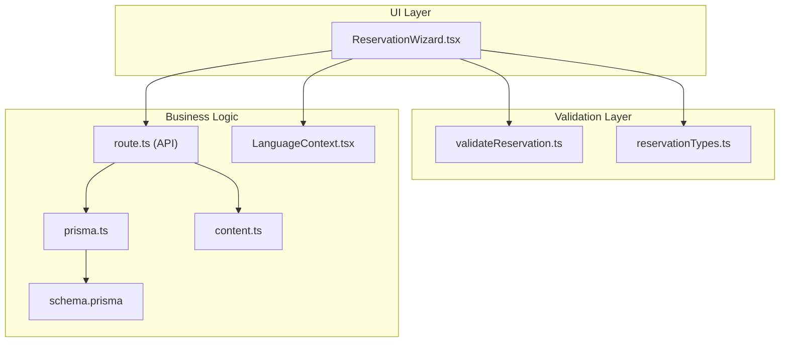
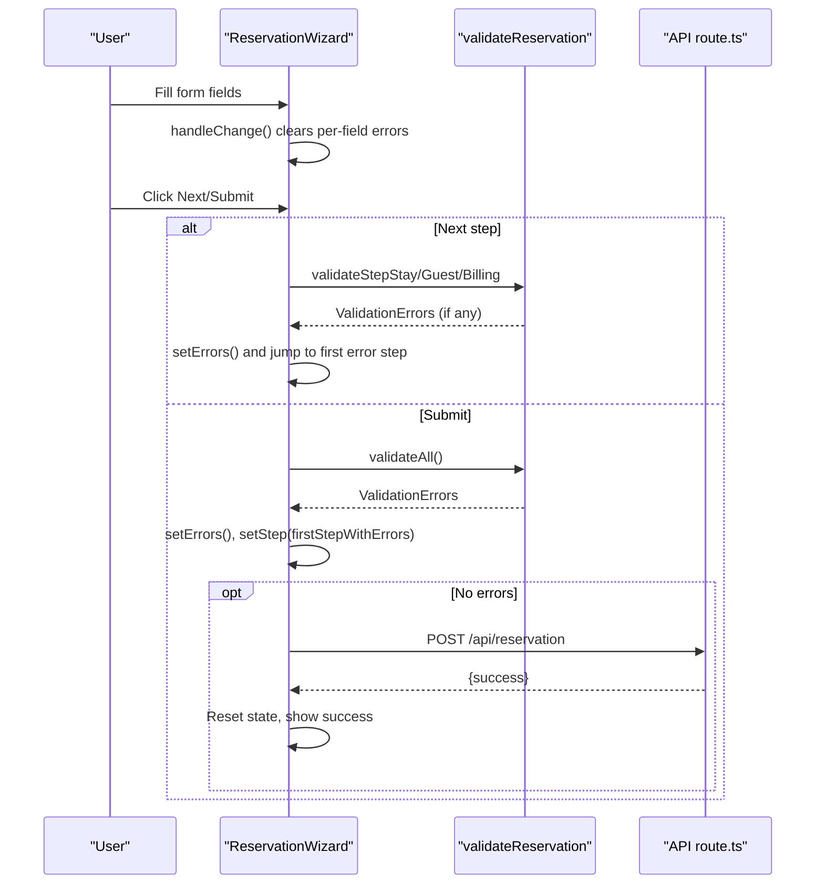
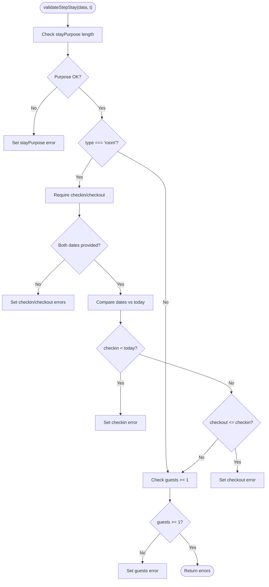
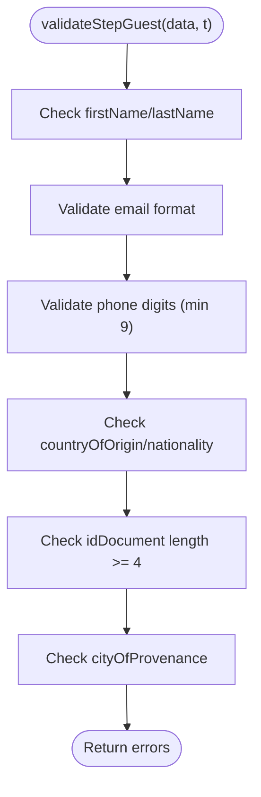
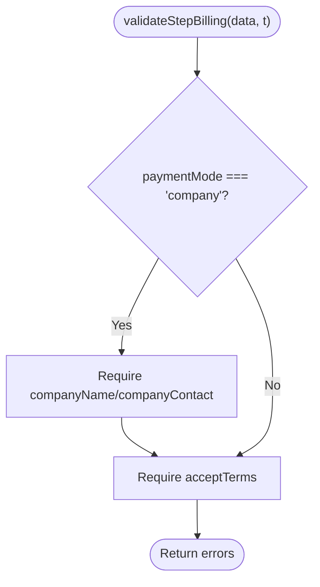
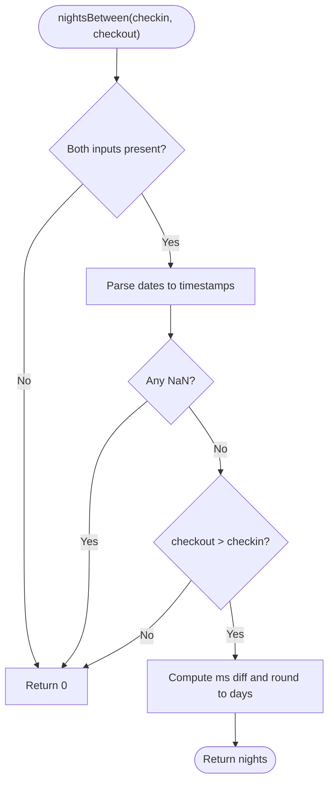
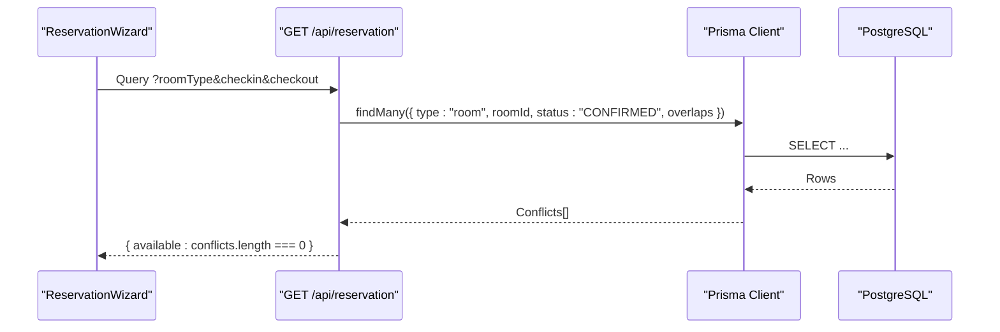
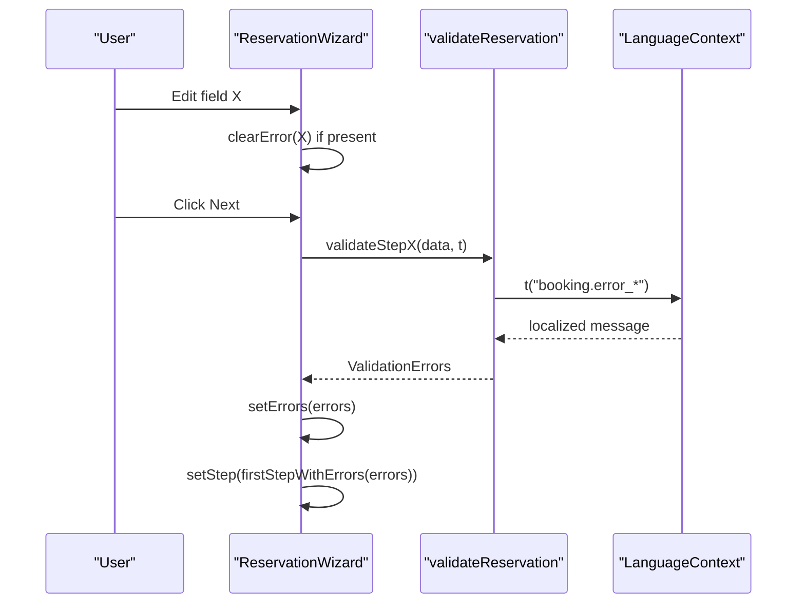
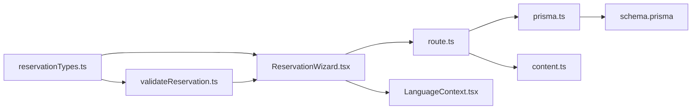

# Form Validation and Business Logic

<cite>
**Referenced Files in This Document**
- [validateReservation.ts](file://src/components/reservation/validateReservation.ts)
- [reservationTypes.ts](file://src/components/reservation/reservationTypes.ts)
- [ReservationWizard.tsx](file://src/components/reservation/ReservationWizard.tsx)
- [route.ts](file://src/app/api/reservation/route.ts)
- [content.ts](file://src/data/content.ts)
- [LanguageContext.tsx](file://src/context/LanguageContext.tsx)
- [prisma.ts](file://src/lib/prisma.ts)
- [schema.prisma](file://prisma/schema.prisma)
</cite>

## Table of Contents
1. [Introduction](#introduction)
2. [Project Structure](#project-structure)
3. [Core Components](#core-components)
4. [Architecture Overview](#architecture-overview)
5. [Detailed Component Analysis](#detailed-component-analysis)
6. [Dependency Analysis](#dependency-analysis)
7. [Performance Considerations](#performance-considerations)
8. [Troubleshooting Guide](#troubleshooting-guide)
9. [Conclusion](#conclusion)

## Introduction
This document explains the reservation validation system and business logic for the hotel booking wizard. It covers:
- Step-by-step validation functions for stay, guest, and billing steps
- The unified validation aggregator
- TypeScript interfaces and types used across the system
- Business rules for date validation, guest count, room availability, and form requirements
- Real-time validation feedback and localized error messages
- Integration between validation logic and the UI
- Examples of validation scenarios, common failures, and resolutions

## Project Structure
The validation and business logic span several modules:
- Validation functions and types live under the reservation components
- The wizard orchestrates UI, state, and validation
- The API endpoint persists reservations and performs server-side checks
- Content and localization provide room/hall definitions and error messages



**Diagram sources**
- [ReservationWizard.tsx:1-884](file://src/components/reservation/ReservationWizard.tsx#L1-L884)
- [validateReservation.ts:1-59](file://src/components/reservation/validateReservation.ts#L1-L59)
- [reservationTypes.ts:1-58](file://src/components/reservation/reservationTypes.ts#L1-L58)
- [route.ts:1-255](file://src/app/api/reservation/route.ts#L1-L255)
- [prisma.ts:1-12](file://src/lib/prisma.ts#L1-L12)
- [schema.prisma:1-75](file://prisma/schema.prisma#L1-L75)
- [content.ts:70-114](file://src/data/content.ts#L70-L114)
- [LanguageContext.tsx:1-555](file://src/context/LanguageContext.tsx#L1-L555)

**Section sources**
- [ReservationWizard.tsx:1-884](file://src/components/reservation/ReservationWizard.tsx#L1-L884)
- [validateReservation.ts:1-59](file://src/components/reservation/validateReservation.ts#L1-L59)
- [reservationTypes.ts:1-58](file://src/components/reservation/reservationTypes.ts#L1-L58)
- [route.ts:1-255](file://src/app/api/reservation/route.ts#L1-L255)
- [content.ts:70-114](file://src/data/content.ts#L70-L114)
- [LanguageContext.tsx:1-555](file://src/context/LanguageContext.tsx#L1-L555)
- [prisma.ts:1-12](file://src/lib/prisma.ts#L1-L12)
- [schema.prisma:1-75](file://prisma/schema.prisma#L1-L75)

## Core Components
- Validation functions:
  - validateStepStay: Validates stay purpose, check-in/out dates, and guest count
  - validateStepGuest: Validates identity and contact fields with regex rules
  - validateStepBilling: Validates company billing fields and terms acceptance
  - validateAll: Aggregates all validation errors
- Types and interfaces:
  - PaymentMode: "private" | "company"
  - ReservationData: shape of the reservation form state
  - ValidationErrors: record of field-level errors
- Wizard integration:
  - Real-time clearing of per-field errors on change
  - Step navigation with per-step validation
  - Final submission validation and error mapping to UI

**Section sources**
- [validateReservation.ts:1-59](file://src/components/reservation/validateReservation.ts#L1-L59)
- [reservationTypes.ts:1-58](file://src/components/reservation/reservationTypes.ts#L1-L58)
- [ReservationWizard.tsx:47-164](file://src/components/reservation/ReservationWizard.tsx#L47-L164)

## Architecture Overview
The validation pipeline integrates UI, validation functions, and backend checks.



**Diagram sources**
- [ReservationWizard.tsx:105-201](file://src/components/reservation/ReservationWizard.tsx#L105-L201)
- [validateReservation.ts:5-58](file://src/components/reservation/validateReservation.ts#L5-L58)
- [route.ts:59-253](file://src/app/api/reservation/route.ts#L59-L253)

## Detailed Component Analysis

### Validation Functions and Business Rules

#### validateStepStay
- Purpose: Enforce stay purpose length, presence of check-in/check-out for room bookings, and date logic
- Rules:
  - stayPurpose: required and minimum length enforced
  - checkin/checkout: required for type "room"
  - Dates:
    - checkin must not be in the past (today at start of day)
    - checkout must be after checkin
  - guests: must be a finite number >= 1
- Error keys: "checkin", "checkout", "stayPurpose", "guests"



**Diagram sources**
- [validateReservation.ts:5-24](file://src/components/reservation/validateReservation.ts#L5-L24)

**Section sources**
- [validateReservation.ts:5-24](file://src/components/reservation/validateReservation.ts#L5-L24)

#### validateStepGuest
- Purpose: Validate identity and contact fields
- Rules:
  - firstName/lastName: required
  - email: basic format validation
  - phone: numeric, minimum length enforced
  - countryOfOrigin/nationality: required
  - idDocument: required and minimum length enforced
  - cityOfProvenance: required
- Error keys: "firstName", "lastName", "email", "phone", "countryOfOrigin", "nationality", "idDocument", "cityOfProvenance"



**Diagram sources**
- [validateReservation.ts:26-40](file://src/components/reservation/validateReservation.ts#L26-L40)

**Section sources**
- [validateReservation.ts:26-40](file://src/components/reservation/validateReservation.ts#L26-L40)

#### validateStepBilling
- Purpose: Validate billing mode and terms acceptance
- Rules:
  - If paymentMode is "company", require companyName and companyContact
  - Terms must be accepted
- Error keys: "companyName", "companyContact", "acceptTerms"



**Diagram sources**
- [validateReservation.ts:42-50](file://src/components/reservation/validateReservation.ts#L42-L50)

**Section sources**
- [validateReservation.ts:42-50](file://src/components/reservation/validateReservation.ts#L42-L50)

#### validateAll
- Aggregates errors from all three steps
- Used on final submit to ensure completeness

**Section sources**
- [validateReservation.ts:52-58](file://src/components/reservation/validateReservation.ts#L52-L58)

### TypeScript Interfaces and Types

```mermaid
classDiagram
class PaymentMode {
<<type>>
"private"
"company"
}
class ReservationData {
+string type
+string firstName
+string lastName
+string email
+string phone
+string countryOfOrigin
+string nationality
+string idDocument
+string cityOfProvenance
+string stayPurpose
+PaymentMode paymentMode
+string companyName
+string companyContact
+string checkin
+string checkout
+number guests
+string roomType?
+string hallType?
+string message
+boolean acceptTerms
}
class ValidationErrors {
<<type>>
Record~string, string~
}
```

**Diagram sources**
- [reservationTypes.ts:1-26](file://src/components/reservation/reservationTypes.ts#L1-L26)

**Section sources**
- [reservationTypes.ts:1-26](file://src/components/reservation/reservationTypes.ts#L1-L26)

### Business Rules and Calculations

#### Night Count Calculation
- The wizard computes nights between check-in and check-out when both are present
- The computed value is used for display and review summary



**Diagram sources**
- [ReservationWizard.tsx:54-60](file://src/components/reservation/ReservationWizard.tsx#L54-L60)

**Section sources**
- [ReservationWizard.tsx:54-60](file://src/components/reservation/ReservationWizard.tsx#L54-L60)

#### Room Availability Check
- The API exposes a GET endpoint to check room availability for a given room type and date range
- It queries confirmed reservations overlapping the requested period



**Diagram sources**
- [route.ts:28-57](file://src/app/api/reservation/route.ts#L28-L57)
- [prisma.ts:1-12](file://src/lib/prisma.ts#L1-L12)
- [schema.prisma:34-74](file://prisma/schema.prisma#L34-L74)

**Section sources**
- [route.ts:28-57](file://src/app/api/reservation/route.ts#L28-L57)
- [prisma.ts:1-12](file://src/lib/prisma.ts#L1-L12)
- [schema.prisma:34-74](file://prisma/schema.prisma#L34-L74)

#### Pricing and Room/Hall Definitions
- Room and hall definitions are provided in content.ts
- The wizard displays room prices and capacities; the API labels are used for emails

**Section sources**
- [content.ts:70-114](file://src/data/content.ts#L70-L114)
- [route.ts:16-26](file://src/app/api/reservation/route.ts#L16-L26)

### UI Integration and Real-Time Feedback
- Per-field error clearing:
  - handleChange removes a field’s error when the user edits it
- Step navigation:
  - goNext runs step-specific validation; on errors, sets errors and jumps to the first step containing errors
- Final submission:
  - handleSubmit runs validateAll; if errors exist, maps them to UI and opens the first affected step
- Error rendering:
  - A helper renders localized error messages below each field when present



**Diagram sources**
- [ReservationWizard.tsx:105-164](file://src/components/reservation/ReservationWizard.tsx#L105-L164)
- [validateReservation.ts:1-59](file://src/components/reservation/validateReservation.ts#L1-L59)
- [LanguageContext.tsx:13-530](file://src/context/LanguageContext.tsx#L13-L530)

**Section sources**
- [ReservationWizard.tsx:105-164](file://src/components/reservation/ReservationWizard.tsx#L105-L164)
- [validateReservation.ts:1-59](file://src/components/reservation/validateReservation.ts#L1-L59)
- [LanguageContext.tsx:13-530](file://src/context/LanguageContext.tsx#L13-L530)

### Examples of Validation Scenarios

- Scenario A: Missing stay purpose
  - Symptom: stayPurpose error appears
  - Resolution: Enter a purpose with sufficient length

- Scenario B: Check-in date in the past
  - Symptom: checkin error
  - Resolution: Choose today or a future date

- Scenario C: Check-out not after check-in
  - Symptom: checkout error
  - Resolution: Adjust checkout to be later than check-in

- Scenario D: Invalid email format
  - Symptom: email error
  - Resolution: Fix email to match expected format

- Scenario E: Phone too short
  - Symptom: phone error
  - Resolution: Enter at least nine digits (digits only)

- Scenario F: Company billing missing fields
  - Symptom: companyName or companyContact error
  - Resolution: Fill both fields when paymentMode is "company"

- Scenario G: Terms not accepted
  - Symptom: acceptTerms error
  - Resolution: Accept the terms checkbox

- Scenario H: Submit with incomplete step
  - Symptom: Wizard jumps to the problematic step
  - Resolution: Complete all required fields for the current step

**Section sources**
- [validateReservation.ts:5-50](file://src/components/reservation/validateReservation.ts#L5-L50)
- [ReservationWizard.tsx:152-164](file://src/components/reservation/ReservationWizard.tsx#L152-L164)
- [LanguageContext.tsx:13-530](file://src/context/LanguageContext.tsx#L13-L530)

## Dependency Analysis



**Diagram sources**
- [reservationTypes.ts:1-58](file://src/components/reservation/reservationTypes.ts#L1-L58)
- [validateReservation.ts:1-59](file://src/components/reservation/validateReservation.ts#L1-L59)
- [ReservationWizard.tsx:1-884](file://src/components/reservation/ReservationWizard.tsx#L1-L884)
- [route.ts:1-255](file://src/app/api/reservation/route.ts#L1-L255)
- [prisma.ts:1-12](file://src/lib/prisma.ts#L1-L12)
- [schema.prisma:1-75](file://prisma/schema.prisma#L1-L75)
- [content.ts:70-114](file://src/data/content.ts#L70-L114)
- [LanguageContext.tsx:1-555](file://src/context/LanguageContext.tsx#L1-L555)

**Section sources**
- [reservationTypes.ts:1-58](file://src/components/reservation/reservationTypes.ts#L1-L58)
- [validateReservation.ts:1-59](file://src/components/reservation/validateReservation.ts#L1-L59)
- [ReservationWizard.tsx:1-884](file://src/components/reservation/ReservationWizard.tsx#L1-L884)
- [route.ts:1-255](file://src/app/api/reservation/route.ts#L1-L255)
- [prisma.ts:1-12](file://src/lib/prisma.ts#L1-L12)
- [schema.prisma:1-75](file://prisma/schema.prisma#L1-L75)
- [content.ts:70-114](file://src/data/content.ts#L70-L114)
- [LanguageContext.tsx:1-555](file://src/context/LanguageContext.tsx#L1-L555)

## Performance Considerations
- Client-side validation is lightweight and runs synchronously in the UI thread; keep validations simple and avoid heavy computations in render paths.
- The night count computation is constant-time and only triggered when check-in/checkout change.
- Room availability checks are performed via a single database query with appropriate filters; ensure the database is indexed on reservation overlap fields for optimal performance.

## Troubleshooting Guide
- Symptoms: Errors persist after editing a field
  - Likely cause: handleChange did not clear the error for that field
  - Resolution: Verify handleChange logic and ensure the field name matches the error key

- Symptoms: Wizard does not navigate to the first error step
  - Likely cause: firstStepWithErrors not detecting the error key
  - Resolution: Confirm error keys arrays align with validation outputs

- Symptoms: Localized messages appear as raw keys
  - Likely cause: Translation key missing or LanguageContext not initialized
  - Resolution: Add the key to LanguageContext translations and ensure provider wraps the app

- Symptoms: Room availability always reports available
  - Likely cause: Missing query parameters or database mismatch
  - Resolution: Ensure GET /api/reservation receives roomType, checkin, and checkout; verify Prisma query and PostgreSQL records

**Section sources**
- [ReservationWizard.tsx:47-164](file://src/components/reservation/ReservationWizard.tsx#L47-L164)
- [LanguageContext.tsx:13-530](file://src/context/LanguageContext.tsx#L13-L530)
- [route.ts:28-57](file://src/app/api/reservation/route.ts#L28-L57)

## Conclusion
The reservation validation system combines precise client-side validation with server-side persistence and availability checks. It enforces essential business rules, provides localized error messages, and integrates seamlessly with the UI to deliver immediate feedback. By adhering to the documented rules and resolving common failure modes, the system ensures reliable and user-friendly bookings.