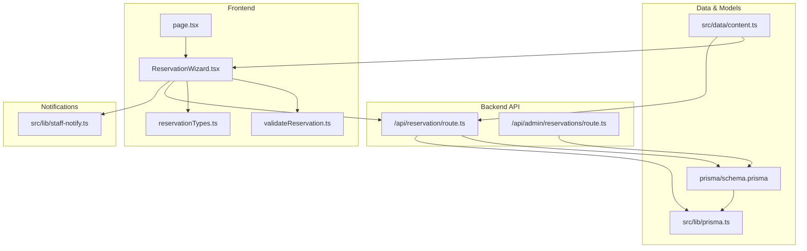
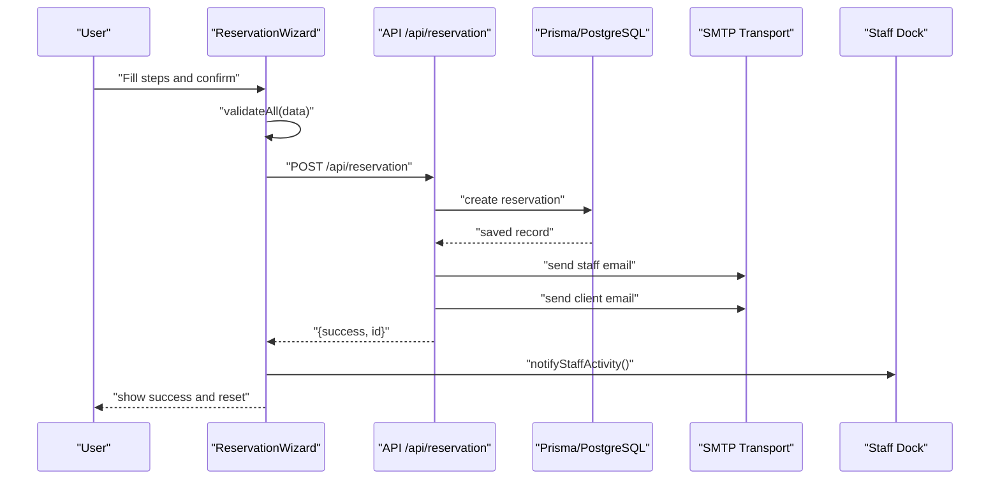
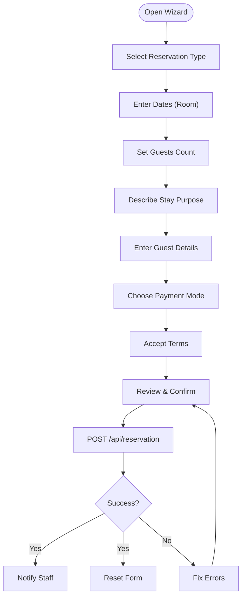
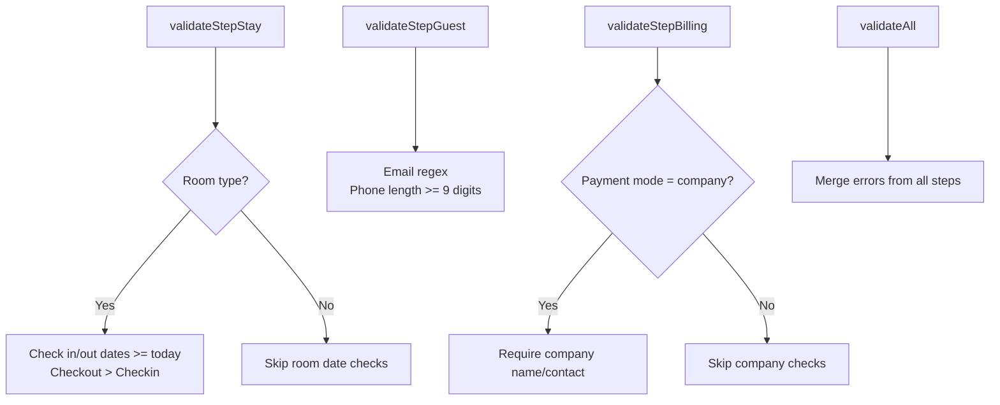
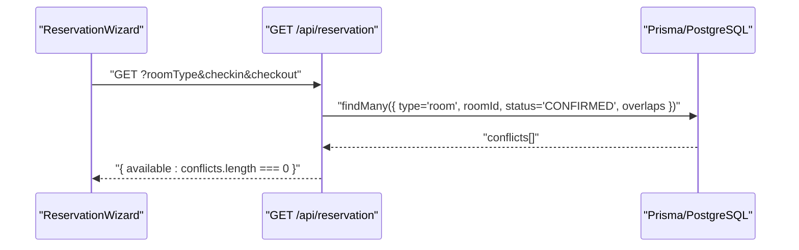
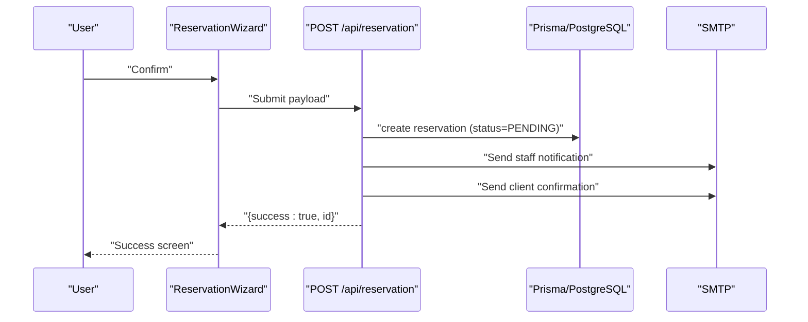
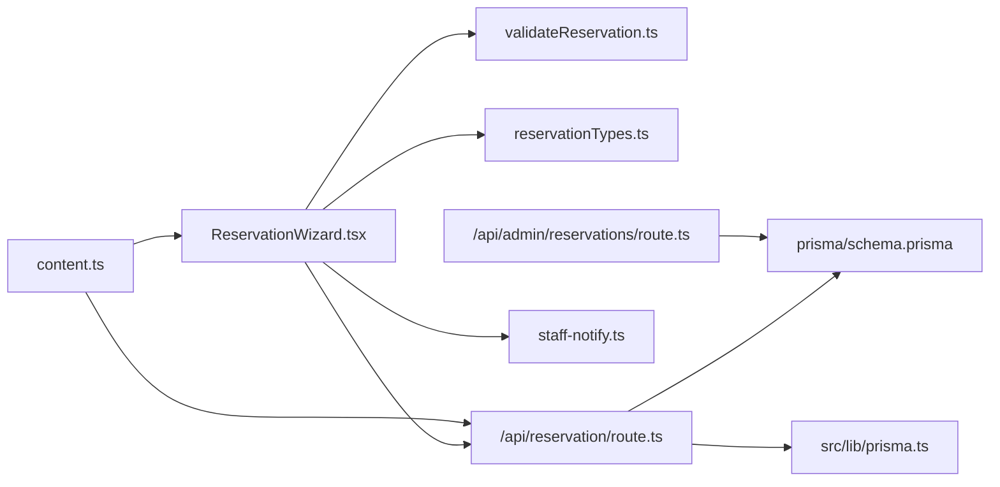

# Reservation System

<cite>
**Referenced Files in This Document**
- [ReservationWizard.tsx](file://src/components/reservation/ReservationWizard.tsx)
- [validateReservation.ts](file://src/components/reservation/validateReservation.ts)
- [reservationTypes.ts](file://src/components/reservation/reservationTypes.ts)
- [route.ts](file://src/app/api/reservation/route.ts)
- [content.ts](file://src/data/content.ts)
- [schema.prisma](file://prisma/schema.prisma)
- [prisma.ts](file://src/lib/prisma.ts)
- [staff-notify.ts](file://src/lib/staff-notify.ts)
- [page.tsx](file://src/app/reservation/page.tsx)
- [route.ts](file://src/app/api/admin/reservations/route.ts)
</cite>

## Table of Contents
1. [Introduction](#introduction)
2. [Project Structure](#project-structure)
3. [Core Components](#core-components)
4. [Architecture Overview](#architecture-overview)
5. [Detailed Component Analysis](#detailed-component-analysis)
6. [Dependency Analysis](#dependency-analysis)
7. [Performance Considerations](#performance-considerations)
8. [Troubleshooting Guide](#troubleshooting-guide)
9. [Conclusion](#conclusion)
10. [Appendices](#appendices)

## Introduction
This document describes the reservation management system for Archanges Hotel. It covers the multi-step booking wizard, form validation logic, availability checking, supported reservation types and services, the end-to-end reservation workflow, API endpoints, TypeScript interfaces, error handling, user experience considerations, and integration with the email notification system. It also provides scenario examples and troubleshooting guidance for common booking issues.

## Project Structure
The reservation system spans the frontend UI, validation utilities, backend API routes, database schema, and email notification integration. The main pieces are:
- Frontend reservation wizard component and validation helpers
- Backend API for creating and checking reservations
- Prisma schema modeling rooms, halls, and reservations
- Email notifications to staff and clients
- Admin API for viewing and updating reservation statuses



**Diagram sources**
- [ReservationWizard.tsx:1-884](file://src/components/reservation/ReservationWizard.tsx#L1-L884)
- [validateReservation.ts:1-59](file://src/components/reservation/validateReservation.ts#L1-L59)
- [reservationTypes.ts:1-58](file://src/components/reservation/reservationTypes.ts#L1-L58)
- [route.ts:1-255](file://src/app/api/reservation/route.ts#L1-L255)
- [route.ts:1-46](file://src/app/api/admin/reservations/route.ts#L1-L46)
- [schema.prisma:1-75](file://prisma/schema.prisma#L1-L75)
- [prisma.ts:1-12](file://src/lib/prisma.ts#L1-L12)
- [content.ts:70-114](file://src/data/content.ts#L70-L114)
- [staff-notify.ts:1-17](file://src/lib/staff-notify.ts#L1-L17)
- [page.tsx:1-23](file://src/app/reservation/page.tsx#L1-L23)

**Section sources**
- [ReservationWizard.tsx:1-884](file://src/components/reservation/ReservationWizard.tsx#L1-L884)
- [route.ts:1-255](file://src/app/api/reservation/route.ts#L1-L255)
- [schema.prisma:1-75](file://prisma/schema.prisma#L1-L75)
- [content.ts:70-114](file://src/data/content.ts#L70-L114)
- [staff-notify.ts:1-17](file://src/lib/staff-notify.ts#L1-L17)
- [page.tsx:1-23](file://src/app/reservation/page.tsx#L1-L23)

## Core Components
- Reservation Wizard: Multi-step UI with validation per step, state management, and submission to the backend.
- Validation Utilities: Step-specific validators and a combined validator for end-of-wizard checks.
- TypeScript Interfaces: Strongly typed reservation data and validation errors.
- API Routes: Reservation creation and availability check endpoints; admin endpoints for listing and updating statuses.
- Prisma Schema: Data model for rooms, halls, and reservations with relations and status.
- Content Definitions: Reservation types, room types, and event halls used by the UI and emails.
- Notification Helpers: DOM and BroadcastChannel-based staff alerts after successful bookings.

**Section sources**
- [ReservationWizard.tsx:62-201](file://src/components/reservation/ReservationWizard.tsx#L62-L201)
- [validateReservation.ts:5-58](file://src/components/reservation/validateReservation.ts#L5-L58)
- [reservationTypes.ts:3-51](file://src/components/reservation/reservationTypes.ts#L3-L51)
- [route.ts:59-253](file://src/app/api/reservation/route.ts#L59-L253)
- [schema.prisma:34-74](file://prisma/schema.prisma#L34-L74)
- [content.ts:357-382](file://src/data/content.ts#L357-L382)
- [staff-notify.ts:6-16](file://src/lib/staff-notify.ts#L6-L16)

## Architecture Overview
The reservation workflow is a client-server interaction:
- The client renders the wizard, validates inputs locally, and submits to the backend.
- The backend persists the reservation, sends notifications to staff and the client, and returns a success response.
- Admins can view and update reservation statuses via an admin API protected by a session cookie.



**Diagram sources**
- [ReservationWizard.tsx:171-201](file://src/components/reservation/ReservationWizard.tsx#L171-L201)
- [route.ts:59-253](file://src/app/api/reservation/route.ts#L59-L253)
- [prisma.ts:5-11](file://src/lib/prisma.ts#L5-L11)
- [staff-notify.ts:6-16](file://src/lib/staff-notify.ts#L6-L16)

## Detailed Component Analysis

### Reservation Wizard
The wizard is a multi-step form with:
- Step 0: Stay selection (type, dates, guests, room or hall choice, purpose)
- Step 1: Guest details (names, email, phone, origin, ID, city)
- Step 2: Billing (payment mode, optional company info), terms acceptance
- Step 3: Review summary and submit

Key behaviors:
- Local validation per step and combined validation before submission
- Dynamic UI based on selected reservation type
- Night count calculation for stays
- Submission posts to the reservation API and triggers staff notifications



**Diagram sources**
- [ReservationWizard.tsx:152-201](file://src/components/reservation/ReservationWizard.tsx#L152-L201)
- [validateReservation.ts:5-58](file://src/components/reservation/validateReservation.ts#L5-L58)

**Section sources**
- [ReservationWizard.tsx:62-201](file://src/components/reservation/ReservationWizard.tsx#L62-L201)
- [ReservationWizard.tsx:800-884](file://src/components/reservation/ReservationWizard.tsx#L800-L884)

### Validation Logic
Validation is split into three steps:
- Stay validation: required purpose, valid date range, minimum guests
- Guest validation: required fields, email and phone formats
- Billing validation: company fields when applicable, terms acceptance

Combined validation aggregates all errors.



**Diagram sources**
- [validateReservation.ts:5-58](file://src/components/reservation/validateReservation.ts#L5-L58)

**Section sources**
- [validateReservation.ts:5-58](file://src/components/reservation/validateReservation.ts#L5-L58)

### TypeScript Interfaces and Data Structures
ReservationData defines the shape of submitted data, including:
- Personal and guest info
- Stay details (dates, guests, room/hall selection)
- Billing and payment mode
- Message and terms acceptance
- Language preference

ValidationErrors is a simple map of field keys to error messages.

```mermaid
classDiagram
class ReservationData {
+string type
+string firstName
+string lastName
+string email
+string phone
+string countryOfOrigin
+string nationality
+string idDocument
+string cityOfProvenance
+string stayPurpose
+PaymentMode paymentMode
+string companyName
+string companyContact
+string checkin
+string checkout
+number guests
+string roomType
+string hallType
+string message
+boolean acceptTerms
}
class ValidationErrors {
<<map>>
}
class PaymentMode {
<<enum>>
"private"
"company"
}
ReservationData --> PaymentMode : "uses"
```

**Diagram sources**
- [reservationTypes.ts:3-24](file://src/components/reservation/reservationTypes.ts#L3-L24)

**Section sources**
- [reservationTypes.ts:1-58](file://src/components/reservation/reservationTypes.ts#L1-L58)

### Supported Reservation Types and Services
Supported reservation types include:
- Room: hotel rooms with standard/deluxe/vip options
- Restaurant: table booking
- Event Hall: reception halls with capacities
- Photography: photoshoot sessions

These are defined in content and used by the wizard and emails.

**Section sources**
- [content.ts:70-114](file://src/data/content.ts#L70-L114)
- [content.ts:357-382](file://src/data/content.ts#L357-L382)
- [route.ts:139-149](file://src/app/api/reservation/route.ts#L139-L149)

### Availability Checking Mechanism
For room reservations, the system exposes a GET endpoint that checks for existing confirmed reservations overlapping the requested period for a given room type. The frontend can call this endpoint to inform users about availability before submission.



**Diagram sources**
- [route.ts:28-57](file://src/app/api/reservation/route.ts#L28-L57)

**Section sources**
- [route.ts:28-57](file://src/app/api/reservation/route.ts#L28-L57)

### Reservation Workflow: From Selection to Confirmation
End-to-end flow:
- User selects reservation type and enters stay details
- Guest and billing details are collected
- Review screen shows a summary
- On submit, the backend:
  - Validates required fields and terms
  - Persists the reservation with PENDING status
  - Sends an internal staff notification email
  - Sends a client acknowledgment email in the chosen language
  - Returns success with the reservation ID



**Diagram sources**
- [ReservationWizard.tsx:171-201](file://src/components/reservation/ReservationWizard.tsx#L171-L201)
- [route.ts:59-253](file://src/app/api/reservation/route.ts#L59-L253)

**Section sources**
- [ReservationWizard.tsx:171-201](file://src/components/reservation/ReservationWizard.tsx#L171-L201)
- [route.ts:59-253](file://src/app/api/reservation/route.ts#L59-L253)

### API Endpoints
- GET /api/reservation
  - Query params: roomType, checkin, checkout
  - Returns availability status for room reservations
- POST /api/reservation
  - Body: ReservationData plus language and computed fullname
  - Returns success and reservation ID; sends staff and client emails
- GET /api/admin/reservations
  - Requires admin_session cookie
  - Returns all reservations with related room/hall
- PATCH /api/admin/reservations
  - Requires admin_session cookie
  - Updates reservation status by ID

**Section sources**
- [route.ts:28-57](file://src/app/api/reservation/route.ts#L28-L57)
- [route.ts:59-253](file://src/app/api/reservation/route.ts#L59-L253)
- [route.ts:4-45](file://src/app/api/admin/reservations/route.ts#L4-L45)

### Database Model and Relations
The Prisma schema defines:
- Room: id, name, type, price, description, image, amenities, reservations
- Hall: id, name, capacity, price, description, image, reservations
- Reservation: id, timestamps, personal info, stay info, room/hall relations, message, admin notes, payment mode, status, language

Status defaults to PENDING and can be updated to CONFIRMED or CANCELLED via admin.

**Section sources**
- [schema.prisma:13-74](file://prisma/schema.prisma#L13-L74)

### Email Notification System
- Staff notification: After successful submission, the frontend dispatches a DOM event and BroadcastChannel message to alert the staff dock.
- Staff email: Sent to the reservations mailbox with structured HTML content.
- Client email: Sent in French or English depending on language preference, confirming receipt and including the reservation ID.

**Section sources**
- [staff-notify.ts:6-16](file://src/lib/staff-notify.ts#L6-L16)
- [route.ts:129-243](file://src/app/api/reservation/route.ts#L129-L243)

## Dependency Analysis
- ReservationWizard depends on:
  - Validation utilities for step-wise checks
  - Content definitions for reservation types and room/hall lists
  - Prisma client for persistence
  - SMTP transport for email notifications
  - Staff notification helper for UI feedback
- API routes depend on:
  - Prisma client
  - Environment variables for SMTP configuration
  - Content definitions for labels and descriptions
- Admin API depends on:
  - Prisma client
  - Session cookie for authorization



**Diagram sources**
- [ReservationWizard.tsx:1-884](file://src/components/reservation/ReservationWizard.tsx#L1-L884)
- [validateReservation.ts:1-59](file://src/components/reservation/validateReservation.ts#L1-L59)
- [reservationTypes.ts:1-58](file://src/components/reservation/reservationTypes.ts#L1-L58)
- [route.ts:1-255](file://src/app/api/reservation/route.ts#L1-L255)
- [route.ts:1-46](file://src/app/api/admin/reservations/route.ts#L1-L46)
- [schema.prisma:1-75](file://prisma/schema.prisma#L1-L75)
- [prisma.ts:1-12](file://src/lib/prisma.ts#L1-L12)
- [content.ts:70-114](file://src/data/content.ts#L70-L114)
- [staff-notify.ts:1-17](file://src/lib/staff-notify.ts#L1-L17)

**Section sources**
- [ReservationWizard.tsx:1-884](file://src/components/reservation/ReservationWizard.tsx#L1-L884)
- [route.ts:1-255](file://src/app/api/reservation/route.ts#L1-L255)
- [route.ts:1-46](file://src/app/api/admin/reservations/route.ts#L1-L46)
- [schema.prisma:1-75](file://prisma/schema.prisma#L1-L75)
- [content.ts:70-114](file://src/data/content.ts#L70-L114)

## Performance Considerations
- Client-side validation reduces unnecessary network requests.
- The availability check endpoint performs a targeted query against confirmed reservations; ensure proper indexing on reservation type, roomId, status, and date overlap.
- Email sending occurs synchronously during request handling; consider offloading to a queue for high volume.
- Keep the wizard state minimal and avoid heavy computations in render paths.

## Troubleshooting Guide
Common issues and resolutions:
- Submission fails with missing required fields
  - Cause: Terms not accepted or essential fields blank
  - Resolution: Ensure acceptTerms is checked and all required fields are filled
- Invalid date range
  - Cause: Checkout before or equal to checkin, or past dates
  - Resolution: Select valid future dates with checkout after checkin
- Phone/email format errors
  - Cause: Non-conforming phone or email
  - Resolution: Enter a phone number with at least 9 digits and a valid email address
- Room not available
  - Cause: Conflicting confirmed reservation during requested dates
  - Resolution: Choose different dates or another room type
- Network errors on submit
  - Cause: Temporary connectivity or server error
  - Resolution: Retry submission; check server logs for failures
- Admin endpoints unauthorized
  - Cause: Missing or inactive admin_session cookie
  - Resolution: Authenticate and ensure session cookie is present

**Section sources**
- [validateReservation.ts:5-58](file://src/components/reservation/validateReservation.ts#L5-L58)
- [route.ts:87-100](file://src/app/api/reservation/route.ts#L87-L100)
- [route.ts:28-57](file://src/app/api/reservation/route.ts#L28-L57)
- [route.ts:7-9](file://src/app/api/admin/reservations/route.ts#L7-L9)

## Conclusion
The reservation system provides a robust, multilingual booking experience with strong client-side validation, real-time availability checks for rooms, and automated email notifications. The backend APIs support both customer submissions and admin management, while the Prisma schema cleanly models rooms, halls, and reservations. Following the guidelines and troubleshooting tips herein will help maintain reliability and a smooth user experience.

## Appendices

### Example Scenarios
- Room booking for two nights
  - Select “Room”, choose dates, select room type, enter guest and billing info, accept terms, review, submit
- Event hall booking
  - Select “Event Hall”, choose hall, enter dates, guests, purpose, submit
- Photography session
  - Select “Photography”, choose dates and guests, submit

### UI Entry Point
- The reservation page renders the wizard component.

**Section sources**
- [page.tsx:12-22](file://src/app/reservation/page.tsx#L12-L22)