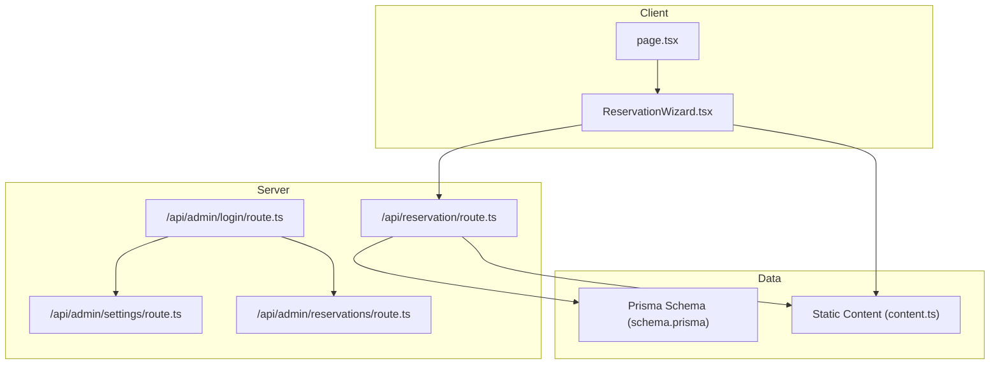
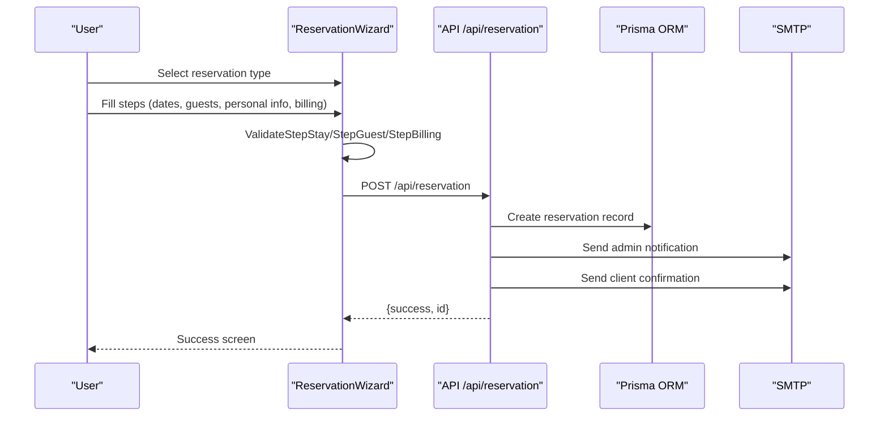
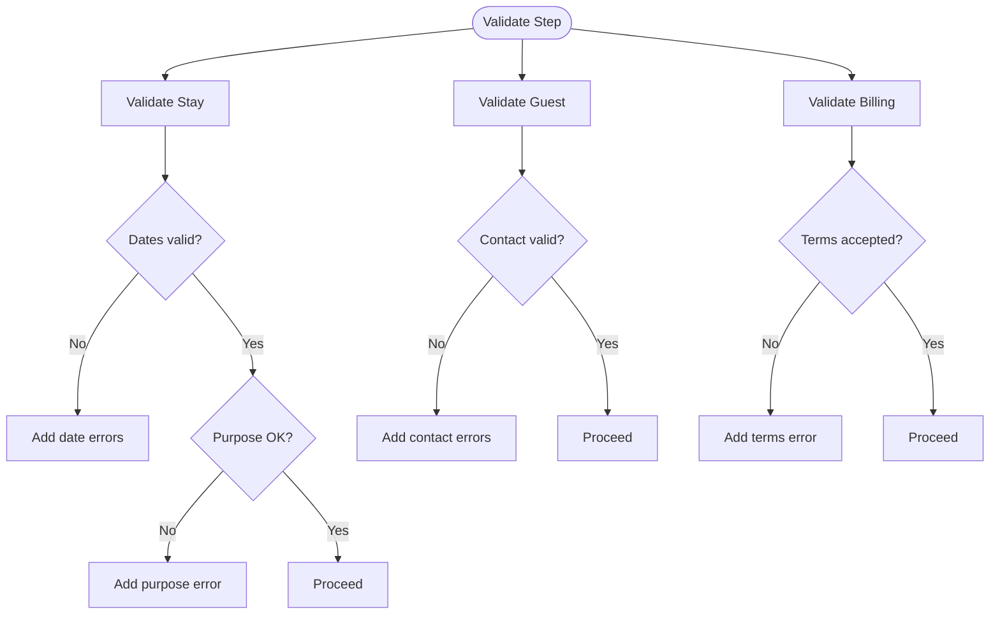
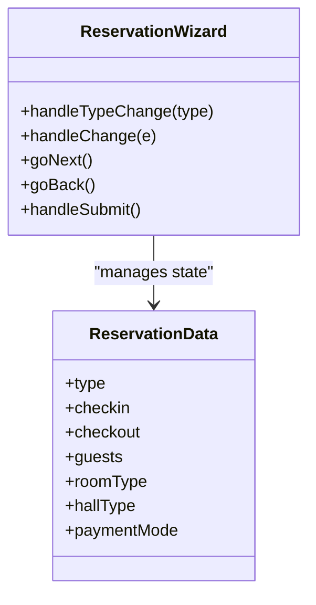
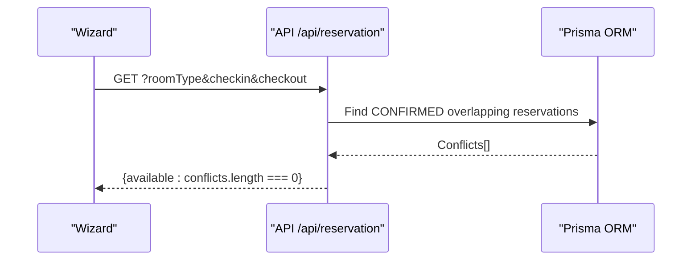
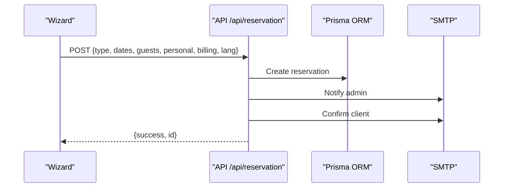
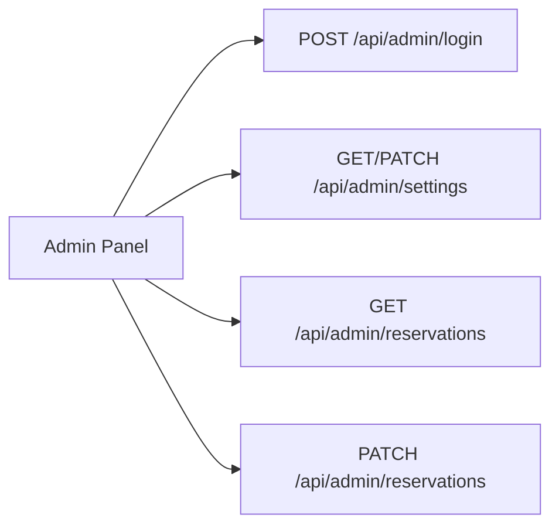
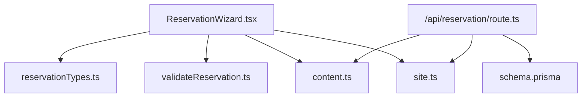

# Reservation Types and Services

<cite>
**Referenced Files in This Document**
- [reservationTypes.ts](file://src/components/reservation/reservationTypes.ts)
- [validateReservation.ts](file://src/components/reservation/validateReservation.ts)
- [ReservationWizard.tsx](file://src/components/reservation/ReservationWizard.tsx)
- [page.tsx](file://src/app/reservation/page.tsx)
- [route.ts](file://src/app/api/reservation/route.ts)
- [schema.prisma](file://prisma/schema.prisma)
- [content.ts](file://src/data/content.ts)
- [login.route.ts](file://src/app/api/admin/login/route.ts)
- [settings.route.ts](file://src/app/api/admin/settings/route.ts)
- [reservations.route.ts](file://src/app/api/admin/reservations/route.ts)
- [site.ts](file://src/lib/site.ts)
</cite>

## Table of Contents
1. [Introduction](#introduction)
2. [Project Structure](#project-structure)
3. [Core Components](#core-components)
4. [Architecture Overview](#architecture-overview)
5. [Detailed Component Analysis](#detailed-component-analysis)
6. [Dependency Analysis](#dependency-analysis)
7. [Performance Considerations](#performance-considerations)
8. [Troubleshooting Guide](#troubleshooting-guide)
9. [Conclusion](#conclusion)
10. [Appendices](#appendices)

## Introduction
This document explains the reservation system’s four main categories: room bookings, restaurant reservations, event hall rentals, and photography services. It details how reservation types are selected, how form layouts and validation adapt per service, and how pricing and availability are configured and managed. It also covers the administrative backend for updating services, prices, and reservation statuses, and describes how the system integrates with the static content catalog.

## Project Structure
The reservation experience is implemented as a single-page wizard routed under the reservation namespace. Data about rooms, halls, and reservation types is centralized in a content module. Backend APIs handle validation, persistence, email notifications, and administrative operations.

**Diagram sources**
- [ReservationWizard.tsx:62-201](file://src/components/reservation/ReservationWizard.tsx#L62-L201)
- [page.tsx:12-22](file://src/app/reservation/page.tsx#L12-L22)
- [route.ts:59-253](file://src/app/api/reservation/route.ts#L59-L253)
- [login.route.ts:3-24](file://src/app/api/admin/login/route.ts#L3-L24)
- [settings.route.ts:4-34](file://src/app/api/admin/settings/route.ts#L4-L34)
- [reservations.route.ts:4-45](file://src/app/api/admin/reservations/route.ts#L4-L45)
- [schema.prisma:13-74](file://prisma/schema.prisma#L13-L74)
- [content.ts:70-114](file://src/data/content.ts#L70-L114)

**Section sources**
- [page.tsx:12-22](file://src/app/reservation/page.tsx#L12-L22)
- [ReservationWizard.tsx:62-201](file://src/components/reservation/ReservationWizard.tsx#L62-L201)
- [route.ts:59-253](file://src/app/api/reservation/route.ts#L59-L253)
- [schema.prisma:13-74](file://prisma/schema.prisma#L13-L74)
- [content.ts:70-114](file://src/data/content.ts#L70-L114)

## Core Components
- Reservation data model and defaults: defines shared fields and defaults for all reservation types.
- Validation functions: enforce per-step rules for dates, guests, contact info, and terms.
- Wizard UI: renders dynamic forms based on selected reservation type and orchestrates steps and submission.
- API endpoint: persists reservations, computes availability for rooms, and sends emails.
- Static content: supplies room types, halls, and reservation type metadata.
- Admin APIs: authentication, settings (pricing), and reservations management.

**Section sources**
- [reservationTypes.ts:3-51](file://src/components/reservation/reservationTypes.ts#L3-L51)
- [validateReservation.ts:5-58](file://src/components/reservation/validateReservation.ts#L5-L58)
- [ReservationWizard.tsx:132-201](file://src/components/reservation/ReservationWizard.tsx#L132-L201)
- [route.ts:59-253](file://src/app/api/reservation/route.ts#L59-L253)
- [content.ts:70-114](file://src/data/content.ts#L70-L114)
- [login.route.ts:3-24](file://src/app/api/admin/login/route.ts#L3-L24)
- [settings.route.ts:4-34](file://src/app/api/admin/settings/route.ts#L4-L34)
- [reservations.route.ts:4-45](file://src/app/api/admin/reservations/route.ts#L4-L45)

## Architecture Overview
The reservation flow is a multi-step wizard that adapts to the chosen service type. The frontend validates locally and submits to a serverless route that persists data and emails stakeholders. Administrative endpoints manage pricing and reservation statuses.

**Diagram sources**
- [ReservationWizard.tsx:152-201](file://src/components/reservation/ReservationWizard.tsx#L152-L201)
- [route.ts:59-253](file://src/app/api/reservation/route.ts#L59-L253)

## Detailed Component Analysis

### Reservation Data Model and Defaults
- Shared fields include personal details, contact info, stay purpose, guests count, and payment mode.
- Defaults initialize the wizard with sensible values (e.g., default room/hall selection, payment mode).
- Input and label styles are standardized for consistent UX.

**Section sources**
- [reservationTypes.ts:3-58](file://src/components/reservation/reservationTypes.ts#L3-L58)

### Validation Rules by Step
- Stay step: validates required purpose and date range for room bookings; ensures checkout after checkin.
- Guest step: validates presence and format of name, email, phone, origin, nationality, ID, and city.
- Billing step: requires company fields when billing mode is corporate and terms acceptance.

**Diagram sources**
- [validateReservation.ts:5-50](file://src/components/reservation/validateReservation.ts#L5-L50)

**Section sources**
- [validateReservation.ts:5-58](file://src/components/reservation/validateReservation.ts#L5-L58)

### Reservation Type Selection and Dynamic Forms
- Users choose among room, restaurant, event, and photoshoot.
- The wizard conditionally renders:
  - Date pickers and room type selector for room bookings.
  - Hall selector for event bookings.
  - Guest and billing sections for all types.
- Icons and labels reflect the selected type.

**Diagram sources**
- [ReservationWizard.tsx:132-201](file://src/components/reservation/ReservationWizard.tsx#L132-L201)
- [reservationTypes.ts:3-24](file://src/components/reservation/reservationTypes.ts#L3-L24)

**Section sources**
- [ReservationWizard.tsx:334-468](file://src/components/reservation/ReservationWizard.tsx#L334-L468)
- [content.ts:357-382](file://src/data/content.ts#L357-L382)

### Room Bookings: Availability and Pricing
- Availability check for rooms uses date overlap logic against confirmed reservations.
- Room types are defined with names, prices, and amenities; labels include price per night.
- Pricing is stored in the database and referenced in the UI.

**Diagram sources**
- [route.ts:28-57](file://src/app/api/reservation/route.ts#L28-L57)
- [schema.prisma:13-22](file://prisma/schema.prisma#L13-L22)
- [content.ts:89-114](file://src/data/content.ts#L89-L114)

**Section sources**
- [route.ts:28-57](file://src/app/api/reservation/route.ts#L28-L57)
- [schema.prisma:13-22](file://prisma/schema.prisma#L13-L22)
- [content.ts:89-114](file://src/data/content.ts#L89-L114)

### Event Hall Rentals: Capacity and Pricing
- Halls are defined with capacity and optional price; labels include capacity.
- The wizard selects a hall and displays capacity in summary and review screens.

**Section sources**
- [content.ts:70-87](file://src/data/content.ts#L70-L87)
- [ReservationWizard.tsx:430-450](file://src/components/reservation/ReservationWizard.tsx#L430-L450)
- [route.ts:22-26](file://src/app/api/reservation/route.ts#L22-L26)

### Restaurant Reservations and Photography Services
- Restaurant and photoshoot are selectable types; the wizard routes to the same backend, which stores the type and persists accordingly.
- No special validations differ from the generic guest/billing steps for these types.

**Section sources**
- [content.ts:357-382](file://src/data/content.ts#L357-L382)
- [ReservationWizard.tsx:338-358](file://src/components/reservation/ReservationWizard.tsx#L338-L358)
- [route.ts:103-127](file://src/app/api/reservation/route.ts#L103-L127)

### Submission, Persistence, and Email Notifications
- The wizard aggregates all fields and posts to the reservation API.
- The API:
  - Validates required fields and terms.
  - Persists a reservation with type, dates, guests, personal info, and billing mode.
  - Sends an internal admin email and a client confirmation email in the selected language.

**Diagram sources**
- [ReservationWizard.tsx:171-201](file://src/components/reservation/ReservationWizard.tsx#L171-L201)
- [route.ts:59-253](file://src/app/api/reservation/route.ts#L59-L253)

**Section sources**
- [ReservationWizard.tsx:171-201](file://src/components/reservation/ReservationWizard.tsx#L171-L201)
- [route.ts:59-253](file://src/app/api/reservation/route.ts#L59-L253)

### Administrative Management
- Login: simple password check sets a session cookie for admin access.
- Settings: retrieves rooms and halls sorted by price/capacity; updates price by type.
- Reservations: lists all reservations with relations and updates status.

**Diagram sources**
- [login.route.ts:3-24](file://src/app/api/admin/login/route.ts#L3-L24)
- [settings.route.ts:4-34](file://src/app/api/admin/settings/route.ts#L4-L34)
- [reservations.route.ts:4-45](file://src/app/api/admin/reservations/route.ts#L4-L45)

**Section sources**
- [login.route.ts:3-24](file://src/app/api/admin/login/route.ts#L3-L24)
- [settings.route.ts:4-34](file://src/app/api/admin/settings/route.ts#L4-L34)
- [reservations.route.ts:4-45](file://src/app/api/admin/reservations/route.ts#L4-L45)

## Dependency Analysis
- The wizard depends on:
  - Static content for room types, halls, and reservation type metadata.
  - Validation helpers for step-wise checks.
  - Site constants for branding and contact info.
- The API depends on:
  - Prisma models for persistence.
  - Static content for labels and pricing references.
  - SMTP transport for notifications.

**Diagram sources**
- [ReservationWizard.tsx:27-32](file://src/components/reservation/ReservationWizard.tsx#L27-L32)
- [reservationTypes.ts:1-58](file://src/components/reservation/reservationTypes.ts#L1-L58)
- [validateReservation.ts:1-59](file://src/components/reservation/validateReservation.ts#L1-L59)
- [content.ts:70-114](file://src/data/content.ts#L70-L114)
- [site.ts:1-29](file://src/lib/site.ts#L1-L29)
- [route.ts:1-253](file://src/app/api/reservation/route.ts#L1-L253)
- [schema.prisma:13-74](file://prisma/schema.prisma#L13-L74)

**Section sources**
- [ReservationWizard.tsx:27-32](file://src/components/reservation/ReservationWizard.tsx#L27-L32)
- [route.ts:1-253](file://src/app/api/reservation/route.ts#L1-L253)
- [schema.prisma:13-74](file://prisma/schema.prisma#L13-L74)

## Performance Considerations
- Local validation reduces unnecessary network requests.
- Room availability queries filter by type and overlapping date windows; keep date ranges minimal to reduce overlap scans.
- SMTP operations occur after persistence; consider async delivery if throughput increases.

## Troubleshooting Guide
- Validation errors:
  - Ensure required fields are filled and formatted correctly (email, phone).
  - For room bookings, confirm check-in is not in the past and check-out is after check-in.
- Submission failures:
  - Verify terms are accepted.
  - Confirm required fields are present before submit.
- Admin endpoints:
  - Ensure the admin session cookie is present for protected routes.
  - Price updates require correct type and numeric price values.

**Section sources**
- [validateReservation.ts:5-50](file://src/components/reservation/validateReservation.ts#L5-L50)
- [ReservationWizard.tsx:152-201](file://src/components/reservation/ReservationWizard.tsx#L152-L201)
- [login.route.ts:3-24](file://src/app/api/admin/login/route.ts#L3-L24)
- [settings.route.ts:17-34](file://src/app/api/admin/settings/route.ts#L17-L34)
- [reservations.route.ts:29-45](file://src/app/api/admin/reservations/route.ts#L29-L45)

## Conclusion
The reservation system cleanly separates concerns between UI, validation, persistence, and administration. The wizard adapts dynamically to reservation types, while the backend enforces business rules and notifies stakeholders. Administrators can update pricing and manage reservations through dedicated endpoints. Static content drives room and hall definitions, enabling straightforward updates to offerings and pricing.

## Appendices

### Reservation Type Workflows
- Room booking:
  - Select dates and room type; validate date range; enter guest and billing info; submit.
- Restaurant reservation:
  - Choose type; fill guest and billing info; submit.
- Event hall rental:
  - Select dates and hall; validate capacity; enter guest and billing info; submit.
- Photography service:
  - Choose type; fill guest and billing info; submit.

**Section sources**
- [ReservationWizard.tsx:334-468](file://src/components/reservation/ReservationWizard.tsx#L334-L468)
- [content.ts:357-382](file://src/data/content.ts#L357-L382)

### Service-Specific Business Rules
- Room bookings:
  - Check-in must be today or later; check-out must be after check-in.
  - Availability is computed against confirmed reservations.
- Event halls:
  - Capacity is displayed; selection is validated in the UI.
- Corporate billing:
  - Company name and contact are mandatory when payment mode is corporate.

**Section sources**
- [validateReservation.ts:10-24](file://src/components/reservation/validateReservation.ts#L10-L24)
- [ReservationWizard.tsx:430-450](file://src/components/reservation/ReservationWizard.tsx#L430-L450)
- [validateReservation.ts:42-50](file://src/components/reservation/validateReservation.ts#L42-L50)

### Configuration Management Procedures
- Update room or hall pricing:
  - Use the admin settings endpoint to PATCH price by type and ID.
- Add or modify services:
  - Edit static content arrays for rooms, halls, and reservation types.
- Manage reservations:
  - Use the admin reservations endpoint to update status.

**Section sources**
- [settings.route.ts:17-34](file://src/app/api/admin/settings/route.ts#L17-L34)
- [content.ts:70-114](file://src/data/content.ts#L70-L114)
- [reservations.route.ts:29-45](file://src/app/api/admin/reservations/route.ts#L29-L45)

### Integration with Static Content System
- Room and hall definitions live in the content module and are consumed by the wizard and API for labels and pricing.
- Site metadata (branding, contacts) is centralized for consistent presentation.

**Section sources**
- [content.ts:70-114](file://src/data/content.ts#L70-L114)
- [site.ts:1-29](file://src/lib/site.ts#L1-L29)